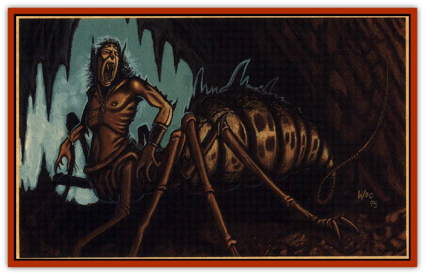

# The Spider

| Statistic | **The Spider** |
| --- | --- |
| **Activity Cycle:** | Any |
| **Alignment:** | Chaotic evil |
| **Armor Class:** | -2 for carapace; 4 for underbelly |
| **Blood:** | True (Azrai): 95 |
| **Blood Abilities:** | Animal affinity (spiders-great), Bloodform (great), Invulnerability (great), Long life (great), Major Regeneration (great), Std. Regeneration (great) |
| **Climate/Terrain:** | The Spiderfell/Forests |
| **Damage/Attack:** | 1d10/1d10/1d6 |
| **Diet:** | Carnivorous |
| **Frequency:** | Unique |
| **Hit Dice:** | 13 HD (81 hit points) |
| **Intelligence:** | Very (11) |
| **Magic Resistance:** | 15% |
| **Morale:** | Fearless (20) |
| **Movement:** | 15 |
| **No. Appearing:** | 1 |
| **No. of Attacks:** | 3 (claw/claw/bite) or 1 (web) |
| **Organization:** | Solitary/Regent |
| **Size:** | L (7' tall, 7' long) |
| **Special Attacks:** | Web, jump, poison |
| **Special Defenses:** | Spittle, regeneration |
| **THAC0:** | 7 |
| **Treasure:** | Domain Treasure (20-30 GB) |
| **XP Value:** | 14,000 |

In the days when [[Human_Cerilia|humans]] were first arriving in Cerilia, the woods near the modern lands of Roesone were controlled by a [[Goblin_Cerilia|goblin]] tribe. The goblins, who commanded sorcery and dabbled in powers beyond the ken of man, were a force to be reckoned with. Of all of them, Tal-Qazar was the mightiest. He was called the Spiderlord, for once his enemies were ensnared in his traps, they were doomed. He led armies of thousands of goblins and gnolls against the hated elves; many were the elven towers that fell beneath the booted feet of the Spiderlord's humanoids, and many were the elves that fell with poisoned arrows in their sides.

Eventually, Tal-Qazar claimed a large portion of the dark wood and called it the Spiderfell. At the same time, the Andu settlers who called themselves the Deretha drove the elves from the Erebannien. The Spiderlord crushed the elves as they fled, and only a few survived to reach safety in the elven homelands.

Tal-Qazar's goblins clashed frequently with the Deretha, until the day of Deismaar. The Spiderlord led a mighty host of goblins, and great was the destruction they wreaked along the way. However, the host was all but obliterated by the blast of the gods' destruction, and Tal-Qazar and a few pitiful survivors crept home. 

The Spiderlord had absorbed some of Azrai's essence, and be grew to realize the power at his disposal. He used this power to reestablish himself in the Spiderfell, and young goblins flocked to bis banner. As Tal-Qazar used his power to gain more money and more infamy for himself, Azrai's blood twisted him, bringing his spiderish nature to the fore./p>
Tal-Qazar, with no small surprise, soon found himself mutating into the bloated monstrosity that he is today. He tried everything within his reach to remain a normal goblin. However, no amount of surgery could permanently remove the additional legs that kept growing from his hips. No amount of cutting could reduce the spiderish abdomen that replaced his lower torso. The only sure way to halt the transformation was to stop using his blood abilities; if be tried that, the young goblins would try to seize power. And so the transformation continued apace, until the Spiderlord truly became the Spider.

Meanwhile, the Anuireans were driving the goblins back into savagery. Much of goblin civilization was lost when the Anuireans cleared vast tracts of land, and while the Roele emperors could not destroy the Spider, they could contain it and its hordes. Goblin power nearly vanished from Anuire for a time.

The Spider brooded in its wood, sending forth sallies of humanoids into the human lands only to watch them die. Its sanity frayed with each passing year, disappearing with its goblinoid essence.

The Spider now appears as a gigantic, mottled, hairy spider with a muscled goblinoid upper body resting atop it. Its mouth is full of fangs, its ears are pointed, and its eyes are devoid of sanity. It can converse and be bargained with, but its temper swings wildly and it can kill a visitor without a second thought. It does have a twisted sense of honor, however, and it will keep its word-perhaps the last remnant of a once-noble goblin lord.

**Combat:** Though it is less powerful than the Gorgon and Rhuobhe Manslayer, the Spider is still a foe to be feared. It can scuttle rapidly from side to side, dodging blows all the while. When it attacks, it uses its two powerful clawed bands to swipe at an opponent, and follows with a nasty bite from razored teeth. If the Spider successfully bites an enemy, the opponent must make a saving throw vs. poison with a -2 penalty or fall dead on the spot. Even a successful save inflicts 20 points of damage.

The Spider can jump up to 30 feet in the air and land on a target 50 feet away with a successful attack roll. This is not a tactic it uses very often in combat, but is valuable for ambush or escape. Still, there are times when a good jump just seems right. ... 

The awnshegh can string a web trail behind it or spin an intricate web. The web can cover an area 40x40x40 feet and holds creatures as the web spell. This web cannot be burned away, however. These webs dissolve after a day or two.

If the Spider is in a tight spot, it uses its blinding spittle to escape. This great gob of saliva can hit three people in a 10- foot radius with a successful attack roll on each, and it blinds victims for 1d6 turns. Unless a saving throw vs. poison is successful, this saliva also causes 1d6 damage after 1 round. It can be flushed away with water, but this alleviates only the damage, not the blindness.

The Spider regenerates at the rate of 1 hp per round. It can even regenerate from damage that takes it below -10 hit points. The only way to positively kill the creature is to chop the remnants, set them aflame, and scatter salt over the earth where the ashes lie.

**Habitat/Society:** The Spider controls the dank forest known as the Spiderfell, in the midst of the Anuirean powers. It is a testament to the Spider's cunning and subtlety that it has survived this long trapped between so many hostile realms.

The Spiderfell is one of the most noisome forests in Anuire, and is filled with pitfalls and natural traps. What appear to be game trails lead into bogs and cairns of dead goblins.

The land is also filled with *live* goblins and [[Gnoll|gnolls]], all scurrying to do the Spider's bidding. Centuries have passed since any of them tried to usurp the Spider's position; tales of that last fool are still told around the campfires at night.

The spiders that fill the Spiderfell are without number. They range in size from a small fingernail to those that can bring down a deer. Most are highly venomous. None of them attack the Spider's henchmen.

**Ecology:** The Spider's armies are feared by kingdoms far and wide, for they raid without provocation and without warning. Regents who have sought to tame the Spiderfell with massive armies have always emerged from the forest with fewer than half their men and a promise never to enter that wood again.

The Spider commands not only armies of goblins and gnolls, but also has developed a strange control over natural [[Spider|spiders]]. No one knows the extent of this power, but one unfortunate soul bas claimed to have seen the lesser spiders pumping their venom into their leader. Others claim that the Spider enjoys a telepathic link with each and every one of its arachnid minions.

---
## Discovery & Documentation

**Source Publication:** Birthright Campaign Setting Box Set (1995)
**Campaign Setting:** Birthright
**Author(s):** L. Richard Baker III, Colin McComb, Walter Velez, Tony Szczudlo, William O'Connor, Eric Hotz, Carrie Bebris, Roger E. Moore, Sue Weinlein, Peggy Cooper

### Other Creatures Found in This Source Book
   * [[Dragon_Cerilia|Dragon (Cerilia)]]
   * [[Giant_Cerilia|Giant (Cerilia)]]
   * [[Goblin_Cerilia|Goblin (Cerilia)]]
   * [[Orog_Cerilia|Orog (Cerilia)]]
   * [[Rhuobhe_Manslayer|Rhuobhe Manslayer]]
   * [[The_Gorgon|The Gorgon]]
   * [[The_Seadrake|The Seadrake]]
