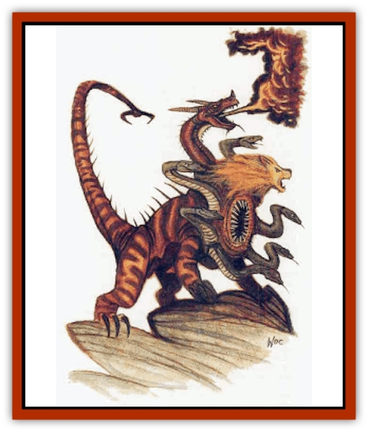

# Thessalmonster

| Statistic | **Thessalgorgon** | **Thessalhydra** | **Thessalmera** | **Thessaltrice** |
| --- | --- | --- | --- | --- |
| **Activity Cycle:** | Nocturnal | Nocturnal | Nocturnal | Nocturnal |
| **Alignment:** | Neutral | Neutral | Neutral evil | Neutral |
| **Armor Class:** | 2 | 0 | 5/2/0 | 3 |
| **Climate/Terrain:** | Damp, dark places | Damp, dark places | Damp, dark places | Damp, dark places |
| **Damage/Attack:** | 1d6 (&times;8)/2d6 | 1d6 (&times;8)/1d12/1d20 | 1d6 (&times;6-8)/3d4/1d12/2d4 | 1d6 (&times;8)/1d10 |
| **Diet:** | Carnivore | Carnivore | Carnivore | Carnivore |
| **Frequency:** | Very rare | Rare | Very rare | Very rare |
| **Hit Dice:** | 10 | 12 | 10 | 8 |
| **Intelligence:** | Low (5-7) | Low (5-7) | Low (5-7) | Low (5-7) |
| **Magic Resistance:** | Nil | Nil | Nil | Nil |
| **Morale:** | Steady (11-12) | Steady (11-12) | Steady (11-12) | Steady (11-12) |
| **Movement:** | 12 | 12 | 12 | 12 |
| **No. Appearing:** | 1 | 1 | 1 | 1 |
| **No. of Attacks:** | 9 | 10 | 9 to 11 | 9 |
| **Organization:** | Solitary | Solitary | Solitary | Solitary |
| **Size:** | H (30' long) | H (30' long) | H (30' long) | H (20' long) |
| **Special Attacks:** | Poison, petrification | Poison, acid | Acid, fire, immobilization | Poison, petrification |
| **Special Defenses:** | Immune to acid and petrification | Immune to acid | Regenerate, resist fire, immune to acid and petrification | Nil |
| **THAC0:** | 11 | 9 | 11 | 13 |
| **Treasure:** | Nil (A) | Incidental | Nil (Any) | Nil (D) |
| **XP Value:** | 9,000 | 12,000 | 10,000 | 8,000 |

The thessalmonsters are a family of hybrid monsters resembling [[Hydra|hydras]]. There are four known types of thessalmonsters.

The actual derivation of the name "thessal" is unknown. Legends suggest that the name thessal referred to a person or organization responsible for the creation of these monstrosities, or the land where they were first encountered.

The original thessalmonster is now extinct. It resembled the thessalhydra except that it lacked the fringe of serpentine heads. The thessalmonster was so genetically unstable that it was able to crossbreed with other monsters, such as hydras, [[Gorgon|gorgons]], [[Chimera|chimerae]], and even the drastically smaller [[Cockatrice|cockatrice]].

## Thessalhydra

The thessalhydra resembles an eight-headed hydra. It has a large, reptilian torso and tail measuring 30 feet long (8 feet tall at the shoulder). Eight serpentine heads surround a large, circular month rimmed with jagged teeth. Each serpentine head and neck measures 6 feet long. At the end of the 18-foot-long tail is a pair of sharp pincers.

Most of the shiny bide is a deep green. The undersides of the necks, torso, and tail are ocher yellow. Patches of reddish yellow hair cover the chest and upper forelegs. The eyes are dark red.

**Combat:** The thessalhydra attacks with its serpentine heads. Each head attacks independently and bites for 1d6 points of damage plus an additional 1d6 points if the victim fails a saving throw vs. poison. The main mouth bites for 1d20 points of damage plus an additional 1d20 points if the victim fails a saving throw vs. poison. The tail pincer can grasp an opponent, deliver 1d12 points of damage, and deposit the victim in the mouth in the same round. Items placed in the central mouth must roll saving throws vs. acid and crushing blows each round until destroyed or removed.

Once per day, the thessalhydra can spit out a gob of acidic saliva from its main mouth. This gob can cover a 12-foot-dimeter circle at a range of 30 yards. Creatures struck by the acid suffer 12d6 points of damage (half if a saving throw vs. poison is successful).

Thessalhydrae are immune to all acids and acidic poisons.

A fringe head can suffer 12 points of damage before it is severed. Damage done to heads does not affect the overall hit points of the monster. Severed heads are regenerated in 12 days.

**Habitat/Society:** Thessalhydrae prefer dark, damp settings, such as swamps, jungles, and subterranean lairs. They do not collect treasure. Such items as they possess are the remains of former meals that have somehow survived the chewing and acid of the monsters' digestive tracts.

**Ecology:** Thessalhydrae are often confused with hydras. They prey upon their less intelligent kin and anything else edible that wanders by They may take advantage of their resemblance to attack would-be hydra slayers.

Their eggs are worth 7,500 gp and young are worth 12,000 gp. The young can be chained in place to act as guardians for specific locations or set to roaming normally unused areas.

## Thessalmera

The thessalmera is a hybrid of thessalhydra and chimera. It has the scaled, lizardlike body and pincer-clawed tail of the thessalhydra, six to eight snakelike heads, a [[Cat_Great|lion's]] head in the middle of the snake heads, and a [[Dragon_Chromatic_Red|red-dragon]]like head above these on the upper back. The lion's head is covered in reddish gold hair. Patches of red-black hair cover the chest and upper forelegs.

**Combat:** The snakelike heads cause 1d6 points of damage per bite, plus 1d6 per bit from the monster�s acidic venom (half if a saving throw vs. poison is successful). The thessalmera cannot spit acid.

The lion jaws' bite causes 3d4 points of damage. The pincerlike tail inflicts 1d12 points of damage on a hit and can grasp one man-sized or smaller opponent. Victims are held immobile and can escape with a successful open doors roll (1d20, with a +5 bonus, one attempt per round).

The dragon head bites for 2d4 points of damage or breathes fire up to six times. The flame extends in a cone 5 feet wide at its mouth, widening to 50 feet at its maximum range of 20 feet. The flame causes 3d8 points of damage (half if saving throw vs. breath weapon succeeds).

The serpentine heads can be killed with 12 points of damage; harming these does not diminish the monster's overall hit points. The thessalmera is always controlled by the lion head unless this is damaged or destroyed, in which case the dragon head takes over. If that is destroyed, the thessalmera becomes a semi-intelligent, frenzied berserker, fearlessly and recklessly attacking everything within reach. When it is done, it retires to a cave to regrow its missing heads.

Thessalmera regenerate 2 hit points every 24 hours. They are resistant to fire (+3 bonus to saving throws vs. heat and fire). They are immune to petrification and acid.

**Habitat/Society:** These fearsome creatures make their lairs in swamps, jungles, and cavern. They can endure extreme environments with impunity.

**Ecology:** The cunning thessalmera is often found close to society, where it can feed on livestock and travelers under the cover of night. It prefers human flesh to other meats.

Eggs are worth 8,000 gp. Young are worth 12,000 gp. The young can be chained in place to act as guardians for smecific locations or set to roaming normally unused areas.

## Thessalgorgon

The thessalgorgon is a hybrid of a thessalhydra and a gorgon. It has the scaled, lizardlike body of the thessalhydra, eight snakelike heads, and a bull's head in the middle of the snake heads. The entire body is covered in thick, metallic scales that are a coppery green in color. A thatch of green-black hair covers the top of the bull's head, the chest, and upper forelegs.

**Combat:** Each head attacks independently and bites for 1d6 points of damage plus an additional 1d6 points if the victim fails a saving throw vs. poison. The main mouth bites for 2d6 points of damage plus an additional 2d6 points if the victim fails a saving throw vs. poison.

Four times per day, the thessalgorgon can breathe out a cone of petrifying gas measuring 5 feet at the mouth, 60 feet long, and 20 feet wide at the end. Victims who fail their saving throws vs. petrification are immediately turned to stone.

Thessalgorgons are immune to petrification and all acids.

A fringe head can suffer 12 points of damage before it is severed. Damage done to heads does not affect the overall hit points of the monster. Severed heads are regenerated in 12 days.

**Habitat/Society:** These monsters prefer caves in wilderness regions.

**Ecology:** The eggs are worth 7,000 gp and the young are worth 10,000 gp. The young can be chained in place to act as guardians for specific locations or set to roaming normally unused areas.

## Thessaltrice

The thessaltrice is a hybrid of a thessalhydra and a cockatrice. The eight fringe heads of the thessaltrice resemble the head and neck of a cockatrice. The wattle, comb, eyes, and tongue are bright red. The green neck is covered with reddish gold feathers. The reptilian torso and tail are deep green with a yellow underbelly, The torso measures 12 feet long (6 feet at the shoulder), while the tail is 8 feet long. Each cockatricelike head and neck measures 6 feet in length.

**Combat:** The thessaltrice attacks with its circle of cockatrice-like heads. Each head can attack independently with a bite that causes 1d6 points of damage plus an additional 1d6 points if the victim fails a saving throw vs. poison. The central mouth inflicts 1d1O points of damage plus 1d1O if the victim fails a saving throw vs. poison. Each head can attack independently. Fringe heads take 8 points of damage before they are severed. Lost heads regenerate in 10 days. Damage done to heads does not injure the body.

Each head can, once per day, petrify a victim by touch. This petrification effect can extend into the Astral and Ethereal planes.

**Habitat/Society:** The thessaltrice prefers warm conditions, such as tropical swamps, jungles, and caverns.

**Ecology:** Thessaltrice treasure consists of the possessions of petrified victims.

The eggs are worth 5,000 gp and the young are worth 10,000 gp. The young can be chained in place to act as guardians for specific locations or set to roaming normally unused areas.

---
## Discovery & Documentation

**Source Publication:** MC3 Volume III Forgotten Realms Appendix I (1989)
**Campaign Setting:** Forgotten Realms
**Author(s):** William Connors, David Martin, Rick Swan, Gary Thomas

### Other Creatures Found in This Source Book
   * [[Asperii|Asperii]]
   * [[Belabra|Belabra]]
   * [[Berbalang|Berbalang]]
   * [[Bhaergala|Bhaergala]]
   * [[Bichir|Bichir]]
   * [[Bunyip|Bunyip]]
   * [[Burbur|Burbur]]
   * [[Cloaker|Cloaker]]
   * [[Crawling_Claw|Crawling Claw]]
   * [[Darkenbeast|Darkenbeast]]
   * [[Dracolich|Dracolich]]
   * [[Dragon_Oriental_Carp_Yu_Lung|Dragon, Oriental, Carp (Yu Lung)]]
   * [[Dragon_Oriental_Celestial_T'ien_Lung|Dragon, Oriental, Celestial (T'ien Lung)]]
   * [[Dragon_Oriental_Coiled_Pan_Lung|Dragon, Oriental, Coiled (Pan Lung)]]
   * [[Dragon_Oriental_Earth_Li_Lung|Dragon, Oriental, Earth (Li Lung)]]
   * [[Dragon_Oriental_Lung_General_Information|Dragon, Oriental (Lung), General Information]]
   * [[Dragon_Oriental_River_Chiang_Lung|Dragon, Oriental, River (Chiang Lung)]]
   * [[Dragon_Oriental_Sea_Lung_Wang|Dragon, Oriental, Sea (Lung Wang)]]
   * [[Dragon_Oriental_Spirit_Shen_Lung|Dragon, Oriental, Spirit (Shen Lung)]]
   * [[Dragon_Oriental_Typhoon_Tun_Mi_Lung|Dragon, Oriental, Typhoon (Tun Mi Lung)]]
   * [[Dragonet_Faerie_Dragon|Dragonet, Faerie Dragon]]
   * [[Firenewt|Firenewt]]
   * [[Firestar|Firestar]]
   * [[Fish_Ascallion|Fish, Ascallion]]
   * [[Fish_Vurgens|Fish, Vurgens]]
   * [[Meazel|Meazel]]
   * [[Medusa_Maedar|Medusa, Maedar]]
   * [[Mist_Crimson_Death|Mist, Crimson Death]]
   * [[Revenant|Revenant]]
   * [[Rhaumbusun|Rhaumbusun]]
   * [[Strider_Giant|Strider, Giant]]
   * [[Web_Living|Web, Living]]
   * [[Wemic|Wemic]]
