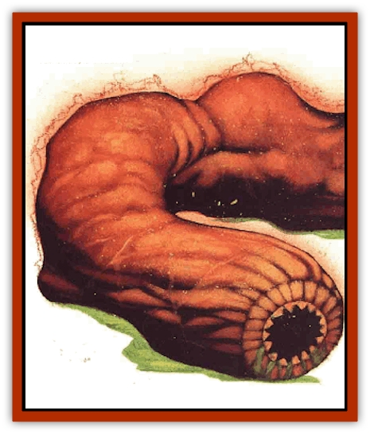

# Thoqqua

| Statistic | **Thoqqua** |
| --- | --- |
| **Activity Cycle:** | Any |
| **Alignment:** | Neutral |
| **Armor Class:** | 2 |
| **Climate/Terrain:** | Planes of Fire, Earth, Magma |
| **Damage/Attack:** | 2d6 or 4d8 |
| **Diet:** | Stone |
| **Frequency:** | Very rare |
| **Hit Dice:** | 3 (but see below) |
| **Intelligence:** | Low (5-7) |
| **Magic Resistance:** | Nil |
| **Morale:** | Steady (11-12) |
| **Movement:** | 12, Br 3 |
| **No. Appearing:** | 1d2 |
| **No. of Attacks:** | 1 |
| **Organization:** | Pairs |
| **Size:** | M (4-5' long) |
| **Special Attacks:** | Heat, charge |
| **Special Defenses:** | Melt weapons, gain hp from heat/fire attacks |
| **THAC0:** | 17 |
| **Treasure:** | Nil |
| **XP Value:** | 650 |

Chant has it that the thoqqua - also known as a rockworm or a fireworm - is a creature native to the Paraelemental Plane of Magma. This makes a certain amount of sense, but the fact is, the monster's found just as often on the Elemental Planes of Fire and Earth. On Earth, it's a hated vermin, attacked on sight by most intelligent denizens of the plane, yet that's also where it's happiest. On Fire, a thoqqua's relatively ignored by the other inhabitants, but its existence is misery. And on Magma, it achieves a balance between the two but never finds true contentment.

See, the thoqqua is a creature of heat and fire that loves stone. It eats minerals and lives within solid rock. This dual nature has led the beast to develop a choleric mood and a foul temper - a thoqqua's never satisfied with its situation. When it comes across a basher, it's as likely to attack him as anything else, just out of mean-spiritedness.

However, that's not due to evil intent. The thoqqua's limited intelligence focuses mainly on self-preservation and finding food. It spends its time burrowing through rock, which it does quite easily thanks to the great heat generated by its long, wormlike body. Chant is that even [[Elemental_Fire_Water|fire elementals]] themselves can't boast the heat produced in the heart of a thoqqua. Sure, that's probably a barmy's exaggeration, but it's still true that the creature can melt stone and metal with ease.

**Combat:** Despite their small size and fairly low Hit Dice total, the thoqquas inspire good, healthy fear in even the toughest of bloods. Inexperienced bashers should avoid them altogether. After all, fireworms give off enough heat to melt through rock - how hard would it be for them to melt their way through a person?

The blistering touch of a thoqqua inflicts 2d6 points of damage. Its most feared attack, however, is its charge into battle; the creature often lunges at a foe from within a nearby rock wall, floor, or ceiling (imposing -2 to the victim's surprise roll). In doing so, a thoqqua can move at a rate of 48 for up to 30 feet, inflicting 4d8 points of damage due to the heat and the impact.

Whenever a thoqqua strikes a sod (whether in a normal attack or a charge), the victim's equipment, armor, or clothing - whatever is actually touched - must make a successful saving throw or be destroyed by the scalding heat. Against a rockworm's charge, items make their saving throws at -4.

A thoqqua can be struck by ordinary (nonmagical) weapons, but they might melt against its super-hot hide. Those that fail a saving throw are destroyed, and each weapon must make a new save every time it strikes the monster.

Cold-based attacks inflict twice their normal damage on a thoqqua. On the other hand, heat makes a poor weapon. Fact is, when a bark uses a fire- or heat-based attack on a thoqqua, the creature gains one hit point for each point of damage that the assault would've caused. In this manner, it can attain a maximum of 48 hit points, which is twice its normal maximum amount, but the additional points last for only 5d8 rounds. When two or more thoqquas are encountered together, they often have inencreased hit point totals from supplementing each other's strength with their own heat.

**Habitat/Society:** The thoqqua appears on many planes. While it doesn't have the power to travel the multiverse on its own, it seems to have a knack for finding vortices and borders which it can use to cross over. While the beast can survive on the planes of Magma, Earth, and Fire (though there's precious little for it to eat on Fire), it's truly at home on none.

On the Elemental Plane of Earth, it burrows endlessly, devouring the melted slag as it goes. Native creatures view these passages as wounds upon their plane and destroy the thoqqua if they can. Certain others, particularly non-natives, appreciate the rockworm for the tunnels it forms. The [[Shad|shad]], for example, use thoqqua burrows so frequently that sometimes their priests *charm* the creatures to create passages where the shad wish to go.

A new rockworm's tunnel's usually about 4 feet in diameter, and a canny cutter knows to let it cool for a short while before using it. For the first 10 rounds after a thoqqua has passed, the walls of the fresh passage are visibly red-hot and burn anything that touches them (inflicting 1d10+4 points of damage). For 10 rounds after that, even though the rock is cooling, any berk who touches the tunnel's walls still suffers 1d6+1 points of damage. The victim is not allowed a saving throw in either case.

**Ecology:** Chant is that the first bashers who ever ran across a rockworm thought it was the larval form of another creature, perhaps a [[Elemental_Fire_Kin|salamander]]. Others (probably Clueless) believed that the thoqqua was a "young elemental", though no one could agree on whether it belonged to Earth, Fire, or Magma. 'Course, today it's known that thoqquas are full-grown creatures in their own right, unrelated to any other beasts.

Fireworms reproduce by budding, and thus are asexual. Young thoqquas exactly resemble their sires except that they're smaller (half the size of an adult, with half the hit points) and generate less heat (inflicting half as much damage).

The thoqqua feeds on minerals and rocks of any kind. It attacks other creatures only out of belligerence or self-defense. Few beings prey on the fiery tunneller, though some of the [[Genie|dao]] and [[Genie|efreet]] look upon boiled rockworm as a delicacy.

---
## Discovery & Documentation

**Source Publication:** Planescape III (1996)
**Campaign Setting:** Planescape
**Author(s):** Monte Cook

### Other Creatures Found in This Source Book
   * [[Animental|Animental]]
   * [[Archomental_Evil|Archomental, Evil]]
   * [[Archomental_Good|Archomental, Good]]
   * [[Belker|Belker]]
   * [[Bzastra|Bzastra]]
   * [[Chososion|Chososion]]
   * [[Darklight|Darklight]]
   * [[Devete|Devete]]
   * [[Devourer_Planescape|Devourer (Planescape)]]
   * [[Dharum_Suhn|Dharum Suhn]]
   * [[Egarus|Egarus]]
   * [[Elemental_Athas_Lesser_Air_Earth|Elemental (Athas), Lesser, Air/Earth]]
   * [[Elemental_Athas_Lesser_Fire_Water|Elemental (Athas), Lesser, Fire/Water]]
   * [[Elemental_Fire_Kin_Salamander_II|Elemental, Fire Kin, Salamander II]]
   * [[Entrope|Entrope]]
   * [[Facet|Facet]]
   * [[Frost_Salamander|Frost Salamander]]
   * [[Fundamental_Air_Earth|Fundamental, Air/Earth]]
   * [[Fundamental_Fire_Water|Fundamental, Fire/Water]]
   * [[Fundamental_All_Elements|Fundamental, All Elements]]
   * [[Garmorm|Garmorm]]
   * [[Homunculus_Elemental|Homunculus, Elemental]]
   * [[Immoth|Immoth]]
   * [[Khargra|Khargra]]
   * [[Klyndes|Klyndes]]
   * [[Magran|Magran]]
   * [[Menglis|Menglis]]
   * [[Nathri|Nathri]]
   * [[Ooze_Sprite|Ooze Sprite]]
   * [[Paraelemental|Paraelemental]]
   * [[Phirblas|Phirblas]]
   * [[Psurlon|Psurlon]]
   * [[Quasielemental_Negative|Quasielemental, Negative]]
   * [[Quasielemental_Positive|Quasielemental, Positive]]
   * [[Rast|Rast]]
   * [[Ravid|Ravid]]
   * [[Ruvoka|Ruvoka]]
   * [[Scile|Scile]]
   * [[Shad|Shad]]
   * [[Shocker|Shocker]]
   * [[Sislan|Sislan]]
   * [[Suisseen|Suisseen]]
   * [[Terithran|Terithran]]
   * [[Trilloch|Trilloch]]
   * [[Tsnng|Tsnng]]
   * [[Ungulosin|Ungulosin]]
   * [[Vacuous|Vacuous]]
   * [[Wavefire|Wavefire]]
   * [[Xag-Ya_Xeg-Yi|Xag-Ya/Xeg-Yi]]
   * [[Xill|Xill]]
