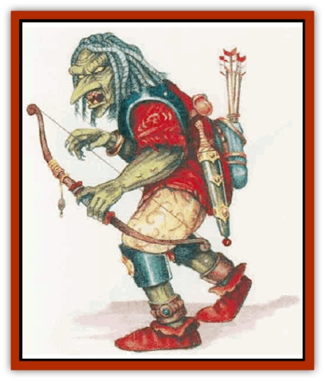

# Thoul

| Statistic | **Thoul** |
| --- | --- |
| **Activity Cycle:** | Any |
| **Alignment:** | Lawful evil |
| **Armor Class:** | 6 |
| **Climate/Terrain:** | Any non-arctic |
| **Damage/Attack:** | 1d3 (claw)/1d3 (claw) or by weapon |
| **Diet:** | Omnivore |
| **Frequency:** | Very rare |
| **Hit Dice:** | 3 |
| **Intelligence:** | Low (5-7) |
| **Magic Resistance:** | Nil |
| **Morale:** | Champion (15) |
| **Movement:** | 12 |
| **No. Appearing:** | 1d6 |
| **No. of Attacks:** | 2 or 1 |
| **Organization:** | Solitary or tribal |
| **Size:** | M (6½' tall) |
| **Special Attacks:** | Paralyzation |
| **Special Defenses:** | Regeneration |
| **THAC0:** | 17 |
| **Treasure:** | C |
| **XP Value:** | 270 / Spellcaster, 1st level: 420 / Spellcaster, 2nd level: 650 / Spellcaster, 3rd level: 975 / Spellcaster, 4th level: 1,400 |

Thouls are magical crosses between [[Ghoul|ghouls]], [[Hobgoblin|hobgoblins]], and [[Troll|trolls]]. In spite of their ghoulish blood, they are living creatures, not undead.

Most thouls look just like hobgoblins: about 6½' tall, dark skinned, and untidy. Some, however, show clear signs of their troll ancestry. Such thouls can have any of the following characteristics: relatively hairless skin with a greenish cast instead of the dark-red or reddish-orange skin of hobgoblins; slate gray or dull black hair, ropy in texture; long and tubelike noses like a troll's, very different from a hobgoblin's rather canine muzzle.

Like hobgoblins, thouls have yellow teeth. Their eyes - yellow like some hobgoblins or pure white - lack any pupil; this and their somewhat vacant look are traits that point to their troll and ghoul ancestry.

Again like hobgoblins, thouls favor brightly colored clothing, usually blood-red cloth and gleaming-black leather. Their weapons are always well cared for and brilliantly polished.Thouls have no tongue of their own, speaking hobgoblin instead. Roughly 60% also speak the languages of [[Orc|orcs]], [[Goblin|goblins]], and [[Ape_Carnivorous|carnivorous apes]]. Thouls living among hobgoblins can speak Common if their hobgoblin hosts do. Independent thouls speak Common 20% of the time.

**Combat:** Like hobgoblins, thouls have infravision with a range of 60' and fight equally well in bright light or darkness. Thouls living with hobgoblins share their hosts' hatred of [[Elf|elves]].

Thouls can paralyze victims just as ghouls can. A target hit by a thoul's claw must make a successful saving throw vs. paralyzation or be paralyzed for 1d6+2 rounds. Tho& often disdain the use of melee weapons unless they are facing elves, who are immune to the paralyzation effect.

Armed thouls usually carry some kind of sword and a long bow. When injured, a thoul can regenerate one lost hit point a melee round as long as it remains alive.

**Habitat/Society:** Thouls have a brutal, militaristic outlook, just as hobgoblins do. Independent thouls live in small family groups in caves or ruins. Lone thoul encounters are with hunters and scouts whose business has taken them away from the main group. A thoul lair contains two young for each adult. Immature thouls inflict no damage other than paralysis (victims receive a +2 bonus on saving throws).

Thouls often serve as bodyguards to hobgoblin kings and chieftains. About 25% of subterranean hobgoblin lairs have 2d6 thoul guards (only 5% of hobgoblin surface villages have thouls). Any thoul living among hobgoblins is hated and feared for its superior abilities and status, and a thoul living in a hobgoblin tribe without the sponsorship of a powerful hobgoblin leader is treated as wretched outcast. Frequently, such thoul survive the abuse they suffer only by virtue of their regeneration ability.

Thoul spellcasters are rare but slightly more frequent among thouls living with hobgoblins. Thouls can become shamans of up to 5th level with access to the Necromancy, Healing, and Charm spheres. Thouls can also become 4th-level witch doctors with spells from the Illusion/Phantasm, Enchantment/Charm, and Necromancy schools.

**Ecology:** Thouls are a viable race but have one of the lowest birthrate among humanoids. Opportunistic hobgoblins, and occasionally orcs, frequently raid independent thoul communities to get young thouls to train as royal bodyguards, assistant shamans, or witch doctors.

Thouls live about 50 years. Thoul guards in hobgoblin live a little longer, due to better food and living conditions.

---
## Discovery & Documentation

**Source Publication:** Mystara Appendix (1994)
**Campaign Setting:** Mystara
**Author(s):** John Nephew, Teeuwynn Woodruff, John Terra, Skip Williams

### Other Creatures Found in This Source Book
   * [[Actaeon|Actaeon]]
   * [[Agarat|Agarat]]
   * [[Ash_Crawler|Ash Crawler]]
   * [[Baldandar|Baldandar]]
   * [[Bargda|Bargda]]
   * [[Bhut|Bhut]]
   * [[Bird_Mystara|Bird (Mystara)]]
   * [[Blackball|Blackball]]
   * [[Choker|Choker]]
   * [[Coltpixie|Coltpixie]]
   * [[Crone_of_Chaos|Crone of Chaos]]
   * [[Darkhood|Darkhood]]
   * [[Darkwing|Darkwing]]
   * [[Decapus|Decapus]]
   * [[Deep_Glaurant|Deep Glaurant]]
   * [[Diabolus|Diabolus]]
   * [[Dimensional_Warper|Dimensional Warper]]
   * [[Dragon_Mystara_Crystalline|Dragon (Mystara), Crystalline]]
   * [[Dragon_Mystara_Jade|Dragon (Mystara), Jade]]
   * [[Dragon_Mystara_Onyx|Dragon (Mystara), Onyx]]
   * [[Dragon_Mystara_Ruby|Dragon (Mystara), Ruby]]
   * [[Drake_Mystara|Drake (Mystara)]]
   * [[Dragonfly|Dragonfly]]
   * [[Dusanu|Dusanu]]
   * [[Elemental_of_Chaos_Air_Earth|Elemental of Chaos, Air/Earth]]
   * [[Elemental_of_Chaos_Fire_Water|Elemental of Chaos, Fire/Water]]
   * [[Elemental_of_Law_Air_Earth|Elemental of Law, Air/Earth]]
   * [[Elemental_of_Law_Fire_Water|Elemental of Law, Fire/Water]]
   * [[Familiar_Mystara|Familiar (Mystara)]]
   * [[Frost_Salamander|Frost Salamander]]
   * [[Fundamental_Air_Earth|Fundamental, Air/Earth]]
   * [[Fundamental_Fire_Water|Fundamental, Fire/Water]]
   * [[Gargantua_Mystara|Gargantua (Mystara)]]
   * [[Geonid|Geonid]]
   * [[Ghostly_Horde|Ghostly Horde]]
   * [[Giant_Athach|Giant, Athach]]
   * [[Giant_Hephaeston|Giant, Hephaeston]]
   * [[Golem_Drolem|Golem, Drolem]]
   * [[Golem_Mystara_I|Golem (Mystara) I]]
   * [[Golem_Mystara_II|Golem (Mystara) II]]
   * [[Golem_Mystara_III|Golem (Mystara) III]]
   * [[Gray_Philosopher|Gray Philosopher]]
   * [[Guardian_Warrior|Guardian Warrior]]
   * [[Gyerian|Gyerian]]
   * [[Herex|Herex]]
   * [[Hivebrood|Hivebrood]]
   * [[Horde|Horde]]
   * [[Hsiao|Hsiao]]
   * [[Huptzeen|Huptzeen]]
   * [[Hutaakan|Hutaakan]]
   * [[Imp_Mystara|Imp (Mystara)]]
   * [[Jellyfish_Giant_Mystara|Jellyfish, Giant (Mystara)]]
   * [[Kna|Kna]]
   * [[Kopru|Kopru]]
   * [[Lizard_Mystara|Lizard (Mystara)]]
   * [[Lizard-kin_Mystara|Lizard-kin (Mystara)]]
   * [[Lupin|Lupin]]
   * [[Lycanthrope_Werejaguar_Mystara|Lycanthrope, Werejaguar (Mystara)]]
   * [[Lycanthrope_Wereswine|Lycanthrope, Wereswine]]
   * [[Magen|Magen]]
   * [[Manikin|Manikin]]
   * [[Mek|Mek]]
   * [[Mujina|Mujina]]
   * [[Nagpa|Nagpa]]
   * [[Neh-thalggu|Neh-thalggu]]
   * [[Nightshade_Mystara|Nightshade (Mystara)]]
   * [[Nuckalavee|Nuckalavee]]
   * [[Pegataur|Pegataur]]
   * [[Phanaton|Phanaton]]
   * [[Plant_Dangerous_Mystara|Plant, Dangerous (Mystara)]]
   * [[Plasm|Plasm]]
   * [[Rakasta|Rakasta]]
   * [[Rock_Man|Rock Man]]
   * [[Sabreclaw|Sabreclaw]]
   * [[Sacrol|Sacrol]]
   * [[Scamille|Scamille]]
   * [[Shapeshifter|Shapeshifter]]
   * [[Shargugh|Shargugh]]
   * [[Shark-kin|Shark-kin]]
   * [[Sollux|Sollux]]
   * [[Spectral_Death|Spectral Death]]
   * [[Spectral_Hound|Spectral Hound]]
   * [[Spider-kin|Spider-kin]]
   * [[Spirit_Mystara|Spirit (Mystara)]]
   * [[Statue_Living|Statue, Living]]
   * [[Surtaki|Surtaki]]
   * [[Tabi|Tabi]]
   * [[Thunderhead|Thunderhead]]
   * [[Tiger_Ebon|Tiger, Ebon]]
   * [[Topi|Topi]]
   * [[Tortle|Tortle]]
   * [[Vampire_Velya|Vampire, Velya]]
   * [[White_Fang|White Fang]]
   * [[Worm_Mystara|Worm (Mystara)]]
   * [[Wyrd|Wyrd]]
   * [[Yowler|Yowler]]
   * [[Zombie_Lightning|Zombie, Lightning]]
