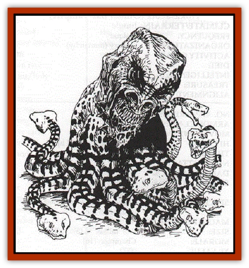

# Thousandtooth

| Statistic | **Thousandtooth** |
| --- | --- |
| **Activity Cycle:** | any |
| **Alignment:** | Lawful Evil |
| **Armor Class:** | s |
| **Climate/Terrain:** | any |
| **Damage/Attack:** | 1d6/1d3 |
| **Diet:** | omnivore |
| **Frequency:** | very rare |
| **Hit Dice:** | 6 |
| **Intelligence:** | Low (5-7) |
| **Magic Resistance:** | Nil |
| **Morale:** | Elite (14) |
| **Movement:** | 9 |
| **No. Appearing:** | 1 |
| **No. of Attacks:** | 1 + up to 8 |
| **Organization:** | solitary |
| **Size:** | M (4' diameter) |
| **Special Attacks:** | Petrification, poison |
| **Special Defenses:** | Nil |
| **THAC0:** | 15 |
| **Treasure:** | Nil |
| **XP Value:** | 4000 |

The thousandtooth is a monstrosity made by mutating a [[Medusa|medusa]]. It looks like an oversized human head with large sharp teeth and solid gray eyes. Rather than a body, it has a roundish lump of flesh behind the head from which sprout 8+1d4 thick reptilian limbs, each ending in the head of a venomous snake. It moves by using three or more of its lower reptilian limbs as primitive legs. Some also have a pair of spindly arms growing from the sides of their fleshy bodies.

**Combat:** The thousandtooth retains the medusa's ability to petrify flesh, although its power is much weaker than a medusa's. Any creature that comes within 30' of the thousandtooth must make a saving throw vs. petrification at +2 or slowly change into stone. On the first round after the attack, the victim is slowed (as per th.e spell) but gains a + 1 bonus to his armor class due to the stony consistency of his skin. On the third round, the victim is completely petrified. At close range, the thousandtooth attacks with its humanhead bite and up to eight bites from its snake-limbs. Anyone struck by a snake-head must save vs. poison or die (type F poison). The thousandtooth must make a saving throw vs. petrification +2 if it sees its reflection.

**Habitat/Society:** A thousandtooth is a solitary predator, claiming a few square miles as its turf. As it cannot outrun its prey, it must wait for creatures to approach it, so it prefers terrain with places to hide. It reproduces by budding - once a year, one of the snaky limbs drops off and crawls away as an independent creature; after a year of living like a snake it begins to consume massive amounts of food to prepare for its metamorphosis. The snake changes into an adult thousandtooth after a week of hibernation; it can use all its powers and is particularly hungry after the change.

**Ecology:** The thousandtooth is a destructive predator, attacking anything in its territory that it sees as a threat or competition. This results in a number of statues in its territory as well as an increase in the number of predators in neighboring regions.

---
## Discovery & Documentation

**Source Publication:** The Scarlet Brotherhood (1999)
**Campaign Setting:** Greyhawk
**Author(s):** Sean Reynolds, Kij Johnson, Chris McKitterick, Lisa Stevens, Erik Mona, Roger Moore, Steve Wilson, Sam Wood, Dawn Murin

### Other Creatures Found in This Source Book
   * [[Gibbering_Mouther_Greater|Gibbering Mouther, Greater]]
   * [[Onco|Onco]]
   * [[Ravenous|Ravenous]]
   * [[Su-Monster|Su-Monster]]
   * [[Tlokasazotz_Olman_Bat-Vampire|Tlokasazotz (Olman Bat-Vampire)]]
