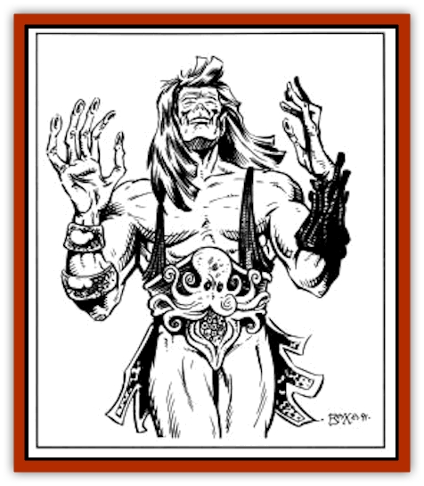

# Thrax

| Statistic | **Thrax** |
| --- | --- |
| **Activity Cycle:** | Night |
| **Alignment:** | Neutral evil |
| **Armor Class:** | 2 |
| **Climate/Terrain:** | Sea of Silt, Tablelands |
| **Damage/Attack:** | 2-12 or by weapon +3 (strength) |
| **Diet:** | Special |
| **Frequency:** | Rare |
| **Hit Dice:** | 9 |
| **Intelligence:** | Very (11-12) |
| **Magic Resistance:** | Nil |
| **Morale:** | Champion (15-16) |
| **Movement:** | 24 |
| **No. Appearing:** | 1 |
| **No. of Attacks:** | 1 + special |
| **Organization:** | Solitary |
| **Size:** | M (5-7' tall) |
| **Special Attacks:** | Water drain |
| **Special Defenses:** | Nil |
| **THAC0:** | 11 |
| **Treasure:** | K,M (A) |
| **XP Value:** | 2,000 |

**Psionics Summary**

| Level | Dis/Sci/Dev | Attack/Defense | Score | PSPs |
| --- | --- | --- | --- | --- |
| 2 | 1/2/4 | -/- | 12 | 66 |

**Psychometabolism -** *Sciences:* energy containment, shadow form; *Devotions:* aging, cause decay, displacement, double pain.

A Thrax is a dreadful creature that exists by draining the water from its victims. The thrax is very intelligent and is an implacable foe.

The thrax is humanoid in appearance with a ruddy tinge to its skin. It has dark hair and pointed ears, but it will never be mistaken for an [[Elf_Athas|elf]]. Its features are gaunt and angular, and the eyes of a thrax are a deep blue, like a pool of water. The thrax is a muscular creature; it has long thin arms and fingers that end in small suckers.

Thrax speak all of the languages they knew in their former existence.

**Combat:** A thrax prefers to attack solitary creatures, either a being out by itself or perhaps a lone sentry on watch over a sleeping camp. The thrax uses its shadow-form to close with the potential victim, solidifying behind him. If the victim is well armored, the thrax will attempts to decay the victim's armor. When the armor falls to pieces around the victim, the thrax attacks with its powerful arms, to hold and drain the victim of all the water in his body.

A successful hit by a thrax on an unarmored victim causes 2d6 points of damage, and the victim must save vs. petrification. Failure means that the thrax has fastened its finger suckers to the victim's skin and has begun to drain the water from the victim. If the intended prey still has armor on, the thrax has a 10% chance per AC point of fastening onto the victim. (Thus, the thrax has an 80% chance of touching someone who is Armor Class 8.)

It takes one turn for a thrax to drain all of the water from a man-sized creature, or roughly one round per 20 lbs of body weight. This causes incredible pain to the afflicted being; each round the victim must make a save vs. death magic or pass out from the pain. Each round that the draining is continued causes a cumulative -2 penalty to the save. When more than 75% of the water is drained, the victim automatically passes out due to dehydration. Note that the -2 penalty also applies to attacks, damage, and any other abilities or actions that the being under attack from the thrax attempts. The pain also prevents the victim from concentrating sufficiently to cast spells or use psionic powers.

A victim who is totally drained of water does not become a thrax, but turns into a desiccated corpse. However, a human who survives an attack by a thrax must make a saving throw vs. death magic, with no modifier, or become a water drainer himself. This is not a disease, but rather a magical curse transmitted by the thrax. This change takes from two to four weeks (d3+1), and during that time the victim has an intense thirst. It requires a *remove curse* to cure the victim of this affliction. The spell must be cast before the victim manifests as a thrax. Only humans are susceptible to this curse.

**Habitat/Society:** The thrax is an unfortunate creature that can be found anywhere. Since the corpse of a thrax victim is unmistakable, thrax are not common in cities or villages, at least not for long. They usually leave as soon as they discover their curse, or else they are hunted down and wiped out. Outside the villages they lead solitary anguished lives. The thrax remembers what he was like before the change, but he cannot help himself. He is driven to try to survive. At first, the new thrax may even retain his original alignment, perhaps resolving to feed on animals instead of intelligent beings. But the curse continues to work, and after a few months, feeding is the only thing that matters. He also begins to hate those who have not suffered his curse, especially humans and demi-humans.

**Ecology:** A thrax needs to feed on a victim at least once a day. A thrax can drink water, but it does not provide the nourishment that he requires.

---
## Discovery & Documentation

**Source Publication:** MC12 Dark Sun Appendix I - Terrors of the Desert (1991)
**Campaign Setting:** Dark Sun
**Author(s):** Tom Prusa, Louis J. Prosperi, Walter M. Baas

### Other Creatures Found in This Source Book
   * [[Animal_Herd_Athas|Animal, Herd (Athas)]]
   * [[Animal_Household_Athas|Animal, Household (Athas)]]
   * [[Antloid_Desert|Antloid, Desert]]
   * [[Banshee_Dwarf|Banshee, Dwarf]]
   * [[Beetle_Agony|Beetle, Agony]]
   * [[Bog_Wader|Bog Wader]]
   * [[Brambleweed|Brambleweed]]
   * [[B'rohg|B'rohg]]
   * [[Burnflower|Burnflower]]
   * [[Cat_Psionic|Cat, Psionic]]
   * [[Cha'thrang|Cha'thrang]]
   * [[Cistern_Fiend|Cistern Fiend]]
   * [[Clam_Giant|Clam, Giant]]
   * [[Cloud_Ray|Cloud Ray]]
   * [[Drake_Athas_Air|Drake (Athas), Air]]
   * [[Drake_Athas_Earth|Drake (Athas), Earth]]
   * [[Drake_Athas_Fire|Drake (Athas), Fire]]
   * [[Drake_Athas_Water|Drake (Athas), Water]]
   * [[Dune_Runner|Dune Runner]]
   * [[Dune_Trapper|Dune Trapper]]
   * [[Elemental_Athas_Greater_Air|Elemental (Athas), Greater, Air]]
   * [[Elemental_Athas_Greater_Earth|Elemental (Athas), Greater, Earth]]
   * [[Elemental_Athas_Greater_Fire|Elemental (Athas), Greater, Fire]]
   * [[Elemental_Athas_Greater_Water|Elemental (Athas), Greater, Water]]
   * [[Elemental_Athas_Lesser_Air_Earth|Elemental (Athas), Lesser, Air/Earth]]
   * [[Elemental_Athas_Lesser_Fire_Water|Elemental (Athas), Lesser, Fire/Water]]
   * [[Elemental_Athas_General_Information|Elemental (Athas), General Information]]
   * [[Erdland|Erdland]]
   * [[Esperweed|Esperweed]]
   * [[Flailer|Flailer]]
   * [[Floater|Floater]]
   * [[Giant_Athas|Giant (Athas)]]
   * [[Golem_Athas_I|Golem (Athas) I]]
   * [[Golem_Athas_II|Golem (Athas) II]]
   * [[Golem_Athas_III|Golem (Athas) III]]
   * [[Golem_Athas_General_Information|Golem (Athas), General Information]]
   * [[Halfling_Renegade|Halfling, Renegade]]
   * [[Hej-kin|Hej-kin]]
   * [[Id_Fiend|Id Fiend]]
   * [[Insect_Swarm_Athas|Insect Swarm (Athas)]]
   * [[Kank_Wild|Kank, Wild]]
   * [[Kirre|Kirre]]
   * [[Megapede|Megapede]]
   * [[Mul_Wild|Mul, Wild]]
   * [[Nightmare_Beast|Nightmare Beast]]
   * [[Plant_Carnivorous_Athas|Plant, Carnivorous (Athas)]]
   * [[Pterran|Pterran]]
   * [[Pterrax|Pterrax]]
   * [[Pulp_Bee|Pulp Bee]]
   * [[Pyreen|Pyreen]]
   * [[Rasclinn|Rasclinn]]
   * [[Razorwing|Razorwing]]
   * [[Roc_Athas|Roc (Athas)]]
   * [[Sand_Bride|Sand Bride]]
   * [[Sand_Cactus|Sand Cactus]]
   * [[Sand_Vortex|Sand Vortex]]
   * [[Scrab|Scrab]]
   * [[Silt_Horror|Silt Horror]]
   * [[Silt_Runner|Silt Runner]]
   * [[Sink_Worm|Sink Worm]]
   * [[Sloth_Athas|Sloth (Athas)]]
   * [[So-ut|So-ut]]
   * [[Spider_Cactus|Spider Cactus]]
   * [[Spider_Crystal|Spider, Crystal]]
   * [[Spirit_of_the_Land|Spirit of the Land]]
   * [[T'Chowb|T'Chowb]]
   * [[Tohr-kreen_I|Tohr-kreen I]]
   * [[Villichi|Villichi]]
   * [[Zhackal|Zhackal]]
   * [[Zombie_Plant|Zombie Plant]]
