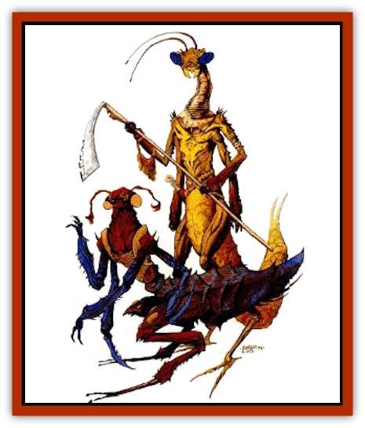
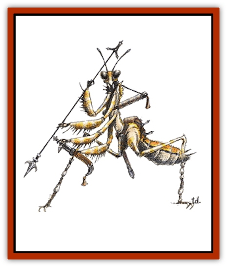

# Thri-kreen

| Statistic | **Thri-kreen** |
| --- | --- |
| **Activity Cycle:** | Constant |
| **Alignment:** | Chaotic neutral |
| **Armor Class:** | 5 |
| **Climate/Terrain:** | Any land (Temperate or tropical arid land) |
| **Damage/Attack:** | 1d4 (&times;4)/1d4+1, or 1d4+1 and by weapon |
| **Diet:** | Carnivore |
| **Frequency:** | Uncommon |
| **Hit Dice:** | 6+3 |
| **Intelligence:** | Average to high (8-14) |
| **Magic Resistance:** | Nil |
| **Morale:** | Fanatic (17-18) |
| **Movement:** | 18 |
| **No. Appearing:** | 2d12 |
| **No. of Attacks:** | 5 or 2 |
| **Organization:** | Clutch and pack |
| **Size:** | L (11' long) |
| **Special Attacks:** | Paralyzation |
| **Special Defenses:** | Missile dodge |
| **THAC0:** | 13 |
| **Treasure:** | Varies |
| **XP Value:** | 1,400 |

The figures given above are for mature adult thri-kreen. Others have the following abilities, based on their age (they age one age category per year until they reach mature adult):

|  | HD | THAC0 | XP | Claw/bite Damage | Special Ability |
| --- | --- | --- | --- | --- | --- |
| Larva | 1+3 | 19 | 65 | 1/1 | - |
| Child | 2+3 | 17 | 120 | 1/1 | - |
| Young | 3+3 | 17 | 175 | 1d3/1d3 | leap |
| Young adult | 4+3 | 15 | 270 | 1d3/1d3 | - |
| Adult | 5+3 | 15 | 975 | 1d4/1d4+1 | venom, chatkcha |
| Mature adult | 6+3 | 13 | 1,400 | 1d4/1d4+1 | dodge missiles |

Thri-kreen are a race of large, intelligent [[Insect_Giant|insects]] often referred to as "mantis warriors". They are found in most areas of Athas and they prefer to roam the plains where they have hunting territorres. Thri-kreen have no need of sleep and can remain active through the day and night.

Mature adult thri-kreen are 7 feet tall at the shoulder and 11 feet long. Six limbs protrude from their midsection, two are used for walking and the other four end in hands. The tough, sandy-yellow exoskeleton is extremely hard. A thri-kreen has two compound eyes, usually black with highlighted eyespots, two antennae, and a complicated jaw structure that manipulates food as the thri-kreen chews. The antennae help the individual to maneuver through brush and grasslands in the darkness (they also lessen any melee combat penalty from darkness or blindness by 1; missile combat is not affected). Thri-kreen often wear harnesses and even some forms of clothing, but they never wear armor.

The two subspecies of thri-kreen found in the Tyr Region are the jeral and the to'ksa. Jeral have short necks and antennae. Their hands each have three fingers and the shells of their abdomens are segmented. To'ksa have four-fingered hands, long necks, and long antennae They also have a long, solid shell that covers the top of the abdomen, and a thin layer of skin that covers the rest of their chitin.

The thri-kreen native language uses several sounds found in humanoid languages, but also uses clicks and grinding sounds. While it is difficult for other creatures to speak this tongue, it is just as difficult for thri-kreen to imitate more standard speech patterns. Thri-kreen speak their own language, but some (perhaps 30%) understand common.

**Combat:** The majority of thri-kreen are hunters, concerned primarily with finding enough prey to support the pack. Thri-kreen hunters seldom attack other sentient beings for food, but will defend themselves if attacked. Some thri-kreen have strayed from hunting and have begun raiding, these thri-kreen are the scourge of all other creatures. Thri-kreen attack in a well-coordinated group, generally weakening their enemies with psionics and missile weapons before engaging in melee. They also stalk prey and are relentless in their pursuit. Because thri-kreen do not sleep, their ability in siege combat is superior. A raiding party can continue an assault long after their opponents have tired. Though thri-kreen can win most battles by force, they win some through attrition and endurance.

The thri-kreens' chitinous exoskeletons give them AC 5 naturally. Thri-kreen are immune to *charm person* and *hold person* spells. Unarmed, thri-kreen can attack with 4 claws and 1 bite attack per round. If using a weapon, thri-kreen can attack with weapon and bite. The gythka, a polearm with a blade at each end, can slash for 1-6 (1d6) points of damage against man-sized or smaller targets, or 1-10 (1d10) points of damage against larger targets. The gythka can be thrown as a spear to inflict 3.8 (1d6+2) points of damage. Thri-kreen also learn special combat maneuvers as they grow older, learning all by the time they are mature adults.

*Leap:* This ability allows thri-kreen to leap 20 feet straight up or 50 feet forward. They cannot leap backward.

*Chatkcha:* This is a crystalline throwing wedge. A thri-kreen can throw 2 chatkcha per round, as far as 270 feet. A chatkcha causes 3-8 (1d6+2) points of damage when it hits, and returns to the thrower when it misses. Generally, only adult thri-kreen use the chatkcha. The thri-kreen ceremony of adulthood is associated with the chatkcha.

*Venom:* This venom is delivered through an older thri-kreen's bite. Anyone bitten must make a successful save vs. paralyzation or be paralyzed. Smaller than man-sized creatures are paralyzed for 2-20 (2d10) rounds, man-sized for 2-16 (2d8) rounds, large creatures for 1-8 (1d8) rounds, and huge and gargantuan creatures for only 1 round.

*Dodge missiles:* A mature thri-kreen can dodge missiles fired at it with a roll of 9 or better on 1d20; they cannot dodge magical effects, only physical missiles. Magical physical missiles (arrows, thrown axes) modify this roll by their magical bonus.

*Psionics:* Some thri-kreen have psionic wild talents. There is a 50% chance that any thri-kreen will have a psionic wild talent, described in *The Complete Psionics Handbook*.

*Magical items:* Thri-kreen can use most magical items, though those designed for humanoid creatures cannot be worn properly, so do not function for a thri-kreen.

**Habitat/Society:** Thri-kreen hatch from eggs. Those who hatch from the same group of eggs are considered a clutch. The bond of a clutchmate goes beyond family or friendship. When thri-kreen enter humanoid society. they still feel compelled to belong to a clutch and often accept humanoids as clutchmates.

In their natural habitats thri-kreen organize into hunting packs. There are no permanent thri-kreen communities. Each pack consists of several clutches and ranges over a wide territory that the pack considers to be theirs for purposes of hunting. Small packs consist only of mature adults. Packs of more than eight thri-kreen are about two-thirds mature adults and one-third other age categories (in about equal numbers).

Thri-kreen clutches and packs are organized along a strict order of dominance. The toughest member is the leader, the second most powerful is the second in command, and so forth. A thri-kreen can challenge a superior for dominance, initiating a contest. The combatants fight until one surrenders or dies. Afterward, the matter is settled and there are no lingering resentments, because all thri-kreen agree that a strong leader makes a strong pack. The challenger is doing what is best for the pack, not seeking personal gain, and after a challenge, both individuals can go about their business, confident of their status within the group.

When thri-kreen are not engaged in hunting, they make and repair weapons, teach skills to their young, and create works of art, usually sculpture. Thri-kreen also decorate their chitin with etchings or sometimes paints. Thri-kreen also pride themselves in the quality of their weapons, especially the chatkcha. Many chatkcha are decorative as well as functional and have designs carved into them. Some chatkcha become heirlooms and are passed on from generation to generation within a pack. If an heirloom chatkcha is lost or stolen, thri-kreen consider it a point of honor to recover it.

Thri-kreen are monogamous and never betray the bond between mates. Mating usually takes place late in the year at the time of the ascending sun. From 10-30 eggs are laid approximately 30 days later. Eggs not eaten by predators hatch about 60 days later. Thri-kreen advance one age category per year until they become mature adults. A thrikreen seldom lives for more than 35 years.

**Ecology:** Thri-kreen are carnivores. They seldom hunt other intelligent creatures for food, but will do so in times of need. Mantis warriors have a well-known taste for [[Elf_Athas|elves]], which keeps both races at an uneasy peace at best. When raiding instead of simply hunting, thri-kreen are rarely interested in items with monetary value, usually concentrating on those things they can eat. Thri-kreen packs carry little that could be considered treasure, though their weapons and tools are considered valuable by some. Thri-kreen chitin can also be used for armor by humanoids if care is taken.

---
## Discovery & Documentation

**Source Publication:** Monstrous Manual (1995)
**Campaign Setting:** Advanced Dungeons & Dragons 2nd Edition
**Author(s):** Tim Beach

### Other Creatures Found in This Source Book
   * [[Aarakocra|Aarakocra]]
   * [[Aboleth|Aboleth]]
   * [[Ankheg|Ankheg]]
   * [[Arcane|Arcane]]
   * [[Argos|Argos]]
   * [[Aurumvorax|Aurumvorax]]
   * [[Baatezu_Lesser_Abishai|Baatezu, Lesser, Abishai]]
   * [[Baatezu_General_Information|Baatezu, General Information]]
   * [[Baatezu_Greater_Pit_Fiend|Baatezu, Greater, Pit Fiend]]
   * [[Banshee|Banshee]]
   * [[Basilisk|Basilisk]]
   * [[Bat|Bat]]
   * [[Bear|Bear]]
   * [[Beetle_Giant|Beetle, Giant]]
   * [[Behir|Behir]]
   * [[Beholder_and_Beholder-kin_I|Beholder and Beholder-kin I]]
   * [[Beholder_and_Beholder-kin_II|Beholder and Beholder-kin II]]
   * [[Bird|Bird]]
   * [[Brain_Mole|Brain Mole]]
   * [[Broken_One|Broken One]]
   * [[Brownie|Brownie]]
   * [[Bugbear|Bugbear]]
   * [[Bulette|Bulette]]
   * [[Bullywug|Bullywug]]
   * [[Carrion_Crawler|Carrion Crawler]]
   * [[Cat_Great|Cat, Great]]
   * [[Catoblepas|Catoblepas]]
   * [[Cat_Small|Cat, Small]]
   * [[Cave_Fisher|Cave Fisher]]
   * [[Centaur|Centaur]]
   * [[Centipede|Centipede]]
   * [[Chimera|Chimera]]
   * [[Cloaker|Cloaker]]
   * [[Cockatrice|Cockatrice]]
   * [[Couatl|Couatl]]
   * [[Crabman|Crabman]]
   * [[Crawling_Claw|Crawling Claw]]
   * [[Crocodile|Crocodile]]
   * [[Crustacean_Giant|Crustacean, Giant]]
   * [[Crypt_Thing|Crypt Thing]]
   * [[Death_Knight|Death Knight]]
   * [[Deepspawn|Deepspawn]]
   * [[Dinosaur_I|Dinosaur I]]
   * [[Displacer_Beast|Displacer Beast]]
   * [[Dog|Dog]]
   * [[Dog_Moon|Dog, Moon]]
   * [[Dolphin|Dolphin]]
   * [[Doppelganger|Doppelganger]]
   * [[Dracolich|Dracolich]]
   * [[Dragon_Brown|Dragon, Brown]]
   * [[Dragon_Chromatic_Black|Dragon, Chromatic, Black]]
   * [[Dragon_Chromatic_Blue|Dragon, Chromatic, Blue]]
   * [[Dragon_Chromatic_Green|Dragon, Chromatic, Green]]
   * [[Dragon_Cloud|Dragon, Cloud]]
   * [[Dragon_Chromatic_Red|Dragon, Chromatic, Red]]
   * [[Dragon_Chromatic_White|Dragon, Chromatic, White]]
   * [[Dragon_Deep|Dragon, Deep]]
   * [[Dragon_Gem_Amethyst|Dragon, Gem, Amethyst]]
   * [[Dragon_Gem_Crystal|Dragon, Gem, Crystal]]
   * [[Dragon_Gem_Emerald|Dragon, Gem, Emerald]]
   * [[Dragon_Gem_Sapphire|Dragon, Gem, Sapphire]]
   * [[Dragon_Gem_Topaz|Dragon, Gem, Topaz]]
   * [[Dragon_Metallic_Brass|Dragon, Metallic, Brass]]
   * [[Dragon_Metallic_Bronze|Dragon, Metallic, Bronze]]
   * [[Dragon_Metallic_Copper|Dragon, Metallic, Copper]]
   * [[Dragon_Mercury|Dragon, Mercury]]
   * [[Dragon_Metallic_Gold|Dragon, Metallic, Gold]]
   * [[Dragon_Mist|Dragon, Mist]]
   * [[Dragon_Metallic_Silver|Dragon, Metallic, Silver]]
   * [[Dragon_General_Information|Dragon, General Information]]
   * [[Dragon_Shadow|Dragon, Shadow]]
   * [[Dragon_Steel|Dragon, Steel]]
   * [[Dragon_Yellow|Dragon, Yellow]]
   * [[Dragonne|Dragonne]]
   * [[Dragon_Turtle|Dragon Turtle]]
   * [[Dragonet_Faerie_Dragon|Dragonet, Faerie Dragon]]
   * [[Dragonet_Fire_Drake|Dragonet, Fire Drake]]
   * [[Dragonet_Pseudodragon|Dragonet, Pseudodragon]]
   * [[Dryad|Dryad]]
   * [[Dwarf_Derro|Dwarf, Derro]]
   * [[Dwarf|Dwarf]]
   * [[Elemental_Athas_General_Information|Elemental (Athas), General Information]]
   * [[Elemental_Air_Kin|Elemental, Air Kin]]
   * [[Elemental_Earth_Kin|Elemental, Earth Kin]]
   * [[Elemental_Fire_Kin|Elemental, Fire Kin]]
   * [[Elemental_Water_Kin|Elemental, Water Kin]]
   * [[Elemental_of_Chaos_Air_Earth|Elemental of Chaos, Air/Earth]]
   * [[Elemental_of_Chaos_Fire_Water|Elemental of Chaos, Fire/Water]]
   * [[Elemental_Composite|Elemental, Composite]]
   * [[Elemental_Air_Earth|Elemental, Air/Earth]]
   * [[Elemental_Fire_Water|Elemental, Fire/Water]]
   * [[Elemental_General_Information|Elemental, General Information]]
   * [[Elephant|Elephant]]
   * [[Elf|Elf]]
   * [[Elf_Aquatic|Elf, Aquatic]]
   * [[Elf_Drow|Elf, Drow]]
   * [[Ettercap|Ettercap]]
   * [[Eyewing|Eyewing]]
   * [[Feyr|Feyr]]
   * [[Fish|Fish]]
   * [[Frog|Frog]]
   * [[Fungus|Fungus]]
   * [[Galeb_Duhr|Galeb Duhr]]
   * [[Gargantua|Gargantua]]
   * [[Gargoyle_I|Gargoyle I]]
   * [[Genie|Genie]]
   * [[Ghost|Ghost]]
   * [[Ghoul|Ghoul]]
   * [[Giant_Cloud|Giant, Cloud]]
   * [[Giant_Cyclops|Giant, Cyclops]]
   * [[Giant_Desert|Giant, Desert]]
   * [[Giant_Ettin|Giant, Ettin]]
   * [[Giant_Firbolg|Giant, Firbolg]]
   * [[Giant_Fire|Giant, Fire]]
   * [[Giant_Fog|Giant, Fog]]
   * [[Giant_Fomorian|Giant, Fomorian]]
   * [[Giant_Frost|Giant, Frost]]
   * [[Giant_Hill|Giant, Hill]]
   * [[Giant_Jungle|Giant, Jungle]]
   * [[Giant_Mountain|Giant, Mountain]]
   * [[Giant_Reef|Giant, Reef]]
   * [[Giant_Stone|Giant, Stone]]
   * [[Giant_Storm|Giant, Storm]]
   * [[Giant_Verbeeg|Giant, Verbeeg]]
   * [[Giant_Wood|Giant, Wood]]
   * [[Gibberling|Gibberling]]
   * [[Giff|Giff]]
   * [[Gith|Gith]]
   * [[Gith_Pirate_of|Gith, Pirate of]]
   * [[Githyanki|Githyanki]]
   * [[Githzerai|Githzerai]]
   * [[Gloomwing|Gloomwing]]
   * [[Gnoll|Gnoll]]
   * [[Gnome|Gnome]]
   * [[Gnome_Spriggan|Gnome, Spriggan]]
   * [[Goblin|Goblin]]
   * [[Golem_General_Information|Golem, General Information]]
   * [[Golem_I_Greater_Golem|Golem I (Greater Golem)]]
   * [[Golem_II_Lesser_Golem|Golem II (Lesser Golem)]]
   * [[Golem_III|Golem III]]
   * [[Golem_IV|Golem IV]]
   * [[Golem_V|Golem V]]
   * [[Golem_VI_Stone_Variants|Golem VI (Stone Variants)]]
   * [[Gorgon|Gorgon]]
   * [[Grell_Colonial|Grell, Colonial]]
   * [[Gremlin_Jermlaine|Gremlin, Jermlaine]]
   * [[Gremlin|Gremlin]]
   * [[Griffon|Griffon]]
   * [[Grimlock|Grimlock]]
   * [[Grippli|Grippli]]
   * [[Hag|Hag]]
   * [[Halfling|Halfling]]
   * [[Harpy|Harpy]]
   * [[Hatori|Hatori]]
   * [[Haunt|Haunt]]
   * [[Hell_Hound|Hell Hound]]
   * [[Heucuva|Heucuva]]
   * [[Hippocampus|Hippocampus]]
   * [[Hippogriff|Hippogriff]]
   * [[Hobgoblin|Hobgoblin]]
   * [[Homunculus|Homunculus]]
   * [[Hook_Horror|Hook Horror]]
   * [[Horse|Horse]]
   * [[Human|Human]]
   * [[Hydra|Hydra]]
   * [[Imp|Imp]]
   * [[Insect_Giant|Insect, Giant]]
   * [[Insect_Swarm|Insect Swarm]]
   * [[Intellect_Devourer|Intellect Devourer]]
   * [[Invisible_Stalker|Invisible Stalker]]
   * [[Ixitxachitl|Ixitxachitl]]
   * [[Jackalwere|Jackalwere]]
   * [[Kenku|Kenku]]
   * [[Ki-rin|Ki-rin]]
   * [[Kirre|Kirre]]
   * [[Kobold|Kobold]]
   * [[Kuo-Toa|Kuo-Toa]]
   * [[Lamia|Lamia]]
   * [[Lammasu|Lammasu]]
   * [[Leech|Leech]]
   * [[Leprechaun|Leprechaun]]
   * [[Leucrotta|Leucrotta]]
   * [[Lich|Lich]]
   * [[Living_Wall|Living Wall]]
   * [[Lizard|Lizard]]
   * [[Lizard_Man|Lizard Man]]
   * [[Locathah|Locathah]]
   * [[Lurker|Lurker]]
   * [[Lycanthrope_General_Information|Lycanthrope, General Information]]
   * [[Lycanthrope_Seawolf|Lycanthrope, Seawolf]]
   * [[Lycanthrope_Werebear|Lycanthrope, Werebear]]
   * [[Lycanthrope_Wereboar|Lycanthrope, Wereboar]]
   * [[Lycanthrope_Werebat|Lycanthrope, Werebat]]
   * [[Lycanthrope_Werefox|Lycanthrope, Werefox]]
   * [[Lycanthrope_Wererat|Lycanthrope, Wererat]]
   * [[Lycanthrope_Wereraven|Lycanthrope, Wereraven]]
   * [[Lycanthrope_Weretiger|Lycanthrope, Weretiger]]
   * [[Lycanthrope_Werewolf|Lycanthrope, Werewolf]]
   * [[Mammal|Mammal]]
   * [[Mammal_Giant|Mammal, Giant]]
   * [[Mammal_Herd_I|Mammal, Herd I]]
   * [[Mammal_Small|Mammal, Small]]
   * [[Manscorpion|Manscorpion]]
   * [[Manticore|Manticore]]
   * [[Medusa_Maedar|Medusa, Maedar]]
   * [[Medusa|Medusa]]
   * [[Mephit_General_Information|Mephit, General Information]]
   * [[Merman|Merman]]
   * [[Mimic|Mimic]]
   * [[Mind_Flayer|Mind Flayer]]
   * [[Minotaur|Minotaur]]
   * [[Mist_Crimson_Death|Mist, Crimson Death]]
   * [[Mist_Vampiric|Mist, Vampiric]]
   * [[Mold_I|Mold I]]
   * [[Moldman|Moldman]]
   * [[Mongrelman|Mongrelman]]
   * [[Morkoth|Morkoth]]
   * [[Muckdweller|Muckdweller]]
   * [[Mudman|Mudman]]
   * [[Mummy_Greater|Mummy, Greater]]
   * [[Mummy|Mummy]]
   * [[Myconid|Myconid]]
   * [[Naga|Naga]]
   * [[Naga_Dark|Naga, Dark]]
   * [[Neogi|Neogi]]
   * [[Nightmare|Nightmare]]
   * [[Nymph|Nymph]]
   * [[Octopus_Giant|Octopus, Giant]]
   * [[Ogre|Ogre]]
   * [[Ogre_Half-|Ogre, Half-]]
   * [[Ooze_Slime_Jelly_I|Ooze/Slime/Jelly I]]
   * [[Ooze_Slime_Jelly_II|Ooze/Slime/Jelly II]]
   * [[Ooze_Slime_Jelly_Slithering_Tracker|Ooze/Slime/Jelly, Slithering Tracker]]
   * [[Orc|Orc]]
   * [[Otyugh|Otyugh]]
   * [[Owlbear_I|Owlbear I]]
   * [[Pegasus|Pegasus]]
   * [[Peryton|Peryton]]
   * [[Phantom|Phantom]]
   * [[Phoenix|Phoenix]]
   * [[Piercer|Piercer]]
   * [[Plant_Dangerous_I|Plant, Dangerous I]]
   * [[Plant_Intelligent|Plant, Intelligent]]
   * [[Poltergeist|Poltergeist]]
   * [[Pudding_Deadly|Pudding, Deadly]]
   * [[Quaggoth|Quaggoth]]
   * [[Rakshasa|Rakshasa]]
   * [[Rat|Rat]]
   * [[Rat_Osquip|Rat, Osquip]]
   * [[Remorhaz|Remorhaz]]
   * [[Revenant|Revenant]]
   * [[Roc|Roc]]
   * [[Roper|Roper]]
   * [[Rust_Monster|Rust Monster]]
   * [[Sahuagin|Sahuagin]]
   * [[Satyr|Satyr]]
   * [[Scorpion|Scorpion]]
   * [[Sea_Lion|Sea Lion]]
   * [[Selkie|Selkie]]
   * [[Shadow|Shadow]]
   * [[Shedu|Shedu]]
   * [[Sirine|Sirine]]
   * [[Skeleton|Skeleton]]
   * [[Skeleton_Giant|Skeleton, Giant]]
   * [[Skeleton_Warrior|Skeleton, Warrior]]
   * [[Slaad|Slaad]]
   * [[Slug_Giant|Slug, Giant]]
   * [[Snake|Snake]]
   * [[Snake_Winged|Snake, Winged]]
   * [[Spectre|Spectre]]
   * [[Sphinx|Sphinx]]
   * [[Spider|Spider]]
   * [[Sprite|Sprite]]
   * [[Squid_Giant|Squid, Giant]]
   * [[Stirge|Stirge]]
   * [[Su-Monster|Su-Monster]]
   * [[Swanmay|Swanmay]]
   * [[Tabaxi|Tabaxi]]
   * [[Tako|Tako]]
   * [[Tanar'ri_True_Balor|Tanar'ri, True, Balor]]
   * [[Tanar'ri_True_Marilith|Tanar'ri, True, Marilith]]
   * [[Tarrasque|Tarrasque]]
   * [[Tasloi|Tasloi]]
   * [[Thought_Eater|Thought Eater]]
   * [[Titan|Titan]]
   * [[Toad_Giant|Toad, Giant]]
   * [[Treant|Treant]]
   * [[Triton|Triton]]
   * [[Troglodyte|Troglodyte]]
   * [[Troll|Troll]]
   * [[Umber_Hulk|Umber Hulk]]
   * [[Unicorn|Unicorn]]
   * [[Urchin|Urchin]]
   * [[Vampire|Vampire]]
   * [[Wemic|Wemic]]
   * [[Whale|Whale]]
   * [[Wight|Wight]]
   * [[Will_O'Wisp|Will O'Wisp]]
   * [[Wolf|Wolf]]
   * [[Wolfwere|Wolfwere]]
   * [[Worm|Worm]]
   * [[Wraith|Wraith]]
   * [[Wyvern|Wyvern]]
   * [[Xorn|Xorn]]
   * [[Yeti|Yeti]]
   * [[Yuan-ti_Histachii|Yuan-ti, Histachii]]
   * [[Yuan-ti|Yuan-ti]]
   * [[Yugoloth_Guardian|Yugoloth, Guardian]]
   * [[Zaratan|Zaratan]]
   * [[Zombie|Zombie]]
