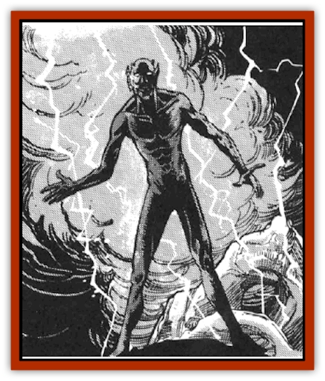

# Thunder Children

| Statistic | **Thunder Children** |
| --- | --- |
| **Activity Cycle:** | Night and/or storms |
| **Alignment:** | Neutral evil |
| **Armor Class:** | -1 |
| **Climate/Terrain:** | Temperate/any |
| **Damage/Attack:** | 2-16 |
| **Diet:** | Fear |
| **Frequency:** | Rare |
| **Hit Dice:** | 7 |
| **Intelligence:** | Average (8-10) |
| **Magic Resistance:** | Nil |
| **Morale:** | Average (8-10) |
| **Movement:** | 6, Fl 18 (A) |
| **No. Appearing:** | 1-6 |
| **No. of Attacks:** | 1 |
| **Organization:** | Group |
| **Size:** | S (4' high) |
| **Special Attacks:** | See below |
| **Special Defenses:** | +1 or better weapon to hit |
| **THAC0:** | 14 |
| **Treasure:** | F |
| **XP Value:** | 2,000 |

Thunder children, also known as storm children, night rattlers, and lightning kin, are mischievous, malicious creatures that com out to "play" during violent thunderstorms, especially at night. This play is quite harmful to other creatures.

These "children" are shiny black, gaunt humanoids, with slender limbs and vestigial wings. Their faces are human, though they have tiny horns on their temples and pointed ears. Thunder children have pupil-less eyes that flash like lightning.

Thunder children have their own language, which consists of crackles, howls, and booms. Many also speak Common, and are experts at mimicking normal sounds such as squeaking doors, heavy footfalls. and the like.

**Combat:** Thunder children fight in several ways. The most simple and direct is the bite from their unusually strong, fanged mouths. In addition to taking 2-16 hit points of damage, the victim must make a save vs. spell. Failing the roll inflicts an additional 10 points of electrical damage.

Each thunder child can also cast the following wizard spells at seventh-level proficiency: *chain lightning* (which comes from the eyes), *gust of wind*, *fog cloud*, *darkness 15' radius*. Each spell may be cast seven times per day, though only one spell may be in effect at any given time.

Thunder children can also sense fear in a 120' radius, and change into gaseous form, resembling a small black storm cloud.

The most ingenious manner in which a thunder child attacks is by subtle, psychological ways. During violent storms, thunder children delight in loosening doors and windows, banging shutters, flinging small outdoor objects about, and doing other things which heighten their victims' unease over the storm. The victims' fear is what feeds the thunder children.

Any round in which a thunder child attempts to frighten its victim, the victim must save vs. paralyzation. Failure indicates that the victim is overcome with fright, and loses one point of Wisdom, drained by the thunder child. When the victim's Wisdom reaches 0, he/she dies of fright, unless he/she makes a successful save vs. death magic. Victims who survive can regain their Wisdom points at a rate of one every 12 hours.

Thunder children can also move silently and hide in shadows, each at a 70% ability. They are also immune to fear. Thunder children have infravision 120', and can even see through magical darkness.

**Habitat/Society:** Thunder children dwell in little caves hollowed out from storm clouds. These clouds have been magically reinforced in much the same way that a [[Giant_Cloud|cloud giant's]] clouds can support a castle. The lairs have no treasure, since thunder children have no interest in such things.

There are no sexes among the thunder children. They reproduce by flying into storm clouds and getting hit by lightning. If the creature makes its save vs. magic, a half-strength thunder child is born just as the thunderclap from the lightning bolt is heard. If the creature fails its save, it dies. The "new" thunder child matures in six months. Any thunder child lair encountered has a 10% chance of having 1d4+1 young.

Thunder children have no leaders. They act together because it is advantageous to do so, though sometimes a solitary "child" will delight in having some private sport with a victim.

Places that are especially gloomy, such as old graveyards, moldy mansions, and dark castles on a sea cliffside, are the favorite haunts of thunder children. Any place that inspires fear in humans, demi-humans or humanoids is an ideal place for a thunder child.

Thunder children who find their way to Ravenloft adore it. In that shadowy realm, a thunder child feels like it has arrived at its vision of Paradise.

**Ecology:** Due to their capricious nature, thunder children have many enemies. Among those enemies are [[Genie|djinn]], [[Elemental_Air_Earth|air elementals]], cloud giants, [[Giant_Storm|storm giants]], and [[Pegasus|pegasi]]. Storm giants and cloud giants call them "thunder bats", and consider them as much of a nuisance as humans consider [[Rat|rats]] in their house.

It is rumored that the blood of a thunder child is a useful ingredient in some recipes for *potions of gaseous form* and *potions of weather control* (as per the 7th-level priest spell, although this potion is believed to still be only a theoretical possibility).

---
## Discovery & Documentation

**Source Publication:** Lankhmar: City of Adventure (2nd Ed.) (1993)
**Campaign Setting:** Lankhmar
**Author(s):** Bruce Nesmith, Douglas Niles, and Ken Rolston

### Other Creatures Found in This Source Book
   * [[Astral_Wolf|Astral Wolf]]
   * [[Behemoth|Behemoth]]
   * [[Bird_of_Tyaa|Bird of Tyaa]]
   * [[Cat_War|Cat, War]]
   * [[Cloaker_Sea|Cloaker, Sea]]
   * [[Cold_Woman|Cold Woman]]
   * [[Devourer_Lankhmar|Devourer (Lankhmar)]]
   * [[Ghoul_Kleshite|Ghoul, Kleshite]]
   * [[Ghoul_Lankhmar|Ghoul (Lankhmar)]]
   * [[Gladiator_Lizard|Gladiator Lizard]]
   * [[Horag|Horag]]
   * [[Howler|Howler]]
   * [[Ice_Gnome|Ice Gnome]]
   * [[Invisible_of_Stardock|Invisible of Stardock]]
   * [[Lizard|Lizard]]
   * [[Ophidian|Ophidian]]
   * [[Ray_Invisible_Flying|Ray, Invisible Flying]]
   * [[Scorpion|Scorpion]]
   * [[Simorgyan|Simorgyan]]
   * [[Snow_Serpent|Snow Serpent]]
   * [[Wraith-Spider|Wraith-Spider]]
   * [[Zombie_Sea|Zombie, Sea]]
