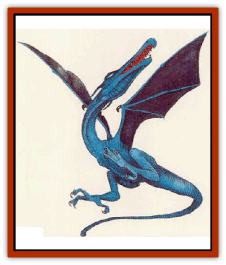

# Thunderhead

| Statistic | **Thunderhead** |
| --- | --- |
| **Activity Cycle:** | Any |
| **Alignment:** | Chaotic evil |
| **Armor Class:** | 0 |
| **Climate/Terrain:** | Aerial, thunderstorms |
| **Damage/Attack:** | 2d6 (claw)/2d6 (claw) |
| **Diet:** | Carnivore |
| **Frequency:** | Very rare (common in thunderstorms) |
| **Hit Dice:** | 8 (16 in thunderstorms) |
| **Intelligence:** | Low (5-7) |
| **Magic Resistance:** | Nil |
| **Morale:** | Elite (14) |
| **Movement:** | 3, Fl 18 (E) |
| **No. Appearing:** | 1d3 |
| **No. of Attacks:** | 2 |
| **Organization:** | Solitary |
| **Size:** | H (30' wingspan) |
| **Special Attacks:** | Lightning bolt |
| **Special Defenses:** | Nil |
| **THAC0:** | 13 (5 in thunderstorms) |
| **Treasure:** | Nil |
| **XP Value:** | 2,000 (10,000 in thunderstorms) |

Thunderheads are reptilian carnivores related to both [[Dragon_General_Information|dragons]] and [[Wyvern|wyverns]]. They are constantly on the wing and are usually encountered during thunderstorms.

A thunderhead has a leathery black body that shows deep blue highlights on those rare occasions when sunlight strikes it; its swept-back, batlike wings are velvety black. The creature has a narrow, elongated head with a long, toothy beak and a pair of slitlike eyes colored a vibrant electric blue. A thunderhead's two legs look spindly but are very strong, ending in splayed feet. Each foot has three toes and a opposed thumb, each digit equipped with a vicious-looking claw.

**Combat:** Thunderheads usually limit their hunting to other aerial creatures. They have exceptionally keen eyesight and can spot prey as small as a sparrow from several thousand feet away.

A thunderhead's favorite tactic is to swoop down upon smaller prey and grab with its daws. If the thunderhead hits with a roll of 16 or better, the victim is caught in the claws and can be squeezed automatically for claw damage each round thereafter. A thunderhead can snatch and carry two small or tiny creatures (one in each foot) or a slngle creature as large as a light war [[Horse|horse]].

When faced with an opponent too large to carry or too nimble to snatch, a thunderhead rakes with its claws and uses its breath weapon - a stroke of lighming 5 feet wide and 60 feet long that inflicts 5d6 points of damage. Victims who make a successhl saving throw vs. breath weipon take only half damage. A thunderhead can generate one stroke every three rounds.

Tbunderhe3ds become very excited and aggressive during thunderstorms. When a storm strikes, a thunderhead's Hit Dice and bit points double. The creaturea also gains a THAC0 appropriate to its doubled Hit Dice, and its experience increases accurdingly (use the statistic listed in parentheses). When excited and strengthened in this fashion, thunderheads swoop down to ground level and attack anything that moves, first loosing strokes of lightning, then attempting to snatch their victims.

**Habitat/Society:** Thunderheads live high up in the clouds, soaring and hunting. They are not social creatures, but any area with strong updrafts that make soaring easier can attract several thunderheads. Such areas can bedome extremely dangerous if thunderstorms develop in them.

Thunderheads hunt, eat, sleep, and mate on the wing.

**Ecology:** Thunderheads hunt all types of flying creature birds, bats giant flying insects, even flying humans. During thunderstorms, a frenzied thunderhead will try to catch and eat anything it spots.

Sages disagree over exactly how and why a thunderhead's Hit Dice and hit points double during thunderstorms. Most scholars believe that the creature simply goes berserk, attacking ferociously and shrugging off attacks that might otherwise cause it great harm. Others argue that a thunderhead must actually enhance its own life force, using the charged atmosphere inside active storm clouds as an energy source.

Virtually the only time thunderheads land voluntarily is when fema1es do so briefly to lay eggs after mating. All thunderhead nesting sites are located in areas prone to violent storms. The female chooses a sheer, sunny cliff face that is accessible only from the air. Once she finds a suitable site, she lays a clutch of 1d4+1 eggs.

Thunderhead eggs have exceptionally thick shells; their tough exterior and mottled brown or gray color makes them look just like large stones. The eggs become ready to hatch after about 14 weeks, and the parents stay nearby, ready to drive off intruders.

Thunderhead eggs have shells so thick and strong that young thunderheads must blast their way out with their lightning bolts when they are ready to hatch. Thunderhead parents feed their hatchlings for about a month. During this time, the hatchlings' size and weight triple and they eat voraciously. When a thunderstorm finally builds up, the young thunderheads go into the same frenzy as their parents and launch themselves into the storm. Once airborne, instinct takes over and the young thunderheads immediately begin hunting on their own.

---
## Discovery & Documentation

**Source Publication:** Mystara Appendix (1994)
**Campaign Setting:** Mystara
**Author(s):** John Nephew, Teeuwynn Woodruff, John Terra, Skip Williams

### Other Creatures Found in This Source Book
   * [[Actaeon|Actaeon]]
   * [[Agarat|Agarat]]
   * [[Ash_Crawler|Ash Crawler]]
   * [[Baldandar|Baldandar]]
   * [[Bargda|Bargda]]
   * [[Bhut|Bhut]]
   * [[Bird_Mystara|Bird (Mystara)]]
   * [[Blackball|Blackball]]
   * [[Choker|Choker]]
   * [[Coltpixie|Coltpixie]]
   * [[Crone_of_Chaos|Crone of Chaos]]
   * [[Darkhood|Darkhood]]
   * [[Darkwing|Darkwing]]
   * [[Decapus|Decapus]]
   * [[Deep_Glaurant|Deep Glaurant]]
   * [[Diabolus|Diabolus]]
   * [[Dimensional_Warper|Dimensional Warper]]
   * [[Dragon_Mystara_Crystalline|Dragon (Mystara), Crystalline]]
   * [[Dragon_Mystara_Jade|Dragon (Mystara), Jade]]
   * [[Dragon_Mystara_Onyx|Dragon (Mystara), Onyx]]
   * [[Dragon_Mystara_Ruby|Dragon (Mystara), Ruby]]
   * [[Drake_Mystara|Drake (Mystara)]]
   * [[Dragonfly|Dragonfly]]
   * [[Dusanu|Dusanu]]
   * [[Elemental_of_Chaos_Air_Earth|Elemental of Chaos, Air/Earth]]
   * [[Elemental_of_Chaos_Fire_Water|Elemental of Chaos, Fire/Water]]
   * [[Elemental_of_Law_Air_Earth|Elemental of Law, Air/Earth]]
   * [[Elemental_of_Law_Fire_Water|Elemental of Law, Fire/Water]]
   * [[Familiar_Mystara|Familiar (Mystara)]]
   * [[Frost_Salamander|Frost Salamander]]
   * [[Fundamental_Air_Earth|Fundamental, Air/Earth]]
   * [[Fundamental_Fire_Water|Fundamental, Fire/Water]]
   * [[Gargantua_Mystara|Gargantua (Mystara)]]
   * [[Geonid|Geonid]]
   * [[Ghostly_Horde|Ghostly Horde]]
   * [[Giant_Athach|Giant, Athach]]
   * [[Giant_Hephaeston|Giant, Hephaeston]]
   * [[Golem_Drolem|Golem, Drolem]]
   * [[Golem_Mystara_I|Golem (Mystara) I]]
   * [[Golem_Mystara_II|Golem (Mystara) II]]
   * [[Golem_Mystara_III|Golem (Mystara) III]]
   * [[Gray_Philosopher|Gray Philosopher]]
   * [[Guardian_Warrior|Guardian Warrior]]
   * [[Gyerian|Gyerian]]
   * [[Herex|Herex]]
   * [[Hivebrood|Hivebrood]]
   * [[Horde|Horde]]
   * [[Hsiao|Hsiao]]
   * [[Huptzeen|Huptzeen]]
   * [[Hutaakan|Hutaakan]]
   * [[Imp_Mystara|Imp (Mystara)]]
   * [[Jellyfish_Giant_Mystara|Jellyfish, Giant (Mystara)]]
   * [[Kna|Kna]]
   * [[Kopru|Kopru]]
   * [[Lizard_Mystara|Lizard (Mystara)]]
   * [[Lizard-kin_Mystara|Lizard-kin (Mystara)]]
   * [[Lupin|Lupin]]
   * [[Lycanthrope_Werejaguar_Mystara|Lycanthrope, Werejaguar (Mystara)]]
   * [[Lycanthrope_Wereswine|Lycanthrope, Wereswine]]
   * [[Magen|Magen]]
   * [[Manikin|Manikin]]
   * [[Mek|Mek]]
   * [[Mujina|Mujina]]
   * [[Nagpa|Nagpa]]
   * [[Neh-thalggu|Neh-thalggu]]
   * [[Nightshade_Mystara|Nightshade (Mystara)]]
   * [[Nuckalavee|Nuckalavee]]
   * [[Pegataur|Pegataur]]
   * [[Phanaton|Phanaton]]
   * [[Plant_Dangerous_Mystara|Plant, Dangerous (Mystara)]]
   * [[Plasm|Plasm]]
   * [[Rakasta|Rakasta]]
   * [[Rock_Man|Rock Man]]
   * [[Sabreclaw|Sabreclaw]]
   * [[Sacrol|Sacrol]]
   * [[Scamille|Scamille]]
   * [[Shapeshifter|Shapeshifter]]
   * [[Shargugh|Shargugh]]
   * [[Shark-kin|Shark-kin]]
   * [[Sollux|Sollux]]
   * [[Spectral_Death|Spectral Death]]
   * [[Spectral_Hound|Spectral Hound]]
   * [[Spider-kin|Spider-kin]]
   * [[Spirit_Mystara|Spirit (Mystara)]]
   * [[Statue_Living|Statue, Living]]
   * [[Surtaki|Surtaki]]
   * [[Tabi|Tabi]]
   * [[Thoul|Thoul]]
   * [[Tiger_Ebon|Tiger, Ebon]]
   * [[Topi|Topi]]
   * [[Tortle|Tortle]]
   * [[Vampire_Velya|Vampire, Velya]]
   * [[White_Fang|White Fang]]
   * [[Worm_Mystara|Worm (Mystara)]]
   * [[Wyrd|Wyrd]]
   * [[Yowler|Yowler]]
   * [[Zombie_Lightning|Zombie, Lightning]]
