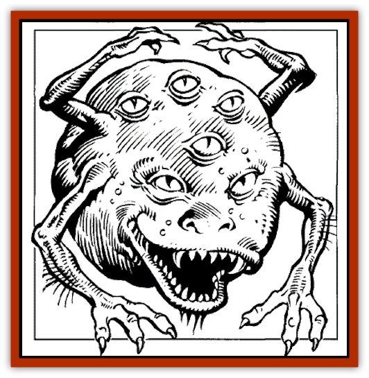

# Tinkerer - Giant Bubble

| Statistic | **Tinkerer (Giant Bubble)** |
| --- | --- |
| **Activity Cycle:** | Any |
| **Alignment:** | Chaotic neutral |
| **Armor Class:** | 6 |
| **Climate/Terrain:** | Any space |
| **Damage/Attack:** | 2-5 and 1-2 (or by weapon type) x6 |
| **Diet:** | Omnivore |
| **Frequency:** | Very rare |
| **Hit Dice:** | 4+4 |
| **Intelligence:** | Highly (13-14) |
| **Magic Resistance:** | Nil |
| **Morale:** | Very Steady (13-14) |
| **Movement:** | 16 (bounce; also up to 20' vertically), Fl 14 (A) |
| **No. Appearing:** | 1-8 |
| **No. of Attacks:** | 7 |
| **Organization:** | Wandering: solitary or bands |
| **Size:** | S (3'-4' diameter) |
| **Special Attacks:** | Use magical items |
| **Special Defenses:** | Regeneration |
| **THAC0:** | 17 |
| **Treasure:** | V (sometimes x3 or 4) |
| **XP Value:** | 650 |

Tinkerers are ball-shaped, comical-looking creatures named for the aims they all seem to follow: to acquire, improve upon, and modify all equipment (including magical items) they can get their hands on. This includes, of course, everything humans carry and use! They covet tools and magical. items highly, and have been known to swallow small, non-sharp items to examine later.

Tinkerers will also experiment with living organisms, including humans, to modify their body-forms or mate them with machinery (endowing humans with weapon-equipped limbs, for example).

Most experiments harm or disable the subjects (who must either be willing or unable to resist), but both reavers and wonderseekers have been encountered with limbs replaced by intricate weapons or tools (saws, scythes, and plier-like gripping claws). Some beings even have sockets that will take a variety of tools and weapons. Such beings are very rare-and, like tinkerers themselves, extremely rare in the well-travelled areas of space.

Tinkerers are spherical, floating creatures with six eyes set around their bodies, four arms with ball-joints at wrists and elbows; and hands consisting of three opposed digits. They can thus see and reach in all directions at once.

**Combat:** Tinkerers can bite anything that they can bounce on top of, or sit on, for 2-5 points of damage (their mouths are large enough to take in a human head), but their puny fists can hit for only 1-2 points of damage each.

Few warriors laugh at a tinkerer twice, because the comical, bouncing little creatures can wield weapons in all six arms for normal damage.

A piercing attack that deals a tinkerer more than 10 points of damage in a single round causes it to explode violently. This terminates the unfortunate tinkerer's corporeal existence, and deals every being within ten feet 3-12 points of blast damage (no saving throw). Items swallowed or held by the tinkerer may have to make saving throws vs. Crushing Blow if flung into things. They may also become missiles, menacing creatures nearby (2-5 or 2-8 damage depending on size, attack rolls to hit endangered beings).

**Habitat/Society:** Tinkerers seem to be a race of lost, scattered wanderers, who roam space looking for something.

Khelben Arunsun and Elminster believe them to be one of the oldest spacefaring races, who either abandoned organized spacefaring society and the ships that must support it, or who lost much of their civilization and knowledge in some sort of cataclysm, and are slowly and painfully striving to improve themselves over the passing generations to regain it.

Tinkerers travel constantly, hitching rides with all manner of ships and spacefaring races that use them. They are attracted to [[Gnome|gnomes]], [[Dwarf|dwarves]], [[Sarphardin_Watcher|sarphardin]], and humans, and can often be found drifting around the space vessels of those races, generally getting in the way and monkeying with everything. They can and do use most human weaponry, tools, conveyances, and other equipment.

**Ecology:** Tinkerers are covered with spherical, translucent grey pock-marks, pores through which they "breathe" in gases from their surroundings. Membranes filter out edible pollens, mold spores, germs, and other protein from airborne dust particles. Thus tinkerers can go for long periods without food as we know it, and are immune to all known human poisons and diseases. They can clean air for ships on long voyages (each tinkerer keeping one ton of air pure) and are sometimes captured and towed for this reason.

Tinkerers float about, travelling by means of a controlled release of the gas they take in, in tiny jets. Thus, they can spin, perform aerobatics, and so on with great precision. To remain stationary, a tinkerer expels even amounts of gas all around, taking gas in as needed (and pulsing all over).

They have large mouths on their undersides, and eat the same things humans do, being addicted to sugared candy and sweets.

Tinkerers also regenerate at a rate of 1 hit point every 3 rounds, requiring contact with water to do so. They often carry canteens with them for this purpose.

---
## Discovery & Documentation

**Source Publication:** SJR1 Lost Ships (1990)
**Campaign Setting:** Spelljammer
**Author(s):** Ed Greenwood, Paul Jaquays, Anne Brown, Dell Barras, Brom, Jeff Grubb

### Other Creatures Found in This Source Book
   * [[Beholder_Undead_Death_Tyrant|Beholder, Undead (Death Tyrant)]]
   * [[Flow_Barnacle|Flow Barnacle]]
   * [[Lich_Arch|Lich, Arch]]
   * [[Neogi:_Undead_Old_Master|Neogi: Undead Old Master]]
   * [[Shadowsponge_Air_Stealer|Shadowsponge (Air Stealer)]]
   * [[Beholder_Eater_Thagar_Grimgobbler|Beholder Eater, Thagar (Grimgobbler)]]
   * [[Sarphardin_Watcher|Sarphardin (Watcher)]]
   * [[Men:_Wonderseeker|Men: Wonderseeker]]
   * [[Spaceworm|Spaceworm]]
