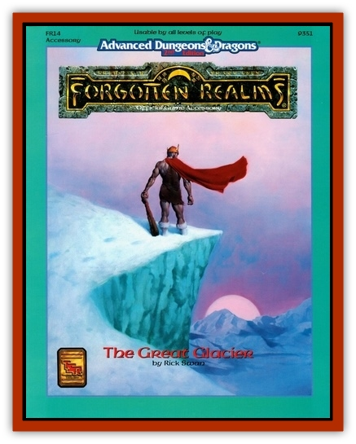

# Tirichik

| Statistic | **Tirichik** |
| --- | --- |
| **Activity Cycle:** | Any |
| **Alignment:** | Chaotic evil |
| **Armor Class:** | 1 |
| **Climate/Terrain:** | Arctic (Great Glacier) |
| **Damage/Attack:** | 3-24 (3d8) or 1-8/1-8 |
| **Diet:** | Carnivore |
| **Frequency:** | Very rare |
| **Hit Dice:** | 13 |
| **Intelligence:** | Semi- (2-4) |
| **Magic Resistance:** | See below |
| **Morale:** | Champion (16) |
| **Movement:** | 12, Br 3 |
| **No. Appearing:** | 1 |
| **No. of Attacks:** | 1 or 2 |
| **Organization:** | Solitary |
| **Size:** | G (30' long) |
| **Special Attacks:** | See below |
| **Special Defenses:** | See below |
| **THAC0:** | 7 |
| **Treasure:** | Nil |
| **XP Value:** | 5,000 |

Vicious, stealthy, and with an insatiable appetite for human flesh, the tirichik is one of the most feared predators in the Great Glacier.

The tirichik resembles a cross between a [[Dragon_General_Information|dragon]] and an immense [[Centipede|centipede]]. Both its dragon-like head and long, tubular body are covered with white scales. A bony ridge extends from the back of its neck, along its spine, and across its stumpy tail. It has eight thick legs end in flat, saucer-shaped feet, each with a dozen hooked claws. Its sunken eyes are dull pink, the only part of its body not colored white. A pair of short horns grow behind its eyes, curving upward into the air, their tips indented into shallow cups. The horns serve as hearing organs and are useless in combat. Likewise, the claws on its feet are too short to be useful in attacks, and instead are used for climbing and clinging.

The tirichik has a mouthful of long teeth that protrude over its lips even when its mouth is closed. On either side of its mouth is a 3-inch-diameter opening. The tirichik can extend snaky tentacles from these holes at will, up to a length of 20 feet. The tentacles are also white, as tough as metal cable, and end in needle-sharp points. Though the tentacles are primarily used as sense organs, capable of sensing motion, scents, and body heat, they can also be used as piercing weapons.

The tirichik's claws enable it to scuttle across snow and ice, scale sheer cliffs, and cling to any solid surface. It can also burrow through snow (but not rock, frozen ground, or similarly hard surfaces) at a movement rate of 3.

The tirichik is utterly silent.

**Combat:** The tirichik prefers to ambush its prey by lurking inside a crevasse, hiding among hills of snow, or otherwise concealing itself. Its tentacles enable it to sense prey up to 100 yards away when the prey approaches, the tirichik reveals itself, scuttling from its crevasse or charging from the snow. Because of the tirichik's color and stealth, opponents suffer a -5 penalty to their surprise roll if encountering a concealed tirichik.

When prey is scarce, the tirichik goes hunting. It uses its tentacles to probe into caves, beneath rocks, and even under the doors of houses to look for food. When it locates something to eat, it strikes, lunging into the cave or battering down the door to commence its attacks.

The tirichik has special elastic tendons in its neck that allow it to temporarily detach its skull from its spinal column. The creature can strike like a snake by suddenly elongating its neck, stretching itself an additional 5 feet. When making a stretch attack, the tirichik gains a +2 bonus to its attack roll. It is unable to make any attacks in the following round, as it must spend that round withdrawing its neck and re-attaching its skull to its spinal column. Therefore, the tirichik can make a stretching attack only once every other round.

Instead of its bite, the tirichik can also use its tentacles to attack, thrusting them like daggers. The tentacles have an AC of 1, but because the tentacles constantly wave and writhe, attacks directed against the tentacles are made at a -2 penalty. If a tentacle suffers 5 points of damage (this damage is in addition to the tirichik's normal number of hit points, in effect giving the tirichik 10 hit points beyond that of its 13 Hit Dice), it is severed. The tirichik grows a new tentacle in about a month.

The tirichik suffers no ill effects from cold temperatures, and is also immune to all cold-based spells and magically-generated cold, including [[Dragon_Chromatic_White|white dragon's]] breath.

**Habitat/Society:** A tirichik has no permanent lair. When not hunting, it rests inside a crevasse, clinging motionless to the crevasse's inner wall.

The tirichik has a life span of about a century. Mid-point in its life, the asexual tirichik burrows deep into the snow and gives birth to 1-4 spawn. The foot-long spawn remain beneath the surface until they reach maturity, which takes about a year.

**Ecology:** By far, the tirichik's favorite food is human flesh, and there seems to be no end to the number of humans a hungry tirichik may devour in a the same meal; rumor has it that a single tirichik is capable of eating an entire village. The tirichik also enjoys [[Bear|polar bears]], [[Kupuk|kupuk]], and young white dragons. The Iulutiuns of the Great Glacier prize the tirichik's leathery hide for waterproof boots.

---
## Discovery & Documentation

**Source Publication:** FR14 The Great Glacier (1991)
**Campaign Setting:** Forgotten Realms
**Author(s):** Rick Swan

### Other Creatures Found in This Source Book
   * [[Dwarf_Arctic|Dwarf, Arctic]]
   * [[Fish_Great_Glacier|Fish (Great Glacier)]]
   * [[Kupuk|Kupuk]]
