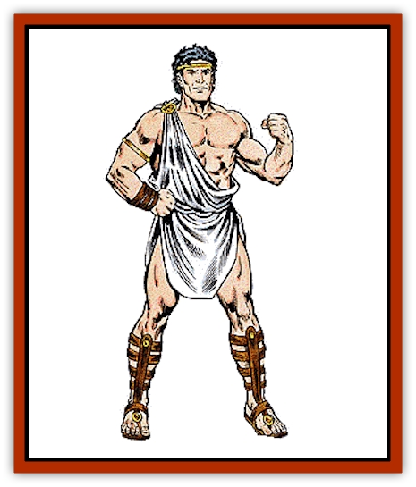

# Titan

| Statistic | **Titan** |
| --- | --- |
| **Activity Cycle:** | Any |
| **Alignment:** | Chaotic good |
| **Armor Class:** | 0 |
| **Climate/Terrain:** | Olympus |
| **Damage/Attack:** | 7-42 (7d6) weapon +14 (strength bonus) |
| **Diet:** | Omnivore |
| **Frequency:** | Uncommon |
| **Hit Dice:** | 20 |
| **Intelligence:** | Supra-genius to godlike (19-21+) |
| **Magic Resistance:** | 50% |
| **Morale:** | Fearless (19-20) |
| **Movement:** | 36 |
| **No. Appearing:** | 1-10 |
| **No. of Attacks:** | 2 |
| **Organization:** | Group |
| **Size:** | G (25'+ tall) |
| **Special Attacks:** | See below |
| **Special Defenses:** | See below |
| **THAC0:** | 5 |
| **Treasure:** | E,Q&times;10,R |
| **XP Value:** | 21,000 (see below) |

Titans are gargantuan, almost godlike men and woman. They, quite simply, look like 25' tall people of great physical strength and beauty. They are commonly dressed in traditional Greek garb, favoring togas, loincloths, and such. They wear rare and valuable jewelry and in other ways make themselves seem beautiful and overpowering.

In addition to speaking their own language, titans are able to speak the six main dialects of giants. All titans are also conversant in the common tongue as well as that commonly spoken by forest creatures, as these giants have close ties with nature.

**Combat:** The basic attack of titans is their great maul (*maul of the titans*). These monstrous beings are capable of attacking twice in a melee round and inflicting 7-42 points of damage per hit.

Titans may choose to make a single other attack in a round. This form of special attack is so destructive and deadly, that a titan will use it only if there are no other options left open. The form of each titan's attack will be different (some kick, some punch, others use a breath attack, lightning, etc.), but the effect is the same for each. The special attack inflicts 10-60 points of damage per hit and can be used every other round. These mighty attacks have been known to destroy buildings and sink ships.

Titans can become ethereal twice per day. All titans are able to employ both mage or priest spells (dependent on the individual titan - only one, not both) as a 20th-level spell caster. In addition, all titans have the following spell-like powers, at 20th level of spell use, usable once per round, one at a time, at will: *advanced illusion*, *alter self*, *animal summoning II*, *astral spell*, *bless*, *charm person or mammal*, *commune with nature*, *cure light wounds*, *eyebite*, *fire storm*, *hold person*, *hold monster*, *hold undead*, *invisibility*, *levitate*, *light*, *mirror image*, *pass without trace*, *produce fire*, *protection from evil, 10' radius*, *remove fear*, *remove curse*, *shield*, *speak with plants*, *summon insects*, and *whispering wind*.

Titans are not affected by attacks from nonmagical weapons.

**Habitat/Society:** Titans are livers of life, creators of fate. These benevolent giants are closer to the well springs of life than mere mortals and, as such, revel in their gigantic existences. Titans are wild and chaotic. They are prone to more pronounced emotions that humans and can experience godlike fits of rage. They are, however, basically good and benevolent, so they tend not to take life. They are very powerful creatures and will fight with ferocity when necessary.

To some, titans seem like gods. With their powers they can cause things to happen that, surely, only a god could. They are fiery and passionate, displaying emotions with greater purity and less reservation than mortal beings. Titans are quick to anger, but quicker still to forgive. In fits of rage they destroy mountains and in moments of passion will create empires. They are in all ways godlike and in all ways larger than life.

And yet is should be noted that titans are not gods. They are beings that make their home in Olympus and walk among the gods. Yet they are not omnipotent, omniscient rulers of the planes. Sometimes their godlike passions and godlike rages make them seem like deities, however, and it is common for whole civilizations to mistake them for deities.

In one society, Jeuron, a titan with dominion over knowledge, was revered as a god for centuries. Those mortals built their whole civilization around him and Jeuron revelled in the worship. He even walked among them occasionally to see their love and admiration. But Odin, of the Norse mythos, discovered his deception and punished Jeuron by shackling him to the bottom of the deepest sea for 100 years.

Titans have a natural affinity for [[Giant_Storm|storm giants]]. Those giants are the closest beings the titans have found to peers and they will readily befriend them. In any group of titans, there is a 35% chance that they will be accompanied by one or more storm giants. Although titans can sometimes be condescending by nature, they never treat the storm giants as subordinates or inferiors.

On Olympus, titans have developed a culture similar to what they found there. They wear similar clothing, eat similar foods, play similar music, etc. It is unclear why this has occurred. Perhaps the titans, in a godlike whim, adopted their favorite mortal lifestyle. Such would not be unusual for these great beings.

Titans primarily dwell in great palaces and mansions in Olympus where they live their lives whimsically. There they will dance, sing, study, debate and engage in all other manner of activities with titanic proportion. If a titan finds something that interests him, it would not be unusual for him to study it in great detail for many weeks, only to leave it when his interest has waned. They may also engage in debates or arguments that last literally for weeks at a time. These debates might end in a jovial laughter and good spirits or in thunder and rage. Such are the whims of titans.

**Ecology:** Titans are basically identical to humans, except much larger. What makes them immortal is not known. Perhaps it is their enchanted existence in the halls of Olympus.

These giants are commonly known to experience the same range of emotions as humans do. They develop idiosyncrasies as humans do, also. In fact, titan mannerisms emulate those of humans very closely. Again, it is difficult to tell if the titans are whimsically copying humans, or vice versa.

Titans, being godlike creatures, tend to be very diverse and unique. Each individual titan (or sometimes group of titans) have a special power is that related to their personality or sphere of influence. These powers are very different, and usually very strong. Some examples of the powers of a titan are explained below:

*Algorn*, a titan that has influence over the seas, has the ability to *create water* whenever he chooses to. This water can be vast as he desires, up to the volume of a medium-sized lake. Algorn can simply cause the water to flow, he can cause it to jet out from his hands (washing away everything in its path away), or he can even cause the water to be frozen.

*Mane*, a titan with dominion over felines, has the ability to change into a giant form of any cat. When he transforms, he is instantly cured of all wounds, poisons, and diseases. Mane may change into a cat and back again five times per day.

*Porphyl* is a titan with the power of growth. He may cause any immature life to grow to maturity. Thus, he can cause crops to grow, he can make a boy grow to manhood, etc. Porphyl is very wise and would never abuse his ability.

*Malephus*, a titan with influence over law and justice can unerringly detect any spoken lie and any bad intention. He is often used by many greater powers in trials of justice. Malephus is totally honest; he is incapable of lies or deception.

Syllia, a titan with power over love, can remove any negative feelings from any being (except deities and powers). She has the ability to remove hatred, unhappiness, depression, etc. Syllia cannot remove the feeling permanently, but for at least a day or so. The deities of the upper planes often employ her power when trying to stop wars.

*Girzon*, a titan with dominion over death, can take the life from any living being. It should be noted that Girzon has never used this ability unless commanded to by a deity. Girzon's restraint and self-control is revered by other titans.

**Greater Titans**

  Rumors exist of a race of titans more powerful still than common titans. These greater titans are said to be very close to the gods and always accompany one (with some deities and powers being attended by more than one greater titan). Perhaps greater titans were formally common titans who have grown so great in power that the gods brought them closer to themselves. Such matters are not common knowledge.

It is very difficult to provide combat statistics for greater titans. Like the gods themselves, greater titans are simply not subject to aggression from nondivine beings. They are never harmed by such attacks.

---
## Discovery & Documentation

**Source Publication:** MC8 Outer Planes Appendix (1990)
**Campaign Setting:** Planescape
**Author(s):** Timothy B. Brown, Jamie LaFountain

### Other Creatures Found in This Source Book
   * [[Aasimon_Agathinon|Aasimon, Agathinon]]
   * [[Aasimon_Deva|Aasimon, Deva]]
   * [[Aasimon_Light|Aasimon, Light]]
   * [[Aasimon_General_Information|Aasimon, General Information]]
   * [[Aasimon_Planetar|Aasimon, Planetar]]
   * [[Aasimon_Solar|Aasimon, Solar]]
   * [[Air_Sentinel|Air Sentinel]]
   * [[Animal_Lord|Animal Lord]]
   * [[Archon|Archon]]
   * [[Baatezu_Lesser_Abishai|Baatezu, Lesser, Abishai]]
   * [[Baatezu_Greater_Amnizu|Baatezu, Greater, Amnizu]]
   * [[Baatezu_Lesser_Barbazu|Baatezu, Lesser, Barbazu]]
   * [[Baatezu_Greater_Cornugon|Baatezu, Greater, Cornugon]]
   * [[Baatezu_Lesser_Erinyes|Baatezu, Lesser, Erinyes]]
   * [[Baatezu_General_Information|Baatezu, General Information]]
   * [[Baatezu_Greater_Gelugon|Baatezu, Greater, Gelugon]]
   * [[Baatezu_Lesser_Hamatula|Baatezu, Lesser, Hamatula]]
   * [[Baatezu_Lemure|Baatezu, Lemure]]
   * [[Baatezu_Least_Nupperibo|Baatezu, Least, Nupperibo]]
   * [[Baatezu_Lesser_Osyluth|Baatezu, Lesser, Osyluth]]
   * [[Baatezu_Greater_Pit_Fiend|Baatezu, Greater, Pit Fiend]]
   * [[Baatezu_Least_Spinagon|Baatezu, Least, Spinagon]]
   * [[Balaena|Balaena]]
   * [[Bariaur|Bariaur]]
   * [[Bebilith|Bebilith]]
   * [[Bodak|Bodak]]
   * [[Dog_Moon|Dog, Moon]]
   * [[Dragon_Adamantite|Dragon, Adamantite]]
   * [[Einheriar|Einheriar]]
   * [[Gehreleth|Gehreleth]]
   * [[Githyanki|Githyanki]]
   * [[Githzerai|Githzerai]]
   * [[Hordling|Hordling]]
   * [[Lammasu_Celestial|Lammasu, Celestial]]
   * [[Larva|Larva]]
   * [[Maelephant|Maelephant]]
   * [[Marut|Marut]]
   * [[Mediator|Mediator]]
   * [[Mortai|Mortai]]
   * [[Night_Hag|Night Hag]]
   * [[Nightmare|Nightmare]]
   * [[Noctral|Noctral]]
   * [[Per|Per]]
   * [[Phoenix|Phoenix]]
   * [[Slaad|Slaad]]
   * [[Tanar'ri_Greater_Babau|Tanar'ri, Greater, Babau]]
   * [[Tanar'ri_Greater_Chasme|Tanar'ri, Greater, Chasme]]
   * [[Tanar'ri_Greater_Nabassu|Tanar'ri, Greater, Nabassu]]
   * [[Tanar'ri_Least_Dretch|Tanar'ri, Least, Dretch]]
   * [[Tanar'ri_Least_Manes|Tanar'ri, Least, Manes]]
   * [[Tanar'ri_Least_Rutterkin|Tanar'ri, Least, Rutterkin]]
   * [[Tanar'ri_Lesser_Alu-Fiend|Tanar'ri, Lesser, Alu-Fiend]]
   * [[Tanar'ri_Lesser_Bar-Lgura|Tanar'ri, Lesser, Bar-Lgura]]
   * [[Tanar'ri_Lesser_Cambion|Tanar'ri, Lesser, Cambion]]
   * [[Tanar'ri_Lesser_Succubus|Tanar'ri, Lesser, Succubus]]
   * [[Tanar'ri_Guardian_Molydeus|Tanar'ri, Guardian, Molydeus]]
   * [[Tanar'ri_General_Information|Tanar'ri, General Information]]
   * [[Tanar'ri_True_Balor|Tanar'ri, True, Balor]]
   * [[Tanar'ri_True_Glabrezu|Tanar'ri, True, Glabrezu]]
   * [[Tanar'ri_True_Hezrou|Tanar'ri, True, Hezrou]]
   * [[Tanar'ri_True_Marilith|Tanar'ri, True, Marilith]]
   * [[Tanar'ri_True_Nalfeshnee|Tanar'ri, True, Nalfeshnee]]
   * [[Tanar'ri_True_Vrock|Tanar'ri, True, Vrock]]
   * [[Translator|Translator]]
   * [[T'uen-rin|T'uen-rin]]
   * [[Vaporighu|Vaporighu]]
   * [[Warden_Beast|Warden Beast]]
   * [[Yugoloth_Greater_Arcanaloth|Yugoloth, Greater, Arcanaloth]]
   * [[Yugoloth_Lesser_Dergoloth|Yugoloth, Lesser, Dergoloth]]
   * [[Yugoloth_Lesser_Hydroloth|Yugoloth, Lesser, Hydroloth]]
   * [[Yugoloth_General_Information|Yugoloth, General Information]]
   * [[Yugoloth_Lesser_Mezzoloth|Yugoloth, Lesser, Mezzoloth]]
   * [[Yugoloth_Greater_Nycaloth|Yugoloth, Greater, Nycaloth]]
   * [[Yugoloth_Lesser_Piscoloth|Yugoloth, Lesser, Piscoloth]]
   * [[Yugoloth_Greater_Ultroloth|Yugoloth, Greater, Ultroloth]]
   * [[Yugoloth_Lesser_Yagnoloth|Yugoloth, Lesser, Yagnoloth]]
   * [[Zoveri|Zoveri]]
