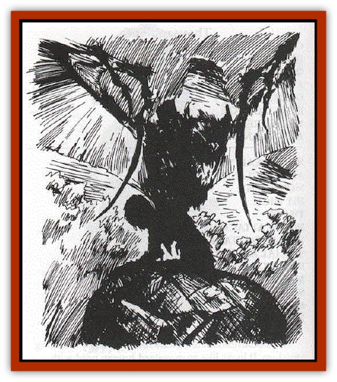
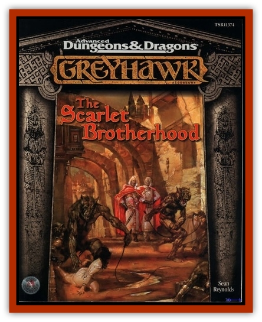

# Tlokasazotz - Olman Bat-Vampire

| Statistic | **Tlokasazotz (Olman Bat-Vampire)** |
| --- | --- |
| **Activity Cycle:** | Night |
| **Alignment:** | Neutral Evil |
| **Armor Class:** | 1 |
| **Climate/Terrain:** | Jungle |
| **Damage/Attack:** | 1d8/1d8/2d4 |
| **Diet:** | Blood |
| **Frequency:** | Unique |
| **Hit Dice:** | 14th-level priest (82 hp) |
| **Intelligence:** | High (14) |
| **Magic Resistance:** | Nil |
| **Morale:** | Champion (16) |
| **Movement:** | 12, Fl 18 (D) |
| **No. Appearing:** | 1 |
| **No. of Attacks:** | 3 |
| **Organization:** | Solitary (monarchy) |
| **Size:** | L (8' tall) or M (5½' tall) |
| **Special Attacks:** | Cause lycanthropy, breath weapon, priest spells |
| **Special Defenses:** | Regeneration, +1 or better weapon to hit |
| **THAC0:** | 12 |
| **Treasure:** | A |
| **XP Value:** | 9000 |

The tlokasazotz is a unique being - Zotlatlan, king of the Olman nation of Telaneteculi. His normal form is an 8' 1 tall [[Bat|bat]]-like humanoid with large wings and huge talons on his arms. He can also assume his original shape, that of a cruel-looking Olman man of regal bearing.

**Combat:** Zotlatlan has been blessed with several potent abilities by his god. His claws and bite can easily tear through hard wood, copper or bronze ( + 1 to hit against armor of these materials). He can breathe fire, filling a 10' sphere in front of him and causing 6d6 damage to all within that area. He may change back into his original form for up to one turn, although he can do this no more than three times per day. In either of his forms, he has full access to spells as a 14th-level Olman priest - he may cast any spells that a specialty priest of Camazotz or Mictlantecuhtli can cast, although he gains no other powers of the specialty priests of those gods. His bite causes a form of lycanthropy, and he can automatically make someone into a form of [[Lycanthrope_Werebat|werebat]] if he spends an undisturbed round drinking a victim's blood.

Weapons of enchantment less than +1 bounce off of his furry hide, and he regenerates 1 hit point per round no matter what shape he is wearing. His keen ears mean that he has a 50% chance of detecting invisible creatures. Zotlatlan is not undead, cannot be turned and is not harmed by holy water. He must drink blood every day or begin to weaken, losing 1 hit point per day and losing the power to regenerate or breathe fire; he normally does not drink human blood unless he intends to create more werebats.

The people he turns into werebats are not typical werebats in that their lycanthropy is not contagious - they can• not infect others with their curse. They also only crave blood when Luna is full, otherwise eating as normal humans. However, children born of these werebats are werebats, and like normal werebats in terms of abilities, weaknesses and so on.

**Habitat/Society:** Zotlatlan rules his little kingdom in the jungle, watching over his theriomorphic subjects like an overprotective parent. He is served in his crumbling temple- palace by werebat servants and flies out nightly to feed on livestock and wild animals. He enjoys conversation and often greets visitors in his human form if they bring suitable gifts.

**Ecology:** A tlokasazotz is a parasitic mammal, much like a vampire bat. He does not normally kill his victims, so he does little harm to the ecostructure. It is only when Zotlatlan hears that his people are being harmed that he flies into a rage and creates a path of destruction on his way to those responsible.

---
## Discovery & Documentation

**Source Publication:** The Scarlet Brotherhood (1999)
**Campaign Setting:** Greyhawk
**Author(s):** Sean Reynolds, Kij Johnson, Chris McKitterick, Lisa Stevens, Erik Mona, Roger Moore, Steve Wilson, Sam Wood, Dawn Murin

### Other Creatures Found in This Source Book
   * [[Gibbering_Mouther_Greater|Gibbering Mouther, Greater]]
   * [[Onco|Onco]]
   * [[Ravenous|Ravenous]]
   * [[Su-Monster|Su-Monster]]
   * [[Thousandtooth|Thousandtooth]]
