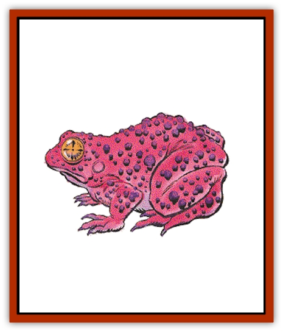

# Toad - Giant

| Statistic | **Fire Toad** | **Giant Toad** | **Ice Toad** | **Poisonous Toad** |
| --- | --- | --- | --- | --- |
| **Activity Cycle:** | Any | Any | Day | Any |
| **Alignment:** | Chaotic neutral | Neutral | Neutral | Neutral |
| **Armor Class:** | 10 | 6 | 4 | 7 |
| **Climate/Terrain:** | Non-arctic or subterranean | Non-arctic or subterranean | Arctic, subarctic land or subterranean | Non-arctic or subterranean |
| **Damage/Attack:** | Varies | 2-8 | 3-12 | 2-5 |
| **Diet:** | Carnivore | Carnivore | Carnivore | Carnivore |
| **Frequency:** | Rare | Common | Rare | Uncommon |
| **Hit Dice:** | 4+1 | 2+4 | 5 | 2 |
| **Intelligence:** | Low (5-7) | Animal (1) | Average (8-10) | Animal (1) |
| **Magic Resistance:** | Nil | Nil | Nil | Nil |
| **Morale:** | Average (8-10) | Unsteady (7) | Steady (11-12) | Unsteady (7) |
| **Movement:** | 6, hop 6 | 6, hop 6 | 9, hop 9 | 6, hop 6 |
| **No. Appearing:** | 1-6 | 1-12 | 1-4 | 1-8 |
| **No. of Attacks:** | 1 | 1 | 1 | 1 |
| **Organization:** | Colony | Colony | Colony | Colony |
| **Size:** | S (4' length) | M (5' length) | L (8' length) | M (5' length) |
| **Special Attacks:** | See below | See below | See below | See below |
| **Special Defenses:** | Nil | Nil | Nil | Nil |
| **THAC0:** | 17 | 17 | 15 | 19 |
| **Treasure:** | C | Nil | Q (C) | Nil |
| **XP Value:** | 270 | 120 | 270 | 175 |

Giant toads are found in most regions. Although their smaller cousins are beneficial insect eaters, the large toads devour (or at least attempt to devour) any creature which appears edible.

Their exact appearance varies from species to species, but these beasts are all just what their name implies, giant versions of toads. Coloration runs the gamut from weak brown to iron red, but their skin is always dry, rough to the touch, and warty.

**Combat:** All giant toads can jump up to their movement distance. This hop will clear any object up to one-third as high as the length of the leap and requires but a single round to accomplish. A jumping toad can attack in midair or at the end of the leap.

When hunting, giant toads remain motionless until likely prey walks or slithers within range. The toad then leaps to the attack; the victim has a -3 penalty on its surprise roll.

**Habitat/Society:** Giant toads often make their homes underground, where they enjoy both the damp air and the steady supply of food. They prefer temperate zones, near water where they can lay their eggs, but often survive in surprisingly cool or dry regions.

Toads are often attracted to settled areas where they prey upon livestock (goats, chickens, and even sheep). Cities often have problems with sewer toads, giant monstrosities which have grown fat on vermin, house pets, and, occasionally, civil engineers.

**Ecology:** Giant toads keep no treasure, but worthwhile indigestibles are occasionally found in their droppings. Their skin can be fashioned into suitable leather armor, but its odor will be at least as distinctive as its appearance.

**Fire Toad**

These large, red toads are about 4 feet long and covered with rough, purple warts. Fire toads shun water, preferring drier surroundings. Fire toads are so named because of their ability to exhale small *fireballs*. These fireballs are their only form of attack; a single fireball can travel up to 30 feet and has a blast radius of 5 feet. Damage is equal to 2-16 points, half that if a saving throw vs. spell is made. Fire toads rarely attack unless threatened, molested, or defending their lairs. Fire toads subtract 1 point of damage on all dice for fire-based attacks against them, but cold- or water-based attacks inflict an additional point of damage per die. Throwing liquid - even water - at a fire toad will cause it to retreat, though it will immediately breathe twice at its assailant in the round of its retreat.

**Ice Toad**

Fully intelligent, ice toads dwell in cold climes or far beneath the surface of the ground. In addition to its vicious bite, the creature can radiate cold in a 10-foot radius from its body. Ice toads can generate this special attack once every other round. All noncold-using creatures within this sphere of cold suffer 3-18 points of damage. Characters making a saving throw vs. spell suffer only half damage. Ice toads speak their own weird language and actively collect gems and jewelry, particularly diamonds.

**Poisonous Toad**

These toads, indistinguishable from common giant toads, secrete a weak, hemotoxic poison. A creature bitten by a poisonous toad must save vs. poison at +2. Failure means the victim falls comatose and will die within 24 hours unless treated.

---
## Discovery & Documentation

**Source Publication:** MC1 Volume I (w/binder #1) (1991)
**Campaign Setting:** Advanced Dungeons & Dragons 2nd Edition
**Author(s):** Jay Batista, Scott Bennie, Grant Boucher, William W. Connors, Steve Gilbert, Heike Kubasch, James Lowder, David Edward Martin, Bruce Nesmith, Jean Rabe, Rick Swan, John J. Terra, Gary L. Thomas

### Other Creatures Found in This Source Book
   * [[Bat|Bat]]
   * [[Bear|Bear]]
   * [[Behir|Behir]]
   * [[Boar|Boar]]
   * [[Bookworm|Bookworm]]
   * [[Brownie|Brownie]]
   * [[Bugbear|Bugbear]]
   * [[Carrion_Crawler|Carrion Crawler]]
   * [[Cat_Great|Cat, Great]]
   * [[Catoblepas|Catoblepas]]
   * [[Dragon_General_Information|Dragon, General Information]]
   * [[Dragonfish|Dragonfish]]
   * [[Elemental_Air_Kin_Aerial_Servant|Elemental, Air Kin, Aerial Servant]]
   * [[Elemental_Earth_Kin_Sandling|Elemental, Earth Kin, Sandling]]
   * [[Elephant|Elephant]]
   * [[Gnoll|Gnoll]]
   * [[Hobgoblin|Hobgoblin]]
   * [[Homunculus|Homunculus]]
   * [[Hornet_Giant|Hornet, Giant]]
   * [[Horse|Horse]]
   * [[Hyena|Hyena]]
   * [[Jackal|Jackal]]
   * [[Jackalwere|Jackalwere]]
   * [[Korred|Korred]]
   * [[Lich|Lich]]
   * [[Lizard|Lizard]]
   * [[Lizard_Man|Lizard Man]]
   * [[Lycanthrope_General_Information|Lycanthrope, General Information]]
   * [[Lycanthrope_Seawolf|Lycanthrope, Seawolf]]
   * [[Lycanthrope_Werebear|Lycanthrope, Werebear]]
   * [[Lycanthrope_Weretiger|Lycanthrope, Weretiger]]
   * [[Lycanthrope_Werewolf|Lycanthrope, Werewolf]]
   * [[Manticore|Manticore]]
   * [[Medusa|Medusa]]
   * [[Mind_Flayer|Mind Flayer]]
   * [[Minotaur|Minotaur]]
   * [[Mudman|Mudman]]
   * [[Mummy|Mummy]]
   * [[Nixie|Nixie]]
   * [[Nymph|Nymph]]
   * [[Ogre|Ogre]]
   * [[Ooze_Slime_Jelly_I|Ooze/Slime/Jelly I]]
   * [[Ooze_Slime_Jelly_II|Ooze/Slime/Jelly II]]
   * [[Orc|Orc]]
   * [[Owl|Owl]]
   * [[Owlbear_I|Owlbear I]]
   * [[Pegasus|Pegasus]]
   * [[Piercer|Piercer]]
   * [[Pudding_Deadly|Pudding, Deadly]]
   * [[Rakshasa|Rakshasa]]
   * [[Rat|Rat]]
   * [[Ray|Ray]]
   * [[Remorhaz|Remorhaz]]
   * [[Satyr|Satyr]]
   * [[Scorpion|Scorpion]]
   * [[Selkie|Selkie]]
   * [[Shadow|Shadow]]
   * [[Skeleton|Skeleton]]
   * [[Skunk|Skunk]]
   * [[Snake|Snake]]
   * [[Spectre|Spectre]]
   * [[Spider|Spider]]
   * [[Sprite|Sprite]]
   * [[Treant|Treant]]
   * [[Troll|Troll]]
   * [[Umber_Hulk|Umber Hulk]]
   * [[Unicorn|Unicorn]]
   * [[Vampire|Vampire]]
   * [[Wight|Wight]]
   * [[Will_O'Wisp|Will O'Wisp]]
   * [[Wolf|Wolf]]
   * [[Wolfwere|Wolfwere]]
   * [[Wraith|Wraith]]
   * [[Wyvern|Wyvern]]
   * [[Yeti|Yeti]]
   * [[Yuan-ti|Yuan-ti]]
   * [[Zombie|Zombie]]
