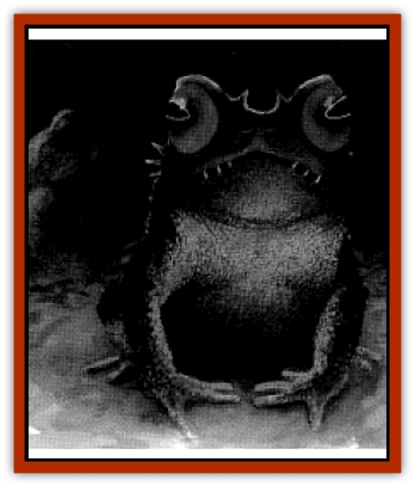

# Toad - Leech

| Statistic | **Toad, Leech** |
| --- | --- |
| **Activity Cycle:** | Night |
| **Alignment:** | Neutral |
| **Armor Class:** | 10 |
| **Climate/Terrain:** | Non-arctic |
| **Damage/Attack:** | 1-3 |
| **Diet:** | Blood |
| **Frequency:** | Very rare |
| **Hit Dice:** | 1-1 |
| **Intelligence:** | Low (5-7) |
| **Magic Resistance:** | Nil |
| **Morale:** | Unreliable (2) |
| **Movement:** | 6, hop 6 |
| **No. Appearing:** | 3-8 |
| **No. of Attacks:** | 1 |
| **Organization:** | Pack |
| **Size:** | T (6&rdquo;-1') |
| **Special Attacks:** | Gaze |
| **Special Defenses:** | Nil |
| **THAC0:** | 20 |
| **Treasure:** | Nil |
| **XP Value:** | 120 |

Small horns protrude from the heads of leech toads. With pitch-black skin, these creatures are difficult to see at night, when they are most likely to be encountered. Their bright red eyes are large, with horizontal pupils. Leech toads are also known as "bloodeyes", "stirgetoads", or "shadow toads".

**Combat:** Leech toads hunt in small packs. They encircle a potential victim stealthily. Then one of the creatures approaches from the front, using its gaze attack. The leech toad's eyes glow an evil red while it gazes at its victim. Those meeting the eyes of a leech toad must save vs. paralyzation or be frozen in place. The paralyzation lasts one round per point by which the save failed. Thus, if a 14 was needed to save and the roll was a 12; the victim is paralyzed for two rounds. A victim who saves is immune to further paralyzation attempts for the next 12 hours.

Paralyzed victims are swarmed by the rest of the leech toad pack; each leaps onto the victim and bites for 1-3 hp damage at +4 to hit. Leech toads are bloodsuckers, and once a successful bite occurs, each toad remains in place, draining an additional 1-3 hp of blood per round automatically, until it has drained a total of 6 hp. At that point, the leech toad leaps off the victim and moves on, sated.

If there are still leech toads on the victim when the paralyzation effects wear off, they immediately disengage and flee, regardless of how much blood was drained. Leech toads are cowards, attacking only those who cannot fight back.

Victims of the leech toads' gaze attack are immune to further paralyzation attempts for the next 12 hours, just as if they had originally made a successful save.

**Habitat/Society:** Leech toads stay in small packs to hunt more effectively. A single leech toad is almost never encountered. Neither is it likely to find these creatures about in the daylight hours, as they prefer a nocturnal existence, when they can hide in the shadows of the trees. They prey exclusively on warmblooded creatures. They prefer attacking larger creatures over smaller ones: a mammal the size of a [[Wolf|wolf]] can provide sustenance for many leech toads at the same time with only one gaze attack, whereas something the size of a mouse would only feed a single toad, and perhaps not fully at that.

When stalking potential victims, leech toads call out to each other in high-pitched chirps. While not approaching the complexity of a spoken language, these chirps allow each toad to know the locations of the other members of the pack. Each leech toad's chirp is slightly different in pitch, length, or volume, enabling the toads to differentiate between individuals.

Leech toads spend the daylight hours in hollow stumps, hidden under fallen leaves, or, more commonly, in holes dug by burrowing creatures such as moles, rabbits, or ground squirrels. They are too lazy to dig their own holes but are more than willing to take over one already created, usually by hypnotizing and killing the current inhabitants.

**Ecology:** Leech toads are universally hated and feared by those who live near them. They are tasty when cooked but generally too dangerous to hunt.

Nonetheless, wizards and alchemists have quite a different opinion about the usefulness of the leech frog. The blood of these creatures, when dried and mixed with fluid from their eyes, is a useful component in the magical inks used to inscribe the spells *hypnotism*, *hypnotic pattern*, and *hold person*. Leech toad hearts can be used as substitute material components in the casting of a *fear* spell without any lessening of the spell's efficacy. Furthermore, one formula for the creation of a *wand of fear* calls for the wooden wand to soak in the blood of thirteen leech toads for no less than one week before the spell *enchant an item* is cast upon it.

---
## Discovery & Documentation

**Source Publication:** Dragon247 (1998)
**Campaign Setting:** Dragon Magazine
**Author(s):** 

### Other Creatures Found in This Source Book
   * [[Frog_Archer|Frog, Archer]]
   * [[Frog_Ghoul|Frog, Ghoul]]
   * [[Toad_Spined|Toad, Spined]]
