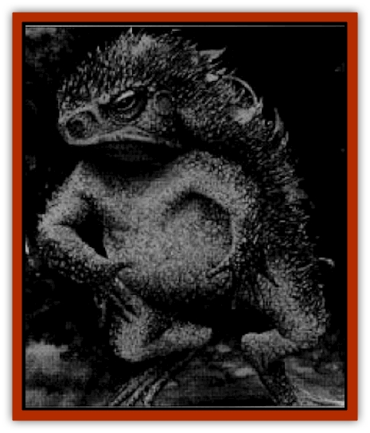

# Toad - Spined

| Statistic | **Toad, Spined** |
| --- | --- |
| **Activity Cycle:** | Any |
| **Alignment:** | Neutral |
| **Armor Class:** | 5 |
| **Climate/Terrain:** | Non-artic |
| **Damage/Attack:** | 1-2 (1 HD) or 1-4 (2 HD) |
| **Diet:** | Herbivore |
| **Frequency:** | Uncommon |
| **Hit Dice:** | 1-2 |
| **Intelligence:** | Animal (1) |
| **Magic Resistance:** | Nil |
| **Morale:** | Steady (11-12) |
| **Movement:** | 9, hop 9 |
| **No. Appearing:** | 1-4 |
| **No. of Attacks:** | 1 |
| **Organization:** | Pack |
| **Size:** | S-M (2-6') |
| **Special Attacks:** | Nil |
| **Special Defenses:** | See below |
| **THAC0:** | 19 |
| **Treasure:** | Nil |
| **XP Value:** | 1HD:35 / 2HD:65 |

Spined toads appear to be a strange mix between a [[Toad_Giant|giant toad]] and a [[Mammal_Small|hedgehog]]. Except for their undersides, their bodies are covered in short, sharp spines. Coloration ranges from tan to dark brown, with a lighter (often white) underbelly.

**Combat:** The spines are used strictly in defense; like other giant toads, the spined toad attacks only with its bite, inflicting 1d4 hp damage. However, those attacking a spined toad and coming into contact with the numerous spines suffer 2d4 hp damage. This includes most animal predators and PCs attacking with bare hands or short weapons, like a dagger or knife.

If attacked by a powerful enemy, a spined toad curls up into a ball, protecting its soft underbelly with its outward-thrusting spines. Most natural enemies give up and seek easier prey.

**Habitat/Society:** Spined toads live in small family units. They lay their eggs in water; after the tadpole stage, a young spined toad stands 2 feet long, has 1 HD, and bites for 1-2 hp damage. Every year it grows one foot in length; upon reaching four feet, it adds an extra hit die and bites for 1d4 hp damage.

Spined toads eat insects and most animals smaller than themselves, preferring small rodents. They also dine on everything from snails to snakes. While hunting mainly on land, spined toads occasionally enter the water to hunt ducks, swans, and other water fowl, popping up underneath them to swallow them whole.

Like other giant toads, spined toads can hop their full movement distance. However, they don't hop as often as do other frogs and toads, especially when in forested areas, as they tend to get their spines stuck in tree trunks or low overhanging branches. Spined toads walk in an awkward, loping gait. As they move through foliage, their spines tend to shred leaves and twigs; rangers should be granted a +8 bonus to their tracking ability when attempting to follow a spined toad's path.

Somewhat playful at times, it isn't uncommon to see a spined toad curl up in a ball at the top of a hill and go rolling down to the bottom. This behavior not only provides an avenue of amusement for the toad but also occasionally impales small creatures on the toad's spines on the way down. These creatures are then removed and devoured.

**Ecology:** Because of their impressive defenses, not many creatures prey upon spined toads. However, some [[Lizard_Man|lizard man]] tribes have devised a way of turning spined toads into weapons: using a wooden oar or similar implement, they flip the toads at their enemies. "Projectile" spined toads cause 2d4 hp damage to their opponents, while the toads themselves suffer 1-2 hp damage upon impact and are 50% likely to be stunned for 1 round. Generally, only spined toads smaller than three feet long can be used in this fashion.

Spined toad skin is also popular among lizard men as leather armor, due to the extra damage caused by the spines. The skin can be stretched across a frame to form a shield with offensive capabilities similar to a spiked buckler. The spines of the largest specimens of spined toad can be sawed off and used as weapons themselves: as primitive daggers, or as the heads of such weapons as spears or morning stars.

Several humanoid games take advantage of the spined toad's armament. The simplest, often played by [[Goblin|goblins]], involves surrounding a spined toad, poking it with spears until it curls up into a ball, and then playing tug of war with a 10'-pole centered over the toad, with each goblin trying to pull his opponent onto the toad's spines. Another game involves throwing apples or similar fruit at a spined toad; the winner is the one who gets the most of his fruit to "stick". [[Ogre|Ogres]] have a variation of this game in which they see who can throw a curled-up spined toad and get it to stick the highest in a tree.

---
## Discovery & Documentation

**Source Publication:** Dragon247 (1998)
**Campaign Setting:** Dragon Magazine
**Author(s):** 

### Other Creatures Found in This Source Book
   * [[Frog_Archer|Frog, Archer]]
   * [[Frog_Ghoul|Frog, Ghoul]]
   * [[Toad_Leech|Toad, Leech]]
