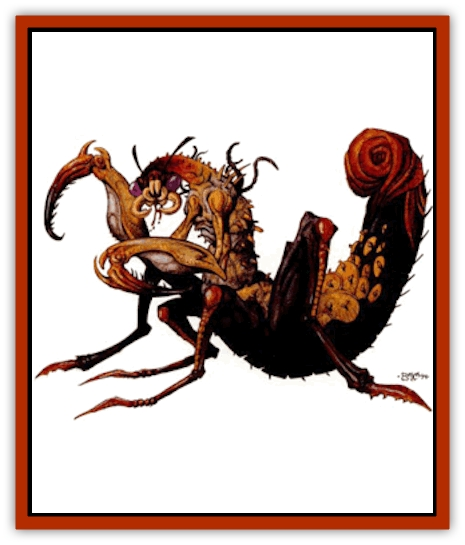

# Tohr-kreen II

| Statistic | **J'ez** | **J'hol** |
| --- | --- | --- |
| **Activity Cycle:** | Constant | Constant |
| **Alignment:** | Any lawful | Any non-good |
| **Armor Class:** | 5 | 5 |
| **Climate/Terrain:** | Any land | Any land |
| **Damage/Attack:** | 1d3 (&times;4)/1d6+1 or 1d6+1 and by weapon | 1d4 (&times;4)/1d4+1 or 1d4+1 and by weapon |
| **Diet:** | Carnivore | Carnivore |
| **Frequency:** | Common in the North, very rare elsewhere | Common in the North, very rare elsewhere |
| **Hit Dice:** | 6+3 | 6+3 |
| **Intelligence:** | Average to genius (8-18) | Average to excentional (8-16) |
| **Magic Resistance:** | Nil | Nil |
| **Morale:** | Champion (15-16) | Fanatic (17-18) |
| **Movement:** | 18 | 18 |
| **No. Appearing:** | 3d12 | 3d10 |
| **No. of Attacks:** | 5 or 2 | 5 or 2 |
| **Organization:** | Clutch and state | Clutch and state |
| **Size:** | L (9' long) | M (6' tall) |
| **Special Attacks:** | Paralyzation | Leap |
| **Special Defenses:** | Missile dodge | Missile dodge |
| **THAC0:** | 13 | 13 |
| **Treasure:** | U (see below) | U (see below) |
| **XP Value:** | 1,400 | 1,400 |

[[Tohr-kreen_I|Tohr-kreen]] are large, intelligent insects, very similar to [[Thri-kreen|thri-kreen]]. Tohr-kreen build permanent settlements in the lands far to the north of the Tablelands, home to Tyr and the other humanoid city-states. For many years, the tohr-kreen have sent scouts to the Tyr region These scouts are called *zik-trin'ta* by other tohr-kreen, but are known as tohr-kreen to the peoples of the Tablelands.

The most common tohr-kreen of the north are the j'ez, who have black chitin, and the j'hol, who are smaller and have red chitin. Members of both species have aggressive natures. Both are similar in most ways to thri-kreen.

## J'ez Tohr-kreen

The figures given above are for mature adult j'ez. Others have the following abilities, based on their age (they age one age category every two years until they reach mature adult):

|  | HD | THAC0 | XP | Claw/bite Damage | Special Ability |
| --- | --- | --- | --- | --- | --- |
| Larva | 1+3 | 19 | 65 | 1/1d2 | - |
| Child | 2+3 | 17 | 120 | 1/1d3 | - |
| Young | 3+3 | 17 | 175 | 1d3/1d4 | leap |
| Young adult | 4+3 | 15 | 270 | 1d3/1d6 | venom |
| Adult | 5+3 | 15 | 975 | 1d4/1d6+1 | chatkcha |
| Mature adult | 6+3 | 13 | 1,400 | 1d4/1d6+1 | dodge missiles |

J'ez have black chitin and four-fingered hands. Skin stretches over their chitin and they have long antennae. J'ez also have mouths that are odd for kreen. The general arrangement is circular, and the j'ez have inward-pointing fanglike parts around the circumference of their relatively flexible mouths. Extensions reach from the sides of the mouth and help secure food to be taken in by the "fangs", which dispense the tohr-kreen's venom.

**Combat:** J'ez enjoy combat and war and are good military leaders. They prefer to use psionics against their opponents when possible, closing to melee when psionic attack is not an option. J'ez prefer manufactured weapons, especially the gythka, that can slash for 1-6 (1d6) points of damage against targets of man-size or smaller, or for 1-10 (1d10) points of damage against a larger target. Like thri-kreen, j'ez tohrkreen have a natural AC 5 because of their exoskeletons, and are immune to *hold person* and *charm person* spells. They learn other special abilities as they age.

*Leap:* This ability allows j.ez to leap 20 feet straight up or 50 feet forward. They cannot leap backward.

*Venom:* A bite delivers this venom. Anyone bitten must make a successful save vs. paralyzation or be paralyzed. Smaller than man-sized creatures are paralyzed for 2-10 (2d10) rounds, man-sized for 2-8 (2d8) rounds, large creatures for 1-8 (1d8) rounds, and huge and gargantuan creatures for 1 round.

*Chatkcha:* J'ez can throw two chatkcha per round, as far as 270 feet. A chatkcha causes 3-8 (1d6+2) points of damage when it hits, and returns to the thrower when it misses.

*Dodge missiles:* Mature j'ez can dodge missiles fired at them with a roll of 9 or better on 1d20; they cannot dodge magical effects, only physical missiles. Magical physical missiles (arrows, thrown axes) modify this roll by their magical bonus.

*Psionics:* Many j'ez (50%) are psionicists. The rest have psionic wild talents (see The Complete psionics Handbook).

*Magical and psionic items:* J'ez never use magical items, but all have at least one item with psionic powers.

**Habitat/Society:** J'ez usually live in rocky badlands and sandy wastes, terrain that exists throughout most of their nation in the North. J'ez are often psionicists and philosophers, but tend to be aggressive. Their philosophy requires them to remain combat capable. J'ez have mating habits and gestation periods similar to those of thri-kreen. J'ez can live to be 80 years old.

**Ecology:** Tohr-kreen are carnivores. They build towns and cities. They work with a similar species, the zik-chil, to produce zik-trin'ta scouts.

J'ez architecture and art are average, but their literature is superb. Treasure carried by a j'ez is often books and gems (substitute psionic items for any indicated magical items).

## J'hol Tohr-kreen

The figures given are for mature adult j'hol. Others have the following abilities, based on their age (they age one age category per year until they reach mature adult):

|  | HD | THAC0 | XP | Claw/bite Damage | Special Ability |
| --- | --- | --- | --- | --- | --- |
| Larva | 1+3 | 19 | 65 | 1/1 | - |
| Child | 2+3 | 17 | 120 | 1/1 | - |
| Young | 3+3 | 17 | 175 | 1d3/1d3 | leap |
| Young adult | 4+3 | 15 | 270 | 1d3/1d3 | chatkcha, kyorkcha, dodge missiles |
| Adult | 5+3 | 15 | 975 | 1d4/1d4+1 | venom |
| Mature adult | 6+3 | 13 | 1,400 | 1d4/1d4+1 | - |

A j'hol has red chitin, three claws per hand, and large antennae. A j'hol's abdomen is small compared to other kreens, and the j'hol is almost humanoid in appearance. A j'hol is better built for stony barrens and rocky badlands, terrain that exists throughout most of its nation.

**Combat:** J'hol enjoy combat. Many have warrior character classes and some are psionicists. J'hol prefer long-range combat with missiles and psionics, but also use then leaping ability to charge into combat (standard charging adjustments, -2 to initiative, +2 to attack rolls, and a +1 penalty to AC). J'hol usually enter melee using a gythka, but also fight with claws and bite if necessary. J'hol tohr-kreen have a natural AC 5 because of their exoskeletons and are immune to *hold person* and *charm person* spells. They also learn other special abilities as they grow older.

*Leap:* This ability allows j.hol to leap 30 feet straight up or 60 feet forward. They can leap backward 10 feet.

*Chatkcha:* J'hol can throw two chatkcha or kyorkcha per round, as far as 270 feet. A chatkcha causes 3-8 (1d6+2) points of damage, the kyorkcha, 3-10 (1d8+2) points of damage. Both weapons return to the thrower if they miss.

*Dodge missiles:* Mature j'hol can dodge missiles fired at them on a roll of 8 or better on 1d20. They cannot dodge magical effects, only physical missiles. Magical physical missiles (arrows, thrown axes) modify this roll by their magical bonus.

*Venom:* Though j'hol produce venom like other kreen, most use it to produce the crystal needed to make chatkcha and kyorkcha. Only 5% of j'hol actually have a venomous bite. Their venom paralyzes most creatures for 1-4 (1d4) rounds, huge and gargantuan creatures for only 1 round.

*Psionics:* At least one j'hol (and as many as 25%) in a group is a psionicist. About 50% of the rest have psionic wild talents, described in *The Complete Psionics Handbook*.

*Magical and psionic items:* J'hol rarely use magical items, but sometimes carry items with psionic powers.

**Habitat/Society:** J'hol are more inclined toward building and crafting the other tohr-kreen. Their cities are elaborately made, and usually quite large, with vast parks, ornate decorations, high walkways, and tall spires.

Popular professions among j'hol include the psionicist and all warrior professions. Gladiators are rare among j'hol, but j'hol enjoy combat and like watching gladiatorial contests; their arenas are some of the most popular in the North.

J.hol have mating habits and gestation periods similar to those of thri-kreen and can live to be 50 years old.

**Ecology:** J'hol are builders and make fine clothing and tools, and they are the only kreen who routinely work metal. J'hol make beautiful crystalline weapons. For individuals, a finely made crystalline weapon (a chatkcha or kyorkcha, or a gythka with crystalline heads) should be substituted for indicated art objects, while a psionic item should be used if a magical item is indicated.

---
## Discovery & Documentation

**Source Publication:** Dark Sun Appendix II - Terrors Beyond Tyr (1991)
**Campaign Setting:** Dark Sun
**Author(s):** Jim Atkiss, Steve Brown, Timothy B. Brown, Andrew P. Morris, Bruce Nesmith, Wes Nicholson, Bill Slavicsek

### Other Creatures Found in This Source Book
   * [[Aarakocra_Athas|Aarakocra (Athas)]]
   * [[Animal_Domestic_Athas_II|Animal, Domestic (Athas) II]]
   * [[Aviarag|Aviarag]]
   * [[Baazrag|Baazrag]]
   * [[Baazrag_Boneclaw|Baazrag, Boneclaw]]
   * [[Bloodgrass|Bloodgrass]]
   * [[Cactus_Hunting|Cactus, Hunting]]
   * [[Cactus_Rock|Cactus, Rock]]
   * [[Cilops|Cilops]]
   * [[Crodlu|Crodlu]]
   * [[Dagorran|Dagorran]]
   * [[Dhaot|Dhaot]]
   * [[Drake_Lesser_Athas_General_Information|Drake, Lesser (Athas), General Information]]
   * [[Drake_Lesser_Athas_Magma|Drake, Lesser (Athas), Magma]]
   * [[Drake_Lesser_Athas_Rain|Drake, Lesser (Athas), Rain]]
   * [[Drake_Lesser_Athas_Silt|Drake, Lesser (Athas), Silt]]
   * [[Drake_Lesser_Athas_Sun|Drake, Lesser (Athas), Sun]]
   * [[Dray|Dray]]
   * [[Drik|Drik]]
   * [[Dune_Reaper|Dune Reaper]]
   * [[Dwarf_Athas|Dwarf (Athas)]]
   * [[Elemental_Beast_Athas_Air|Elemental Beast (Athas), Air]]
   * [[Elemental_Beast_Athas_Earth|Elemental Beast (Athas), Earth]]
   * [[Elemental_Beast_Athas_Fire|Elemental Beast (Athas), Fire]]
   * [[Elemental_Beast_Athas_Water|Elemental Beast (Athas), Water]]
   * [[Elf_Athas|Elf (Athas)]]
   * [[Fael|Fael]]
   * [[Feylaar|Feylaar]]
   * [[Fordorran|Fordorran]]
   * [[Giant_Half-giant|Giant, Half-giant]]
   * [[Giant_Shadow|Giant, Shadow]]
   * [[Golem_Athas_Magma|Golem (Athas), Magma]]
   * [[Golem_Athas_Salt|Golem (Athas), Salt]]
   * [[Golem_Athas_General_Information|Golem (Athas), General Information]]
   * [[Gorak|Gorak]]
   * [[Halfling_Athas|Halfling (Athas)]]
   * [[Human_Athas|Human (Athas)]]
   * [[Jhakar|Jhakar]]
   * [[Kaisharga|Kaisharga]]
   * [[Kes'trekel|Kes'trekel]]
   * [[Klar|Klar]]
   * [[Krag|Krag]]
   * [[Kragling|Kragling]]
   * [[Lirr|Lirr]]
   * [[Mastyrial|Mastyrial]]
   * [[Meorty|Meorty]]
   * [[Mul|Mul]]
   * [[Nikaal|Nikaal]]
   * [[Paraelemental_Beast_General_Information|Paraelemental Beast, General Information]]
   * [[Paraelemental_Beast_Magma|Paraelemental Beast, Magma]]
   * [[Paraelemental_Beast_Rain|Paraelemental Beast, Rain]]
   * [[Paraelemental_Beast_Silt|Paraelemental Beast, Silt]]
   * [[Paraelemental_Beast_Sun|Paraelemental Beast, Sun]]
   * [[Pakubrazi|Pakubrazi]]
   * [[Psionocus|Psionocus]]
   * [[Psurlon|Psurlon]]
   * [[Raaig|Raaig]]
   * [[Retriever_Obsidian|Retriever, Obsidian]]
   * [[Ruktoi|Ruktoi]]
   * [[Ruvoka_Athas|Ruvoka (Athas)]]
   * [[Sand_Howler|Sand Howler]]
   * [[Scorpion_Athas|Scorpion (Athas)]]
   * [[Seed_Brain|Seed, Brain]]
   * [[Silt_Horror_Black|Silt Horror, Black]]
   * [[Silt_Horror_Magma|Silt Horror, Magma]]
   * [[Silt_Horror_Red|Silt Horror, Red]]
   * [[Silt_Spawn|Silt Spawn]]
   * [[Slig|Slig]]
   * [[Spider_Athas|Spider (Athas)]]
   * [[Spinewyrm|Spinewyrm]]
   * [[Ssurran|Ssurran]]
   * [[Stalking_Horror|Stalking Horror]]
   * [[Tarek|Tarek]]
   * [[Tari|Tari]]
   * [[Thri-kreen|Thri-kreen]]
   * [[T'liz|T'liz]]
   * [[Tohr-kreen_III|Tohr-kreen III]]
   * [[Trin|Trin]]
   * [[Tul'k|Tul'k]]
   * [[Undead_Athas_General_Information|Undead (Athas), General Information]]
   * [[Wraith_Athas|Wraith (Athas)]]
   * [[Xerichou|Xerichou]]
   * [[Zombie_Thinking|Zombie, Thinking]]
