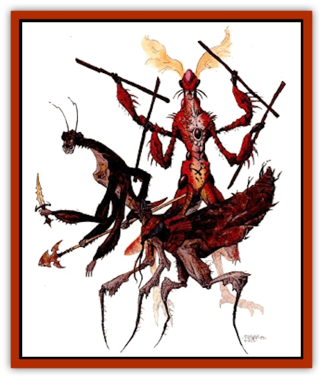

# Tohr-kreen III

| Statistic | **T'keech** | **Tondi** |
| --- | --- | --- |
| **Activity Cycle:** | Constant | Constant |
| **Alignment:** | Neutral good | Neutral |
| **Armor Class:** | 5 | 5 |
| **Climate/Terrain:** | Any land | Any fertile land |
| **Damage/Attack:** | 1d4+1 (&times;5) or 1d4+1 and by weapon | 1d4 (&times;4)/1d4+1 or 1d4+1 and by weapon |
| **Diet:** | Carnivore | Carnivore |
| **Frequency:** | Uncommon in the North | Rare, and only in the North |
| **Hit Dice:** | 6+3 | 6+3 |
| **Intelligence:** | Average to high (8-14) | Average to exceptional (8-16) |
| **Magic Resistance:** | Nil | Nil |
| **Morale:** | Champion (15-16) | Fearless (19-20) |
| **Movement:** | 18 | 18 |
| **No. Appearing:** | 2d4 | 1d6 |
| **No. of Attacks:** | 5 or 2 | 5 or 2 |
| **Organization:** | Clutch | Solitary or clutch |
| **Size:** | M (7' tall) | L (11' long) |
| **Special Attacks:** | Paralyzation | Paralyzation |
| **Special Defenses:** | Dodge missiles | Camouflage |
| **THAC0:** | 13 | 13 |
| **Treasure:** | Varies | Varies |
| **XP Value:** | 1,400 | 1,400 |

These [[Tohr-kreen_I|tohr-kreen]] are large, intelligent insects similar to [[Thri-kreen|thri-kreen]]. Like other tohr-kreen, t'keech and tondi are found in permanent settlements far north of the Tyr region. They seldom build their own settlements, however, and are usually found among other tohr-kreen.

T'keech have green chitin and are relatively non-aggressive. Tondi have a similar temperament, but have chitin that is a pinkish-purple in color.

## T'keech Tohr-kreen

The figures given above are for mature adult t'keech. Others have the following abilities, based on their age (they age one age category every two years until they reach mature adult):

|  | HD | THAC0 | XP | Claw/bite Damage | Special Ability |
| --- | --- | --- | --- | --- | --- |
| Larva | 1+3 | 19 | 65 | 1/1d2 | - |
| Child | 2+3 | 17 | 120 | 1/1d3 | - |
| Young | 3+3 | 17 | 175 | 1d3/1d4 | leap |
| Young adult | 4+3 | 15 | 270 | 1d3/1d6 | venom, chatkcha |
| Adult | 5+3 | 15 | 975 | 1d4/1d6+1 | - |
| Mature adult | 6+3 | 13 | 1,400 | 1d4/1d6+1 | dodge missiles |

T'keech have green chitin, indicating that they once lived in areas where plants were common. The green is a fairly dark shade, with lighter green along the thorax and abdomen. T'keech have small abdomens and are similar in build to [[Tohr-kreen_II|j'hol]]. T.keech have long antennae and four-clawed hands.

**Combat:** T'keech do not seek combat, but are quite capable when challenged. They refer melee combat and almost always attack without weapons, using their claws and bite. A group of t'keech includes one priest or druid and one with a warrior character class (usually a ranger). T'keech have a natural AC 5 because of their exoskeletons and are immune to *hold person* and *charm person* spells. They develop other abilities as they grow older.

*Leap:* This ability allows t'keech to leap 30 feet straight up or 60 feet forward. They can leap 10 feet backward.

*Venom:* A bite delivers thus venom. Anyone bitten must make a successful save vs. paralyzation or be paralyzed. Smaller than man-sized creatures are paralyzed for 2-20 (2d10) rounds, man-sized for 2-16 (2d8) rounds, large creatures for 1-8 (1d8) rounds, and huge and gargantuan creatures for 1 round.

*Chatkcha:* T'keech can throw two chatkcha per round, as far as 270 feet. A chatkcha causes 1d6+2 points of damage when it hits, and returns to the thrower when it misses.

*Dodge missiles:* Mature t'keech can dodge missiles fired at them on a roll of 9 or better on 1d20; they cannot dodge magical effects, only physical missiles. Magical physical missiles (arrows, thrown axes) modify this roll by their magical bonus.

*Psionics:* About 50% of t'keech have psionic wild talents, described in *The Complete Psionics Handbook*.

*Magical and psionic items:* T'keech rarely have contact with magical items, but use such items if possible (unless the item is made specifically for a humanoid). T'keech sometimes use psionic items.

**Habitat/Society:** Most t'keech serve as laborers in the northern tohr-kreen nations. Small clutches of t'keech are found in each nation. T'keech are almost never nomadic, but some clutches have small, independent settlements near oases. T'keech prefer to live in scrub plants and near oases, though they can be found anywhere in the North.

T.keech have mating habits and gestatron periods similar to those of thri-kreen. They can live to be 75 years old.

**Ecology:** Tohr-kreen are carnivores. They almost always live in permanent settlements. T'keech produce quality crafts, but are seldom artists. Treasure carried by a t'keech usually consists of tools, weapons, and simple pieces of art.

## Tondi Tohr-kreen

The figures given are for mature adult tondi. Others have the following abilities, based on their age (they age one age category per three years until they reach mature adult):

|  | HD | THAC0 | XP | Claw/bite Damage | Special Ability |
| --- | --- | --- | --- | --- | --- |
| Larva | 1+3 | 19 | 65 | 1/1 | camouflage |
| Child | 2+3 | 17 | 120 | 1/1 | - |
| Young | 3+3 | 17 | 175 | 1d3/1d3 | - |
| Young adult | 4+3 | 15 | 270 | 1d3/1d3 | venom, chatkcha |
| Adult | 5+3 | 15 | 975 | 1d4/1d4+1 | leap |
| Mature adult | 6+3 | 13 | 1,400 | 1d4/1d4+1 | dodge missiles |

The tondi are the most unusual of kreen. Their chitin is a mottled, pinkish-purple, and the exoskeletons of their abdomens are elaborately decorated with protrusions. When still, tondi look like giant flowers, or outcroppings of rock crystal (found in some places in the North). Besides their odd chitin, tondi are similar to other kreen. They have abdomens as large as those of to'ksa thri-kreen, long antennae, and three-clawed hands.

**Combat:** Tondi avoid combat and usually avoid contact with non-kreen altogether. Almost all tondi who choose a profession become druids. An individual encountered has druidic abilities, while one of any group of tondi is a druid as well.

If forced into combat, tondi prefer psionics and spells if possible, then missile combat, then melee combat. In melee, they rely on their wits and weapons. Tondi have a natural AC 5 because of their exoskeletons and are immune to *hold person* and *charm person* spells. They also learn other special abilities as they grow older.

*Venom:* The venom of the tondi, delivered through the bite, is somewhat different from the venom of other kreen. The victim of a tondi's bite must make a successful save vs. paralyzation or be paralyzed. Creatures of man-size or smaller are paralyzed for 3-24 (3d8) rounds, while all others are paralyzed for 2-16 (2d8) rounds, regardless of size.

*Chatkcha:* Tondi can throw two chatkcha per round, as far as 270 feet. A chatkcha causes 3-8 (1d6+2) points of damage when it hits, and returns to the thrower if it misses. A tondi chatkcha is a pale lavender in color.

*Leap:* This ability allows tondi to leap 10 feet straight up or 40 feet forward. They cannot leap backward.

*Dodge missiles:* Mature tondi can dodge missiles fired at them on a roll of 11 or better on 1d20, they cannot dodge magical effects, only physical missiles. Magical physical missiles (arrows, thrown axes) modify this roll by their magical bonus.

*Psionics:* About 50% of tondi have psionic wild talents, described in *The Complete Psionics Handbook*.

*Magical and psionic items:* Tondi have little experience with magical items, but use them when given the opportunity. They sometimes use psionic items as well.

**Habitat/Society:** Tondi are quite rare. They tend to be of neutral alignment, and most have a love of nature. Most are skilled herbalists. There are certain areas of badlands in the North with outcroppings of pinkish rock crystal, and large flowers are found in the scrub plains of the North.

Tondi often lay eggs near these flowers and adults often live among the rocky badlands or in gardens of the flowers.

Rare in the North, tondi are completely unknown in the Tablelands. Still, it is rumored that the kreen druid of the Lost Oasis, Durwadala, is a tondi. Durwadala certainly fits the general description of the tondi personality, with her love of nature and detachment from other intelligent life forms. Since no one in memory has seen Durwadala, it is entirely possible that she is a tondi.

All tondi are female: They reproduce by parthenogenesis, laying eggs that hatch into more females.

**Ecology:** Tondi care for nature and seek to preserve plants and wildlife, with the exception of those needed for hunting. Tondi care little for material goods and they seldom carry any items, so almost never have treasure. Some carry special magical or psionic items, using them to defend themselves.

---
## Discovery & Documentation

**Source Publication:** Dark Sun Appendix II - Terrors Beyond Tyr (1991)
**Campaign Setting:** Dark Sun
**Author(s):** Jim Atkiss, Steve Brown, Timothy B. Brown, Andrew P. Morris, Bruce Nesmith, Wes Nicholson, Bill Slavicsek

### Other Creatures Found in This Source Book
   * [[Aarakocra_Athas|Aarakocra (Athas)]]
   * [[Animal_Domestic_Athas_II|Animal, Domestic (Athas) II]]
   * [[Aviarag|Aviarag]]
   * [[Baazrag|Baazrag]]
   * [[Baazrag_Boneclaw|Baazrag, Boneclaw]]
   * [[Bloodgrass|Bloodgrass]]
   * [[Cactus_Hunting|Cactus, Hunting]]
   * [[Cactus_Rock|Cactus, Rock]]
   * [[Cilops|Cilops]]
   * [[Crodlu|Crodlu]]
   * [[Dagorran|Dagorran]]
   * [[Dhaot|Dhaot]]
   * [[Drake_Lesser_Athas_General_Information|Drake, Lesser (Athas), General Information]]
   * [[Drake_Lesser_Athas_Magma|Drake, Lesser (Athas), Magma]]
   * [[Drake_Lesser_Athas_Rain|Drake, Lesser (Athas), Rain]]
   * [[Drake_Lesser_Athas_Silt|Drake, Lesser (Athas), Silt]]
   * [[Drake_Lesser_Athas_Sun|Drake, Lesser (Athas), Sun]]
   * [[Dray|Dray]]
   * [[Drik|Drik]]
   * [[Dune_Reaper|Dune Reaper]]
   * [[Dwarf_Athas|Dwarf (Athas)]]
   * [[Elemental_Beast_Athas_Air|Elemental Beast (Athas), Air]]
   * [[Elemental_Beast_Athas_Earth|Elemental Beast (Athas), Earth]]
   * [[Elemental_Beast_Athas_Fire|Elemental Beast (Athas), Fire]]
   * [[Elemental_Beast_Athas_Water|Elemental Beast (Athas), Water]]
   * [[Elf_Athas|Elf (Athas)]]
   * [[Fael|Fael]]
   * [[Feylaar|Feylaar]]
   * [[Fordorran|Fordorran]]
   * [[Giant_Half-giant|Giant, Half-giant]]
   * [[Giant_Shadow|Giant, Shadow]]
   * [[Golem_Athas_Magma|Golem (Athas), Magma]]
   * [[Golem_Athas_Salt|Golem (Athas), Salt]]
   * [[Golem_Athas_General_Information|Golem (Athas), General Information]]
   * [[Gorak|Gorak]]
   * [[Halfling_Athas|Halfling (Athas)]]
   * [[Human_Athas|Human (Athas)]]
   * [[Jhakar|Jhakar]]
   * [[Kaisharga|Kaisharga]]
   * [[Kes'trekel|Kes'trekel]]
   * [[Klar|Klar]]
   * [[Krag|Krag]]
   * [[Kragling|Kragling]]
   * [[Lirr|Lirr]]
   * [[Mastyrial|Mastyrial]]
   * [[Meorty|Meorty]]
   * [[Mul|Mul]]
   * [[Nikaal|Nikaal]]
   * [[Paraelemental_Beast_General_Information|Paraelemental Beast, General Information]]
   * [[Paraelemental_Beast_Magma|Paraelemental Beast, Magma]]
   * [[Paraelemental_Beast_Rain|Paraelemental Beast, Rain]]
   * [[Paraelemental_Beast_Silt|Paraelemental Beast, Silt]]
   * [[Paraelemental_Beast_Sun|Paraelemental Beast, Sun]]
   * [[Pakubrazi|Pakubrazi]]
   * [[Psionocus|Psionocus]]
   * [[Psurlon|Psurlon]]
   * [[Raaig|Raaig]]
   * [[Retriever_Obsidian|Retriever, Obsidian]]
   * [[Ruktoi|Ruktoi]]
   * [[Ruvoka_Athas|Ruvoka (Athas)]]
   * [[Sand_Howler|Sand Howler]]
   * [[Scorpion_Athas|Scorpion (Athas)]]
   * [[Seed_Brain|Seed, Brain]]
   * [[Silt_Horror_Black|Silt Horror, Black]]
   * [[Silt_Horror_Magma|Silt Horror, Magma]]
   * [[Silt_Horror_Red|Silt Horror, Red]]
   * [[Silt_Spawn|Silt Spawn]]
   * [[Slig|Slig]]
   * [[Spider_Athas|Spider (Athas)]]
   * [[Spinewyrm|Spinewyrm]]
   * [[Ssurran|Ssurran]]
   * [[Stalking_Horror|Stalking Horror]]
   * [[Tarek|Tarek]]
   * [[Tari|Tari]]
   * [[Thri-kreen|Thri-kreen]]
   * [[T'liz|T'liz]]
   * [[Tohr-kreen_II|Tohr-kreen II]]
   * [[Trin|Trin]]
   * [[Tul'k|Tul'k]]
   * [[Undead_Athas_General_Information|Undead (Athas), General Information]]
   * [[Wraith_Athas|Wraith (Athas)]]
   * [[Xerichou|Xerichou]]
   * [[Zombie_Thinking|Zombie, Thinking]]
