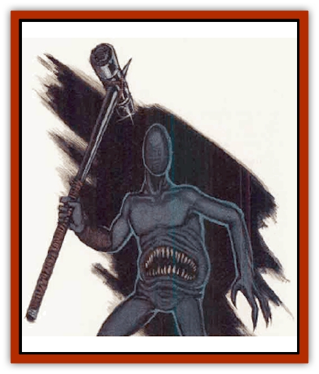

# Tomb Tapper

| Statistic | **Tomb Tapper** |
| --- | --- |
| **Activity Cycle:** | Any |
| **Alignment:** | Lawful neutral |
| **Armor Class:** | -2 |
| **Climate/Terrain:** | Anv subterranean |
| **Damage/Attack:** | 4d6/4d6/1d12+9 or 1d12+6 |
| **Diet:** | See below |
| **Frequency:** | Very rare |
| **Hit Dice:** | 8+8 |
| **Intelligence:** | High (13-14) |
| **Magic Resistance:** | Nil |
| **Morale:** | Elite (16) |
| **Movement:** | 9, Br 14 |
| **No. Appearing:** | 1-12 |
| **No. of Attacks:** | 3 or 1 |
| **Organization:** | Clan |
| **Size:** | H (15-21' tall) |
| **Special Attacks:** | See below |
| **Special Defenses:** | See below |
| **THAC0:** | 13 |
| **Treasure:** | Q&times;4 (speciai) |
| **XP Value:** | 8,000 |

Tomb Tappers, also known as Thaalud, appear as tall, naked, sexless, and hairless humanoids with very hard, smooth, blue-gray skin, claws that can dig through solid rock, and great toothed mouths in their bellies. Their smooth, featureless heads have earned them the nickname "the faceless".

**Combat:** Thaalud attack with iron-hard, long-fingered hands (4d6 damage each), and bend over or hurl themselves atop opponents to bite with their abdominal mouths (which crush and tear armor, rock, flesh and bone alike, one bite doing 1d12+9 damage). If they lack the room for such maneuvers, or don't want to close with opponents, they swing great hammers for 1d12+6 damage. Tappers can wield these weapons one-handed (-2 on attack rolls) and throw them with great accuracy (+2 to hit).

Thaalud see by sonar (they emit inaudibly high sound raves, which bounce back) accurate up to 440 feet even in darkness. This sense enables them to locate invisible creatures and objects and makes them immune vision-related spells (such as *phantasmal force*, *color spray*, and *hypnotic pattern*). They communicate by means of humming sounds created by skin vibration (this language is partially understood by [[Mind_Flayer|mind flayers]]) and by a limited telepathy (120-foot range, no mindreading or attacks possible from either end). Tappers can *detect magic* at will and can *animate rock* (as the 7th level priest spell, affecting up to 9 cubic feet of rock for 1d4+2 rounds; determine duration randomly each time used) once every 12 turn.

Tomb tappers are immune to enchaniment/charm spells and fire- and cold-based attacks of all sorts. Electrical attacks do them half (if the save is made, no) damage. They save vs. petrification at -2. A tomb tapper turn to stone 1-2 rounds after dying.

**Habitat/Society:** Tomb tappers get their name from their habit of burrowing up from the depths to plunder tombs, temples, and wizards' towers in search of magical item, which they carry off. They usually try to seize magical items from encountered beings.

Magic is sacred to thaalud; they never use my magical items, but protect and venerate them. Tappers spend their long lives in an eternal search for the source of all magic, which they believe lies hidden somewhem deep in the earth. They are somewhat in awe of [[Elemental_Air_Earth|earth elementals]], believing them to be created at this miysterious source, and are reluctant to attack them.

Thaalud keep as common treasure (owned by the clan as a qhole) all magical items, and guard these watchfully. As personal treasure they keep pretty rocks(but not gems, which are dull when uncut) such as quartz, jade, agate, and amethyst. These are stored in caverns of *glowrock*, in the utter depths. (Glowrock is a stone that gives off a natural amber or lime-green *faery fire*. It is harmless and useful as a light source but too soft to carve. It is often present in radiation-strong areas of the Underdark, glowing brightly when exposed to such radiation-but is not itself a radiation source. Tomb tappers don't need it as a light source but seem to sense and enjoy the glow nonetheless.)

**Ecology:** Tomb tappers are not natural creatures. Their existence has been traced back to the very beginning of the Shadowed Age of Netheril, when a group of powerful wizards created them to seek out the source of the drain on magic that was beginning to reach across Netheril. This is supported by their faceless heads (suggesiing they have been changed from a humanoid norm) and by their spell immunities (suggesting they were created to fight the [[Phaerimm|phaerimm]]). Tapper beliefs indicate they know magic has power over them. Some, including Elminster, think thaalud were originally made from rock animated in human form. This view is supported by their turning to stone at death.

Thaalud skin varies in porosity at will; through it, tappers take in needed water. Their gigantic jaws can crush rock, from which thaalud extract mineral sustenance. They also digest iron from blood and bone marrow if such become available but do not hunt to eat.

Thaalud customarily wield great hammers of *arenite*, an alloy derived from magma (the exact composition is secret). These hammers are 10 feet or more long, heavy, harder than most rock, and very durable. Tappers can dig through rock with their claws, but use their hammers to split rock when smooth surface is desired.

Thaalud are naturally long-lived and form regional clans. It is not known whether they have young or give birth; no children or pregnant thaalud have ever been seen. Even who leads a clan is not known, although thaalud make and keep deals with other beings, and hence are assumed to respect rules and authority.

Thaalud will aid [[Gnome|svirfneblins]] and [[Dwarf|dwarves]], whose magic they leave unmolested. They have no interest in [[Elf_Drow|drow]] cloaks, boots and other items that resemble magic because of Underdark radiatiom and not true dweomers. Thaalud hate [[Umber_Hulk|umber hulks]], somelimes enslaving them from birth, mutually ignore [[Xorn|xorn]], dislike [[Dwarf_Duergar|duergar]] and drow, and are bitter foes of [[Mind_Flayer|illithids]] and phaerimm, who have slain more than a few thaalud.

---
## Discovery & Documentation

**Source Publication:** Monstrous Compendium, 1996 Annual, Volume 3 (1995)
**Campaign Setting:** Advanced Dungeons & Dragons 2nd Edition
**Author(s):** Jon Pickens

### Other Creatures Found in This Source Book
   * [[Alaghi|Alaghi]]
   * [[Alhoon|Alhoon]]
   * [[Aranea_Savage_Coast|Aranea (Savage Coast)]]
   * [[Arcane_Head|Arcane Head]]
   * [[Banedead|Banedead]]
   * [[Banelich|Banelich]]
   * [[Bat_Bonebat|Bat, Bonebat]]
   * [[Beetle|Beetle]]
   * [[Belgoi|Belgoi]]
   * [[Bladeling|Bladeling]]
   * [[Braxat|Braxat]]
   * [[Bunyip|Bunyip]]
   * [[Burbur|Burbur]]
   * [[Bvanen|Bvanen]]
   * [[Cat_Great_Snow_Tiger|Cat, Great, Snow Tiger]]
   * [[Chosen_One|Chosen One]]
   * [[Chronovoid|Chronovoid]]
   * [[Cildabrin|Cildabrin]]
   * [[Coffer_Corpse|Coffer Corpse]]
   * [[Disenchanter|Disenchanter]]
   * [[Dog_Temporal|Dog, Temporal]]
   * [[Dragon_Cerilia|Dragon (Cerilia)]]
   * [[Dragon_Ghost|Dragon, Ghost]]
   * [[Dragon_Lesser_Undead|Dragon, Lesser Undead]]
   * [[Dragon_Neutral_Amber|Dragon, Neutral, Amber]]
   * [[Dread_Warrior|Dread Warrior]]
   * [[Dreamweaver|Dreamweaver]]
   * [[Dream_Spawn_Greater_Ennui|Dream Spawn, Greater, Ennui]]
   * [[Dream_Spawn_Lesser_Morph|Dream Spawn, Lesser, Morph]]
   * [[Dwarf_Arctic|Dwarf, Arctic]]
   * [[Dwarf_Urdunnir|Dwarf, Urdunnir]]
   * [[Eel_Giant_Moray|Eel, Giant Moray]]
   * [[Elemental_Fire_Kin_Tome_Guardian|Elemental, Fire Kin, Tome Guardian]]
   * [[Elf_Rockseer|Elf, Rockseer]]
   * [[Ethyk|Ethyk]]
   * [[Faerie_Faerie_Fiddler|Faerie, Faerie Fiddler]]
   * [[Faerie_Petty_Bramble|Faerie, Petty, Bramble]]
   * [[Faerie_Petty_Gorse|Faerie, Petty, Gorse]]
   * [[Faerie_Petty|Faerie, Petty]]
   * [[Firenewt|Firenewt]]
   * [[Formian|Formian]]
   * [[Gargoyle_II|Gargoyle II]]
   * [[Giant_Cerilia|Giant (Cerilia)]]
   * [[Goblin_Cerilia|Goblin (Cerilia)]]
   * [[Golem_Magic|Golem, Magic]]
   * [[Golem_Shaboath|Golem, Shaboath]]
   * [[Hag_Bheur|Hag, Bheur]]
   * [[Hamadryad|Hamadryad]]
   * [[Hound_of_Ill-Omen|Hound of Ill-Omen]]
   * [[Human_Cerilia|Human (Cerilia)]]
   * [[Hybsil|Hybsil]]
   * [[Ibrandlin|Ibrandlin]]
   * [[Imp_Chaos|Imp, Chaos]]
   * [[Ixitxachitl_Ixzan|Ixitxachitl, Ixzan]]
   * [[Jabberwock|Jabberwock]]
   * [[Kyton|Kyton]]
   * [[Kyuss_Son_of|Kyuss, Son of]]
   * [[Lillend|Lillend]]
   * [[Life-Shaped_Creation_Guardian|Life-Shaped Creation, Guardian]]
   * [[Life-Shaped_Creation_Transport|Life-Shaped Creation, Transport]]
   * [[Lycanthrope_Werecrocodile|Lycanthrope, Werecrocodile]]
   * [[Lycanthrope_Werespider|Lycanthrope, Werespider]]
   * [[Magedoom|Magedoom]]
   * [[Manotaur|Manotaur]]
   * [[Mastiff_Shadow|Mastiff, Shadow]]
   * [[Meazel|Meazel]]
   * [[Mist_Scarlet_Dancer|Mist, Scarlet Dancer]]
   * [[Needleman|Needleman]]
   * [[Orc_Neo-Orog|Orc, Neo-Orog]]
   * [[Orc_Ondonti|Orc, Ondonti]]
   * [[Owlbear_II|Owlbear II]]
   * [[Pegataur|Pegataur]]
   * [[Phaerimm|Phaerimm]]
   * [[Reggelid|Reggelid]]
   * [[Render|Render]]
   * [[Saurial|Saurial]]
   * [[Scalamagdrion|Scalamagdrion]]
   * [[Sharn|Sharn]]
   * [[Snake_Messenger|Snake, Messenger]]
   * [[Spirit_Forest_Uthraki|Spirit, Forest, Uthraki]]
   * [[Spirit_Forest_Wood_Man|Spirit, Forest, Wood Man]]
   * [[Spirit_Ice_Orglash|Spirit, Ice, Orglash]]
   * [[Spirit_Rock_Thomil|Spirit, Rock, Thomil]]
   * [[Strider_Giant|Strider, Giant]]
   * [[Tembo|Tembo]]
   * [[Temporal_Glider|Temporal Glider]]
   * [[Temporal_Stalker|Temporal Stalker]]
   * [[Tether_Beast|Tether Beast]]
   * [[Thessalmonster|Thessalmonster]]
   * [[Time_Dimensional|Time Dimensional]]
   * [[Undead_Dragon_Slayer|Undead Dragon Slayer]]
   * [[Unicorn_Black_Toril|Unicorn, Black (Toril)]]
   * [[Vaath|Vaath]]
   * [[Vortex_Spider|Vortex Spider]]
   * [[Weredragon|Weredragon]]
   * [[Zhentarim_Spirit|Zhentarim Spirit]]
