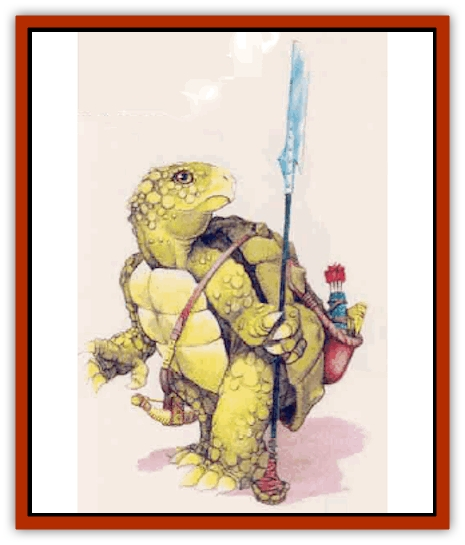

# Tortle

| Statistic | **Snapper** | **Tortle** |
| --- | --- | --- |
| **Activity Cycle:** | Day | Day |
| **Alignment:** | Lawful evil | Any |
| **Armor Class:** | 5 | 3 (1) |
| **Climate/Terrain:** | Ocean shores | Forest, beaches |
| **Damage/Attack:** | 1d6/1d6/2d4 (or weapon + bite) | 1d4/1d4 (or by weapon) |
| **Diet:** | Carnivore | Omnivore |
| **Frequency:** | Rare | Uncommon |
| **Hit Dice:** | 3 | 2 |
| **Intelligence:** | Average (8-10) | Average (8-10) |
| **Magic Resistance:** | Nil | Nil |
| **Morale:** | Steady (11-12) | Fanatic (17-18) |
| **Movement:** | 6, Sw 18 | 6, Sw 3 |
| **No. Appearing:** | 2d10 | 2d6 |
| **No. of Attacks:** | 3 (claw/claw/bite) | 2 (claws) |
| **Organization:** | Pack | Tribe |
| **Size:** | M (6-7' tall) | M (5-7' tall) |
| **Special Attacks:** | Nil | Bite |
| **Special Defenses:** | Nil | Shell |
| **THAC0:** | 17 | 19 |
| **Treasure:** | U | K |
| **XP Value:** | 120 | 120 |

Tortles are land-dwelling, humanoid tortoises. They walk upright with a ponderous, rolling gait. The creatures have leathery, reptilian skin and shells that cover their backs and bellies. Only their heads, limbs, and tails stick out of their shells. An adult tortle stands about 6 feet tall and weighs more than 500 pounds.

Tortles have no hair; their skin is mostly olive or blue-green. Their back shells are usually shinier and darker than their skin, while their front shells tend to be lighter, with a yellowish cast. A tortle's eyes look something like the eyes of humans, except that the pupils are horizontal ovals in shape. The irises are vibrantly colored, usually blue, but sometimes green or red. A tortle's mouth is beaklike and toothless and can deliver a vicious bite.

Tortles are stocky, but most of their weight comes from their shells, so they tend to remain at the same weight throughout their adult lives, never growing fat or thin. Their arms and hands are shaped like those of humans, but thicker and tipped with sharp claws. Tortles can wield most weapons as easily as humans. Their tails measure about two feet long. Also, they usually wear no clothing, though some may wear cloaks, belts, or harnesses for carrying tools and supplies.

Despite their ancestry, tortles are not especially slow, either mentally or physically; however, they are thinkers who might ponder a question a little longer than most before answering. Most tortles are peaceful and slow to anger. While they have the same range of emotions as humans, tortles are not as demonstrative and often seem cold and distant to more passionate races. Tortles tend to be lawful and good; chaotic or evil individuals are quite rare.

Tortles speak their own language, simply called tortle, but most speak common or some other local language as well.

**Combat:** Tortles generally prefer to avoid conflict, but once engaged, they seldom retreat, knowing that their shells can protect them. Tortles prefer to use weapons in combat, but can claw if unarmed. Some even learn how to bite effectively, inflicting 1d6 points of damage. These creatures prefer short bows, staves, long swords, and flails. When attacking in groups, about half engage the enemy in melee; they then break off the attack and retreat into their shells so that the rest can attack from a distance with missile weapons without risking injury to their friends. After the missile attacks cease, the meleeing tortles come out of their shells and resume the attack. This tactic is repeated as necessary.

Mages and priests are common among tortles, while warriors and bards are uncommon; thieves are extremely rare. The most popular kit for tortles is the Local Hero. Other common kits include the Honorbound, Wokan, Fighting Monk, and Trader.

Tortles have infravision with a range of 60 feet and can see underwater within this range as well. The creatures automatically gain the swimming nonweapon proficiency, but they are clumsy swimmers. Their natural buoyancy keeps them afloat while they paddle along (even across bogs, quicksand, and mud). Tortles can hold their breath underwater for 10 turns.

Tortles do not wear armor, but they can retreat into their shells for protection. With some effort, they can bend and twist to pull their limbs and head into the shell, but they can take no other actions in the same round. When fully withdrawn, a tortle cannot move or attack, but becomes AC 1 and gains a +4 bonus to all saving throws, even against mental attacks (because the tortle gains the benefit of a shell, it marshals all its inner strength for defense). A withdrawn tortle can hear and smell but cannot see (making it immune to gaze attacks and other attacks that require a victim to see).

**Habitat/Society:** Tortles prefer warm climates and enjoy sunning themselves; they have little tolerance for cold.

Native tortles have an advanced stone-age level of technology, using bows, staves, and other relatively modern implements. Most of the tortles of the Savage Coast have adapted to the ways of their neighbors, using metal tools and weapons, and tortle smiths are capable of making the finest implements. Tortles tend to restrict themselves to the tools of the culture in which they live.

This adaptation to neighboring cultures carries over into all aspects of tortle society. Tortles who live outside the boundaries of other nations (the "free" tortles) tend to be simple farmers, many still using ancient "slash and burn" methods. Other free tortles live the simple, if demanding, lives of hunter-gatherers. However, most tortles dwell within other nations, where they are peasants (usually farmers), living in the style of peasants of that nation. Tortle legends claim that the creatures once built cities of grandeur, but little real evidence exists to support this, other than the Monoliths of Zul, near Eusdria. These ruins include carvings, statues, pyramids, and obelisks, and a number of small buildings. Though sages debate incessantly, these are in fact the ruins of the tortles' brief flirtation with civilization just over 1,000 years ago. The monoliths are sacred to free tortles, who sometimes refer to themselves as "the Free Tortles of Zul".

Tortles are most common in Bellayne and Renardy and on the beaches south of Renardy. Most modern free tortles live along the beaches in small familial groups, typically in huts made of mud and wood. A cluster of huts forms a village center, with outlying huts forming a perimeter of several hundred yards. Each tortle dwelling has an alarm of some sort, usually a horn or gong. Tortles stay in contact with their neighboring tortles, depending on one another for defense and assistance on major building or farming projects.

The Free City of Dunwick is also located on the tortle beaches. Most Dunwickers are tortle peasants, but other residents include members of just about every intelligent race, including goblinoids. Dunwick was built around the site of an old monastery of the Brotherhood of Order; this is now the mayor's residence. The site later became a trading post owned by the LB Trading Company, based in Cimarron. Today, many businesses in Dunwick are either owned or financed by the LB Trading Company, with tortle workers, the hired protection of the Texeiran Navy, and a corps of Torre-ner swordsmen.

A typical tortle lives about 50 years. The creatures mate only once in their lives and invariably die within a year afterward. (Tortles who do not mate can live to become extremely old, with little loss of vitality.) Mating takes place in late summer, egg-laying during the fall. All females ready to produce eggs gather in a specially prepared compound, which the males guard against all attacks. Tortle eggs are considered delicacies, so the location of the egg - laying grounds is always defensible. Tortles from all nations travel to these egg-laying grounds in the lands of the free tortles. Each female lays 4-24 eggs, which hatch about six months later. Some young fall prey to predators, but most survive to be raised by adults, usually under the tutelage of aunts and uncles.

Tortle families are unusual, since parents do not live long enough to raise their children. Thus, a tortle family might consist of a small number of adult tortles and a number of their nieces and nephews of varying ages. The "family" is usually very close. Tortles never refer to fathers or mothers, except in reference to the Immortals, including Mother Ocean (Calitha, their protector) and Father Earth (Ka, the bringer of life). Within the last century, most tortles have added two more Immortals to their pantheon, both adopted from the lupins and considered the children of Mother Ocean and Father Earth: Brother Shell (Matin), the protector of families, and Sister Grain (Ralon), the patron of farmers and the bringer of food.

**Ecology:** Other than using the slash and burn farming method (which leaches nutrients from the soil), tortles generally live in harmony with nature. They are tolerant of most other intelligent people, as long as those beings treat tortles fairly.

**Snapper**

  Snappers are a primitive marine relative of the tortle. They look similar but are broader and more massive, with lumpy, brownish shells and vicious beaks. Snappers cannot retreat into their shells. They have infravision with a range of 60 feet and can see underwater up to twice this distance. The creatures automatically gain the swimming nonweapon proficiency, and they are graceful swimmers compared to the tortles. Snappers can hold their breath underwater for up to two hours.

The creatures favor tridents, nets, and spears but also use their natural weapons. They form small packs, but they have no true leaders. The creatures are bad-tempered and tend to attack any other beings they encounter. Snappers always train their nikt'oo mounts to be aggressive.

Snappers are organized into hunting packs, dominated and run by the largest, toughest male, who can be challenged for leadership at any time.

---
## Discovery & Documentation

**Source Publication:** Mystara Appendix (1994)
**Campaign Setting:** Mystara
**Author(s):** John Nephew, Teeuwynn Woodruff, John Terra, Skip Williams

### Other Creatures Found in This Source Book
   * [[Actaeon|Actaeon]]
   * [[Agarat|Agarat]]
   * [[Ash_Crawler|Ash Crawler]]
   * [[Baldandar|Baldandar]]
   * [[Bargda|Bargda]]
   * [[Bhut|Bhut]]
   * [[Bird_Mystara|Bird (Mystara)]]
   * [[Blackball|Blackball]]
   * [[Choker|Choker]]
   * [[Coltpixie|Coltpixie]]
   * [[Crone_of_Chaos|Crone of Chaos]]
   * [[Darkhood|Darkhood]]
   * [[Darkwing|Darkwing]]
   * [[Decapus|Decapus]]
   * [[Deep_Glaurant|Deep Glaurant]]
   * [[Diabolus|Diabolus]]
   * [[Dimensional_Warper|Dimensional Warper]]
   * [[Dragon_Mystara_Crystalline|Dragon (Mystara), Crystalline]]
   * [[Dragon_Mystara_Jade|Dragon (Mystara), Jade]]
   * [[Dragon_Mystara_Onyx|Dragon (Mystara), Onyx]]
   * [[Dragon_Mystara_Ruby|Dragon (Mystara), Ruby]]
   * [[Drake_Mystara|Drake (Mystara)]]
   * [[Dragonfly|Dragonfly]]
   * [[Dusanu|Dusanu]]
   * [[Elemental_of_Chaos_Air_Earth|Elemental of Chaos, Air/Earth]]
   * [[Elemental_of_Chaos_Fire_Water|Elemental of Chaos, Fire/Water]]
   * [[Elemental_of_Law_Air_Earth|Elemental of Law, Air/Earth]]
   * [[Elemental_of_Law_Fire_Water|Elemental of Law, Fire/Water]]
   * [[Familiar_Mystara|Familiar (Mystara)]]
   * [[Frost_Salamander|Frost Salamander]]
   * [[Fundamental_Air_Earth|Fundamental, Air/Earth]]
   * [[Fundamental_Fire_Water|Fundamental, Fire/Water]]
   * [[Gargantua_Mystara|Gargantua (Mystara)]]
   * [[Geonid|Geonid]]
   * [[Ghostly_Horde|Ghostly Horde]]
   * [[Giant_Athach|Giant, Athach]]
   * [[Giant_Hephaeston|Giant, Hephaeston]]
   * [[Golem_Drolem|Golem, Drolem]]
   * [[Golem_Mystara_I|Golem (Mystara) I]]
   * [[Golem_Mystara_II|Golem (Mystara) II]]
   * [[Golem_Mystara_III|Golem (Mystara) III]]
   * [[Gray_Philosopher|Gray Philosopher]]
   * [[Guardian_Warrior|Guardian Warrior]]
   * [[Gyerian|Gyerian]]
   * [[Herex|Herex]]
   * [[Hivebrood|Hivebrood]]
   * [[Horde|Horde]]
   * [[Hsiao|Hsiao]]
   * [[Huptzeen|Huptzeen]]
   * [[Hutaakan|Hutaakan]]
   * [[Imp_Mystara|Imp (Mystara)]]
   * [[Jellyfish_Giant_Mystara|Jellyfish, Giant (Mystara)]]
   * [[Kna|Kna]]
   * [[Kopru|Kopru]]
   * [[Lizard_Mystara|Lizard (Mystara)]]
   * [[Lizard-kin_Mystara|Lizard-kin (Mystara)]]
   * [[Lupin|Lupin]]
   * [[Lycanthrope_Werejaguar_Mystara|Lycanthrope, Werejaguar (Mystara)]]
   * [[Lycanthrope_Wereswine|Lycanthrope, Wereswine]]
   * [[Magen|Magen]]
   * [[Manikin|Manikin]]
   * [[Mek|Mek]]
   * [[Mujina|Mujina]]
   * [[Nagpa|Nagpa]]
   * [[Neh-thalggu|Neh-thalggu]]
   * [[Nightshade_Mystara|Nightshade (Mystara)]]
   * [[Nuckalavee|Nuckalavee]]
   * [[Pegataur|Pegataur]]
   * [[Phanaton|Phanaton]]
   * [[Plant_Dangerous_Mystara|Plant, Dangerous (Mystara)]]
   * [[Plasm|Plasm]]
   * [[Rakasta|Rakasta]]
   * [[Rock_Man|Rock Man]]
   * [[Sabreclaw|Sabreclaw]]
   * [[Sacrol|Sacrol]]
   * [[Scamille|Scamille]]
   * [[Shapeshifter|Shapeshifter]]
   * [[Shargugh|Shargugh]]
   * [[Shark-kin|Shark-kin]]
   * [[Sollux|Sollux]]
   * [[Spectral_Death|Spectral Death]]
   * [[Spectral_Hound|Spectral Hound]]
   * [[Spider-kin|Spider-kin]]
   * [[Spirit_Mystara|Spirit (Mystara)]]
   * [[Statue_Living|Statue, Living]]
   * [[Surtaki|Surtaki]]
   * [[Tabi|Tabi]]
   * [[Thoul|Thoul]]
   * [[Thunderhead|Thunderhead]]
   * [[Tiger_Ebon|Tiger, Ebon]]
   * [[Topi|Topi]]
   * [[Vampire_Velya|Vampire, Velya]]
   * [[White_Fang|White Fang]]
   * [[Worm_Mystara|Worm (Mystara)]]
   * [[Wyrd|Wyrd]]
   * [[Yowler|Yowler]]
   * [[Zombie_Lightning|Zombie, Lightning]]
