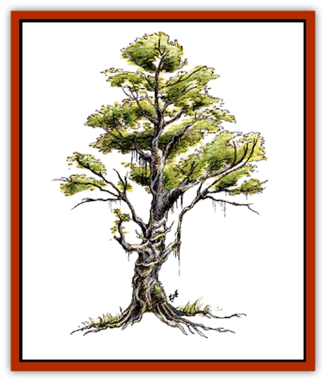

# Treant

| Statistic | **Treant** |
| --- | --- |
| **Activity Cycle:** | Any |
| **Alignment:** | Chaotic good |
| **Armor Class:** | 0 |
| **Climate/Terrain:** | Any forest |
| **Damage/Attack:** | Variable |
| **Diet:** | Photosynthesis |
| **Frequency:** | Rare |
| **Hit Dice:** | 7-12 |
| **Intelligence:** | Very (11-12) |
| **Magic Resistance:** | Nil |
| **Morale:** | Champion (15-16) |
| **Movement:** | 12 |
| **No. Appearing:** | 1-20 |
| **No. of Attacks:** | 2 |
| **Organization:** | Grove |
| **Size:** | H (13-18') |
| **Special Attacks:** | See below |
| **Special Defenses:** | Never surprised |
| **THAC0:** | 7-8 HD: 13 / 9-10 HD: 11 / 11-12 HD: 9 |
| **Treasure:** | Q&times;5,X |
| **XP Value:** | 7HD: 2,000 (+1000 per Hit Die) |

Treants are strangely related to both humans and trees, combining features of both species. Peaceful by nature, treants can cause great damage when roused to anger. They hate evil things and the unrestrained use of fire.

Treants are almost indistinguishable from trees. Their skin is a thick, textured, brown bark. Their arms are gnarled like branches and their legs fit together when standing like the trunk of a tree. Above the eyes and along the head are dozens of smaller branches from which hang great leaves. In winter the leaves of a treant change color but rarely fall out. Treants are very intelligent and often speak a number of languages including their own, elf, dwarf, common, and a smattering of just about all other humanoid tongues (at least enough to say "Get out of my trees!").

**Combat:** The combat ability of treants varies with their size. Young treants (13 or 14 feet) have 7 or 8 Hit Dice and inflict 2-16 points of damage per attack. Middle-aged treants (15 or 16 feet) have 9 or 10 Hit Dice, respectively, and inflict 3-18 points of damage per attack. Elder treants (17 or 18 feet) have 11 or 12 Hit Dice and inflict 4-24 points of damage per attack.

Due to their tough, barklike skin, treants have a superior Armor Class rating against almost all weapons. Their only weakness is fire. Any fire-based attack against a treant is at +4 to hit and +1 damage. In addition, treants save against all fire-based attacks at -4. This weakness to fire also applies to animated trees controlled by a treant.

Treants have the ability to animate normal trees. One treant can animate up to two trees. It takes one round for a normal tree to uproot itself. Thereafter the animated tree can move at a rate of 3 per turn and fights as a full-grown treant (12 Hit Dice, two attacks, 4-24 points of damage per attack). A treant must be within 60 yards of the tree it is attempting to animate. Animated trees lose their ability to move if the treant who animated them is incapacitated or moves more than 60 yards away.

Treants (regardless of size) and treant-controlled trees can inflict structural damage when attacking a building or fortification.

**Habitat/Society:** Treants live in small communities, usually amidst old hardwood forests (oak, maple, mahogany, etc.). In the forest treants rarely reveal themselves, preferring not to interact with the more transient lifeforms (anything with a lifespan of 500 years or less). Humans and demihumans have only a slight chance of spotting a treant who is trying to blend in with the trees. Rangers have a fair chance of spotting a treant (10% per level).

Treants are intolerant of evil, particularly when fire and the wanton destruction of trees is involved. They hate [[Orc|orcs]] and [[Goblin|goblins]] with a passion and tend to be suspicious of anyone carrying an ax.

Treants have no use for treasure, and usually place all such items somewhere out of sight, such as under a great rock. Occasionally a treant can be convinced to give up his treasure but only when some great good will be accomplished by this generosity.

**Ecology:** Treants, like all trees, gain sustenance via photosynthesis. Treants often sleep for long periods of time (anywhere from a few days to several years) during which short roots grow into the ground beneath them gathering water and minerals from the soil. Reproduction is via off-shoot stalks which the female treants then protect and care for until the stalks are grown.

The lifespan of a treant is not known, but is several thousand years at least. As they grow older, treants become slower and less agile, sleeping for longer periods and talking less of things that are and more of things that were. Eventually an old treant will not wake up, taking permanent root in the spot where he sleeps and living out the rest of his life as a normal tree.

---
## Discovery & Documentation

**Source Publication:** MC1 Volume I (w/binder #1) (1991)
**Campaign Setting:** Advanced Dungeons & Dragons 2nd Edition
**Author(s):** Jay Batista, Scott Bennie, Grant Boucher, William W. Connors, Steve Gilbert, Heike Kubasch, James Lowder, David Edward Martin, Bruce Nesmith, Jean Rabe, Rick Swan, John J. Terra, Gary L. Thomas

### Other Creatures Found in This Source Book
   * [[Bat|Bat]]
   * [[Bear|Bear]]
   * [[Behir|Behir]]
   * [[Boar|Boar]]
   * [[Bookworm|Bookworm]]
   * [[Brownie|Brownie]]
   * [[Bugbear|Bugbear]]
   * [[Carrion_Crawler|Carrion Crawler]]
   * [[Cat_Great|Cat, Great]]
   * [[Catoblepas|Catoblepas]]
   * [[Dragon_General_Information|Dragon, General Information]]
   * [[Dragonfish|Dragonfish]]
   * [[Elemental_Air_Kin_Aerial_Servant|Elemental, Air Kin, Aerial Servant]]
   * [[Elemental_Earth_Kin_Sandling|Elemental, Earth Kin, Sandling]]
   * [[Elephant|Elephant]]
   * [[Gnoll|Gnoll]]
   * [[Hobgoblin|Hobgoblin]]
   * [[Homunculus|Homunculus]]
   * [[Hornet_Giant|Hornet, Giant]]
   * [[Horse|Horse]]
   * [[Hyena|Hyena]]
   * [[Jackal|Jackal]]
   * [[Jackalwere|Jackalwere]]
   * [[Korred|Korred]]
   * [[Lich|Lich]]
   * [[Lizard|Lizard]]
   * [[Lizard_Man|Lizard Man]]
   * [[Lycanthrope_General_Information|Lycanthrope, General Information]]
   * [[Lycanthrope_Seawolf|Lycanthrope, Seawolf]]
   * [[Lycanthrope_Werebear|Lycanthrope, Werebear]]
   * [[Lycanthrope_Weretiger|Lycanthrope, Weretiger]]
   * [[Lycanthrope_Werewolf|Lycanthrope, Werewolf]]
   * [[Manticore|Manticore]]
   * [[Medusa|Medusa]]
   * [[Mind_Flayer|Mind Flayer]]
   * [[Minotaur|Minotaur]]
   * [[Mudman|Mudman]]
   * [[Mummy|Mummy]]
   * [[Nixie|Nixie]]
   * [[Nymph|Nymph]]
   * [[Ogre|Ogre]]
   * [[Ooze_Slime_Jelly_I|Ooze/Slime/Jelly I]]
   * [[Ooze_Slime_Jelly_II|Ooze/Slime/Jelly II]]
   * [[Orc|Orc]]
   * [[Owl|Owl]]
   * [[Owlbear_I|Owlbear I]]
   * [[Pegasus|Pegasus]]
   * [[Piercer|Piercer]]
   * [[Pudding_Deadly|Pudding, Deadly]]
   * [[Rakshasa|Rakshasa]]
   * [[Rat|Rat]]
   * [[Ray|Ray]]
   * [[Remorhaz|Remorhaz]]
   * [[Satyr|Satyr]]
   * [[Scorpion|Scorpion]]
   * [[Selkie|Selkie]]
   * [[Shadow|Shadow]]
   * [[Skeleton|Skeleton]]
   * [[Skunk|Skunk]]
   * [[Snake|Snake]]
   * [[Spectre|Spectre]]
   * [[Spider|Spider]]
   * [[Sprite|Sprite]]
   * [[Toad_Giant|Toad, Giant]]
   * [[Troll|Troll]]
   * [[Umber_Hulk|Umber Hulk]]
   * [[Unicorn|Unicorn]]
   * [[Vampire|Vampire]]
   * [[Wight|Wight]]
   * [[Will_O'Wisp|Will O'Wisp]]
   * [[Wolf|Wolf]]
   * [[Wolfwere|Wolfwere]]
   * [[Wraith|Wraith]]
   * [[Wyvern|Wyvern]]
   * [[Yeti|Yeti]]
   * [[Yuan-ti|Yuan-ti]]
   * [[Zombie|Zombie]]
