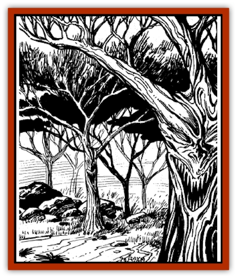

# Treant - Athas

| Statistic | **Treant (Athas)** |
| --- | --- |
| **Activity Cycle:** | Any |
| **Alignment:** | Neutral |
| **Armor Class:** | 0 |
| **Climate/Terrain:** | Forest |
| **Damage/Attack:** | 6-36/6-36 or 4-24 |
| **Diet:** | Photosynthesis |
| **Frequency:** | Very rare |
| **Hit Dice:** | 15 |
| **Intelligence:** | Supra-genius (20) |
| **Magic Resistance:** | 65% |
| **Morale:** | Fearless (19-20) |
| **Movement:** | 12 |
| **No. Appearing:** | 1-3 |
| **No. of Attacks:** | 2 |
| **Organization:** | Grove |
| **Size:** | H (18-20') |
| **Special Attacks:** | See below |
| **Special Defenses:** | Never surprised |
| **THAC0:** | 5 |
| **Treasure:** | Q&times;5,X |
| **XP Value:** | 10,000 |

Athasian treants are magical creatures, a mystic blending of the characteristics of a *tree of life* and a [[Spirit_of_the_Land|water spirit of the land]]. They are virtually immortal, and they act as incarnate guardians of the wilderness for which they were created. Often they are dedicated to caring for groves of trees of life, much as the normal [[Treant|treant]] is the caretaker of a normal forest.

Like normal treants, Athasian treants are almost indistinguishable from trees. When stationary, they look almost exactly like the species of tree from which they were constructed, giving them a 95% chance to hide themselves within a grove of trees. Their skin is bark, their arms tree branches, and their facial features look like the knots on the trunk of the tree.

**Combat:** The combat abilities of an Athasian treant are much more fixed than those of a standard treant, in part because Athasian treants are magical creatures rather than a natural race. Their tough, barklike skin gives them an excellent Armor Class against all attack except fire, which receives a +4 to hit and +1 damage against Athasian treants. Their limblike claws inflict 6d6 damage each, and they are capable of lifting creatures of up to 500 pounds. They may also hurl boulders for 4d6 damage, but they may only hurl one boulder per round.

Unlike their standard counterparts, Athasian treants cannot animate other trees. Moreover, Athasian treants have no magical resistance to fire magic, as it is from the sphere opposing the water spirit.

However, they can cast spells of the Water sphere as an innate ability. They may cast each of the following spells once per day: *create water*, *purify food and drink*, *create food and water*, *lower water*, *reflecting pool*, *conjure elemental (water)*, *part water*, and *transmute water to dust*. Each of these is an innate ability of the Athasian treant and is cast without verbal, somatic, or material components at an initiative rating of 2.

**Habitat/Society:** Athasian treants are created by druids for the express purpose of protecting the wilderness. While they have some advantages over their normal spiritual forms, in other ways they are very limited. Also, it is impossible to create an Athasian treant without the voluntary cooperation of a *water spirit of the land*, so they are extremely rare.

In fact, a *spirit of the land* is more powerful outside of this form than in it, when it manifests both more magical powers and more physical abilities. However, *spirits of the land* are not very attentive, and they will often wait until huge devastation is inflicted on the land before doing anything. While in treant form, a *spirit of the land* is much more closely tied to the physical world, and will therefore react much more quickly to the depredations of defilers and other attackers. Once bound to the treant, however, the *spirit of the land* cannot leave until the treant is killed. While in the form of a treant, the *water spirit of the land's* memory is limited to its life as a treant.

**Ecology:** An Athasian treant is created from a *tree of life* which is specially constructed by a druid to house a water spirit. The druid must convince the *water spirit of the land* of the necessity of the transformation and then must cast the following spells: *liveoak*, *reincarnate*, and *tree of life*. This not necessarily easy, for when the *spirit* leaves the water source it presently inhabits, that pool or stream quickly drys up and vanishes.

Invariably, an Athasian treant will be associated with a particular site and will be tasked with defending that site. It will fight fearlessly in defense of that site, as death has no meaning for such a creature. In the absence of violence, an Athasian treant is immortal; if killed, the *spirit of the land* is freed without injury, although it cannot reform a physical body for a number of years equal to the time it spent as a part of the treant. A *spirit* having been freed from a treant will recall its experiences as a treant as well as its existence prior to having been transformed. The water source which it once inhabited, however, will slowly return if it's bed has not been entirely eradicated.

Although the treant will die in the defense of the wilderness, it will in all other matters act in the interests of its own survival, and it will not give up its life to free the *spirit* within.

---
## Discovery & Documentation

**Source Publication:** The Ivory Triangle (1993)
**Campaign Setting:** Dark Sun
**Author(s):** Curtis Scott, Kirk Botula

### Other Creatures Found in This Source Book
   * [[Bloodvine|Bloodvine]]
   * [[Cilops|Cilops]]
   * [[Zombie_Salt|Zombie, Salt]]
