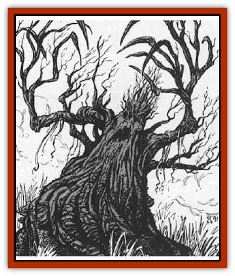

# Treant - Evil

| Statistic | **Treant, Evil** |
| --- | --- |
| **Activity Cycle:** | Any |
| **Alignment:** | Chaotic evil |
| **Armor Class:** | 0 |
| **Climate/Terrain:** | Any forest |
| **Damage/Attack:** | Varies |
| **Diet:** | Carnivore |
| **Frequency:** | Very rare |
| **Hit Dice:** | 7-12 |
| **Intelligence:** | Very (11-12) |
| **Magic Resistance:** | Nil |
| **Morale:** | Elite (13-14) |
| **Movement:** | 12 |
| **No. Appearing:** | 1-20 |
| **No. of Attacks:** | 2 |
| **Organization:** | Grove |
| **Size:** | H (13-18') |
| **Special Attacks:** | Nil |
| **Special Defenses:** | Nil |
| **THAC0:** | 7-8 HD: 13 / 9-10 HD: 11 / 11-12 HD: 9 |
| **Treasure:** | Q&times;5,X |
| **XP Value:** | HD 7: 2,000 (+1,000/HD) |

The peaceful race of [[Treant|treants]], found on many worlds and in many lands, is also represented in Ravenloft. Sadly, the dark waters and corrupting evil of the land has twisted them into evil and foul things. The treants of Ravenloft despise good and innocent things as much as their counterparts hate evil; they go to great lengths to torment and terrorize travellers in their domains. The only trait they seem to share with the true truant is a hatred of unchecked or unrestricted use of fire.

Evil treants look much like normal trees; so much so, in fact, that when standing in a grove or forest they have a 90% chance of being mistaken for common flora. Their bark is thick and gnarled, providing them with protection from physical damage. While they have a face that looks unsettling human when they are speaking, it vanishes into patterns of grooves and knots when the creature wishes to remain stationary. Evil treants come in three age groups: young (13 to 14 feet tall), mature (15 to 16 feet tall), and elder (17 to 18 feet tall). In combat, the amount of damage inflicted by a treant is determined by its age and size.

Evil treants can speak their own language and can usually communicate with the animals in the forest around them. They are also often capable of speaking a fair number (1-4) of other languages.

**Combat:** Young treants can lash out with their powerful branches to strike twice in combat, inflicting 2d8 points of damage per blow landed. Mature treants are able to inflict even more dangerous wounds, inflicting 3d6 points of damage with each attack. Elder treants have amassed so much physical power that their attacks deliver fully 4d6 points of damage each. Few and far between are the creatures that can stand against them in combat.

Despite the thick bark that provides them with protection against physical assaults, treants are unusually vulnerable to fire. Any weapon or attack based on fire (magical or normal) receives a +4 bonus on its attack roll. Further, such attacks score an additional +1 point per die to all damage inflicted. Saving throws required for fire-based attacks and spells are made at a -4 penalty.

Like their good counterparts, evil treants can animate and command living trees. Each treant can animate two trees. This power has a range of 60 yards, and any animated tree that moves beyond that limit is instantly returned to its normal state. After spending one round to uproot itself, an animated tree is able to move about and attack as if it were a mature treant.

Because of their mass and strength, treants are quite effective in combat against structures and fortifications - especially those made from wood. Exact details on this aspect of combat are provided in *The Castle Guide* and *Battlesystem* miniatures rules, where they are considered to be identical to good treants.

**Habitat/Society:** Evil treants live in secluded forests like those found in the mountains of southwestern Ravenloft. Here, they warp the nature of what might otherwise be peaceful and picturesque woodlands, turning them into evil, haunted forests.

Evil treants have no interest in treasures, magical or monetary, although items of value are sometimes found on the ground where they have claimed the lives of past victims. Only in very rare cases will an evil treant attempt to use any of these artificial items as they prefer to leave them where they fell and use them as bait to lure curious explorers to their deaths.

**Ecology:** Unlike good treants, who feed wholly by photosynthesis, evil treants are carnivorous. In fact, they favor the flesh of intelligent creatures (usually humans and demihumans) over all other prey. Their chosen delicacy, when they can obtain it, is the flesh of innocents, who they torment and horrify before devouring. Evil treants rarely kill their prey before consuming it, for they believe that this makes it unfit for digestion. Thus, victims who are accidentally slain during the tortures inflicted upon them by hungry treants are discarded and left to feed the scavengers of the forest.

The sap of an evil treant, when smeared over the entire body, is reported to provide humans and demihumans with protection equivalent to that granted by a *barkskin* spell.

---
## Discovery & Documentation

**Source Publication:** MC10 Ravenloft Appendix I (1989)
**Campaign Setting:** Planescape
**Author(s):** William W. Connors

### Other Creatures Found in This Source Book
   * [[Bastellus|Bastellus]]
   * [[Bat_Ravenloft|Bat (Ravenloft)]]
   * [[Bowlyn|Bowlyn]]
   * [[Broken_One|Broken One]]
   * [[Bussengeist|Bussengeist]]
   * [[Darkling|Darkling]]
   * [[Doom_Guard|Doom Guard]]
   * [[Doppelganger_Plant|Doppelganger Plant]]
   * [[Elemental_Ravenloft|Elemental (Ravenloft)]]
   * [[Ermordenung|Ermordenung]]
   * [[Ghoul_Lord|Ghoul Lord]]
   * [[Goblyn|Goblyn]]
   * [[Golem_III|Golem III]]
   * [[Golem_IV|Golem IV]]
   * [[Golem_Ravenloft|Golem (Ravenloft)]]
   * [[Grim_Reaper|Grim Reaper]]
   * [[Human_Abber_Nomad|Human, Abber Nomad]]
   * [[Human_Ravenloft|Human (Ravenloft)]]
   * [[Imp_Assassin|Imp, Assassin]]
   * [[Impersonator|Impersonator]]
   * [[Lycanthrope_Werebat|Lycanthrope, Werebat]]
   * [[Lycanthrope_Wereraven|Lycanthrope, Wereraven]]
   * [[Mist_Horror|Mist Horror]]
   * [[Mummy_Greater|Mummy, Greater]]
   * [[Quevari|Quevari]]
   * [[Quickwood|Quickwood]]
   * [[Ravenkin|Ravenkin]]
   * [[Reaver|Reaver]]
   * [[Scarecrow_Ravenloft|Scarecrow (Ravenloft)]]
   * [[Shadow_Fiend|Shadow Fiend]]
   * [[Skeleton_Giant|Skeleton, Giant]]
   * [[Strahd's_Skeletal_Steed|Strahd's Skeletal Steed]]
   * [[Treant_Undead|Treant, Undead]]
   * [[Valpurgeist|Valpurgeist]]
   * [[Vampire_Dwarf|Vampire, Dwarf]]
   * [[Vampire_Elf|Vampire, Elf]]
   * [[Vampire_Gnome|Vampire, Gnome]]
   * [[Vampire_Halfling|Vampire, Halfling]]
   * [[Vampire_General_Information|Vampire, General Information]]
   * [[Vampire_Kender|Vampire, Kender]]
   * [[Vampyre|Vampyre]]
   * [[Widow_Red|Widow, Red]]
   * [[Wolfwere_Greater|Wolfwere, Greater]]
   * [[Zombie_Lord|Zombie Lord]]
