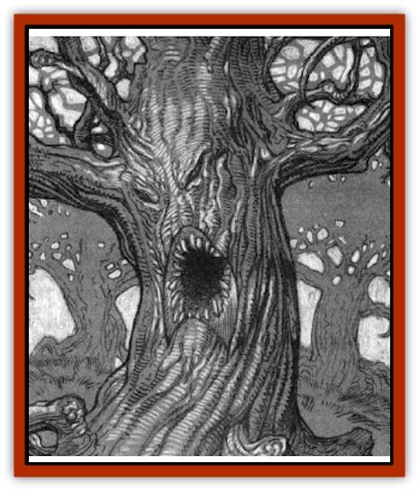

# Treant - Evil - Blackroot

| Statistic | **Treant, Evil (Blackroot)** |
| --- | --- |
| **Activity Cycle:** | Any |
| **Alignment:** | Chaotic evil |
| **Armor Class:** | 0 |
| **Climate/Terrain:** | Tepest |
| **Damage/Attack:** | 4d6/4d6 (branches) |
| **Diet:** | Carnivore |
| **Frequency:** | Unique |
| **Hit Dice:** | 12 (84 hp) |
| **Intelligence:** | Very (11) |
| **Magic Resistance:** | Nil |
| **Morale:** | Elite (14) |
| **Movement:** | 12 |
| **No. Appearing:** | 1 |
| **No. of Attacks:** | 2 |
| **Organization:** | Solitary |
| **Size:** | H (18' tall) |
| **Special Attacks:** | Animate trees, spells |
| **Special Defenses:** | Spells |
| **THAC0:** | 9 |
| **Treasure:** | Q&times;5,X |
| **XP Value:** | 14,000 |

The domain of Tepest has long suffered under the evil of the three [[Hag|hags]] who rule it. Their wickedness has seeped into the land, permeating it and poisoning even the plants and beasts of the forests. Perhaps the most awful example of this corrupting taint is the dreaded Blackroot. This [[Treant_Evil|evil treant]] dwells southwest of Lake Kronov, near the border of the Shadow Rift. None who pass through these woods do so without attracting his notice and. if care is not taken, his wrath.

Blackroot stands just over eighteen feet tall and looks like an ancient oak. His bark is grooved and rough, providing excellent protection from physical attacks. His branches are long and gnarled, never sprouting leaves or showing even the faintest hints of bud or blossom. When he wishes to be seen for what he is, a gnarled face appears to form out of the fissures and grooves of his bark. A great and terrible maw, shaped like an inverted V, opens up beneath two knotty eyes.

Blackroot, like most [[Treant|treants]] of any alignment, is able to speak with the animals of the forest. His evil is so pervasive, however, that the traditionally neutral animals of the forest near him have become neutral evil. Thus, even the most innocent creature in Blackroot's realm can be a potential enemy. Blackroot speaks the languages of Tepest and each of its neighboring domains. He seems to have no understanding of writing, not recognizing it as a form of communication.

**Combat:** Those who enter the forest attempting to destroy Blackroot are seldom seen again. If they are not destroyed by the wilderness which he commands, they usually perish in combat with this ancient, evil creature when they find him. Blackroot can attack twice per combat round, inflicting 4d6 points of damage with each blow that strikes its target. His tremendous strength and mass is such that it enables him to crumple even plate armor as easily as if it were cardboard.

Blackroot's thick bark provides him with excellent protection from most attacks. However, his plantlike biology makes him very vulnerable to attacks made with magical or mundane fire. Any weapon or spell that employs fire gains a +4 bonus on the attack and inflicts an extra +1 point of damage per die. In addition, Blackroot suffers a -4 penalty on all saving throws against fire-based attacks.

Because of this vulnerability, Blackroot quickly attempts to destroy anyone who is careless with fires in his woods. As he is well aware of the danger that such enemies pose, he prefers to act indirectly, sending savage [[Wolf|wolves]] and other animals of the forest to destroy fire-wielding enemies for him. Only if these means fail will he seek a direct confrontation.

The infusion of evil from the tainted soil of Tepest has given him several magical abilities that most of his kind do not possess. Once per day he may cast the following spells as a 12th-level druid: 1st - *animal friendship*, *entangle*, *locate animals or plants*, *putrefy food or drink*; 2nd - *charm person or mammal*, *create water*, *speak with animals*, *warp wood*; 3rd - *hold animal*, *plant growth*, *snare*, *spike growth*, *summon insects*; 4th - *animal summoning I*, *call woodland beings*, *hold plant*, *repel insects*, *speak with plants*; 5th - *animal growth*, *animal summoning II*, *antiplant shell*, *wall of thorns*; 6th - *antianimal shell*, *speak with monsters*. Blackroot has no need of components for his spells; they are all simple acts of will.

Blackroot has the ability to animate the trees of his forest, causing them to obey his mental commands. It takes one round for an animated tree to uproot itself, but once this is done it is fully mobile. At any given time he may have two such followers doing his bidding. These trees conform to the statistics for mature treants, having 10 Hit Dice and inflicting 3d6 points of damage with each of their two attacks. They are not actually intelligent but do serve as extensions of Blackroot's own consciousness. Trees under his control must remain within sixty yards of their master, or they revert to their normal status.

**Habitat/Society:** Blackroot began his life as a tree, not a treant. He was a majestic and noble plant towering above the other trees of the forest and fairly radiating health and stamina. Indeed, so wondrous was this fine oak that a sect of druids settled around it to protect and nurture the ancient plant.

It was not long, of course, before the hags who rule Tepest took notice both of the tree and its protectors. They saw that more and more people were turning to the ways of the druids, venerating nature and balance. Such a shift in attention away from the action of the coven was unacceptable to the darklords.

In order to set things straight, the hags decided to destroy the druids, making an example of them to the other inhabitants of Tepest. One by one, each of the druids was transformed into a twisted and putrefied tree. As these newly created trees took root, the other flora and fauna of the wilds began to change until they too were twisted and corrupted. So sinister and terrible were these new trees that the people of Tepest began to avoid the woods.

The great oak, however, they reserved for special attention. In their horrible iron cauldron, they brewed a special draught composed of things dark and dreadful. When their terrible brew was finished, they took it out into the forest and dribbled it on the roots of the tree. Every night for a month the trio gathered around the tree at midnight and repeated their dark ritual. In the end, as a full moon the color of blood rose into a cloudless sky, the great oak's transformation was completed. With the hags dancing and cackling over their success, Blackroot was born.

Over the years, this once-great tree has become more and more evil. Through the plants and animals of the forest, he keeps a careful eye on all that transpires in the Brujamonte. While he is not under any form of mental domination, he does the bidding of the hags out of respect for their greater evil and in the hopes that he might one day replace them as the master of Tepest.

**Ecology:** Blackroot survives on a diet of human, demihuman, and humanoid flesh. Because of the large number of [[Goblin|goblins]] that infest the woods of Tepest, he is frequently able to satisfy his hunger without molesting travelers on the Timori Road, From time to time, however, he becomes hungry for sweeter, human flesh. Generally, this happens about once a month.

Anyone who enters the forests of southwestern Tepest instantly becomes aware of that place's evil nature. The trees produce bitter fruit, the streams are brackish, stinging insects swarm everywhere, and thorny undergrowth hinders progress in every direction.

---
## Discovery & Documentation

**Source Publication:** The Shadow Rift (1998)
**Campaign Setting:** Ravenloft
**Author(s):** William W. Connors, John D. Rateliff, Cindi Rice

### Other Creatures Found in This Source Book
   * [[Arak_General_Information|Arak, General Information]]
   * [[Arak_Alven|Arak, Alven]]
   * [[Arak_Brag|Arak, Brag]]
   * [[Arak_Fir|Arak, Fir]]
   * [[Arak_Muryan|Arak, Muryan]]
   * [[Arak_Portune|Arak, Portune]]
   * [[Arak_Powrie|Arak, Powrie]]
   * [[Arak_Shee|Arak, Shee]]
   * [[Arak_Sith|Arak, Sith]]
   * [[Arak_Teg|Arak, Teg]]
   * [[Avanc|Avanc]]
   * [[Changeling_Kin|Changeling (Kin)]]
   * [[Crimson_Bones|Crimson Bones]]
   * [[Grim|Grim]]
   * [[Saugh_Dearg-Due|Saugh, Dearg-Due]]
   * [[Saugh_Gossamer|Saugh, Gossamer]]
