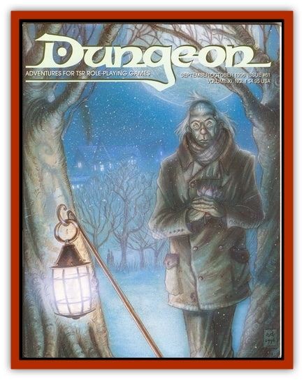

# Treant - Greater

| Statistic | **Treant, Greater** |
| --- | --- |
| **Activity Cycle:** | Any |
| **Alignment:** | Chaotic good |
| **Armor Class:** | -2 |
| **Climate/Terrain:** | Secluded forests |
| **Damage/Attack:** | 6-36 |
| **Diet:** | Photosynthesis |
| **Frequency:** | Rare |
| **Hit Dice:** | 16 |
| **Intelligence:** | Exceptional (15-16) |
| **Magic Resistance:** | 30% |
| **Morale:** | Fanatic (17-18) |
| **Movement:** | 9 |
| **No. Appearing:** | 1 |
| **No. of Attacks:** | 2 |
| **Organization:** | Solitary |
| **Size:** | G (26-36') |
| **Special Attacks:** | See below |
| **Special Defenses:** | Never surprised |
| **THAC0:** | 5 |
| **Treasure:** | Q&times;5,S,T |
| **XP Value:** | 16,000 |

Greater treants are solitary beings found deep within forests far away from civilization. Identical to [[Treant|treants]] in most respects, greater treants are larger and more powerful than their lesser cousins. As sworn protectors of the forests, greater treants can be called upon in times of great need to aid a region's inhabitants. In addition to the language of treant, greater treants can speak most humanoid languages and have the innate ability to communicate with all plants and animals. Some also speak in the secret longue of druids.

**Combat:** Greater treants are most often found (99%) in deep slumbers that may last for more than a century. Anyone with evil intent entering a greater treant's grove (which is usually protected) awakens it in 1-2 rounds. Also, anyone who speaks a greater treant's name while inside its grove will wake it in 1d4 rounds. Aside from their magical abilities, greater treants can attack twice per round using their giant, armlike branches for 6d6 hp damage. Their hardened, barklike skin provides them with a low armor class.

Greater treants have the ability to animate and control normal trees. A greater treant can animate up to 10 normal trees at a time. It takes one round for a tree to be animated. The trees found within a greater treant's forest are unusually large and have superior combat abilities: 14 Hit Dice, two attacks, 5d6 hp damage per attack, and MV 1.

In addition to their magic resistance, greater treants are immune to all charm-related spells. Greater treants have many magical abilities which they employ as a 16th-leuel priest. Once per round a greater treant may use the following spell-like abilities: *detect magic*, *entangle*, *know alignment*, *messenger*, *neutralize poison*, and *plant growth*. In addition, they may also use the following abilities once per day: *animal summoning III*, *call woodland beings*, *charm person or mammal*, *dispel magic*, *reflecting pool*, and *remove curse*.

Greater treants suffer a weakness against fire attacks like normal treants, and magical fires cannot be resisted.

**Habitat/Society:** Greater treants live alone in secluded groves. They are intolerant of evil and any threat to the forests in which they live. If called upon in times of danger, a greater treant does everything in its power to ensure the well-being of its forest. Greater treants have no use for treasure and keep such items buried deep beneath their roots, only to be used for the cause of good.

**Ecology:** Greater treants, like their smaller cousins, obtain sustenance via photosynthesis, The lifespan of greater treants is unknown. It is believed that they are exceptionally ancient beings divinely chosen to stand watch over nature until the end of time. They are assumed to have been around since long before the birth of humankind (some say even before the time of the <a href="/appendix/elf">elves), and no one has ever heard of a greater treant dying of old age.

---
## Discovery & Documentation

**Source Publication:** Dungeon #61 (1997)
**Campaign Setting:** Dungeon Magazine
**Author(s):**
