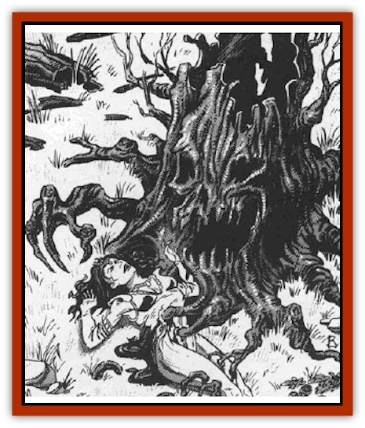

# Treant - Undead

| Statistic | **Treant, Undead** |
| --- | --- |
| **Activity Cycle:** | Night |
| **Alignment:** | Chaotic evil |
| **Armor Class:** | 0 |
| **Climate/Terrain:** | Any forest |
| **Damage/Attack:** | 5d6/5d6 |
| **Diet:** | Blood |
| **Frequency:** | Very rare |
| **Hit Dice:** | 15 |
| **Intelligence:** | High (13-14) |
| **Magic Resistance:** | Nil |
| **Morale:** | Champion (15-16) |
| **Movement:** | 12 |
| **No. Appearing:** | 1-4 |
| **No. of Attacks:** | 2 |
| **Organization:** | Copse |
| **Size:** | H (20' tall) |
| **Special Attacks:** | See below |
| **Special Defenses:** | See below |
| **THAC0:** | 5 |
| **Treasure:** | Nil |
| **XP Value:** | 15,000 |

When an [[Treant_Evil|evil treant]] sees that its many years are soon to come to an end, it seldom accepts this fate quietly. For most, this means a final, wild orgy of violence and death. For a few, however, it means death and resurrection as a thing so dark and evil that even the [[Human_Vistana|Vistani]] will not speak of it.

An undead treant looks much like any other deciduous tree in the winter. It has no leaves and a lusterless, almost brittle, look to its bark. Like living [[Treant|treants]], its face is hidden until it chooses to speak or make its presence known. When a creature of this sort stands amid a grove or copse of similar leafless trees, it is 90% likely to go unnoticed by those passing near.

Undead treants speak the language of evil treants and generally know many (2d4) other tongues. Despite their linguistic skills, however, they seldom converse with the living and seem unable to speak with the animals of the forest around them.

**Combat:** Undead treants lash out with their powerful branches, striking twice per round and inflicting 5d6 points of damage with each succesful blow. On any natural roll of 19 or 20, they are assumed to have knocked their opponent prone and stunned them for 1 round per 5 points (or fraction thereof) of damage inflicted. Thus, a blow delivering 18 points of damage would stun a character for 4 rounds.

If the treant is not otherwise engaged in combat, it will move beside the fallen form and feed upon the blood of the victim. To do this, the treant must remain stationary for 1 round. On the second round, it sprouts 3d4 root-like appendages that snake out and bury themselves in the victim's flesh. These inflict 1 point of damage each and allow the monster to begin feeding on the third round. Starting then, and on each subsequent round, the creature will drain 1d3 points of blood for each root sunk into the victim.

Anyone being drained of blood by the treant is rendered immobile as the coils of roots encircle his body. Individuals so entrapped can only escape the deadly embrace of these vampiric trees with the aid of a third party. In order to end the blood draining, the treant's roots must be cut away. They are treated as armor class 5 and any successful attack will break the tendril. If all of the tendrils are cut, the victim can work his way free in two rounds (one with outside help.) When an undead treant stops feeding, either because it has drained its victim of blood or because all of its tendrils have been severed, it requires a full round to become mobile again. During this time, or whenever it is feeding, all attacks against the creature gain a +2 bonus.

Like other treants, the undead variety are vulnerable to fire. All fire-based attacks gain a +4 bonus on their attack rolls and inflict an extra 2 points per die of damage.

Undead treants are unable to animate other trees, but they are known to employ magic. All undead treants have the spell casting powers of a level 2-6 (2d3) druid. Because of their own vulnerability to flames and fires, however, they will never employ any spells that use any kind of fire. Undead treants require the same verbal and somatic components that other spell casters do, but never need to employ material components unless they are vital to the operation of the spell (a *goodberry*, for example).

Undead treants are immune to spells like *sleep*, *charm*, or *hold*, as are all undead, but also have several other immunities that set them above the rest of the living dead. Holy water, for example, has no effect on them, and they cannot be turned by priests or paladins. They are also untouched by sunlight and cannot be affected by spells like *control undead* or *control plants*.

**Habitat/Society:** Undead treants tend to live in small copses of dead trees with no more than four individuals in any given area. Their foul aura permeates the copse around them, making the woods they inhabit dark and evil places.

It is not uncommon for individual undead treants to still be members the evil treant community they once lived in. When this is the case, the undead treant will be treated with the respect due to a powerful leader and will clearly be in command of the others.

**Ecology:** Undead treants seem to be a natural stage in the life cycle of some evil treants. No doubt this is given as a "reward" for their evil lives by the Dark Powers.

---
## Discovery & Documentation

**Source Publication:** MC10 Ravenloft Appendix I (1989)
**Campaign Setting:** Planescape
**Author(s):** William W. Connors

### Other Creatures Found in This Source Book
   * [[Bastellus|Bastellus]]
   * [[Bat_Ravenloft|Bat (Ravenloft)]]
   * [[Bowlyn|Bowlyn]]
   * [[Broken_One|Broken One]]
   * [[Bussengeist|Bussengeist]]
   * [[Darkling|Darkling]]
   * [[Doom_Guard|Doom Guard]]
   * [[Doppelganger_Plant|Doppelganger Plant]]
   * [[Elemental_Ravenloft|Elemental (Ravenloft)]]
   * [[Ermordenung|Ermordenung]]
   * [[Ghoul_Lord|Ghoul Lord]]
   * [[Goblyn|Goblyn]]
   * [[Golem_III|Golem III]]
   * [[Golem_IV|Golem IV]]
   * [[Golem_Ravenloft|Golem (Ravenloft)]]
   * [[Grim_Reaper|Grim Reaper]]
   * [[Human_Abber_Nomad|Human, Abber Nomad]]
   * [[Human_Ravenloft|Human (Ravenloft)]]
   * [[Imp_Assassin|Imp, Assassin]]
   * [[Impersonator|Impersonator]]
   * [[Lycanthrope_Werebat|Lycanthrope, Werebat]]
   * [[Lycanthrope_Wereraven|Lycanthrope, Wereraven]]
   * [[Mist_Horror|Mist Horror]]
   * [[Mummy_Greater|Mummy, Greater]]
   * [[Quevari|Quevari]]
   * [[Quickwood|Quickwood]]
   * [[Ravenkin|Ravenkin]]
   * [[Reaver|Reaver]]
   * [[Scarecrow_Ravenloft|Scarecrow (Ravenloft)]]
   * [[Shadow_Fiend|Shadow Fiend]]
   * [[Skeleton_Giant|Skeleton, Giant]]
   * [[Strahd's_Skeletal_Steed|Strahd's Skeletal Steed]]
   * [[Treant_Evil|Treant, Evil]]
   * [[Valpurgeist|Valpurgeist]]
   * [[Vampire_Dwarf|Vampire, Dwarf]]
   * [[Vampire_Elf|Vampire, Elf]]
   * [[Vampire_Gnome|Vampire, Gnome]]
   * [[Vampire_Halfling|Vampire, Halfling]]
   * [[Vampire_General_Information|Vampire, General Information]]
   * [[Vampire_Kender|Vampire, Kender]]
   * [[Vampyre|Vampyre]]
   * [[Widow_Red|Widow, Red]]
   * [[Wolfwere_Greater|Wolfwere, Greater]]
   * [[Zombie_Lord|Zombie Lord]]
