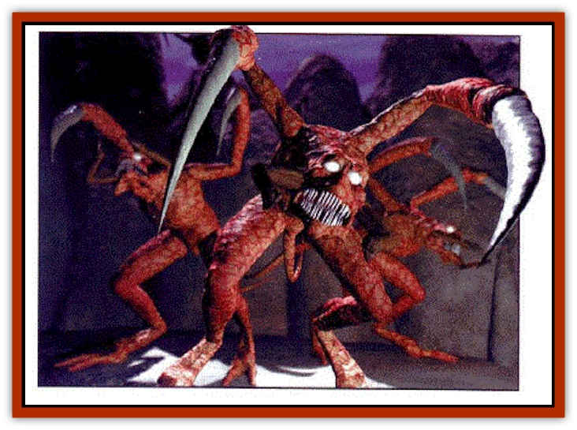

# Trelon

| Statistic | **Trelon** |
| --- | --- |
| **Activity Cycle:** | Nocturnal |
| **Alignment:** | Neutral evil |
| **Armor Class:** | 2 |
| **Climate/Terrain:** | Any shadowy area |
| **Damage/Attack:** | 2- 7/ 2-7 |
| **Diet:** | Mages |
| **Frequency:** | Rare |
| **Hit Dice:** | 3+1 |
| **Intelligence:** | Low(7) |
| **Magic Resistance:** | 35% |
| **Morale:** | Fearless (19-20) |
| **Movement:** | 12 |
| **No. Appearing:** | 1-3/mage |
| **No. of Attacks:** | 2 |
| **Organization:** | Hive |
| **Size:** | L |
| **Special Attacks:** | -3 penalty to opponents' surprise |
| **Special Defenses:** | Immune to illusions, phatasms, and shadow magic |
| **THAC0:** | 17 |
| **Treasure:** | Nil |
| **XP Value:** | 420 |

Trelons originated on one of the Prime worlds and were brought to the Outlands by a sorcerer living on the ninth ring. This sorcerer used them as weapons, transporting them into the Academy of Weavers near Curst, where the trelons murdered the entire schooi of illusionists in their sleep.

Trelons have been described as a "mixture of orange and shadow." They have two long arms that end in curved spikes, two mandibles near the mouth for feeding, and two spindly legs. According to legend, trelons were created to exterminate mages on some long-dead Prime world. True or not, the trelons seem to hate mages and magic in general.

Trelons do not like natural light, and torches or strong lanterns can prevent a trelon from attacking its target. Light sorceries, however, drive them into frenzies, and they attack any opponent using them without hesitation.

**Combat:** A trelon swarm is terrible to behold. When they appear, they mob any nearby creature, tearing through their victims like scythes. Trelons attack with their two armspikes, bisecting a target like a pair of cutting shears. When they have killed a target, the mandibles around their mouth scoop up the remains of the victims. They do not stop to feed until they have killed every non-trelon in sight.

Trelons never "appear" at distances greater than 30 feet from their victim. Until a victim comes within range, the trelons simply don't exist. A target might never even know that he or she is in the middle of a swarm of trelons until they suddenly begin to materialize, imposing a -3 penalty to their prey's surprise roll. Where these creatures come from is unknown, but they seem to appear only in shadowy conditions where there is no natural light. It is not known where they retreat to once they have finished their attack.

No one knows how these creatures hunt. Some believe that the trelons track a creature by its spellcasting, its shadow, its emotions, or its sound. It is known that trelons have the ability to track a victim through almost any spell or magical item designed to cloak the victim. They are drawn to *invisibility*, *dust of disappearance*, *displacements*, and shadow magic. Trelons can sense a target no matter how well they are hidden. It has been observed (under extremely bloody circumstances) that magical cloaking effects seem to drive trelons into a rage, and they prefer to attack any invisible or cloaked target in range.

Trelons are immune to *hold monster*, *protection from evil*, illusions, shadow magic, and mind-influencing spells. They are the bane of illusionists, so much so that a trelon's claw is often a component used in the creation of arrows or other weapons designed to slay illusionists, shadows, or creatures from the Ethereal plane.

**Habitat/Society:** Trelons speak in soft clicks and chittering noises, which rise to a near-deafening screeching when they strike. Their insect nature makes several sages suspect that they may have a hive mentality, but like much that is known about trelons, it is only speculation.

**Ecology:** Trelons seem to combine the worst characteristics of demons and insects. They seem to favor cool, shadowy places. The scent of magic or a wizard causes them to swarm. 

Trelons are valued for their talons, which are long enough to be used as a swordblades. When properly enchanted, they can become fearsome mage-slaying weapons. There have been tales that such weapons prefer to attack mages in combat, sometimes twisting in their owner's grip to stab at a magicuser, no matter the intended target. There are rumors that trelons eventually come to reclaim the piece of their kin taken from them.

---
## Discovery & Documentation

**Source Publication:** Dragon262 (1999)
**Campaign Setting:** Dragon Magazine
**Author(s):** Chris Avellone

### Other Creatures Found in This Source Book
   * [[Grillig|Grillig]]
   * [[Gronk|Gronk]]
   * [[Sohmien|Sohmien]]
