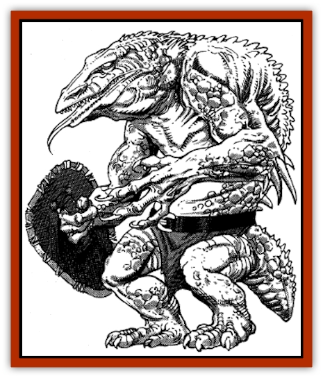

# Tren

| Statistic | **Tren** |
| --- | --- |
| **Activity Cycle:** | Any |
| **Alignment:** | Chaotic evil |
| **Armor Class:** | 4 |
| **Climate/Terrain:** | Damp subterranean |
| **Damage/Attack:** | 1-3/1-3/2-7 or by weapon |
| **Diet:** | Carnivore |
| **Frequency:** | Rare |
| **Hit Dice:** | 3+3 |
| **Intelligence:** | Average (8-10) |
| **Magic Resistance:** | Nil |
| **Morale:** | Elite (14) |
| **Movement:** | 12, Sw 9 |
| **No. Appearing:** | 10-80 |
| **No. of Attacks:** | 3 or 1 |
| **Organization:** | Clan |
| **Size:** | M (6-7' tall) |
| **Special Attacks:** | See below |
| **Special Defenses:** | See below |
| **THAC0:** | 17 |
| **Treasure:** | A,D |
| **XP Value:** | 175 |

Tren are a crossbreed of [[Troglodyte|troglodytes]] with the largest, strongest, vilest members of the [[Lizard_Man|lizard man]] race. They hate all warmblooded creatures, but reserve special animosity for [[Dwarf|dwarves]], who often come into conflict with them over subterranean water supplies.

Tren weigh an average of 220 pounds. Their skin consists of leathery scales, ranging from gray to green to brown in color. The skin of the males is generally spiky, while the females have smoother skin. Tren have only vestigial tails, useful while swimming, but good for little else. Tren wear simple belts and loincloths for clothing. Warriors carry leather shields. If they are without a shield, they are Armor Class 5. Warriors use the most sophisticated weapons they find. Steel short swords are a weapon of choice. Tren have infravision to 60 feet. They speak the languages of both lizard men and trogs, sometimes forming a unique hybrid language.

**Combat:** Tren are organized fighters, using ambushes, traps, and other tactical maneuvers to their advantage. Most tren share the troglodyte appreciation of steel and use whatever steel weapons they can. Those without steel weapons, though, are still formidable in close combat because of their three attacks.

Tren possess a chameleon-like ability to blend in with the background. When motionless against a stable background, tren are 90% invisible. They often attack from this concealment, losing their invisibility but giving opponents a -4 penalty to their saving throw vs. surprise. The tren then enters the melee.

Like their troglodyte ancestors, tren possess the ability to secrete an oil when excited, whose odor is most disgusting to humans, demi-humans, and humanoids. All within 10 feet of a tren secreting this oil must successfully save vs. poison. Those who fail lose 1d6 +1 points of Strength for 10 combat rounds.

**Habitat/Society:** Tren live in loose-knit clans, with each clan led by a chief, usually the biggest, smartest tren. Several sub-chiefs are also present, as well as a few shaman. As with most chaotic societies, leadership is by forceful example.

For every ten tren, there is one sub-chief with 4+4 Hit Dice. For every twenty tren, there is one shaman (cleric) of levels 3, 4, and 5. Each clan is ruled by a tren with 6+6 Hit Dice. Female tren have 2+2 Hit Dice, and won't fight, except to defend their home or young. Fully 40% of each clan are females and young. Young tren have 1+1 Hit Dice, but are noncombatant.

Tren value forged metal, a process they have never mastered. Steel is the preferred alloy, but others will suffice. Tren often mount ambushes on dwarven patrols or on travelers moving through any mountain passes near the tren's lair in order to gain more metal weapons. These will most likely soon be used against any dwarven encampments in the area.

**Ecology:** Tren are pure carnivores and prefer warm-blooded prey. Dwarves and humans are among their favorites, though they eat almost anything they can catch.

---
## Discovery & Documentation

**Source Publication:** MC11 Forgotten Realms Appendix II (1991)
**Campaign Setting:** Advanced Dungeons & Dragons 2nd Edition
**Author(s):** Tim Beach, Tim Brown, William W. Connors, Dale Donovan, Ed Greenwood, Jeff Grubb, Bruce Heard, Slade Henson, Rob King, Colin McComb, Roger E. Moore, Bruce Nesmith, Jon Pickens, Jean Rabe, Dori Watry, Skip Williams

### Other Creatures Found in This Source Book
   * [[Alaghi|Alaghi]]
   * [[Alguduir|Alguduir]]
   * [[Beguiler|Beguiler]]
   * [[Bird_Toril|Bird (Toril)]]
   * [[Cantobele|Cantobele]]
   * [[Carapace|Carapace]]
   * [[Cat_Toril|Cat (Toril)]]
   * [[Chitine|Chitine]]
   * [[Cildabrin|Cildabrin]]
   * [[Dimensional_Warper|Dimensional Warper]]
   * [[Dragon_Deep|Dragon, Deep]]
   * [[Fachan_Toril|Fachan (Toril)]]
   * [[Fael|Fael]]
   * [[Feyr|Feyr]]
   * [[Firetail|Firetail]]
   * [[Frost|Frost]]
   * [[Gaund|Gaund]]
   * [[Gloomwing|Gloomwing]]
   * [[Golden_Ammonite|Golden Ammonite]]
   * [[Golem_Lightning|Golem, Lightning]]
   * [[Hamadryad|Hamadryad]]
   * [[Harrier|Harrier]]
   * [[Harrla|Harrla]]
   * [[Haun|Haun]]
   * [[Haundar|Haundar]]
   * [[Hendar|Hendar]]
   * [[Inquisitor|Inquisitor]]
   * [[Lhiannan_Shee|Lhiannan Shee]]
   * [[Loxo|Loxo]]
   * [[Manni|Manni]]
   * [[Manscorpion|Manscorpion]]
   * [[Mara|Mara]]
   * [[Morin|Morin]]
   * [[Naga_Dark|Naga, Dark]]
   * [[Orpsu|Orpsu]]
   * [[Plant_Carnivorous_Black_Willow|Plant, Carnivorous, Black Willow]]
   * [[Plant_Carnivorous_Toril|Plant, Carnivorous (Toril)]]
   * [[Plant_Dangerous_I|Plant, Dangerous I]]
   * [[Ring-Worm|Ring-Worm]]
   * [[Rohch|Rohch]]
   * [[Sand_Cat|Sand Cat]]
   * [[Saurial|Saurial]]
   * [[Sha'az|Sha'az]]
   * [[Silver_Dog|Silver Dog]]
   * [[Simpathetic|Simpathetic]]
   * [[Skuz|Skuz]]
   * [[Spider_Monkey|Spider, Monkey]]
