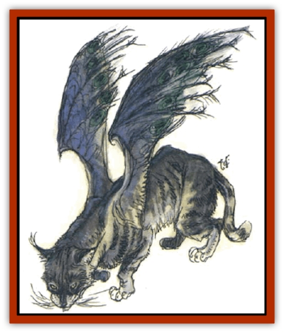
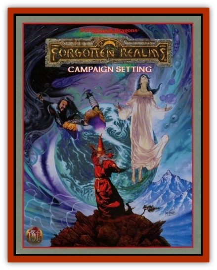

# Tressym

| Statistic | **Tressym** |
| --- | --- |
| **Activity Cycle:** | Any |
| **Alignment:** | Chaotic neutral |
| **Armor Class:** | 6 |
| **Climate/Terrain:** | Any temperate land |
| **Damage/Attack:** | 1-2/1-2/1-4 |
| **Diet:** | Carnivore |
| **Frequency:** | Very rare |
| **Hit Dice:** | 2 |
| **Intelligence:** | Very (11-12) |
| **Magic Resistance:** | 40% |
| **Morale:** | Elite (14) |
| **Movement:** | 6, Fl 16 (A) |
| **No. Appearing:** | 1 (1-4) |
| **No. of Attacks:** | 3 |
| **Organization:** | Solitary |
| **Size:** | T (2' long, 3' wingspan) |
| **Special Attacks:** | Nil |
| **Special Defenses:** | Immune to poison |
| **THAC0:** | 17 |
| **Treasure:** | Nil |
| **XP Value:** | 270 |

Tressym are beautiful, fluffy, [[Cat_Winged|winged cats]], closely related to the small, feral [[Cat_Small|cats]] native to the woodlands of the Heartlands of the Realms - the cats domesticated by many in the Dales, Sembia, Cormyr, the Moonsea cities, and the Sword Coast. Tressym vary in the hues and fur-lengths of their coats as much as normal (wingless) cats do. Most resemble a short-haired gray, tabby, or black cat, with two batlike wings at their well-muscled shoulders.

Tressym wings have feathers. The leathery membranous wings are divided into arc-segments by hollow bones, rather like the elongated fingers of a bat divide up its wings, but the leathery membrane is covered in feathers.

**Combat:** Tressym stalk and pounce on prey, scratching and biting much as normal cats do, but with the added ability of flight, which makes them far more deadly to birds (and insects) of all sorts. They do not, however, seem to attack nestlings or despoil eggs. In battle, they are cunning - scratching at the eyes of opponents, for example, and learning danger quickly, so that a tressym that sees a wand fired by a wizard knows about the danger of sticks of wood held by humans for the rest of its life.

In addition to their 120' infravision, tressym can detect invisible objects and creatures up to 90 feet away. Tressym can also detect poison; through scent, taste, or touch, they recognize substances that are deadly to the intelligent races of the Realms. Tressym themselves seem to be immune to all known forms of poison.

**Habitat/Society:** Tressym are found on occasion in Eveningstar's streets and trees. Northern Cormyr is the only place where they seem to breed and gather, although individual tressym, both wild and domesticated, may be found all over the temperate Realms.

Villagers in Eveningstar feed tressym and try to prevent the worst of their vandalism and aerial catfights. At the same time, they try to prevent any large-scale or magically-assisted trapping and capturing of them. The locals value tressym for their owl-like rodent control in the fields. Most of the flying cats lair in nearby Starwater Gorge and hunt the farm fields night and day, avoiding local cats and dogs rather than fighting or tormenting them.

**Ecology:** These cute, mischievous little terrors are semiwild and thought to be the result of some long-past wizardly experimentation. They are known to live 20 years or more if they do not meet with misadventure, and are free to take shelter from, or fly away from, the worst winter weather. Tressym mate as often as normal cats and do not mate for life. They sometimes mate with normal cats, with whom they are fertile, but only 10% of such young will be tressym; the rest will be wingless. Tressym are quite intelligent and have been known to form strong friendships (and hatreds) with creatures of other races, such as humans and [[Elf|elves]]. Tressym have even been known to sacrifice themselves for those they love.

A few mages have sought these creatures as familiars. At least two wizards of Eveningstar (Lord Tessaril and Maea Dulgussir, who still conceals her magical skills from locals and visitors alike) have done so successfully. As familiars, tressym combine the sensory advantages of a cat and an owl, and have additional benefits: they are intelligent enough to carry and manipulate complex and delicate items (to an extent - they don't have opposable thumbs); they can observe and report events diligently; they can concentrate on a task at hand even when hormones or instincts provide strong distractions; and they can communicate to their masters the identifications of poisons - even harmful gases not intended as an attack. Tressym cannot confer or transmit any immunities against poison to another creature. They are not strong enough to fly with even a halfling aloft. They can fly hard enough to slow a halfling's fall to a 2d4 damage affair in descents of 90' or more, but can't lessen the damage suffered by any larger or heavier creature.

Tressym tend to get along with others of their kind when they meet, but they rarely lair or hunt together. They also peacefully ignore bats, griffons, and the like, but are the deadly foes of stirges and manticores (against whom they will gather with other tressym to fight). Some tressym enjoy teasing [[Dog|dogs]], but usually not to the point where either animal could be truly endangered.

---
## Discovery & Documentation

**Source Publication:** Forgotten Realms Campaign Setting, Revised Edition (1993)
**Campaign Setting:** Forgotten Realms
**Author(s):** Jeff Grubb, Ed Greenwood, Julia Martin

### Other Creatures Found in This Source Book
   * [[Aballin|Aballin]]
   * [[Baneguard|Baneguard]]
   * [[Bat_Bonebat|Bat, Bonebat]]
   * [[Deepspawn|Deepspawn]]
   * [[Dracolich|Dracolich]]
   * [[Gambado|Gambado]]
   * [[Gibberling|Gibberling]]
   * [[Gibbering_Mouther|Gibbering Mouther]]
   * [[Helmed_Horror|Helmed Horror]]
   * [[Lock_Lurker|Lock Lurker]]
   * [[Naga_Dark|Naga, Dark]]
   * [[Nishruu|Nishruu]]
   * [[Quaggoth|Quaggoth]]
   * [[Skum|Skum]]
