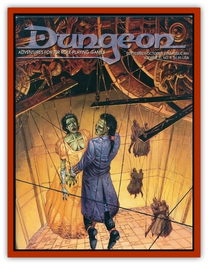

# Tribute Gatherer

| Statistic | **Tribute Gatherer** |
| --- | --- |
| **Activity Cycle:** | Any |
| **Alignment:** | Chaotic evil |
| **Armor Class:** | 0 |
| **Climate/Terrain:** | The Abyss (Umberlee's Lair); Ocean (Prime Material Plane) |
| **Damage/Attack:** | 1-6 (+6) &times;4 |
| **Diet:** | Carnivore |
| **Frequency:** | Very rare |
| **Hit Dice:** | 10 |
| **Intelligence:** | Exceptional (15-16) |
| **Magic Resistance:** | 20% |
| **Morale:** | Fanatic (17-18) |
| **Movement:** | 9, swim 36 |
| **No. Appearing:** | 1 |
| **No. of Attacks:** | 4+Special |
| **Organization:** | Solitary |
| **Size:** | L (10' tall) |
| **Special Attacks:** | Ink spray, bite, telekinesis |
| **Special Defenses:** | +2 or better weapon to hit |
| **THAC0:** | 11 |
| **Treasure:** | F |
| **XP Value:** | 8,000 |

Tribute gatherers resemble large gray octopi at first glance. They have two 6' long arms ending in hands with sharp claws as well as two 12' tentacles, much like those of an octopus. Its bulbous body has large flaps on the underside that extend outward and are used for propulsion (like a manta ray). They are also strong enough for the monster to prop itself up on dry land. In the middle of its underside is a secret pouch where the tribute gatherer stores treasure that it collects from the various temples of Umberlee and distributes it to those involved in plots meeting her favor.

**Combat:** In combat, the tribute gatherer uses its two taloned hands to attack for 1d8 hp damage. If both hands hit, the target is pulled into the tribute gatherer's gaping maw, where it suffers 5d6 hp damage. Each tentacle inflicts 1d12 hp damage and a roll of 17 or better means that the victim is wrapped up and suffers 1d12 hp squeezing damage each round thereafter (Bend Bars roll to escape).

In addition to its multiple melee attacks, the tribute gatherer can use its telekinesis ability, which throws an object (or person) of 500 lbs or less 30' away. This ability can be used every other round.

If in danger, this monster can spew out a black, caustic ink that causes 2dl2 hp acid damage (save vs. breath weapon for half damage) which covers this once every three rounds. Tribute gatherers have a 20% resistance to magic and can only be hit by +2 or better weapons.

**Ecology:** These horrid creatures dwell primarily in the Abyss on Umberlee's layer. A select few are sent by Umberlee to Toril where they prowl the oceans and travel to her temples. There they collect treasure that is used to start new shrines and temples to Umberlee. They are known to be carnivorous, and there is no ocean creature that will even approach a tribute gatherer, save for a fish that has been summoned by a priest of Umberlee to deliver a message to the gatherer. The priest opens the mouth of the fish, speaks the message, and the fish swims to the closest tribute gatherer. When it arrives, the fish opens its mouth, and the tribute gatherer receivees the message (typically a summons to collect treasure or for help). After the message is complete, the monster eats the messenger.

---
## Discovery & Documentation

**Source Publication:** Dungeon #64 (1997)
**Campaign Setting:** Dungeon Magazine
**Author(s):**
