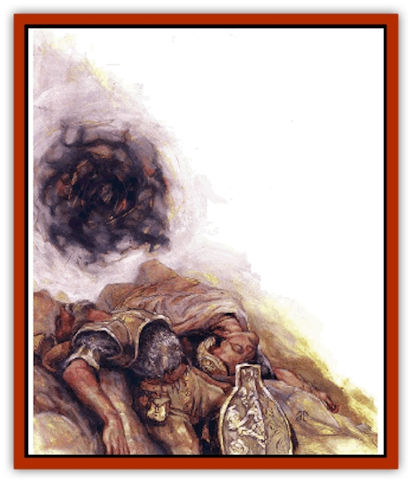

# Trilloch

| Statistic | **Trilloch** |
| --- | --- |
| **Activity Cycle:** | Any |
| **Alignment:** | Neutral |
| **Armor Class:** | n/a |
| **Climate/Terrain:** | Negative Energy Plane (any) |
| **Damage/Attack:** | n/a |
| **Diet:** | Waning life force |
| **Frequency:** | Very rare |
| **Hit Dice:** | n/a |
| **Intelligence:** | Animal (1) |
| **Magic Resistance:** | Nil |
| **Morale:** | Unsteady (5-7) |
| **Movement:** | 12 |
| **No. Appearing:** | 1 |
| **No. of Attacks:** | n/a |
| **Organization:** | Solitary |
| **Size:** | S-M (2-6' diameter) |
| **Special Attacks:** | Induce violence, aid attacks |
| **Special Defenses:** | Invisibility, immunities |
| **THAC0:** | n/a |
| **Treasure:** | Nil |
| **XP Value:** | 650 |

The trilloch is an extraordinarily uncommon creature that originally hails from the Negative Energy Plane but is encountered only as it wanders other planes. However, most folks wouldn't notice it, as the monster is invisible and almost imperceptible. Only a *detect magic* spell cast within 60 feet of a trilloch reveals its unique aura - a pulsating ripple of negative every with no fixed size, shape, or even color.

**Combat:** A trilloch isn't so much an opponent as it is a force. The thing can't make physical attacks against a foe, nor can it be physically harmed by an attacker. Its focused essence is an energy mass from 2 to 6 feet in diameter, but its actual presence occupies a 60-foot-diameter sphere. The trilloch can feed only from sources that fall within this zone. And as it consumes the life force of the dying, it must either find an expiring creature or cause one to die. Thus, unable to harm anything directly, the beast tries to influence events to bring about death.

First of all, the trilloch amplifies the deadly potential of all combat that occurs within its 60-foot sphere of influence. All attack and damage rolls receive a +1 bonus, and morale checks are made with a +3 bonus - in the presence of a trilloch, creatures are more likely to fight to the death.

Second, the trilloch encourages violence. Beings of animal (1) or nonratable (0) Intelligence that're within 60' of the pulsating creature begin attacking whatever is near. Smarter sods can make a saving throw versus spell to resist the effect, but if they fail the roll, they automatically spend the next 1d6 rounds attacking anything they perceive to be an enemy. If they can find no "enemies", they simply attack anyone nearby for 1d4 rounds. Their target must fall within the 60-foot area of influence around the trilloch.

'Course, even after the violent compulsion fades away, some barks might continue fighting on their own - which is what the unseen trilloch counts on. But the combatants don't need to keep making saving throws, even if they remain within the 60-foot zone. The rolls are needed only upon initial contact with the negative-energy monster. However, if a sod runs into another trilloch after 24 hours have passed, he must make a new saving throw in order to resist its power.

As noted above, a *detect magic* spell is the only means of discovering the presence of a trilloch, and only if cast within 60' of the creature's central essence - which means that the spellslinger must be within the trilloch's sphere of influence. The monster can be "fought" in two ways: *dispel magic* drives it off, and an appropriate *banishment* (or singular spell) sends it back to its home plane.

**Habitat/Society:** Though utterly solitary in its existence, the trilloch often attaches itself to another creature - without the creature ever even realizing it. This "host" is usually a powerful beast or something capable of dealing death efficiently and regularly. The invisible trilloch follows it around and feeds upon the dwindling life force of its victims. If the beast itself passes into the dead-book, the negative-energy being moves on, often following the slayer (if any) of the original host.

A body should note that the trilloch has only animal Intelligence and is not malicious. It doesn't delight in causing pain - fact is, it derives nothing from a creature's suffering. Even if a being dies without any pain, the trilloch can still consume the waning life force. Simply put, it feeds on other creatures just as any predator might, even though its methods are a little different. Nonetheless, most folks have a difficult time not looking upon the trilloch as an evil beast.

**Ecology:** The trilloch is defined by what it feeds upon. It's more specialized than other creatures of the Negative Energy Plane in that it eats the life energy of beings that're already dying. In other words, unlike some natives of the dark plane, trillochs don't drain life force on their own. They merely use their powers to bring about the death of others in order to feed.

The trilloch's victims don't need to be extremely intelligent creatures, but only higher organisms provide enough life energy to sustain the invisible predator. Microorganisms, normal insects, tiny worms, and the like aren't enough, but pretty much everything else fits the bill.

---
## Discovery & Documentation

**Source Publication:** Planescape III (1996)
**Campaign Setting:** Planescape
**Author(s):** Monte Cook

### Other Creatures Found in This Source Book
   * [[Animental|Animental]]
   * [[Archomental_Evil|Archomental, Evil]]
   * [[Archomental_Good|Archomental, Good]]
   * [[Belker|Belker]]
   * [[Bzastra|Bzastra]]
   * [[Chososion|Chososion]]
   * [[Darklight|Darklight]]
   * [[Devete|Devete]]
   * [[Devourer_Planescape|Devourer (Planescape)]]
   * [[Dharum_Suhn|Dharum Suhn]]
   * [[Egarus|Egarus]]
   * [[Elemental_Athas_Lesser_Air_Earth|Elemental (Athas), Lesser, Air/Earth]]
   * [[Elemental_Athas_Lesser_Fire_Water|Elemental (Athas), Lesser, Fire/Water]]
   * [[Elemental_Fire_Kin_Salamander_II|Elemental, Fire Kin, Salamander II]]
   * [[Entrope|Entrope]]
   * [[Facet|Facet]]
   * [[Frost_Salamander|Frost Salamander]]
   * [[Fundamental_Air_Earth|Fundamental, Air/Earth]]
   * [[Fundamental_Fire_Water|Fundamental, Fire/Water]]
   * [[Fundamental_All_Elements|Fundamental, All Elements]]
   * [[Garmorm|Garmorm]]
   * [[Homunculus_Elemental|Homunculus, Elemental]]
   * [[Immoth|Immoth]]
   * [[Khargra|Khargra]]
   * [[Klyndes|Klyndes]]
   * [[Magran|Magran]]
   * [[Menglis|Menglis]]
   * [[Nathri|Nathri]]
   * [[Ooze_Sprite|Ooze Sprite]]
   * [[Paraelemental|Paraelemental]]
   * [[Phirblas|Phirblas]]
   * [[Psurlon|Psurlon]]
   * [[Quasielemental_Negative|Quasielemental, Negative]]
   * [[Quasielemental_Positive|Quasielemental, Positive]]
   * [[Rast|Rast]]
   * [[Ravid|Ravid]]
   * [[Ruvoka|Ruvoka]]
   * [[Scile|Scile]]
   * [[Shad|Shad]]
   * [[Shocker|Shocker]]
   * [[Sislan|Sislan]]
   * [[Suisseen|Suisseen]]
   * [[Terithran|Terithran]]
   * [[Thoqqua|Thoqqua]]
   * [[Tsnng|Tsnng]]
   * [[Ungulosin|Ungulosin]]
   * [[Vacuous|Vacuous]]
   * [[Wavefire|Wavefire]]
   * [[Xag-Ya_Xeg-Yi|Xag-Ya/Xeg-Yi]]
   * [[Xill|Xill]]
