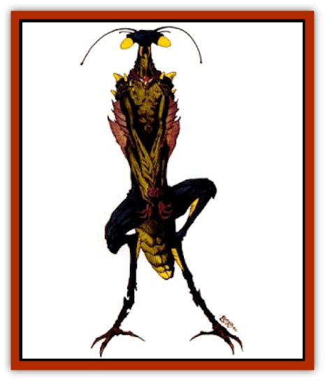

# Trin

| Statistic | **Trin** |
| --- | --- |
| **Activity Cycle:** | Constant |
| **Alignment:** | Chaotic neutral |
| **Armor Class:** | 5 |
| **Climate/Terrain:** | Any land |
| **Damage/Attack:** | 3d6/3d6 |
| **Diet:** | Carnivore |
| **Frequency:** | Uncommon |
| **Hit Dice:** | 8+3 |
| **Intelligence:** | Low (5-7) |
| **Magic Resistance:** | Nil |
| **Morale:** | Elite (13-14) |
| **Movement:** | 21 |
| **No. Appearing:** | 2d12 |
| **No. of Attacks:** | 2 |
| **Organization:** | Clutch |
| **Size:** | L (9' long) |
| **Special Attacks:** | Hold opponents and bite for 1d6+1 damage plus paralysis; leap; surprise bonus |
| **Special Defenses:** | Missile dodge, permanent mind blank |
| **THAC0:** | 13 |
| **Treasure:** | Nil |
| **XP Value:** | 6,000 |

Trin, also called thri-trin, are large, intelligent insects similar to [[Thri-kreen|thri-kreen]], but slightly smaller. They have two arms and four legs instead of four arms and two legs, and their larger mandibles suggest the brutish and primitive. Like To'ksa thri-kreen, trin have a solid shell over the abdomen, a longer neck, and long antennae. Their arms terminate in large, vicious, hinged claws. Sandy-yellow exoskeletons with gray mottling allows them to blend into their surroundings somewhat.

These primitives roam the countryside attacking any animal that comes close, including thri-kreen, [[Tohr-kreen_I|tohr-kreen]], and other trin. Their claws prevent them from using tools or weapons. Their language is rudimentary; they speak only the most basic level of the thri-kreen language. Thri-trin communicate partly by pheromones; a trin clutch has an ability akin to a "group-mind" and is able to coordinate attacks even without verbal communication.

**Combat:** Like thri-kreen, trin never sleep, are unaffected by *charm person* and *hold person* spells, and are protected by their chitinous exoskeletons (AC5). Thri-trin are perpetual hunters, always searching for prey.

Trin hunt in one of two ways: by lying in wait for prey and then leaping on it, or by running after it until the prey tires. A thri-trin can remain perfectly still; this, combined with the creature's natural camouflage, gives opponents a -2 penalty to surprise rolls when attacked in this way. In pursuit, trin are faster than most other Athasian creatures (including thri-kreen) A thri-trin that runs after prey attempts to leap onto it.

Whether leaping from a running start or the perfectly still ambush, a trin receives standard charging bonuses (-2 on initiative, +2 on the attack roll, +1 penalty to AC) for the leap. A thri-trin can leap 50 feet forward or 20 feet straight up and cannot leap backwards. Some might chase prey into an area where other trin lie in wait, or all might chase prey and alternate attacks. If there is not enough prey to go around, several thri-trin will attack each individual opponent.

If a trin hits with both claws, it holds the opponent. The victim can try once each round to break the thri-trin's hold. This requires a successful bend bars roll; the hold is also broken if the trin dies. If the victim fails to break the trin's hold, the creature's claws automatically clamp down, causing 3d6 hit points of additional damage.

A trin will bite at a held opponent, receiving a +4 bonus to the attack roll. If the thri-trin is attacked by others while holding and biting, the trin may attempt to carry the victim to a safer place for dining. A thri-trin can carry off a creature weighing 535 pounds or less.

Like thri-kreen, thri-trin can dodge missiles, but need a roll of 11 or better on 1d20 for success. Thri-trin have the Telepathic devotion mind blank but are not known to have any other psionic powers.

**Habitat/Society:** Trin have no real society, living the life of primitive, nomadic hunters. They mate at will, with eggs being laid about 30 days later and hatching in another 60 days or so. Only about half of the thri-trin eggs laid hatch; others are eaten by predators, including other thri-trin. Young reach maturity in about a year.

**Ecology:** Trin are supreme hunters in their home territories, generally falling only to intelligent or extremely powerful opponents. They eat all forms of animal life. They are to thri-kreen what cavemen (neanderthals) are to humans.

Some thri-trin are found in forest regions. These are slightly smaller than the desert variety and are a mottled green color.

---
## Discovery & Documentation

**Source Publication:** Dark Sun Appendix II - Terrors Beyond Tyr (1991)
**Campaign Setting:** Dark Sun
**Author(s):** Jim Atkiss, Steve Brown, Timothy B. Brown, Andrew P. Morris, Bruce Nesmith, Wes Nicholson, Bill Slavicsek

### Other Creatures Found in This Source Book
   * [[Aarakocra_Athas|Aarakocra (Athas)]]
   * [[Animal_Domestic_Athas_II|Animal, Domestic (Athas) II]]
   * [[Aviarag|Aviarag]]
   * [[Baazrag|Baazrag]]
   * [[Baazrag_Boneclaw|Baazrag, Boneclaw]]
   * [[Bloodgrass|Bloodgrass]]
   * [[Cactus_Hunting|Cactus, Hunting]]
   * [[Cactus_Rock|Cactus, Rock]]
   * [[Cilops|Cilops]]
   * [[Crodlu|Crodlu]]
   * [[Dagorran|Dagorran]]
   * [[Dhaot|Dhaot]]
   * [[Drake_Lesser_Athas_General_Information|Drake, Lesser (Athas), General Information]]
   * [[Drake_Lesser_Athas_Magma|Drake, Lesser (Athas), Magma]]
   * [[Drake_Lesser_Athas_Rain|Drake, Lesser (Athas), Rain]]
   * [[Drake_Lesser_Athas_Silt|Drake, Lesser (Athas), Silt]]
   * [[Drake_Lesser_Athas_Sun|Drake, Lesser (Athas), Sun]]
   * [[Dray|Dray]]
   * [[Drik|Drik]]
   * [[Dune_Reaper|Dune Reaper]]
   * [[Dwarf_Athas|Dwarf (Athas)]]
   * [[Elemental_Beast_Athas_Air|Elemental Beast (Athas), Air]]
   * [[Elemental_Beast_Athas_Earth|Elemental Beast (Athas), Earth]]
   * [[Elemental_Beast_Athas_Fire|Elemental Beast (Athas), Fire]]
   * [[Elemental_Beast_Athas_Water|Elemental Beast (Athas), Water]]
   * [[Elf_Athas|Elf (Athas)]]
   * [[Fael|Fael]]
   * [[Feylaar|Feylaar]]
   * [[Fordorran|Fordorran]]
   * [[Giant_Half-giant|Giant, Half-giant]]
   * [[Giant_Shadow|Giant, Shadow]]
   * [[Golem_Athas_Magma|Golem (Athas), Magma]]
   * [[Golem_Athas_Salt|Golem (Athas), Salt]]
   * [[Golem_Athas_General_Information|Golem (Athas), General Information]]
   * [[Gorak|Gorak]]
   * [[Halfling_Athas|Halfling (Athas)]]
   * [[Human_Athas|Human (Athas)]]
   * [[Jhakar|Jhakar]]
   * [[Kaisharga|Kaisharga]]
   * [[Kes'trekel|Kes'trekel]]
   * [[Klar|Klar]]
   * [[Krag|Krag]]
   * [[Kragling|Kragling]]
   * [[Lirr|Lirr]]
   * [[Mastyrial|Mastyrial]]
   * [[Meorty|Meorty]]
   * [[Mul|Mul]]
   * [[Nikaal|Nikaal]]
   * [[Paraelemental_Beast_General_Information|Paraelemental Beast, General Information]]
   * [[Paraelemental_Beast_Magma|Paraelemental Beast, Magma]]
   * [[Paraelemental_Beast_Rain|Paraelemental Beast, Rain]]
   * [[Paraelemental_Beast_Silt|Paraelemental Beast, Silt]]
   * [[Paraelemental_Beast_Sun|Paraelemental Beast, Sun]]
   * [[Pakubrazi|Pakubrazi]]
   * [[Psionocus|Psionocus]]
   * [[Psurlon|Psurlon]]
   * [[Raaig|Raaig]]
   * [[Retriever_Obsidian|Retriever, Obsidian]]
   * [[Ruktoi|Ruktoi]]
   * [[Ruvoka_Athas|Ruvoka (Athas)]]
   * [[Sand_Howler|Sand Howler]]
   * [[Scorpion_Athas|Scorpion (Athas)]]
   * [[Seed_Brain|Seed, Brain]]
   * [[Silt_Horror_Black|Silt Horror, Black]]
   * [[Silt_Horror_Magma|Silt Horror, Magma]]
   * [[Silt_Horror_Red|Silt Horror, Red]]
   * [[Silt_Spawn|Silt Spawn]]
   * [[Slig|Slig]]
   * [[Spider_Athas|Spider (Athas)]]
   * [[Spinewyrm|Spinewyrm]]
   * [[Ssurran|Ssurran]]
   * [[Stalking_Horror|Stalking Horror]]
   * [[Tarek|Tarek]]
   * [[Tari|Tari]]
   * [[Thri-kreen|Thri-kreen]]
   * [[T'liz|T'liz]]
   * [[Tohr-kreen_II|Tohr-kreen II]]
   * [[Tohr-kreen_III|Tohr-kreen III]]
   * [[Tul'k|Tul'k]]
   * [[Undead_Athas_General_Information|Undead (Athas), General Information]]
   * [[Wraith_Athas|Wraith (Athas)]]
   * [[Xerichou|Xerichou]]
   * [[Zombie_Thinking|Zombie, Thinking]]
