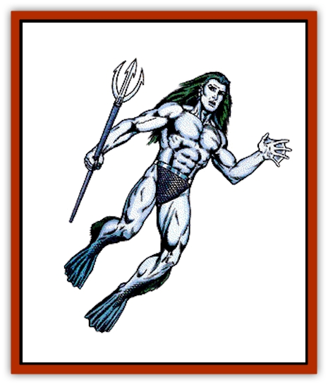

# Triton

| Statistic | **Triton** |
| --- | --- |
| **Activity Cycle:** | Day |
| **Alignment:** | Neutral (good) |
| **Armor Class:** | 5 |
| **Climate/Terrain:** | Any sea |
| **Damage/Attack:** | By weapon |
| **Diet:** | Omnivore |
| **Frequency:** | Rare |
| **Hit Dice:** | 3 |
| **Intelligence:** | High and up (13+) |
| **Magic Resistance:** | 90% |
| **Morale:** | Elite (13) |
| **Movement:** | Sw 15 |
| **No. Appearing:** | 6-60 |
| **No. of Attacks:** | 1 |
| **Organization:** | Community |
| **Size:** | M (7' tall) |
| **Special Attacks:** | See below |
| **Special Defenses:** | See below |
| **THAC0:** | 17 |
| **Treasure:** | M,Q (C,S,T) |
| **XP Value:** | Normal: 270 / Exceptional (4-6 HD): 650 / Exceptional (7-8 HD): 2,000 / Mage: 2,000 +1,000 per level over 7th / Priest: 2,000 +1,000 per level over 7th / Triton leader: 4,000 |

Tritons are rumored to be creatures from the elemental plane of Water that have been placed on the Prime Material plane for some purpose unknown to man. They are sea dwellers, inhabiting warmer waters principally but equally able to live at shallow or great depths.

The lower half of a triton ends in two finned legs, while its torso, head, and arms are handsomely human. Tritons have a silvery skin that fades into silver-blue scales on the lower half of their bodies. Their hair is deep blue or blue-green. Triton speak their own language as well as those of [[Elf_Aquatic|sea elves]] and [[Locathah|locathah]].

**Combat:** Tritons carry either tridents (60%) or long spears (40%). Some 25% are also armed with heavy crossbows. When equipped for battle, tritons wear armor made of scales (AC 4).

Outside their lair, tritons are 90% likely to be mounted, either on [[Hippocampus|hippocampi]] (65%) or [[Sea_Horse_Giant|giant sea horses]] (35%). These mounts fight in defense of their riders.

Exceptional tritons (see below) and triton leaders always carry conch shells with them. Not magical, their sounds are well known to all marine creatures. When blown properly by an exceptional triton, a conch summons 5d4 hippocampi, 1d10 [[Sea_Lion|sea lions]], or 5d6 giant sea horses. These creatures swim to the aid of the summoning triton, arriving 1d6 rounds after the conch is first sounded. The conchs can also be sounded to frighten aquatic animals as the *fear* spell. This latter noise causes all marine creatures within 60 feet and with animal Intelligence or less to flee in panic. Creatures are allowed a saving throw vs. spell to avoid the fear effect, but even those who succeed with their saving throws have a -5 modifier on their attack rolls against the tritons.

Triton are reclusive and nonviolent. They normally attack to capture. If a triton is killed in a battle, however, the fight immediately becomes one of retribution. Should the fighting go poorly, the tritons withdraw to their lair to either gather reinforcements or make a last stand.

In addition to their other abilities, tritons are nearly impervious to magic with a natural magic resistance of 90%.

**Habitat/Society:** Tritons live either in great undersea castles (80% chance) or in finely sculpted caverns (20%). While tritons lean toward good alignment, they are very suspicious of outsiders and have no love for land dwellers in general.

Tritons rarely kill, unless provoked, but they are quick to apprehend those who intrude upon their seas. Trespassers found guilty of intentionally entering triton waters or treasure seeking are left "to the fate of the seas". This means being stripped of all belongings and set adrift at least 10 miles from any shoreline. Characters ruled innocent by the triton court awaken the next day on some distant shore. Tritons never aid land dwellers unless their own interests are involved in the matter.

For every 10 tritons encountered there is an exceptional triton of 4-6 Hit Dice. For every 20 encountered there is an exceptional triton with 7-8 Hit Dice. Groups of 50 or more are always accompanied by a triton leader (AC 2, 9 Hit Dice). There is a 10% chance for every 10 tritons encountered that they are accompanied by a triton mage of 1d6 levels.

At a triton lair, the following additional tritons are always found:

<ul><li>60 males (with related exceptional tritons)</li><li>One mage of 7th- to 10th-level ability</li><li>One priest of 8th- to 11th-level ability</li><li>Four priests of 2nd- to 5th-level ability</li><li>Female tritons equal to 100% of males (2 HD, AC 6)</li><li>Young equal to 100% of males (noncombatants)</li></ul>There is also a 75% chance that the lair contains 2d6 sea lions as pets/guards.

**Ecology:** Tritons are omnivorous and live on fish, shellfish, and sea weed. They have no natural enemies save the [[Squid_Giant|giant squid]], which is immune to the effects of their conch shells. Normal triton live approximately 300 years while their leaders and spellcasters have life expectancies of 500 years or more.

---
## Discovery & Documentation

**Source Publication:** MC2 Volume II (1993)
**Campaign Setting:** Advanced Dungeons & Dragons 2nd Edition
**Author(s):** Jay Batista, Scott Bennie, Grant Boucher, William W. Connors, Steve Gilbert, Heike Kubasch, James Lowder, David Edward Martin, Bruce Nesmith, Jean Rabe, Rick Swan, John J. Terra, Gary L. Thomas

### Other Creatures Found in This Source Book
   * [[Ant|Ant]]
   * [[Ant_Lion_Giant|Ant Lion, Giant]]
   * [[Ape_Carnivorous|Ape, Carnivorous]]
   * [[Baboon|Baboon]]
   * [[Badger|Badger]]
   * [[Barracuda|Barracuda]]
   * [[Beetle_Giant|Beetle, Giant]]
   * [[Bulette|Bulette]]
   * [[Bullywug|Bullywug]]
   * [[Dwarf_Duergar|Dwarf, Duergar]]
   * [[Dwarf_Gully|Dwarf, Gully]]
   * [[Eagle|Eagle]]
   * [[Eel|Eel]]
   * [[Elemental_Air_Kin|Elemental, Air Kin]]
   * [[Elemental_Water_Kin|Elemental, Water Kin]]
   * [[Elemental_Water_Kin_Water_Weird|Elemental, Water Kin, Water Weird]]
   * [[Firestar|Firestar]]
   * [[Firetail|Firetail]]
   * [[Fish_Giant|Fish, Giant]]
   * [[Frog|Frog]]
   * [[Gorgon|Gorgon]]
   * [[Hawk|Hawk]]
   * [[Heucuva|Heucuva]]
   * [[Hippocampus|Hippocampus]]
   * [[Hippogriff|Hippogriff]]
   * [[Kelpie|Kelpie]]
   * [[Kenku|Kenku]]
   * [[Killmoulis|Killmoulis]]
   * [[Kuo-Toa|Kuo-Toa]]
   * [[Lamia|Lamia]]
   * [[Lammasu|Lammasu]]
   * [[Lamprey|Lamprey]]
   * [[Leech|Leech]]
   * [[Leprechaun|Leprechaun]]
   * [[Leucrotta|Leucrotta]]
   * [[Locathah|Locathah]]
   * [[Lycanthrope_Wereboar|Lycanthrope, Wereboar]]
   * [[Lycanthrope_Werefox|Lycanthrope, Werefox]]
   * [[Mammal_Minimal|Mammal, Minimal]]
   * [[Mammal_Small|Mammal, Small]]
   * [[Mimic|Mimic]]
   * [[Morkoth|Morkoth]]
   * [[Muckdweller|Muckdweller]]
   * [[Myconid|Myconid]]
   * [[Naga|Naga]]
   * [[Obliviax|Obliviax]]
   * [[Octopus_Giant|Octopus, Giant]]
   * [[Otyugh|Otyugh]]
   * [[Piranha|Piranha]]
   * [[Plant_Dangerous_I|Plant, Dangerous I]]
   * [[Plant_Intelligent|Plant, Intelligent]]
   * [[Poltergeist|Poltergeist]]
   * [[Porcupine|Porcupine]]
   * [[Rat_Osquip|Rat, Osquip]]
   * [[Roc|Roc]]
   * [[Roper|Roper]]
   * [[Rot_Grub|Rot Grub]]
   * [[Rust_Monster|Rust Monster]]
   * [[Sahuagin|Sahuagin]]
   * [[Sea_Lion|Sea Lion]]
   * [[Sea_Horse_Giant|Sea Horse, Giant]]
   * [[Shambling_Mound|Shambling Mound]]
   * [[Shark|Shark]]
   * [[Sphinx|Sphinx]]
   * [[Squid_Giant|Squid, Giant]]
   * [[Stirge|Stirge]]
   * [[Swanmay|Swanmay]]
   * [[Tarrasque|Tarrasque]]
   * [[Tasloi|Tasloi]]
   * [[Troglodyte|Troglodyte]]
   * [[Urchin|Urchin]]
   * [[Urd|Urd]]
   * [[Weasel|Weasel]]
   * [[Wolverine|Wolverine]]
   * [[Yellow_Musk_Creeper|Yellow Musk Creeper]]
