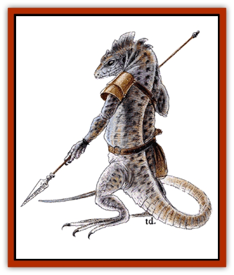

# Troglodyte

| Statistic | **Troglodyte** |
| --- | --- |
| **Activity Cycle:** | Any |
| **Alignment:** | Chaotic evil |
| **Armor Class:** | 5 |
| **Climate/Terrain:** | Subterranean and mountains |
| **Damage/Attack:** | 1-2/1-2/2-5 or 2-8 weapon |
| **Diet:** | Carnivore |
| **Frequency:** | Common |
| **Hit Dice:** | 2 |
| **Intelligence:** | Low (5-7) |
| **Magic Resistance:** | Nil |
| **Morale:** | Steady (11) |
| **Movement:** | 12 |
| **No. Appearing:** | 10-100 |
| **No. of Attacks:** | 3 or 1 |
| **Organization:** | Clan |
| **Size:** | M (6' tall) |
| **Special Attacks:** | See below |
| **Special Defenses:** | See below |
| **THAC0:** | 19 |
| **Treasure:** | A |
| **XP Value:** | Normal: 120 / Guard: 175 / Subchieftain: 270 / Chieftain: 650 |

Troglodytes are a warlike race of carnivorous reptilian humanoids that dwell in natural subterranean caverns and in the cracks and crevices of mountains. They hate man above all other creatures and often launch bloody raids on human communities in search of food and steel.

Troglodytes stand about 6 feet tall, are covered in roughened leathery scales, and have a toothy lizard-like head. Males are easily distinguished from females by the fin-like crest that runs across their heads and down their necks. Coloration for both sexes varies due to the troglodyte's chameleon-like ability to change skin tone, but grayish brown is most common. Most troglodytes wear little more than a leather weapons belt, with perhaps a small bag of semi-fresh meat. Leaders adorn their belts with pieces of steel, a sign of power in troglodyte culture. Troglodytes have excellent infravision (90-foot range). They speak their own language and no other.

**Combat:** Fifty percent of a troglodyte force use their teeth and claws. The remaining 50% use weapons: swords (5%), stone battle axes (10%), stone morning stars (10%), or two troglodyte javelins (25%). Of special note is the troglodyte javelin. These great darts grant a +3 bonus to the attack roll when thrown by a troglodyte; they cause 2d4 points of damage. This bonus reflects the troglodytes' great skill with these darts. About 25% of troglodytes carry two such darts apiece.

Troglodytes prefer ambushes to frontal assaults. Their favorite tactic is to pick a well-trod mountain or subterranean path and then use their chameleon power to blend in with the surrounding rocks. When a likely target walks by, the troglodytes hurl a volley of javelins (this attack gives opponents a -4 penalty to their surprise rolls, but only for the initial round). After a second volley, the troglodytes descend upon their hapless victims.

When angered or engaged in melee, troglodytes secrete an oil that smells extremely disgusting to all humans and demihumans. Those failing their saving throws vs. poison are so revolted as to lose 1d6 points of Strength. This loss remains in effect for 10 rounds.

**Habitat/Society:** Troglodyte society is organized into clans, with each clan led by a chieftain (usually the biggest and most fearsome troglodyte). A number of subchieftains also are present, chosen from those troglodytes that most distinguished themselves in battle. Rank is loose and internal squabbles common. Most chieftains lead only as long as the clan stays fed (and not one meal longer).

For every 10 troglodytes encountered there is one leader with 3 Hit Dice. For every 20 there are two subchieftains each with 4 Hit Dice. Groups of 60 or more always include the clan chieftain. The chieftain stands 7 feet tall, has 6 Hit Dice, and is accompanied by 2d4 guards with 3 Hit Dice each.

Troglodytes usually set their lair near a human or demihuman settlement. This enables them to prey on both the settlers and their livestock. The lair itself is typically a large cave or cavern with a number of smaller chambers adjoining it for the females and hatchlings. Troglodyte lairs contain a number of females equal to 100% of the males. Females have 1+1 Hit Dice each and fight to the death in defense of the hatchlings. Hatchlings number about 50% of the male population and are noncombatants.

Troglodytes value steel above all else, using it to make javelins and as a form of wealth. Individual troglodytes carry nothing of real worth, but their lair may contain considerable treasure amassed from their raids on the outside world. Often this wealth is carelessly strewn about, mixed in with half-eaten food, or just shoved into some out-of-the-way corner.

On moonless nights, raiding parties of 50 or more troglodytes venture forth in search of steel and food. These attacks usually target human settlements, where the troglodytes can use their infravision and their chameleon power to maximum advantage.

**Ecology:** Strict carnivores, troglodytes prefer human flesh over all others, but they won't hesitate to devour practically anything they can catch, including members of other troglodyte clans. Few creatures hunt troglodytes, for their taste is said to be even more vile than their odor.

---
## Discovery & Documentation

**Source Publication:** MC2 Volume II (1993)
**Campaign Setting:** Advanced Dungeons & Dragons 2nd Edition
**Author(s):** Jay Batista, Scott Bennie, Grant Boucher, William W. Connors, Steve Gilbert, Heike Kubasch, James Lowder, David Edward Martin, Bruce Nesmith, Jean Rabe, Rick Swan, John J. Terra, Gary L. Thomas

### Other Creatures Found in This Source Book
   * [[Ant|Ant]]
   * [[Ant_Lion_Giant|Ant Lion, Giant]]
   * [[Ape_Carnivorous|Ape, Carnivorous]]
   * [[Baboon|Baboon]]
   * [[Badger|Badger]]
   * [[Barracuda|Barracuda]]
   * [[Beetle_Giant|Beetle, Giant]]
   * [[Bulette|Bulette]]
   * [[Bullywug|Bullywug]]
   * [[Dwarf_Duergar|Dwarf, Duergar]]
   * [[Dwarf_Gully|Dwarf, Gully]]
   * [[Eagle|Eagle]]
   * [[Eel|Eel]]
   * [[Elemental_Air_Kin|Elemental, Air Kin]]
   * [[Elemental_Water_Kin|Elemental, Water Kin]]
   * [[Elemental_Water_Kin_Water_Weird|Elemental, Water Kin, Water Weird]]
   * [[Firestar|Firestar]]
   * [[Firetail|Firetail]]
   * [[Fish_Giant|Fish, Giant]]
   * [[Frog|Frog]]
   * [[Gorgon|Gorgon]]
   * [[Hawk|Hawk]]
   * [[Heucuva|Heucuva]]
   * [[Hippocampus|Hippocampus]]
   * [[Hippogriff|Hippogriff]]
   * [[Kelpie|Kelpie]]
   * [[Kenku|Kenku]]
   * [[Killmoulis|Killmoulis]]
   * [[Kuo-Toa|Kuo-Toa]]
   * [[Lamia|Lamia]]
   * [[Lammasu|Lammasu]]
   * [[Lamprey|Lamprey]]
   * [[Leech|Leech]]
   * [[Leprechaun|Leprechaun]]
   * [[Leucrotta|Leucrotta]]
   * [[Locathah|Locathah]]
   * [[Lycanthrope_Wereboar|Lycanthrope, Wereboar]]
   * [[Lycanthrope_Werefox|Lycanthrope, Werefox]]
   * [[Mammal_Minimal|Mammal, Minimal]]
   * [[Mammal_Small|Mammal, Small]]
   * [[Mimic|Mimic]]
   * [[Morkoth|Morkoth]]
   * [[Muckdweller|Muckdweller]]
   * [[Myconid|Myconid]]
   * [[Naga|Naga]]
   * [[Obliviax|Obliviax]]
   * [[Octopus_Giant|Octopus, Giant]]
   * [[Otyugh|Otyugh]]
   * [[Piranha|Piranha]]
   * [[Plant_Dangerous_I|Plant, Dangerous I]]
   * [[Plant_Intelligent|Plant, Intelligent]]
   * [[Poltergeist|Poltergeist]]
   * [[Porcupine|Porcupine]]
   * [[Rat_Osquip|Rat, Osquip]]
   * [[Roc|Roc]]
   * [[Roper|Roper]]
   * [[Rot_Grub|Rot Grub]]
   * [[Rust_Monster|Rust Monster]]
   * [[Sahuagin|Sahuagin]]
   * [[Sea_Lion|Sea Lion]]
   * [[Sea_Horse_Giant|Sea Horse, Giant]]
   * [[Shambling_Mound|Shambling Mound]]
   * [[Shark|Shark]]
   * [[Sphinx|Sphinx]]
   * [[Squid_Giant|Squid, Giant]]
   * [[Stirge|Stirge]]
   * [[Swanmay|Swanmay]]
   * [[Tarrasque|Tarrasque]]
   * [[Tasloi|Tasloi]]
   * [[Triton|Triton]]
   * [[Urchin|Urchin]]
   * [[Urd|Urd]]
   * [[Weasel|Weasel]]
   * [[Wolverine|Wolverine]]
   * [[Yellow_Musk_Creeper|Yellow Musk Creeper]]
