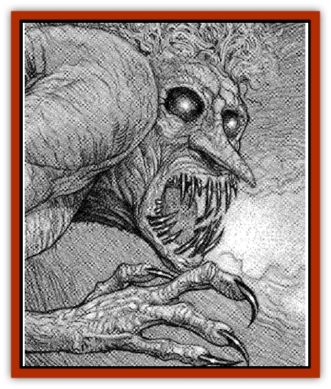

# Troll - Fire

| Statistic | **Troll, Fire** |
| --- | --- |
| **Activity Cycle:** | Any |
| **Alignment:** | Chaotic evil |
| **Armor Class:** | 3 |
| **Climate/Terrain:** | Any volcanic land |
| **Damage/Attack:** | 2d4+6 (&times;2)/2d6+6 |
| **Diet:** | Carnivore |
| **Frequency:** | Very rare |
| **Hit Dice:** | 12+4 |
| **Intelligence:** | Average to Very (9-12) |
| **Magic Resistance:** | Nil |
| **Morale:** | Fanatic (18) |
| **Movement:** | 12, Sw 12 |
| **No. Appearing:** | 2-8 (2d4) |
| **No. of Attacks:** | 3 |
| **Organization:** | Tribe |
| **Size:** | L (12'+) |
| **Special Attacks:** | See below |
| **Special Defenses:** | Regeneration, see below |
| **THAC0:** | 9 |
| **Treasure:** | P,Q (F or G) |
| **XP Value:** | 7,000 / Shaman: 9,000 |

A fire [[Troll|troll]] is a tall, thick-limbed humanoid with smooth, blood-red skin. Within its sunken sockets, its eyes glow a fierce yellow, and its hair is a tangled mass of vibrant oranges and yellows. Its claws and teeth are long, razor sharp, and as dark as fire-blackened steel. A fire troll runs in a stoop, but can keep pace with most other bipeds.

As they spend much of their time wading in magma, fire trolls are very good swimmers. They are very good at climbing the walls of their volcanic caverns, with a 90% chance to climb any surface. Because of their extremely hot habitat, fire trolls do not possess infravision. Their eyes are very sensitive, though. As long as there is any illumination, a fire troll can see 300'.

**Combat:** Fire trolls are amazingly agile and strike with a lightning fast claw/claw/bite routine that they can direct at up to three different opponents. In fact, they are so agile that despite their bulk, fire trolls can contort their bodies to pass through openings as small as 2' in diameter in one round if no other action is taken. Fire trolls never use weapons, much preferring to kill foes with their bare hands and sharp fangs. The one exception is that fire trolls who are in or near a magma pool sometimes throw magma globs at nearby opponents. A fire troll can throw two magma globs per round up to 20 yards away. Each glob does 1d2 points of impact damage and 2d10 points of fire damage. All items worn by a character hit by a glob must immediately save vs. normal fire or be set alight by the molten rock.

Fire trolls are more intelligent than most of their kin, and have become experts at setting ambushes and traps. One of their favorite methods of ambush is to submerge themselves in a magma pool, then leap out as their target approaches. Not only do victims have a -4 penalty to their surprise check, but any characters within 20' must save vs. paralyzation at +2 or be hit by 1d3 magma globs as described above.

Fire trolls normally regenerate three hit points per round starting three rounds after being wounded. If a fire troll is in an area of high heat, but not immersed in flame or another hot substance, it regenerates five hit points per round starting on the second round after being wounded. If a fire troll is immersed in magma or a similar exceptionally hot liquid or is struck by a fire attack ([[Dragon_Chromatic_Red|red dragon's]] breath, *fireball*, etc.) that engulfs at least half its body, it regenerates 10 hit points in that round and for as many rounds as it is so immersed or engulfed. In all cases, the troll only uses one rate of regeneration per round; either 3, 5, or 10 hit points. Fire- and acid-based attacks have no harmful effects upon fire trolls. Electrical damage, however, cannot be regenerated. Cold damage is a special case. Fire trolls take double damage from cold-based attacks, but can regenerate the damage. If a troll is brought to zero or fewer hit points by cold attacks, it falls stiffly to the ground, apparently lifeless. In fact, it will "thaw" in 3d4 rounds and begin to regenerate. If struck for 20 points of physical damage or 10 points of electrical damage before it thaws, the troll's body will shatter, leaving the beast forever dead.

A fire trolls thick limbs are not easily severed by edged weapons. If chopped off by vorpal or sharpness weapons, the limbs will fight until the end of combat and then attempt to reattach to the body. Severed pieces will die in two hours if they cannot reach the largest remaining portion of the troll.

The mauve blood of these humanoids is extremely corrosive to metal, but has no effect on wood, flesh, or stone. Any metal weapon that draws blood from a fire troll must save vs. acid at -1 or simply melt away.

Fire trolls, though always hungry, are never deterred by food dropped in their path by fleeing prey.

**Habitat/Society:** Fire trolls live in volcanically active regions, rarely choosing to enter the colder, civilized lands. They are often found in volcanic areas in the Underdark, preying on the races of the Deepearth.

They form into small familial tribes, and these often fight amongst themselves, though almost never to the death thanks to their ability to regenerate. Males are the dominant gender, though there are no visible differences between the sexes in size, strength, or intelligence. Males are simply more cruel and hateful. Males establish leadership by combat. The chieftain leads hunts, devises tactics, traps, and ambushes, and gets first pick of food, loot, and mates. Only females, however, can wield magic, and as such command a position only slightly lower than the chieftain. There is rarely more than one shaman in a group of fire trolls, and she is usually advisor and mate to the chieftain. Shamans can cast spells up to 12th level from the following spheres: All, Chaos, Combat, Divination, Elemental (fire, earth), Necromantic and Sun. Five percent of shamans are actually witch doctors who can reach 8th/4th level mage/priest.

Fire troll females give birth to a single troll every eight years or so. Young have half normal hit dice and mature in eight to ten years. Fire trolls can live for up to 600 years.

**Ecology:** Fire trolls are the top predators of their sparsely inhabited environment, and can go for months without food. Fire trolls often prey on [[Strider_Giant|giant striders]] and [[Firenewt|firenewts]], and some enjoy feasting on the occasional [[Giant_Fire|fire giant]]. Fire trolls who live in the Underdark consider [[Gnome|svirfneblin]] and [[Elf_Drow|drow]] flesh to be delicacies well worth the chase through the colder tunnels.

The blood of fire trolls is useful in fire and acid magics and is also prized by thieves' guilds for its metal-eating properties.

---
## Discovery & Documentation

**Source Publication:** Dragon199 (1993)
**Campaign Setting:** Dragon Magazine
**Author(s):** 

### Other Creatures Found in This Source Book
   * [[Troll_Gray|Troll, Gray]]
   * [[Trollhound|Trollhound]]
   * [[Troll_Phaze|Troll, Phaze]]
   * [[Troll_Stone|Troll, Stone]]
