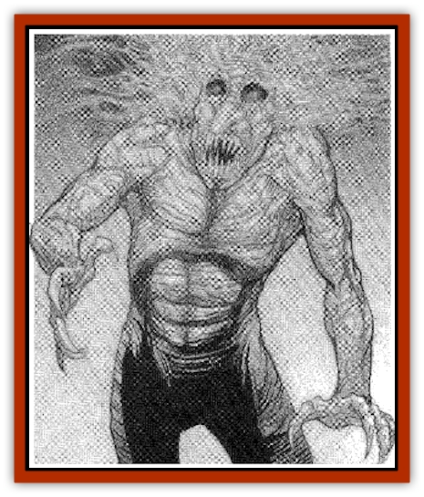

# Troll - Gray

| Statistic | **Troll, Gray** |
| --- | --- |
| **Activity Cycle:** | Night |
| **Alignment:** | Chaotic evil |
| **Armor Class:** | 2 |
| **Climate/Terrain:** | Any subterranean |
| **Damage/Attack:** | 1d4+5 (&times;2)/1d8+5 |
| **Diet:** | Carnivore |
| **Frequency:** | Very rare |
| **Hit Dice:** | 8+1 |
| **Intelligence:** | Low (5-7) |
| **Magic Resistance:** | Nil |
| **Morale:** | Champion (16) |
| **Movement:** | 12 |
| **No. Appearing:** | 1 |
| **No. of Attacks:** | 3 |
| **Organization:** | Solitary/tribe |
| **Size:** | L (9') |
| **Special Attacks:** | See below |
| **Special Defenses:** | Regeneration, see below |
| **THAC0:** | 13 |
| **Treasure:** | Q (D) |
| **XP Value:** | 6,000 |

Gray trolls are tall and gangly, and look much like normal [[Troll|trolls]]. Their gray or gray-brown skin is dry and flaky, like old parchment. The unruly mass of hair on the gray troll's head is gray or white. Deep in the sunken pits that are its eye sockets dance cold blue pinpoints of light.

Gray trolls possess excellent infravision, out to 150'. They are also able climbers (75% climbing chance).

**Combat:** Gray trolls are ferocious in battle, ripping into anything near them with their claw/claw/bite routine. Gray trolls are able to direct these attacks against up to three opponents. The gray troll's saliva is highly toxic, and is delivered every time it successfully bites an opponent. The poison has an onset time of 20 minutes. The victim must then save vs. poison. If successful, there is no further effect. If failed, the victim slips into a coma, and will not awaken unless the poison is neutralized. After 36 hours, the victim must save again, but this time at a -2 penalty. If successful, the victim suffers 2d6 points of damage and then wakes from the coma. If unsuccessful, the victim dies. Gray trolls prefer their natural attacks above ail others, never using weapons or missiles.

Thrice per week, a gray troll may assume gaseous form for no more than six rounds per use. It takes one full round to assume or exit gaseous form. This time does not count against the duration of the power. While changing, the troll can't defend itself, but once in gaseous form, it is immune to all but magical weapons and spells. While in gaseous form, the troll must remain within 5' of the ground and can move at twice its normal speed.

Gray trolls are extraordinary regenerators, regaining six hit points per round, beginning on the fourth round after being wounded. Gray trolls also are totally immune to damage by acid, cold, and electrical attacks. However, fire damage cannot be regenerated, and because of its dry, paper-like skin, a gray troll takes double damage from fire attacks. They hate fire so much they will attack anyone bearing it, in hopes of extinguishing it as quickly as possible.

Thanks to its lanky, emaciated form, a gray troll's limbs are easily severed (on a natural attack roll of 18 to 20) by edged weapons. Severed limbs will fight for up to five rounds after being cut off. If the battle ends before five rounds elapse, the limbs will rejoin the body. If not, the severed limb crumbles to dust.

Sunlight, like fire, is deadly to a gray troll. A gray troll will never willingly enter sunlight, but, if forced, will desperately try to flee and find a dark shelter, attacking anything in its way. While in sunlight, a gray troll fights as if blinded (-4 penalty on attacks, saves, and AC), and is "burned" by the sunlight for five hit points of damage (which cannot be regenerated) every round. If brought to zero hit points while in sunlight, a gray trolls body shrivels and crumbles into black and gray ashes, forever dead. Light other than sunlight has no effect on gray trolls.

Gray trolls are always ravenous and are distracted from pursuit by food dropped in their path 75% of the time.

**Habitat/Society:** Gray trolls are normal trolls that reached their present state by being totally level drained, usually by some form of undead. By processes not fully understood, the rush of negative energy from the attacker reacts strangely with the troll's natural regenerative ability. Less than 5% of trolls so drained of life energy react in this odd way; the rest simply die. Once drained, the troll lapses into a coma for 24 hours, during which time it isn't adversely affected by sunlight. When it awakens, it has become a gray troll, and all commensurate abilities and weaknesses are gained at that moment. It is not undead, however. As a gray troll, the beast has gained a strange link to the Negative Material plane. Due to this connection, a gray troll is rendered sterile and loses any spell-casting powers that it may have possessed. It lives for 25 to 75 years before it crumbles to dust.

After transforming, most gray trolls become solitary wanderers of the Underdark, full of hate and hunger, recklessly attacking any creatures they meet. Occasionally, they will find their old tribe or a new troll tribe, and gain leadership of it.

**Ecology:** Gray trolls attack, kill, and eat any creature they come across. Gray trolls live only to feed and destroy. Though they may seem to possess undead-like abilities, they are alive, and cannot be turned or controlled by clerics.

The dust of a gray troll is useful in healing and resistance magics (acid, cold, electricity) and can bring quite a hefty price due to its extreme rarity.

---
## Discovery & Documentation

**Source Publication:** Dragon199 (1993)
**Campaign Setting:** Dragon Magazine
**Author(s):** 

### Other Creatures Found in This Source Book
   * [[Troll_Fire|Troll, Fire]]
   * [[Trollhound|Trollhound]]
   * [[Troll_Phaze|Troll, Phaze]]
   * [[Troll_Stone|Troll, Stone]]
