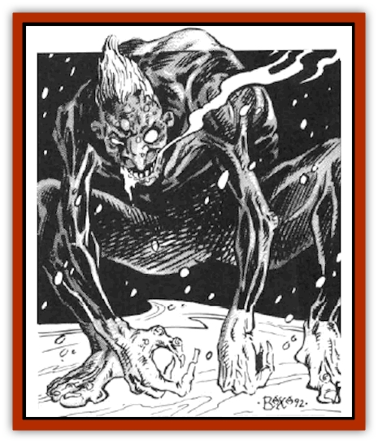

# Troll - Ice

| Statistic | **Troll, Ice** |
| --- | --- |
| **Activity Cycle:** | Any |
| **Alignment:** | Chaotic evil |
| **Armor Class:** | 8 |
| **Climate/Terrain:** | Temperate or Arctic but always near water |
| **Damage/Attack:** | 1-8/1-8 |
| **Diet:** | Carnivore |
| **Frequency:** | Rare |
| **Hit Dice:** | 2 |
| **Intelligence:** | Average (8-10) |
| **Magic Resistance:** | Nil |
| **Morale:** | Steady (11) |
| **Movement:** | 9 |
| **No. Appearing:** | 2-12 |
| **No. of Attacks:** | 2 |
| **Organization:** | Tribal |
| **Size:** | L (8' tall) |
| **Special Attacks:** | Nil |
| **Special Defenses:** | See below |
| **THAC0:** | 19 |
| **Treasure:** | Q (D) |
| **XP Value:** | 175 |

The ice troll is a smaller, more intelligent relative of the normal [[Troll|troll]], and is probably the result of magical experimentation. It closely resembles its more common cousin, but has semitransparent, very cold skin. Ice trolls are famous for being cunning, evil creatures which keep humans and demi-humans as livestock.

Because ice trolls need water to regenerate, they never leave their lakes and rivers, and will create elaborate traps to lure their prey to them.

**Combat:** Ice trolls are organized and intelligent enough to know their weaknesses, and will rarely start a fight at a disadvantage. Unlike their larger and less intelligent cousins, they do not wade into combat blindly, but will try to pick off weaker opponents one by one, hoping to bring back live prey.

Ice trolls generally attack with claws for 1d8 hit points of damage each, but have been known to use weapons on rare occasions (10%), at an additional +4 to each weapon's damage due to Strength. Attacks may be directed against different opponents.

The regenerative powers of ice trolls are not as great as normal trolls. An ice troll must be immersed in water to be able to regenerate 2 hit points per melee round. The creatures often make their stand in a shallow pool of water to keep this advantage. Ice trolls reduced to zero hit points do not die, but rather fall to the ground to regain lost hit points.

Because of the thin, brittle nature of the ice troll, it is possible to sever one of the creature's limbs with an edged weapon, on a natural attack roll of 20. Severed limbs also regenerate 2 hit points per turn, as long as they are immersed in water. If a severed limb is not in contact with water, it will move up to 30 feet in search of water, always moving toward it, if it is in range. If a severed limb cannot join the main body of the ice troll within 24 hours, the limb dies. This is of little concern to the ice troll, since it is able to regenerate any lost body parts within a week as long as it stays in contact with water

Fire and acid are the only attack forms which negate the ice troll's ability to regenerate. If an ice troll is reduced to zero hit points, and then burned by either acid or fire, it dies without chance for regeneration. Because of the ice troll's physiology, fire-based attacks do double damage. Ice trolls are unaffected by cold or cold-based spells, and because of their magical nature, can only be hit by magical weapons or missiles.

As previously stated, ice trolls will often defend their camps by wading in ankle-deep water and attacking from this pool. They frequently lay netr across the floor of these pools to capture or at least entangle their attackers.

**Habitat/Society:** Ice trolls live in groups of 7-12 in arctic and sub-arctic regions, near open water. Because they are smaller and less resilient than their larger cousins, they have developed a higher sense of cooperation to stay alive. Each group has a leader, usually the most intelligent ice troll. Leaders are responsible for keeping the group safe and well-fed.

Ice trolls live near settled regions, hoping to waylay and capture humans and demi-humans. Ice trolls will frequently bait traps for adventurers, using treasure they have salvaged from previously waylaid groups. Settlements also provide more common livestock, which, although less preferable than human flesh, is considered edible in times of need.

Ice trolls establish their lairs near lakes or rivers. Here the ice trolls will have gathered all their treasure, as well as 5-20 human or demi-human captives. These prisoners are kept well-fed on grains and vegetables, so that the ice trolls need never go too long without food.

Ice trolls mate in the spring and give birth to one baby ice troll in the late fall. When an ice troll tribe gets too large, it splits, one group wandering off to find a new lair.

**Ecology:** Ice trolls that live in arctic regions often hunt [[Remorhaz|remorhaz]], and will even pick off a solitary [[Giant_Frost|frost giant]].

Ice troll blood is frequently used in the manufacture of *frost brand* swords, and *rings of cold resistance*.

---
## Discovery & Documentation

**Source Publication:** MC14 Fiend Folio Appendix (1992)
**Campaign Setting:** Fiends Folio
**Author(s):** Don Bingle, John Terra, Wes Nicholson, Tim Beach, Steve Hardinger, Kris Hardinger, Rob Nicholls, Greg Swedberg, Al Boyce, Vince Garcia, Norm Ritchie

### Other Creatures Found in This Source Book
   * [[Aballin|Aballin]]
   * [[Achaierai|Achaierai]]
   * [[Adherer|Adherer]]
   * [[Algoid|Algoid]]
   * [[Al-Mi'raj|Al-Mi'raj]]
   * [[Apparition|Apparition]]
   * [[Caterwaul|Caterwaul]]
   * [[Coffer_Corpse|Coffer Corpse]]
   * [[Crabman|Crabman]]
   * [[Dark_Creeper|Dark Creeper]]
   * [[Dark_Stalker|Dark Stalker]]
   * [[Darter|Darter]]
   * [[Denzelian|Denzelian]]
   * [[Dune_Stalker|Dune Stalker]]
   * [[Dwarf_Urdunnir|Dwarf, Urdunnir]]
   * [[Falcon_Fire|Falcon, Fire]]
   * [[Faux_Faerie|Faux Faerie]]
   * [[Flawder|Flawder]]
   * [[Fyrefly|Fyrefly]]
   * [[Gambado|Gambado]]
   * [[Garbug|Garbug]]
   * [[Giant_Fhoimorien|Giant, Fhoimorien]]
   * [[Gibberling|Gibberling]]
   * [[Gorbel|Gorbel]]
   * [[Grimlock|Grimlock]]
   * [[Hellcat|Hellcat]]
   * [[Ice_Lizard|Ice Lizard]]
   * [[Iron_Cobra|Iron Cobra]]
   * [[Khargra|Khargra]]
   * [[Mantari|Mantari]]
   * [[Penanggalan|Penanggalan]]
   * [[Pernicon|Pernicon]]
   * [[Phantom_Stalker|Phantom Stalker]]
   * [[Retriever|Retriever]]
   * [[Ruve|Ruve]]
   * [[Scathe|Scathe]]
   * [[Sheet_Ghoul_Sheet_Phantom|Sheet Ghoul/Sheet Phantom]]
   * [[Shocker|Shocker]]
   * [[Spanner|Spanner]]
   * [[Stwinger|Stwinger]]
   * [[Sussurus|Sussurus]]
   * [[Symbiotic_Jelly|Symbiotic Jelly]]
   * [[Terithran|Terithran]]
   * [[Thunder_Children|Thunder Children]]
   * [[Tween|Tween]]
   * [[Umpleby|Umpleby]]
   * [[Volt|Volt]]
   * [[Xill|Xill]]
   * [[Xvart|Xvart]]
   * [[Zygraat|Zygraat]]
