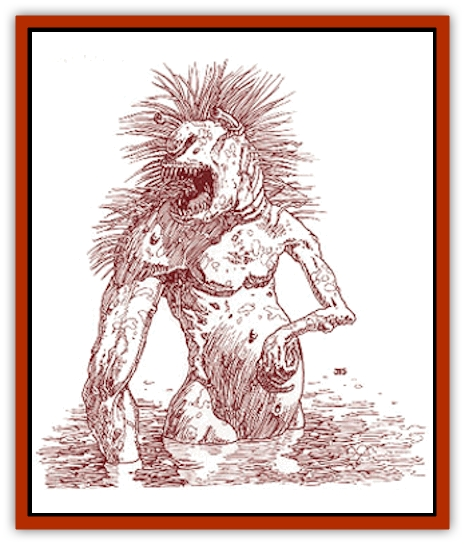

# Troll - Legacy

| Statistic | **Troll, Legacy** |
| --- | --- |
| **Activity Cycle:** | Night |
| **Alignment:** | Chaotic evil |
| **Armor Class:** | 2 |
| **Climate/Terrain:** | Any coast or swamp |
| **Damage/Attack:** | 1d4/1d4/1d8+8 |
| **Diet:** | Carnivore |
| **Frequency:** | Uncommon |
| **Hit Dice:** | 6+12 |
| **Intelligence:** | Low (5-7) |
| **Magic Resistance:** | Nil |
| **Morale:** | Champion (15-16) |
| **Movement:** | 3, Sw 12 |
| **No. Appearing:** | 1d8 |
| **No. of Attacks:** | 3 (claw/claw/bite) |
| **Organization:** | Group |
| **Size:** | L (10' tall) |
| **Special Attacks:** | See below |
| **Special Defenses:** | Regeneration |
| **THAC0:** | 13 |
| **Treasure:** | (D) |
| **XP Value:** | 2,000 |

Legacy trolls are aquatic [[Troll|trolls]] altered over the generations by the *vermeil* muck lining the floor near their homes. These trolls have a variety of Legacies. These deformed trolls often raid coastal villages looking for food and *cinnabryl*.

These aquatic trolls come in both freshwater and saltwater varieties. Legacy trolls are over eight feet tall. Their arms are thin and frail, but their mouths are wide and lined with dozens of needle-sharp fangs. The color of the Legacy troll ranges from blue-green to olive, tinged with a bit of red. Legacy trolls also regenerate 3 hp per round when immersed in water. Even though they have gills, Legacy trolls can survive out of water for short periods (one hour or less) and often come ashore in search of prey.

Legacy troll shamans have access to Elemental (water) spells.

Legacy trolls are always fully mutated by the Afflictions associated with their Legacies, although they never suffer any penalties or ability point losses. Troll Legacies vary are according to the region they live in but are usually associated with Charisma or Strength. Typical Legacies by region are listed below, with the associated physical deformation in parenthesis.

Region 1: Armor (scaly skin), Burn (red skin), Grow (one limb permanently twice normal size), Senses (extremely long tongue, fingers, ears, and nose).

Region 2: Animal Form (permanently stuck in half-fish form), Crimson Fire (eyes glow red), Farsight (eyes on stalks), Meld (blends with background like a chameleon), Sleep (droopy features), Spikes (soft spikes all over body).

Region 3: All-Around Vision (four eyes appear at random points on the body), Ball of Fire (red skin), Separation (body part permanently detached), Shock (hair stands on end),Shrink (head is permanently half size).

Region 4: Acid Touch (drools), Duplicate (illusory third arm), Poison (stinger), Spell Shield (scales), Weaken (appears emaciated).

**Combat:** Combat: Legacy trolls attack just like regular trolls.

**Habitat/Society:** Legacy trolls are found in small colonies containing 1d8 trolls. Groups of more than two are always led by a large female troll, who acts as a chieftain and shaman. She is always the most hideously deformed of all.

Legacy trolls do not lose ability points because of the Red Curse, so they do not desperately need *cinnabryl*. However, they sometimes seek *cinnabryl* to obtain temporary respite from their physical deformations.

Legacy trolls are found up and down the Savage Coast, in rivers, lakes, and along the seashore. Some also live in the Bayou. Most live in groups of underwater nests composed of debris glued together with glandular secretions.

Solitary legacy trolls will sometimes lair in small caves in large coral reefs. In such cases, the troll is 50% likely to have a wolf [[Eel|eel]] or moray eel companion.

**Ecology:** In addition to the normal uses for troll blood, the blood of a Legacy troll can be used to make a potion which temporarily relieves the symptoms of that troll's former Legacy. Blood from a troll with the Armor Legacy, for example, could be used to make a potion that will ward off the Affliction associated with Armor.

Their exact life span is unknown but is believed to be in excess of 150 years.

---
## Discovery & Documentation

**Source Publication:** Monstrous Compendium Savage Coast Appendix (Online Exclusive) (1995)
**Campaign Setting:** Mystara
**Author(s):** Loren L Coleman, Ted James, Thomas Zuvich, Cindi M. Rice

### Other Creatures Found in This Source Book
   * [[Aranea_Savage_Coast|Aranea (Savage Coast)]]
   * [[Arashaeem|Arashaeem]]
   * [[Batracine|Batracine]]
   * [[Cat_Marine|Cat, Marine]]
   * [[Cinnavixen|Cinnavixen]]
   * [[Clockwork_Swordsman|Clockwork Swordsman]]
   * [[Critter_Temple|Critter, Temple]]
   * [[Cursed_One|Cursed One]]
   * [[Deathmare|Deathmare]]
   * [[Dragon_Savage_Coast_Crimson|Dragon (Savage Coast), Crimson]]
   * [[Dragon_Savage_Coast_Red_Hawk|Dragon (Savage Coast), Red Hawk]]
   * [[Echyan|Echyan]]
   * [[Ee'aar|Ee'aar]]
   * [[Enduk|Enduk]]
   * [[Fachan_Savage_Coast|Fachan (Savage Coast)]]
   * [[Feliquine|Feliquine]]
   * [[Fiend_Narvaezan|Fiend, Narvaezan]]
   * [[Frelôn|Frelôn]]
   * [[Ghriest|Ghriest]]
   * [[Glutton_Sea|Glutton, Sea]]
   * [[Goatman|Goatman]]
   * [[Golem_Naâruk|Golem, Naâruk]]
   * [[Golem_Savage_Coast|Golem (Savage Coast)]]
   * [[Grudgling|Grudgling]]
   * [[Heraldic_Servant_I|Heraldic Servant I]]
   * [[Heraldic_Servant_II|Heraldic Servant II]]
   * [[Heraldic_Servant_III|Heraldic Servant III]]
   * [[Heraldic_Servant_IV|Heraldic Servant IV]]
   * [[Heraldic_Servant_V|Heraldic Servant V]]
   * [[Heraldic_Servant_General_Information|Heraldic Servant, General Information]]
   * [[Hermit_Sea|Hermit, Sea]]
   * [[Jorri|Jorri]]
   * [[Juhrion|Juhrion]]
   * [[Kla'a-tah|Kla'a-tah]]
   * [[Leech_Legacy|Leech, Legacy]]
   * [[Lich_Inheritor|Lich, Inheritor]]
   * [[Lizard_Kin_Savage_Coast|Lizard Kin (Savage Coast)]]
   * [[Lupasus|Lupasus]]
   * [[Lupin|Lupin]]
   * [[Lyra_Bird_Saragón|Lyra Bird, Saragón]]
   * [[Malfera|Malfera]]
   * [[Manscorpion_Nimmurian|Manscorpion, Nimmurian]]
   * [[Mythuínn_Folk|Mythuínn Folk]]
   * [[Neshezu|Neshezu]]
   * [[Nikt'oo|Nikt'oo]]
   * [[Nosferatu|Nosferatu]]
   * [[Omm-wa|Omm-wa]]
   * [[Omshirim|Omshirim]]
   * [[Parasite_Savage_Coast|Parasite (Savage Coast)]]
   * [[Phanaton|Phanaton]]
   * [[Plant_Savage_Coast|Plant (Savage Coast)]]
   * [[Pudding_Vermilion|Pudding, Vermilion]]
   * [[Rakasta|Rakasta]]
   * [[Ray_Forest|Ray, Forest]]
   * [[Shedu_Greater_Savage_Coast|Shedu, Greater (Savage Coast)]]
   * [[Shimmerfish|Shimmerfish]]
   * [[Skinwing|Skinwing]]
   * [[Spawn_of_Nimmur|Spawn of Nimmur]]
   * [[Spider-spy|Spider-spy]]
   * [[Spirit_Heroic|Spirit, Heroic]]
   * [[Spirit_Walleran|Spirit, Walleran]]
   * [[Succulus|Succulus]]
   * [[Swampmare|Swampmare]]
   * [[Symbiont_Shadow|Symbiont, Shadow]]
   * [[Tortle|Tortle]]
   * [[Trosip|Trosip]]
   * [[Tyminid|Tyminid]]
   * [[Utukku|Utukku]]
   * [[Voat|Voat]]
   * [[Voat_Herathian|Voat, Herathian]]
   * [[Vulturehound|Vulturehound]]
   * [[Wallara|Wallara]]
   * [[Wurmling|Wurmling]]
   * [[Wynzet|Wynzet]]
   * [[Yeshom|Yeshom]]
   * [[Zombie_Red|Zombie, Red]]
