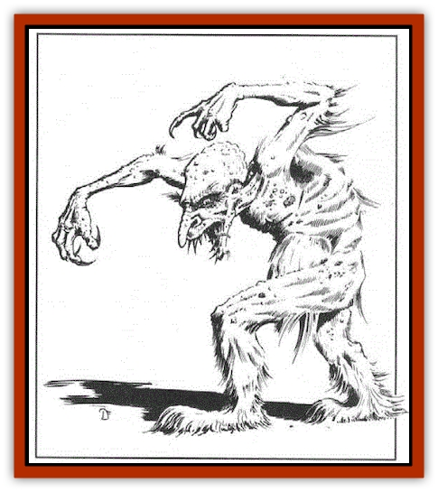

# Troll - Snow

| Statistic | **Troll, Snow** |
| --- | --- |
| **Activity Cycle:** | Night |
| **Alignment:** | Chaotic evil |
| **Armor Class:** | 4 |
| **Climate/Terrain:** | Any arctic or subarctic land |
| **Damage/Attack:** | 1d8+2 (&times;2) |
| **Diet:** | Carnivore |
| **Frequency:** | Rare |
| **Hit Dice:** | 7 |
| **Intelligence:** | Low (5-7) |
| **Magic Resistance:** | Nil |
| **Morale:** | Elite (13-14) |
| **Movement:** | 9 |
| **No. Appearing:** | 1-2 |
| **No. of Attacks:** | 2 |
| **Organization:** | Solitary/pair |
| **Size:** | L (8' tall) |
| **Special Attacks:** | See below |
| **Special Defenses:** | Regeneration, resist cold |
| **THAC0:** | 13 |
| **Treasure:** | Nil |
| **XP Value:** | 1,400 |

Slightly smaller and broader than its fearsome cousin, the snow troll is still a frightening sight. It closely resembles the [[Troll|common troll]], but the snow troll's skin is much paler, and large parts of its body are covered with white fur. The snow troll's broad, furry feet allow it to move quickly over snow and rock, and its strong claws and arms allow it to climb as well as any troll.

Some snow trolls speak a few words of Common, but most only know their own high-pitched, sing-song tongue. The snow troll language has 20 words for "prey".

**Combat:** Unlike the common troll, the snow troll attacks with its two clawed hands only, but like the troll, the snow troll can engage two opponents at once. It also possesses the ability to regenerate 3 hit points per round, starting three rounds after first being wounded, and the snow troll is extremely resistant to cold and cold-based attacks. If a saving throw is successfully made, the snow troll suffers no effects from any cold-based attack form, and it suffers just half damage if the saving throw is failed. Conversely, the snow troll is particularly vulnerable to fire and suffers double damage from any fire-based attacks, while normal damage is sustained if the saving throw succeeds.

The snow troll is a formidable opponent, who will fight to the death at all times. It is fearless enough to attack small villages single-handed, but its preferred method of attack is to occupy a cave or similar dwelling along a well-traveled route, covering the entrance with snow or rock. The snow troll becomes intimately acquainted with the area around its home and is able to detect its prey in a number of ways: It can pick up minute changes in the surface tension of the snow surrounding its lair, it can detect sound vibrations caused by movement over rock or sand, or it can use (like all trolls) its acute sense of smell to sniff out its prey. In any event, the snow troll waits until it detects prey outside its lair, whereupon it bursts forth, suprising its victims with the ferocious nature of its attack. A snow troll has a 6-in-10 chance of surprising prey, and is itself surprised only on a 1 in its home territory.

**Habitat/Society:** The snow troll is a solitary creature, leaving its territory only once every three years, during the mating season. Each third year, dozens or even hundreds of snow trolls gather in the mid-winter darkness to mate in dark mountain valleys unknown to other creatures. The males abandon their mates shortly thereafter, leaving them to raise their young alone; pairs are always a mother and her offspring.

A snow troll's clawed hands help it climb glaciers, snowy mountains, and treacherous ice floes. A female snow troll seeks solitude in high places or on icebergs when she is about to bear young, and this territory gives her the same surprise bonuses as her home territory. Young snow trolls grow to full maturity within a year. They are reputed to be the most dangerous because they eat twice as much as other snow trolls.

Adapted well to the harsh conditions it prefers, the snow troll can live 120 years. It does not work with other races, as it finds all humans and nonhumans equally tasty.

**Ecology:** The snow troll is a rapacious predator, able to pursue prey over difficult terrain and, unlike its temperate cousins, patient enough to wait hours for prey to wander into striking range. It establishes and maintains a territory covering hundreds of square miles, and it will fight and kill [[Bear|polar bears]], humans, and other competitors for food. [[Dragon_Chromatic_White|White dragons]] are their only natural predators. Snow trolls and [[Troll_Ice|ice trolls]] are natural rivals who fight endlessly over territory.

---
## Discovery & Documentation

**Source Publication:** Monstrous Compendium, 1994 Annual, Volume 1 (1995)
**Campaign Setting:** Advanced Dungeons & Dragons 2nd Edition
**Author(s):** David Wise

### Other Creatures Found in This Source Book
   * [[Abyss_Ant|Abyss Ant]]
   * [[Achaierai|Achaierai]]
   * [[Afanc|Afanc]]
   * [[Al-Jahar|Al-Jahar]]
   * [[Baelnorn|Baelnorn]]
   * [[Baneguard|Baneguard]]
   * [[Banelar|Banelar]]
   * [[Bird_Talking|Bird, Talking]]
   * [[Blazing_Bones|Blazing Bones]]
   * [[Campestri|Campestri]]
   * [[Caniquine|Caniquine]]
   * [[Cat_Winged|Cat, Winged]]
   * [[Crypt_Servant|Crypt Servant]]
   * [[Death's_Head_Tree|Death's Head Tree]]
   * [[Dog_Saluqi|Dog, Saluqi]]
   * [[Dragon_Electrum|Dragon, Electrum]]
   * [[Dragon_Fang|Dragon, Fang]]
   * [[Dragon_Linnorm_Corpse_Tearer|Dragon, Linnorm, Corpse Tearer]]
   * [[Dragon_Linnorm_Dread|Dragon, Linnorm, Dread]]
   * [[Dragon_Linnorm_Flame|Dragon, Linnorm, Flame]]
   * [[Dragon_Linnorm_Forest|Dragon, Linnorm, Forest]]
   * [[Dragon_Linnorm_Frost|Dragon, Linnorm, Frost]]
   * [[Dragon_Linnorm_Gray|Dragon, Linnorm, Gray]]
   * [[Dragon_Linnorm_Land|Dragon, Linnorm, Land]]
   * [[Dragon_Linnorm_Midgard|Dragon, Linnorm, Midgard]]
   * [[Dragon_Linnorm_Rain|Dragon, Linnorm, Rain]]
   * [[Dragon_Linnorm_Sea|Dragon, Linnorm, Sea]]
   * [[Dragon_Neutral_Jacinth|Dragon, Neutral, Jacinth]]
   * [[Dragon_Neutral_Jade|Dragon, Neutral, Jade]]
   * [[Dragon_Neutral_Pearl|Dragon, Neutral, Pearl]]
   * [[Dread|Dread]]
   * [[Dragon-kin|Dragon-kin]]
   * [[Elemental_Earth_Kin_Chrysmal|Elemental, Earth Kin, Chrysmal]]
   * [[Elemental_Earth_Kin_Earth_Weird|Elemental, Earth Kin, Earth Weird]]
   * [[Elemental_Fire_Kin_Azer|Elemental, Fire Kin, Azer]]
   * [[Elemental_Sandman|Elemental, Sandman]]
   * [[Elemental_Wind_Walker|Elemental, Wind Walker]]
   * [[Elemental_Vermin|Elemental Vermin]]
   * [[Feystag|Feystag]]
   * [[Flame_Skull|Flame Skull]]
   * [[Foulwing|Foulwing]]
   * [[Gambado|Gambado]]
   * [[Garbug|Garbug]]
   * [[Genie_Tasked_Administrator|Genie, Tasked, Administrator]]
   * [[Genie_Tasked_Deceiver|Genie, Tasked, Deceiver]]
   * [[Genie_Tasked_Harim_Servant|Genie, Tasked, Harim Servant]]
   * [[Genie_Tasked_Messenger|Genie, Tasked, Messenger]]
   * [[Genie_Tasked_Miner|Genie, Tasked, Miner]]
   * [[Genie_Tasked_Oathbinder|Genie, Tasked, Oathbinder]]
   * [[Gibbering_Mouther|Gibbering Mouther]]
   * [[Gnasher|Gnasher]]
   * [[Gnasher_Winged|Gnasher, Winged]]
   * [[Golem_Brain|Golem, Brain]]
   * [[Golem_Hammer|Golem, Hammer]]
   * [[Golem_Metagolem|Golem, Metagolem]]
   * [[Golem_Spiderstone|Golem, Spiderstone]]
   * [[Gorynych|Gorynych]]
   * [[Greelox|Greelox]]
   * [[Helmed_Horror|Helmed Horror]]
   * [[Jarbo|Jarbo]]
   * [[Laraken|Laraken]]
   * [[Lich_Psionic|Lich, Psionic]]
   * [[Living_Steel|Living Steel]]
   * [[Lock_Lurker|Lock Lurker]]
   * [[Loxo|Loxo]]
   * [[Lycanthrope_Loup_de_Noir|Lycanthrope, Loup de Noir]]
   * [[Lycanthrope_Werebadger|Lycanthrope, Werebadger]]
   * [[Lycanthrope_Werejaguar|Lycanthrope, Werejaguar]]
   * [[Lythlyx|Lythlyx]]
   * [[Magebane|Magebane]]
   * [[Marrashi|Marrashi]]
   * [[Metalmaster|Metalmaster]]
   * [[Mimic_House_Hunter|Mimic, House Hunter]]
   * [[Naga_Bone|Naga, Bone]]
   * [[Nautilus_Giant|Nautilus, Giant]]
   * [[Nightshade_Toril|Nightshade (Toril)]]
   * [[Nishruu|Nishruu]]
   * [[Noran|Noran]]
   * [[Opinicus|Opinicus]]
   * [[Ormyrr|Ormyrr]]
   * [[Parasite|Parasite]]
   * [[Pasari-Niml|Pasari-Niml]]
   * [[Plant_Vampire_Moss|Plant, Vampire Moss]]
   * [[Pteraman|Pteraman]]
   * [[Rautym|Rautym]]
   * [[Shadeling|Shadeling]]
   * [[Skum|Skum]]
   * [[Snake_Giant_Cobra|Snake, Giant Cobra]]
   * [[Snake_Stone|Snake, Stone]]
   * [[Spectral_Wizard|Spectral Wizard]]
   * [[Spell_Weaver|Spell Weaver]]
   * [[Spider_Brain|Spider, Brain]]
   * [[Suwyze|Suwyze]]
   * [[Tatalla|Tatalla]]
   * [[Tick_Heart|Tick, Heart]]
   * [[Tree_Dark|Tree, Dark]]
   * [[Tree_Singing|Tree, Singing]]
   * [[Tressym|Tressym]]
   * [[Tuyewera|Tuyewera]]
   * [[Ulitharid|Ulitharid]]
   * [[Undead_Dwarf|Undead Dwarf]]
   * [[Undead_Lake_Monster|Undead Lake Monster]]
   * [[Whipsting|Whipsting]]
   * [[Windghost|Windghost]]
   * [[Wolf_Dread|Wolf, Dread]]
   * [[Wolf_Stone|Wolf, Stone]]
   * [[Wolf_Vampiric|Wolf, Vampiric]]
   * [[Wraith_Shimmering|Wraith, Shimmering]]
   * [[Xantravar|Xantravar]]
   * [[Xaver|Xaver]]
