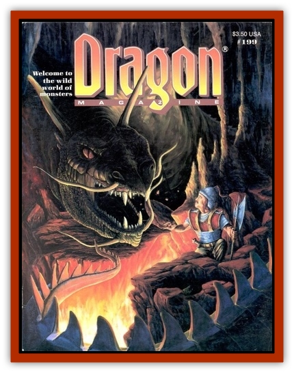

# Trollhound

| Statistic | **Trollhound** |
| --- | --- |
| **Activity Cycle:** | Night |
| **Alignment:** | Chaotic neutral |
| **Armor Class:** | 5 |
| **Climate/Terrain:** | Sub-arctic to sub-tropical/Land |
| **Damage/Attack:** | 1d4+4 |
| **Diet:** | Carnivore |
| **Frequency:** | Very rare |
| **Hit Dice:** | 3+3 |
| **Intelligence:** | Semi- (2-4) |
| **Magic Resistance:** | Nil |
| **Morale:** | Elite (13) |
| **Movement:** | 15 |
| **No. Appearing:** | 4-24 (4d6) |
| **No. of Attacks:** | 1 |
| **Organization:** | Pack |
| **Size:** | M |
| **Special Attacks:** | Lockbite, disease |
| **Special Defenses:** | Regeneration |
| **THAC0:** | 17 |
| **Treasure:** | Q (½I) |
| **XP Value:** | Pup: 175 / Adult: 420 / Pack leader: 975 |

A trollhound looks like a large, ugly [[Wolf|worg]] or dire wolf with black pits for eyes. Most trollhounds stand between 4' and 6' at the shoulder and bulge with thick muscles and tendons. The skin of a trollhound is a vile mix of violet, gray, and green flesh with patches of coarse, spiky black or gray hair. The lips, tongue, and teeth of trollhounds are inky black. They always smell of waste, death, and decay. Trollhounds possess infravision to 60'.

**Combat:** Trollhounds are vicious canines that prefer to strike as a pack, if possible. They charge as a chaotic mass, biting and tearing any opponent they can reach. On a natural attack roll of 20, the trollhound has locked its jaws upon an opponent's limb (see Bite Table). During such a "lockbite", the hound causes damage automatically on each successive round until it is removed or the victim dies. The hound's jaws are quite strong and can't be pried open while the canine is conscious. If it is killed or knocked unconscious for at least one full round the jaws may be forced apart.

A trollhound's teeth aren't the only danger in its bite. Ten percent of all trollhounds carry a nonmagical disease of the DM's choice. When a trollhound bites a foe, there is a 1% chance per point of damage of infecting the victim. During a lockbite, this chance rises to 2% per point of damage. In both cases, the chance to be infected is non-cumulative.

Like other [[Troll|trolls]], trollhounds regenerate. They regenerate one hit point per round beginning the round immediately after being wounded. They cannot regenerate fire or acid damage. If they do suffer damage from such attacks and survive, they heal incredibly fast; six hit points per day regardless of their level of activity.

Trollhounds have very keen senses and are excellent hunters. An average hound can track its quarry as well as a 3rd-level ranger, but as a pack, they track as well as a 6th-level ranger. An exceptional pack leader (see below) can track as well as a 9th-level ranger, and so does the pack as long as it leads. Though determined in their pursuit of prey, food dropped in their path will often (95% chance) distract the hounds.

| 1 | Weapon arm: No attack possible with that arm. |
| --- | --- |
| 2 | Shield arm: No shield bonus if applicable, -1 AC penalty. |
| 3-4 | Leg (either): Movement reduced by ½, -2 AC penalty. |

**Habitat/Society:** In the wild, trollhounds form close-knit, familial packs. The pack stakes out a large territory and roams it constantly, looking for prey. Trollhounds keep several burrows and lairs in their territory, and retreat to the closest when sunrise nears. Trollhounds hate the day, and will not venture out under the sun's light if they have a choice. Sunlight and *continual light* spells hurt a trollhound's eyes and it fights with a -1 penalty on attack and damage rolls and armor class.

Among themselves, trollhounds are never violent, because of an instinctive sense of hierarchy. By scent, trollhounds can tell which of them is stronger and thus secure their places in the pack. The strongest always leads. This is even true between packs, the weaker of the two backing down and retreating after it has scented the other pack.

If a pack of trollhounds numbers ten or more, there is a 25% chance that the pack has an exceptional leader. Such a pack leader has 5+3 hit dice, is +2 to damage rolls, has Low intelligence (5-7), and is tracks as a 9th-level ranger. These leaders are thankfully rare, as their higher intellect allows them to lead their packs with rudimentary tactics that often catch militiamen and adventurers off guard.

Trollhounds also have a great affinity for trolls, and can often be found in their company. In any lair of four or more trolls, there is a 30% chance that a small pack (2d4 hounds) will be present. They act as watchdogs and sentries during the day, and then join their humanoid brethren to hunt when night falls.

All treasure found with trollhounds is incidental. It is either loose coins or gems in their gut, or a former victim's equipment that was brought to a den on the body.

**Ecology:** Trollhounds are fearless, ravenous canines that prey upon anything they can catch. They prefer live prey over carrion. Trollhounds often have at least one human or demihuman settlement in their territory, equating the two-legs with the docile livestock that always accompanies them.

Trollhound females are the larger gender and are often, though not always, pack leaders. Females give birth to 1 or 2 pups every two or three years. Pups are born with 1+1 HD, are -4 to damage, but can run and hunt five days after birth. In two weeks, if they have survived their first hunts, they can track as well as an adult. Every six months, a pup gains 1+1 HD and +2 to damage until its stats equal an adult's. Trollhounds can live up to 30 years before their regenerative powers fail and they are devoured by the pack.

Trollhound blood is useful in minor magics and potions concerned with healing and curing or causing disease.

---
## Discovery & Documentation

**Source Publication:** Dragon199 (1993)
**Campaign Setting:** Dragon Magazine
**Author(s):** 

### Other Creatures Found in This Source Book
   * [[Troll_Fire|Troll, Fire]]
   * [[Troll_Gray|Troll, Gray]]
   * [[Troll_Phaze|Troll, Phaze]]
   * [[Troll_Stone|Troll, Stone]]
