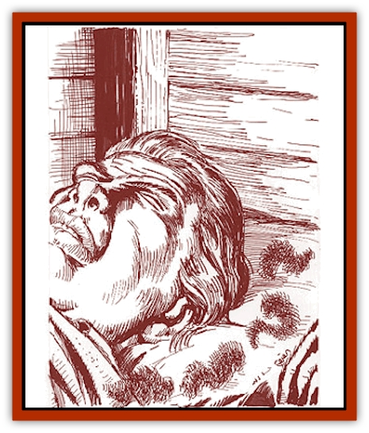

# Trosip

| Statistic | **Trosip** |
| --- | --- |
| **Activity Cycle:** | Any |
| **Alignment:** | Neutral |
| **Armor Class:** | 10 |
| **Climate/Terrain:** | Any interior or subterranean |
| **Damage/Attack:** | Nil |
| **Diet:** | See below |
| **Frequency:** | Very rare |
| **Hit Dice:** | 1 hp |
| **Intelligence:** | Animal (1) |
| **Magic Resistance:** | Nil |
| **Morale:** | Unreliable (2-4) |
| **Movement:** | 3 |
| **No. Appearing:** | 4d6 |
| **No. of Attacks:** | 1 |
| **Organization:** | Colony |
| **Size:** | T (6-9&rdquo; diameter) |
| **Special Attacks:** | Suffocation |
| **Special Defenses:** | Nil |
| **THAC0:** | 20 |
| **Treasure:** | Nil |
| **XP Value:** | 35 |

Trosips look like dark gray dust bunnies. They blend in very well with ordinary cave, dungeon, or household dust. Trosips are attracted to the body heat of sleeping creatures. They snuggle up to these creatures to stay warm, suffocating the victim in the process.

Trosips have had a profound effect on households throughout the Savage Coast region. Even the poorest Savage Coast hovel is kept spotlessly clean, lest it provide a habitat for these deadly creatures.

**Combat:** Trosips attack only sleeping creatures. They have the ability to detect vibrations and motion within a 60-foot radius, ignoring *invisibility* and similar spells. They do not move if somebody is awake within the range of their senses.

When they are not moving, trosips are indistinguishable from normal dust. They become effectively invisible, although they can be detected with any spell or device that allows the user to detect invisible creatures. Some animals, such as [[Cat_Small|cats]], can see trosips. Trosips also move silently 95% of the time.

When the trosips attack, the victim must make a successful saving throw vs. paralyzation (only magical protection bonuses apply) or suffocate in his sleep in 1d4+1 rounds. Once the victim is dead, the trosips leave the cooling body and fade back into the background dust.

If the saving throw is successful, the victim wakes up in time to wave off the marauding trosips. The creatures quickly flee. While they cannot cover long distances at any speed, they can move very quickly in short spurts. Often they are gone and hidden before the victim fully awakens, leaving the victim out of breath, thinking he must have suffered from a nightmare about being suffocated.

It takes at least four trosips to launch an effective attack against a man-sized creature. A group of 24 trosips could thus attack a group of six sleeping adult humans. If more than twelve trosips attack a single creature, the victim must make two successful saving throws in order to survive.

Babies, small children, and invalids are especially vulnerable to this menace.

**Habitat/Society:** Trosips always congregate in groups. Where one trosip is found, others will surely be nearby.

Trosips were discovered by Tobin, a noted biologist-sage of the time. Tobin used an unknown magical means to mask his presence and observed these deadly creatures in action. Learned folk call these creatures trosips, but common folk often call them "death dust" and "breath-stealers". Assassins have been known to use these creatures to kill their victims.

**Ecology:** Left to themselves, trosips multiply quickly. A single trosip invading a home can multiply into a horde of 24 or more within a matter of days. In addition to the energy that they draw from the body heat of their victims, trosips also feed on bits of dirt and refuse dropped on the floor. If they were less deadly, they would make highly effective household cleaners.

These creatures provide an excellent reason to keep the house spotlessly clean. The Savage Coast obsession with cleanliness has had several side effects, most noticeably a drastic drop in the occurrence of disease.

---
## Discovery & Documentation

**Source Publication:** Monstrous Compendium Savage Coast Appendix (Online Exclusive) (1995)
**Campaign Setting:** Mystara
**Author(s):** Loren L Coleman, Ted James, Thomas Zuvich, Cindi M. Rice

### Other Creatures Found in This Source Book
   * [[Aranea_Savage_Coast|Aranea (Savage Coast)]]
   * [[Arashaeem|Arashaeem]]
   * [[Batracine|Batracine]]
   * [[Cat_Marine|Cat, Marine]]
   * [[Cinnavixen|Cinnavixen]]
   * [[Clockwork_Swordsman|Clockwork Swordsman]]
   * [[Critter_Temple|Critter, Temple]]
   * [[Cursed_One|Cursed One]]
   * [[Deathmare|Deathmare]]
   * [[Dragon_Savage_Coast_Crimson|Dragon (Savage Coast), Crimson]]
   * [[Dragon_Savage_Coast_Red_Hawk|Dragon (Savage Coast), Red Hawk]]
   * [[Echyan|Echyan]]
   * [[Ee'aar|Ee'aar]]
   * [[Enduk|Enduk]]
   * [[Fachan_Savage_Coast|Fachan (Savage Coast)]]
   * [[Feliquine|Feliquine]]
   * [[Fiend_Narvaezan|Fiend, Narvaezan]]
   * [[Frelôn|Frelôn]]
   * [[Ghriest|Ghriest]]
   * [[Glutton_Sea|Glutton, Sea]]
   * [[Goatman|Goatman]]
   * [[Golem_Naâruk|Golem, Naâruk]]
   * [[Golem_Savage_Coast|Golem (Savage Coast)]]
   * [[Grudgling|Grudgling]]
   * [[Heraldic_Servant_I|Heraldic Servant I]]
   * [[Heraldic_Servant_II|Heraldic Servant II]]
   * [[Heraldic_Servant_III|Heraldic Servant III]]
   * [[Heraldic_Servant_IV|Heraldic Servant IV]]
   * [[Heraldic_Servant_V|Heraldic Servant V]]
   * [[Heraldic_Servant_General_Information|Heraldic Servant, General Information]]
   * [[Hermit_Sea|Hermit, Sea]]
   * [[Jorri|Jorri]]
   * [[Juhrion|Juhrion]]
   * [[Kla'a-tah|Kla'a-tah]]
   * [[Leech_Legacy|Leech, Legacy]]
   * [[Lich_Inheritor|Lich, Inheritor]]
   * [[Lizard_Kin_Savage_Coast|Lizard Kin (Savage Coast)]]
   * [[Lupasus|Lupasus]]
   * [[Lupin|Lupin]]
   * [[Lyra_Bird_Saragón|Lyra Bird, Saragón]]
   * [[Malfera|Malfera]]
   * [[Manscorpion_Nimmurian|Manscorpion, Nimmurian]]
   * [[Mythuínn_Folk|Mythuínn Folk]]
   * [[Neshezu|Neshezu]]
   * [[Nikt'oo|Nikt'oo]]
   * [[Nosferatu|Nosferatu]]
   * [[Omm-wa|Omm-wa]]
   * [[Omshirim|Omshirim]]
   * [[Parasite_Savage_Coast|Parasite (Savage Coast)]]
   * [[Phanaton|Phanaton]]
   * [[Plant_Savage_Coast|Plant (Savage Coast)]]
   * [[Pudding_Vermilion|Pudding, Vermilion]]
   * [[Rakasta|Rakasta]]
   * [[Ray_Forest|Ray, Forest]]
   * [[Shedu_Greater_Savage_Coast|Shedu, Greater (Savage Coast)]]
   * [[Shimmerfish|Shimmerfish]]
   * [[Skinwing|Skinwing]]
   * [[Spawn_of_Nimmur|Spawn of Nimmur]]
   * [[Spider-spy|Spider-spy]]
   * [[Spirit_Heroic|Spirit, Heroic]]
   * [[Spirit_Walleran|Spirit, Walleran]]
   * [[Succulus|Succulus]]
   * [[Swampmare|Swampmare]]
   * [[Symbiont_Shadow|Symbiont, Shadow]]
   * [[Tortle|Tortle]]
   * [[Troll_Legacy|Troll, Legacy]]
   * [[Tyminid|Tyminid]]
   * [[Utukku|Utukku]]
   * [[Voat|Voat]]
   * [[Voat_Herathian|Voat, Herathian]]
   * [[Vulturehound|Vulturehound]]
   * [[Wallara|Wallara]]
   * [[Wurmling|Wurmling]]
   * [[Wynzet|Wynzet]]
   * [[Yeshom|Yeshom]]
   * [[Zombie_Red|Zombie, Red]]
