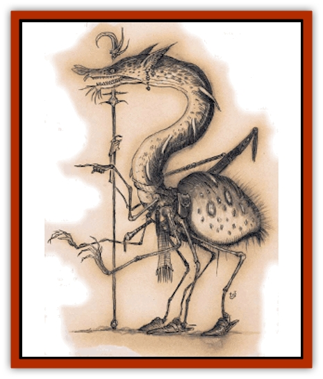

# Tso

| Statistic | **Tso** |
| --- | --- |
| **Activity Cycle:** | Any |
| **Alignment:** | Lawful evil |
| **Armor Class:** | 1 (0) |
| **Climate/Terrain:** | Outlands, any lawful plane |
| **Damage/Attack:** | 1d4/1d4/1d8 and by weapon |
| **Diet:** | Omnivore |
| **Frequency:** | Rare |
| **Hit Dice:** | 7 |
| **Intelligence:** | High (13-14) |
| **Magic Resistance:** | Nil |
| **Morale:** | Unsteady (5-7) |
| **Movement:** | 9, Cl 3 |
| **No. Appearing:** | 3-18 |
| **No. of Attacks:** | 3 and 1 |
| **Organization:** | Brood |
| **Size:** | M (5½' tall) |
| **Special Attacks:** | Poison, magic use |
| **Special Defenses:** | Nil |
| **THAC0:** | 13 |
| **Treasure:** | E (individuals J,K,M,Q) |
| **XP Value:** | 3,000 |

The tso are a race of slavers, smugglers, and cross-traders who roam the lawful planes - at least until they reach Arcadia or Mount Celestia, where they're not at all welcome. Tso are arrangers and procurers, eagerly pursuing the accumulation of wealth no matter what it takes. Despite their absolute lack of scruples and uncontrollable avarice, they're trustworthy in one regard: They never do anything unless they've got an ironclad contract for it.

Tso are related to [[Neogi|neogi]], a race of similar appearance and tastes found on the Prime Material Plane. They're larger and stronger than their clueless cousins, standing about as tall as an adult human. The tso's body is spiderlike, with eight insectile limbs and a bulging abdomen. A long, serpentine neck rises from the creature's thorax, and its head is eellike with a mouth full of needle-sharp teeth. Unlike neogi, tso generally use only the rearmost pairs of legs for walking; the forward limbs are smaller, manipulative members. Tso are completely hairless, and their bodies are covered with gleaming chitin and leathery black skin at the joints or along their neck and head.

There aren't many tso, and as a race they're highly social. It's unheard of to meet a lone tso without others of its kind nearby. Tso're capable of magically enslaving other creatures to be their guards and agents, and a tso brood�s normally accompanied by 2 to 3 times their number of slaves and bodyguards. All tso're at least marginally competent as mages, and it's rumored that an entire brood acting together can weave spells of dreadful power and sinister purpose.

A brood of tso travels in a bizarre vessel shaped like a monstrous spider; the individual design and characteristics of the vessel are different for each brood, but all tso vessels are capable of flight by means of a secret enchantment. A tso ship's commonly known as an aracheon, aracheas, or arachantine.

**Combat:** Tso're capable fighters, but they're also a cowardly race and go to great lengths to stay out of harm's way, letting their slaves fight for them. As noted above, a brood of tso can have anywhere from 2 to 3 times their own number of *charmed* slaves and guards. About 75% of these'll be planar or prime humans, [[Githzerai|githzerai]], and [[Tiefling|tieflings]] or [[Aasimar|aasimar]]. The remainder're rarer creatures such as lesser fiends or [[Modron|modrons]], [[Khaasta|khaasta]], or [[Reave|reaves]]. These sods'll fight to the death if so ordered by the tso, but it's more common for a typical tso to be careful of its property and try not to get its slaves killed needlessly. That's just good business sense.

When a tso's desperate or backed into a corner, it can fight surprisingly well. It strikes with its two uppermost claws for 1d4 points of damage each, a vicious bite for 1d8 points of damage, and uses its second pair of limbs to wield either a two-handed weapon (a polearm or staff) or a one-handed weapon and shield, improving its AC to 0. The tso's bite is poisonous; anyone bitten by the creature must make a successful save versus poison or suffer 1d10 points of extra damage and be *paralyzed* for 1d4 turns.

Tso've got a powerful magical ability to *enslave* other creatures. This functions like an extremely powerful *charm*. The tso must be able to touch its victim and can make no other attack that round. The victim must make a successful saving throw versus spell at -2 or fall under the tso's thrall, serving willingly and without reservation. The victim's Intelligence score is considered to be halved for purposes of determining the time period between saving throws to escape the *charm*.

In addition to their *enslavement* ability, all tso are mages of levels 2 to 5 (d4+1), with appropriate spell capabilities. They favor nondestructive spells that provide information, deception, or the ability to capture an opponent. Tso perceive *phantasmal force* or *detect invisibility* to be far more useful than *burning hands* or *Melf's acid arrow*.

A group of tso can cast cooperative magic at the base level of the most skillful tso present, plus one for each additional tso - a 5th-level tso mage with 6 lesser tso aiding it casts spells as an 11th-level wizard. The leading tso can choose any spell available to its new level, regardless of whether or not it had memorized the spell to be cast, but the casting time increases tenfold; a spell with a casting time of 7 requires 7 rounds of cooperative spellcasting. Cooperative magic is a property of the tso approach to magic, which is alien and undecipherable to nontso wizards. The spell that empowers the aracheons with the ability to navigate the skies is jealously guarded and must be cast by a brood of at least 13 tso.

**Habitat/Society:** Tso are social creatures that don't like to be separated from others of their kind. Their social lives revolve around the rest of their brood and the conduct of business from the brood ship. From time to time, business arrangements might require a smaller group of tso to remain bebind, but it's almost inconceivable that fewer than three tso would be sent on such a mission. When a tso does have to leave the ship, it brings its personal servants along with it.

The second driving force behind the tso is pure avarice. A tso's greed is legendary. The tso constantly seek out ways to make money, either through service rendered or the acquisition of highly-desired goods. For example, a tso brood might learn that a Lord of the Nine in Baator's taken a fancy to gems of a certain type. They'll draw up a contract with the [[Baatezu_General_Information|baatezu]] lord to seek out and bring back the objects in question, and then travel to where they can get what's called for. On the other end of the deal, the tso'll use any means necessary to get what they've promised to provide. (It's more profitable when a body doesn't pay to get the inventory he means to sell, after all.)

Tso broods'll take contracts on almost anything. They'll carry slaves, contraband, or even legitimate trade from time to time. They'll accept contracts for kidnaping, assassinations, or arson. If there's a profit in it somewhere, the tso're interested. A brood of tso's extremely devious and clever in the wordings of its contracts and bury all kinds of clauses and subcontracts in the body of the main draft. Tso figure if a sod don't read what he signs, he deserves to get peeled. Negotiations between tso and baatezu are something to see.

The brood ship's led by the oldest and most powerful tso. Usually, this's the most accomplished sorcerer of the brood, but it can also be the tso with the most powerful slave. Tso measure their station in the brood very carefully, factoring in personal wealth, power, and the number and quality of slaves each tso controls. Tso organization's simple: If a blood with a higher standing says jump, the lower ranks jump.

**Ecology:** Tso reproduce by selecting one of their older brood-members to become the parent of a new brood. This doesn't happen at any fixed interval - it just depends on when a tso reaches a suitable age. When this happens, the other members of the brood paralyze the parent-to-be, beginning a series of radical body changes. The brooding tso is immobilized, but eats constantly for 8 to 10 weeks before 3 to 5 young emerge from its body, killing the parent.

Unlike a neogi brood, the young tso emerge as sentient but smaller versions of their parent. There's a strong tie between siblings, and they're likely to spend their entire lives together. The older tso around the young raise them, and in less than a year the young're incorporated into the tso hierarchy as the low sods on the totem pole.

From time to time, a group of tso becomes too large for its aracheon. Trading parties'll be permanently dispatched from the ship to alleviate the problem for a while, but eventually the brood must split and a new ship'll have to be built. This is a dangerous and unpredictable time for the tso, and months of scheming, plots, and deals revolve around deciding which tso will remain with the original group and which'll strike off on their own.

---
## Discovery & Documentation

**Source Publication:** Planescape II (1996)
**Campaign Setting:** Planescape
**Author(s):** Rich Baker, Karen S. Boomgarden

### Other Creatures Found in This Source Book
   * [[Aasimar|Aasimar]]
   * [[Abrian|Abrian]]
   * [[Arcane|Arcane]]
   * [[Balaena|Balaena]]
   * [[Beholder-kin_Observer|Beholder-kin, Observer]]
   * [[Bloodthorn|Bloodthorn]]
   * [[Bonespear|Bonespear]]
   * [[Darkweaver|Darkweaver]]
   * [[Demarax|Demarax]]
   * [[Dhour|Dhour]]
   * [[Eater_of_Knowledge|Eater of Knowledge]]
   * [[Eladrin_Greater_Firre|Eladrin, Greater, Firre]]
   * [[Eladrin_Greater_Ghaele|Eladrin, Greater, Ghaele]]
   * [[Eladrin_Greater_Tulani|Eladrin, Greater, Tulani]]
   * [[Eladrin_Lesser_Bralani|Eladrin, Lesser, Bralani]]
   * [[Eladrin_Lesser_Coure|Eladrin, Lesser, Coure]]
   * [[Eladrin_Lesser_Noviere|Eladrin, Lesser, Noviere]]
   * [[Eladrin_Lesser_Shiere|Eladrin, Lesser, Shiere]]
   * [[Fhorge|Fhorge]]
   * [[Ghostlight|Ghostlight]]
   * [[Guardinal_Avoral|Guardinal, Avoral]]
   * [[Guardinal_Cervidal|Guardinal, Cervidal]]
   * [[Guardinal_General_Information|Guardinal, General Information]]
   * [[Guardinal_Equinal|Guardinal, Equinal]]
   * [[Guardinal_Leonal|Guardinal, Leonal]]
   * [[Guardinal_Lupinal|Guardinal, Lupinal]]
   * [[Guardinal_Ursinal|Guardinal, Ursinal]]
   * [[Hollyphant|Hollyphant]]
   * [[Incantifer|Incantifer]]
   * [[Ironmaw|Ironmaw]]
   * [[Keeper|Keeper]]
   * [[Khaasta|Khaasta]]
   * [[Leomarh|Leomarh]]
   * [[Monster_of_Legend|Monster of Legend]]
   * [[Mortai|Mortai]]
   * [[Noctral|Noctral]]
   * [[Quill|Quill]]
   * [[Razorvine|Razorvine]]
   * [[Reave|Reave]]
   * [[Retriever|Retriever]]
   * [[Rilmani_Abiorach|Rilmani, Abiorach]]
   * [[Rilmani_General_Information|Rilmani, General Information]]
   * [[Rilmani_Argenach|Rilmani, Argenach]]
   * [[Rilmani_Aurumach|Rilmani, Aurumach]]
   * [[Rilmani_Cuprilach|Rilmani, Cuprilach]]
   * [[Rilmani_Ferrumach|Rilmani, Ferrumach]]
   * [[Rilmani_Plumach|Rilmani, Plumach]]
   * [[Shadowdrake|Shadowdrake]]
   * [[Spellhaunt|Spellhaunt]]
   * [[Spider_Hook|Spider, Hook]]
   * [[Sunfly|Sunfly]]
   * [[Sword_Spirit|Sword Spirit]]
   * [[Tanar'ri_Lesser_Bulezau|Tanar'ri, Lesser, Bulezau]]
   * [[Tanar'ri_Lesser_Maurezhi|Tanar'ri, Lesser, Maurezhi]]
   * [[Tanar'ri_Lesser_Yochlol|Tanar'ri, Lesser, Yochlol]]
   * [[Tanar'ri_General_Information|Tanar'ri, General Information]]
   * [[Tanar'ri_True_Alkilith|Tanar'ri, True, Alkilith]]
   * [[Terlen|Terlen]]
   * [[T'uen-rin|T'uen-rin]]
   * [[Vaporighu|Vaporighu]]
   * [[Vorr|Vorr]]
   * [[Wastrel|Wastrel]]
   * [[Wraithworm|Wraithworm]]
   * [[Yugoloth_Lesser_Canoloth|Yugoloth, Lesser, Canoloth]]
   * [[Zoveri|Zoveri]]
