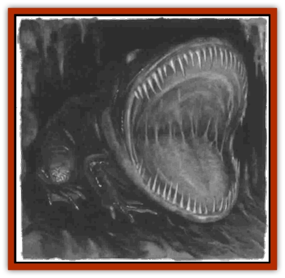

# Tunnelmouth Dweller

| Statistic | **Tunnelmouth Dweller** |
| --- | --- |
| **Activity Cycle:** | Any |
| **Alignment:** | Neutral |
| **Armor Class:** | 6 |
| **Climate/Terrain:** | Subterranean |
| **Damage/Attack:** | 2-16 |
| **Diet:** | Carnivore |
| **Frequency:** | Very rare |
| **Hit Dice:** | 10 |
| **Intelligence:** | Non- (0) |
| **Magic Resistance:** | Nil |
| **Morale:** | Fearless (20) |
| **Movement:** | 3, Swim 9 |
| **No. Appearing:** | 1 |
| **No. of Attacks:** | 1 |
| **Organization:** | Solitary |
| **Size:** | H (20' long) |
| **Special Attacks:** | Swallow whole |
| **Special Defenses:** | Partial immunity to fire (see below) |
| **THAC0:** | 11 |
| **Treasure:** | Incidental |
| **XP Value:** | 4,000 |

The tunnelmouth dweller is a horrifying predator of dungeon and cavern alike. This creature has a mouth as wide as half the length of its body, ten feet in diameter, the typical width uf a dungeon tunnel The entire animal is a rich deep brown. It finds its way through the Underdark by a means of echolocation; the huge, blank white orbs near its mouth once functioned as eyes for its ancestors.

**Combat:** The tunnelmouth dweller has only one attack, but it is especially lethal. When it encounters prey while prowling through cavern tunnels or dungeon corridors, it lunges forward, swallowing whole victims of up to Size H. (The monster's skin stretches, so it can swallow prey its own size.) A tunnelmouth dweller can swallow three PCs at once, or four if they're packed together (like a formation of spearmen). Swallowed characters suffer 2d8 points of damage on the first round from the monster's long teeth. In following rounds, victims suffer 1d6 points of damage from the dweller's digestive juices until they either die or are rescued. The only ways to avoid being swallowed are to brace the creature's jaws with a 10'-long pole or a polearm (requiring a successful Dexterity check, assuming the weapon is already in hand) or successfully dodge the snapping jaws.

Swallowed characters cannot defend themselves unless they have short stabbing weapons such as short swords, knives, or daggers. The entire mouth and throat of the creature is slick with a slimy mucus wet enough to extinguish torches and uncovered lantern flames. Any ordinary flame attack that strikes inside the creature's gaping jaws is totally extinguished, while magical fire causes only half damage (one-quarter damage if the dweller makes a successful saving throw). Note that this only applies to those fighting the creature at its front, which is usually the case. If the tunnelmouth dweller can be attacked at its side or rear, fire-based attacks work normally. Of course, since the big-mouthed thing fills the entire width of a typical corridor, getting around it isn't easy.

**Habitat/Society:** Like the majority of true subterranean predators, the tunnelmouth dweller is solitary, meeting peacefully with its own kind only for an hour or so each year for the mating season. After mating, the couple allow each other to leave uneaten, at which time all consideration ceases. If they meet again before the next mating season, even later on the same day, they try to eat each other as they do everything else. (Pity the group caught between two tunnelmouth dwellers in a corridor with no accessible side tunnels.) The females lay clutches of six leathery eggs, of which perhaps one or two hatchlings survive long enough to reach adulthood.

**Ecology:** Tunnelmouth dweller skin is much in demand among mages seeking to create a bag of holding. Its mucus is also used in extinguishing fires, selling for roughly 50 gp a vial. (One vial can put out a single torch, lantern, or campfire.) It keeps no treasure but often swallows adventurers who have valuable items on them. To retrieve these goods, one must either butcher the creature's carcass or pick apart its droppings.

Those who don't know any better buy tunnelmouth dweller eggs at 500 gp apiece but quickly regret their purchase. The young have 2 Hit Dice and are 2 feet long at birth; they grow to full size within 8 months, gaining two more Hit Dice and slightly more than 2 feet in length per month. Because the creature has such a voracious appetite, it is an expensive guardian for any stronghold and usually wears out its welcome among even evil NPCs within a matter of weeks.

---
## Discovery & Documentation

**Source Publication:** Dragon267 (2000)
**Campaign Setting:** Dragon Magazine
**Author(s):** 

### Other Creatures Found in This Source Book
   * [[Catfish_Stalking|Catfish, Stalking]]
