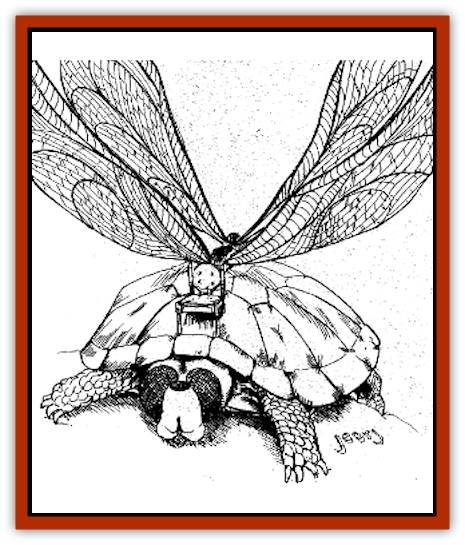

# Turtle - Dragonfly

| Statistic | **Turtle, Dragonfly** |
| --- | --- |
| **Activity Cycle:** | Day |
| **Alignment:** | Neutral |
| **Armor Class:** | 0/3 |
| **Climate/Terrain:** | Any |
| **Damage/Attack:** | 1-4,2-8, or 3-12 |
| **Diet:** | Omnivore |
| **Frequency:** | Very rare |
| **Hit Dice:** | 8 (adult) |
| **Intelligence:** | Animal (1) |
| **Magic Resistance:** | Nil |
| **Morale:** | Steady (11-12) |
| **Movement:** | 3, fly 36 (C) |
| **No. Appearing:** | 1 |
| **No. of Attacks:** | 1 |
| **Organization:** | Solitary |
| **Size:** | L (10' long) |
| **Special Attacks:** | Nil |
| **Special Defenses:** | Hide limbs |
| **THAC0:** | 1-2 HD: 19 / 3-4 HD: 17 / 5-6 HD: 15 / 7-8 HD: 13 |
| **Treasure:** | Nil |
| **XP Value:** | 1 HD: 35 / 2 HD: 65 / 3 HD: 120 / 4 HD: 270 / 5 HD: 420 / 6 HD: 650 / 7 HD: 975 / 8 HD: 1,400 |

Also known as "hovershells," these creatures are a mix between a [[Turtle_Giant|giant turtle]] and a [[Dragonfly_Giant|giant dragonfly]]. They retain the turtle's shell and limbs but sport the dragonfly's head and wings. These creatures are highly valued as flying mounts.

Adding to the creature's already bizarre appearance are the frequent "modifications" on its shell. To make it a more comfortable mode of travel, wizards often apply *sovereign glue* to the shell, attaching such things as chairs, chests, and the like. Dragonfly turtles are quite a sight, buzzing through the air with their legs pulled into their shells, ridden by a wizard seated comfortably on a padded chair mounted to the creature's shell.

While dragonfly turtles do not understand the concept of treasure, there are often valuables in the furniture glued to them. The type of treasure, if any, varies on a case-by-case basis depending upon the needs and habits of the wizard using the dragonfly turtle as a riding mount. For obvious reasons, any chests making up part of a dragonfly turtle's "furniture" are equipped with strong locks to prevent them from being accidentally opened while in flight.

**Combat:** The dragonfly turtle's only attack is with its razorsharp mandibles, which cause 3d4 hp damage per round. Because of their large, heavy turtle shells, these creatures are not as maneuverable as the giant dragonfly, dropping down to maneuverability class C. While they can hover in place and fly as fast as a giant dragonfly, they are unable to dodge missiles as the giant insect can. Fortunately, their thick armored carapace protects them. The head and wings of a dragonfly turtle are AC 3; the armored shell is AC 0.

The wings of these creatures are gauzy and fragile; hitting one in combat requires a called shot, but once any of the creatures four wings suffers 4 hp damage, that wing is destroyed, and the dragonfly turtle is unable to fly, plummeting to the ground if airborne. Wing damage is calculated separately, as damage to the wings does not injure the beast.

Of course, as dragonfly turtles are used primarily as a means of transportation, anyone in combat with one of these creatures most likely must fight the person or persons riding aboard the beast. A dragonfly turtle's hovering ability makes it a relatively stable platform, allowing missile weapons and spells to be used from the creature's back without penalty.

**Habitat/Society:** Dragonfly turtles are a new race, purposely created by wizards as a means of transportation. As such, they are almost never encountered in the wild. Rather, they are kept in comfortable "stables" until needed. Because of their rather limited intelligence, dragonfly turtles will not seek to escape confinement as long as they cannot see outside; any barn-like structure will do to keep them in one place. If they must be "parked" outside, a strong chain is necessary, as they easily chew through even the strongest rope. They are intelligent enough to obey simple commands if properly trained: dragonfly turtles are controlled by a bridle and reins.

**Ecology:** If a wizard creates a male and a female of these creatures, they can be induced to mate. (Mating is a much simpler procedure for the beasts if there's no "furniture" glued to the female's shell, however.) The female lays 2-5 (1d4+1) leathery eggs that hatch in about 4 months. Newly-hatched dragonfly turtles are wingless and aquatic, able to swim at a movement rate of 3. They are about 3' long when born, have 1 HD, and can bite for 1d4 points of damage. Each year thereafter they grow 1 HD and 1' in length, adding 1d4 to their bite damage every three years, until they do full damage (3d4) when 6 years old. Their wings grow in when they reach 4 years of age, at which point they stop swimming (their wings don't function well when wet). Dragonfly turtles live about 20 years.

Their diet consists mainly of insects captured in flight and fish, although they also ingest small quantities of plant matter (especially algae).

---
## Discovery & Documentation

**Source Publication:** Dragon243 (1998)
**Campaign Setting:** Dragon Magazine
**Author(s):** Steve Berman, Roger Raupp, Johnathan M. Richards, George Vrbanic

### Other Creatures Found in This Source Book
   * [[Armadillephant|Armadillephant]]
   * [[Cat_Moat|Cat, Moat]]
   * [[Duckbunny|Duckbunny]]
   * [[Horse_Spider-|Horse, Spider-]]
