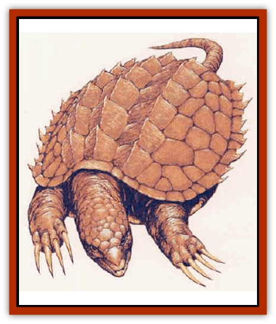

# Turtle - Giant

| Statistic | **Sea, Giant** | **Snapping, Giant** |
| --- | --- | --- |
| **Activity Cycle:** | Any | Any |
| **Alignment:** | Neutral | Neutral |
| **Armor Class:** | 2/5 | 0/5 |
| **Climate/Terrain:** | Any sea | Lake or river |
| **Damage/Attack:** | 4d4 | 6d4 |
| **Diet:** | Omnivore | Omnivore |
| **Frequency:** | Uncommon | Uncommon |
| **Hit Dice:** | 15 | 10 |
| **Intelligence:** | Non- (0) | Non- (0) |
| **Magic Resistance:** | Nil | Nil |
| **Morale:** | Champion (15-16) | Elite (13-14) |
| **Movement:** | 1, Sw 15 | 3, Sw 2 |
| **No. Appearing:** | 1-3 | 1-4 |
| **No. of Attacks:** | 1 | 1 |
| **Organization:** | Solitary | Solitary |
| **Size:** | H (50' diameter) | H (40' diameter) |
| **Special Attacks:** | Upset craft | Surprise, jaws |
| **Special Defenses:** | Hide limbs | Hide limbs |
| **THAC0:** | 5 | 11 |
| **Treasure:** | Nil | Nil |
| **XP Value:** | 5,000 | 3,000 |

Giant turtles are simply huge varieties of the normal species encountered daily in the wild. They resemble their common counterparts in every respect except for size.

A turtle is characterized by its bony outer shell. The lower portion of the shell is known as the plastron, while the upper shell is referred to as the carapace. It is into this shell that a turtle withdraws its legs and head when threatened. Some turtles are incapable of completely shielding their limbs in this way, and plaster their legs very close to the shell for protection.

Giant turtles eat whatever is available in their environment, from living plants to all types of insects, small mammals, and fish of all kinds. They prefer fresh green plants and live worms, as turtles do not enjoy feeding on carrion or rotting vegetation. Naturally, such foods are fair game if the turtle is in danger of starvation.

Turtles have very long life spans-from 30 to 150 years, depending on the species. They are slow-moving and thus would rather withdraw into their shells when faced with an enemy, rather than either fight or flee. However, when harmed or persistently molested, the strong, quick bite of a giant turtle is a deadly weapon indeed.

Giant turtle meat is considered a delicacy in most cultures, and it is highly nourishing and palatable. The upper shells of giant turtles are also greatly preferred as they can be made into small huts, strong roofs, or even boats. Without exception, the tropical marine varieties of sea turtle are the finest tasting and have the most attractive shells.

**Giant Sea Turtle**

This basically non-aggressive marine creature fights fiercely if annoyed or threatened. The tearing bite of giant sea turtle causes 4d4 points of damage to the unlucky victim. If one surfaces beneath a small craft, there is a possibility of upsetting the vessel. There is a 90% chance for a rowboat but only 10% for a longship. Adjust this base chance for other sea-going vessels according to the size and stability of the craft.

The head and flippers of giant sea turtles are Armor Class 5, while the shell is AC 2. If the turtle withdraws its head and flippers into its shell either for defense or while resting, all attacks are considered to be directed against the shell.

**Giant Snapping Turtle**

p Feared greatly for their voracious appetite and aggressiveness, giant snapping turtles are found in large lakes and rivers. Many myths about lake monsters were born out of sightings of these relatively common freshwater creatures.

They lurk near shore or on the bottom, they do not swim quickly. There they remain motionless, causing a 3 penalty to opponents' surprise rolls. They then shoot forth their long necks (up to ten feet away) to grab their prey. Once a victim is bitten (for 6d4 points of damage), he is invariably grabbed by the powerful jaws. Only a successful bend bars/lift gates roll frees one from the vicious mouth, as spells cannot be cast or weapons used at these times. Meanwhile, bite damage is automatic each round while grabbed. When the victim becomes unconscious, the giant snapping turtle throws back its head, gently tossing the victim into the air a few feet, then down into the open gullet of the beast.

The lightly plated heads and limbs of these monsters are AC 5 when extended, but the shell affords AC 0 protection to the body, and to the limbs if retracted.

**Other Giant Turtles**

Other varieties of giant turtles are known or rumored, including a desert turtle much like the giant snapping turtle but adapted to arid regions, and there are legends of an ocean-going [[Zaratan|sea turtle]] of such size that it was mistaken for a small island!

---
## Discovery & Documentation

**Source Publication:** MC5 Greyhawk Appendix (1989)
**Campaign Setting:** Advanced Dungeons & Dragons 2nd Edition
**Author(s):** Grant Boucher, William W. Connors, Steve Gilbert, Bruce Nesmith, Chris Mortika, Skip Williams

### Other Creatures Found in This Source Book
   * [[Aspis|Aspis]]
   * [[Beastman|Beastman]]
   * [[Bonesnapper|Bonesnapper]]
   * [[Booka|Booka]]
   * [[Brownie_Buckawn|Brownie, Buckawn]]
   * [[Brownie_Quickling|Brownie, Quickling]]
   * [[Crystalmist|Crystalmist]]
   * [[Dragon_Cloud|Dragon, Cloud]]
   * [[Dragon_Oerth_Greyhawk|Dragon (Oerth), Greyhawk]]
   * [[Dragonfly_Giant|Dragonfly, Giant]]
   * [[Dragonnel|Dragonnel]]
   * [[Elf_Grugach|Elf, Grugach]]
   * [[Elf_Valley|Elf, Valley]]
   * [[Golem_Necrophidius|Golem, Necrophidius]]
   * [[Grell_Wild|Grell, Wild]]
   * [[Grung|Grung]]
   * [[Hobgoblin_Norker|Hobgoblin, Norker]]
   * [[Hook_Horror|Hook Horror]]
   * [[Horgar|Horgar]]
   * [[Hound_Yeth|Hound, Yeth]]
   * [[Iguana_Giant|Iguana, Giant]]
   * [[Ingundi|Ingundi]]
   * [[Kech|Kech]]
   * [[Kyuss_Son_of|Kyuss, Son of]]
   * [[Mite|Mite]]
   * [[Needleman|Needleman]]
   * [[Plant_Carnivorous_Oerth|Plant, Carnivorous (Oerth)]]
   * [[Plant_Carnivorous_Vampire_Cactus|Plant, Carnivorous, Vampire Cactus]]
   * [[Plasmoid_General_Information|Plasmoid, General Information]]
   * [[Rat_Oerth|Rat (Oerth)]]
   * [[Raven_Crow|Raven/Crow]]
   * [[Scarecrow|Scarecrow]]
   * [[Shadow_Slow|Shadow, Slow]]
   * [[Skulk|Skulk]]
   * [[Snail|Snail]]
   * [[Sprite|Sprite]]
   * [[Taer|Taer]]
   * [[Tentamort|Tentamort]]
   * [[Tyrg|Tyrg]]
   * [[Wolf_Mist|Wolf, Mist]]
   * [[Wraith_Oerth|Wraith (Oerth)]]
   * [[Zygom|Zygom]]
