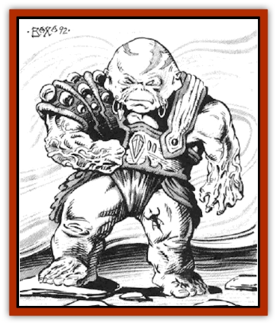

# Tween

| Statistic | **Tween** |
| --- | --- |
| **Activity Cycle:** | Any |
| **Alignment:** | Neutral |
| **Armor Class:** | 10 |
| **Climate/Terrain:** | Any |
| **Damage/Attack:** | By weapon |
| **Diet:** | Omnivore |
| **Frequency:** | Very rare |
| **Hit Dice:** | 1 |
| **Intelligence:** | Very (11-12) |
| **Magic Resistance:** | Nil |
| **Morale:** | Special (see below) |
| **Movement:** | Varies |
| **No. Appearing:** | 1 (10% chance 1-3) |
| **No. of Attacks:** | 1 (on Ethereal Plane only) |
| **Organization:** | Solitary |
| **Size:** | S (3')/Special (see below) |
| **Special Attacks:** | Nil |
| **Special Defenses:** | Etherealness |
| **THAC0:** | 20 |
| **Treasure:** | Nil |
| **XP Value:** | 17 |

A tween is a parasitic creature from the Ethereal Plane. On its home plane it appears as a short, squat, ugly humanoid form with stubby arms and legs, and no neck. On the Prime Material Plane, a tween appears as a smoky or shadowy outline within six feet of whichever being it has chosen as its "host".

**Combat:** The tween can only attack or be attacked on the Ethereal Plane, or by means such as *applying oil of etherealness* to a blade. If such a melee occurs, the tween will fight with a weapon, usually a sword. The tween has no attack ability on the Prime Material Plane, and indeed has little need to defend itself there.

The tween has the ability to see a few seconds into the future, and may communicate this future-sight subliminally to its host. The tween is also able to move relatively light material things short distances, reacting with such speed that it can affect the movement of a weapon in melee. For example, it can reposition its host's sword so that it hits rather than misses. As a result, any character or creature with a tween "partner" gets two die rolls instead of one, whenever a die roll is called for, using the more advantageous of these rolls. This applies to all die rolls: attack rolls, damage rolls, saving throws, etc. This gives the tween's host the appearance of being very "lucky" to any who are not aware that the character is infested with a tween.

While a tween has an obvious beneficial effect on the actions of its host, it has the reverse effect on any other creature, friend or foe, within 50' of the host. While the tween appears to bestow luck upon its host, its parasitic nature absorbs luck from all those nearby. Two die rolls are made for all characters/monsters within a 50' radius whenever a die roll is called for, and the less advantageous is selected. A character with a tween partner is therefore something of a curse to any companions, and usually ends up as an outcast from any adventuring party who knows of his infestation.

**Habitat/Society:** Because of the tween's squat and somewhat ugly natural appearance on the Ethereal Plane, it is considered by most other denizens to be among the lowest form of life residing there, and it is shunned by all other residents, even other tweens. For that reason, most tweens choose to infest a being on the Prime Material Plane and live vicariously through them, deserting their own solitary lives on the Ethereal Plane.

In selecting a host, a tween will prefer an intelligent being, human or near-human, but they have no particular preference for adventurers. After several hours with a new host, a tween will gradually assume the general shape and characteristics of that host, who will appear to have a "shadow" nearby. Once a host has been selected, a tween will remain permanently until the host or the tween dies. Neither tween nor host are able to voluntarily sever the bond. If the host of a tween dies, the shock and grief of losing its host will literally cause the tween to split in two, causing the birth of a new tween. Both tweens then will usually begin looking for new hosts, the "old" tween almost immediately, and the "new" tween as soon as it finds out how miserable its life as a tween on the Ethereal Plane can be.

A tween eats just about anything it can find while alone on the Ethereal Plane without a Prime Material Plane host; after it secures a host, it feeds on the "luck" of those surrounding its host. Its form remains on the Ethereal Plane and no longer needs typical sustenance.

**Ecology:** The tween has no natural enemies on the Ethereal Plane, nor does it have any friends; therefore, most tweens will find and secure a Prime Material Plane host shortly after birth.

There are rumors about some magical research that has been done on the nature of tweens - more specifically, on how to separate a tween from its host without the death of one or the other. A *wish* spell has been proven effective, and experiments have been done with combining *dispel magic*, *remove curse*, and *plane shift*, but thus far the results of these experiments have been disastrous. An *amulet of proof against detection and location* will usually discourage a tween from infesting a character in the first place. The tween prefers to choose an intelligent host, and it cannot gauge a being's Intelligence in the presence of such an amulet.

---
## Discovery & Documentation

**Source Publication:** MC14 Fiend Folio Appendix (1992)
**Campaign Setting:** Fiends Folio
**Author(s):** Don Bingle, John Terra, Wes Nicholson, Tim Beach, Steve Hardinger, Kris Hardinger, Rob Nicholls, Greg Swedberg, Al Boyce, Vince Garcia, Norm Ritchie

### Other Creatures Found in This Source Book
   * [[Aballin|Aballin]]
   * [[Achaierai|Achaierai]]
   * [[Adherer|Adherer]]
   * [[Algoid|Algoid]]
   * [[Al-Mi'raj|Al-Mi'raj]]
   * [[Apparition|Apparition]]
   * [[Caterwaul|Caterwaul]]
   * [[Coffer_Corpse|Coffer Corpse]]
   * [[Crabman|Crabman]]
   * [[Dark_Creeper|Dark Creeper]]
   * [[Dark_Stalker|Dark Stalker]]
   * [[Darter|Darter]]
   * [[Denzelian|Denzelian]]
   * [[Dune_Stalker|Dune Stalker]]
   * [[Dwarf_Urdunnir|Dwarf, Urdunnir]]
   * [[Falcon_Fire|Falcon, Fire]]
   * [[Faux_Faerie|Faux Faerie]]
   * [[Flawder|Flawder]]
   * [[Fyrefly|Fyrefly]]
   * [[Gambado|Gambado]]
   * [[Garbug|Garbug]]
   * [[Giant_Fhoimorien|Giant, Fhoimorien]]
   * [[Gibberling|Gibberling]]
   * [[Gorbel|Gorbel]]
   * [[Grimlock|Grimlock]]
   * [[Hellcat|Hellcat]]
   * [[Ice_Lizard|Ice Lizard]]
   * [[Iron_Cobra|Iron Cobra]]
   * [[Khargra|Khargra]]
   * [[Mantari|Mantari]]
   * [[Penanggalan|Penanggalan]]
   * [[Pernicon|Pernicon]]
   * [[Phantom_Stalker|Phantom Stalker]]
   * [[Retriever|Retriever]]
   * [[Ruve|Ruve]]
   * [[Scathe|Scathe]]
   * [[Sheet_Ghoul_Sheet_Phantom|Sheet Ghoul/Sheet Phantom]]
   * [[Shocker|Shocker]]
   * [[Spanner|Spanner]]
   * [[Stwinger|Stwinger]]
   * [[Sussurus|Sussurus]]
   * [[Symbiotic_Jelly|Symbiotic Jelly]]
   * [[Terithran|Terithran]]
   * [[Thunder_Children|Thunder Children]]
   * [[Troll_Ice|Troll, Ice]]
   * [[Umpleby|Umpleby]]
   * [[Volt|Volt]]
   * [[Xill|Xill]]
   * [[Xvart|Xvart]]
   * [[Zygraat|Zygraat]]
