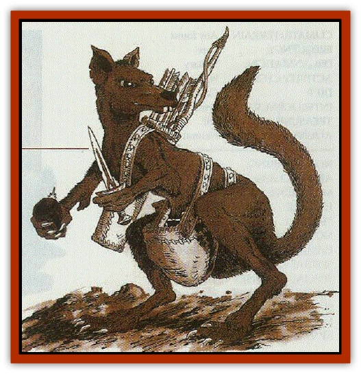
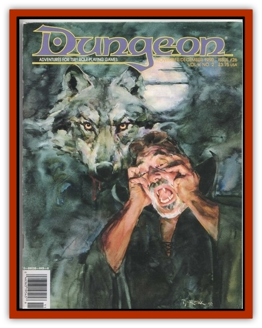

# Twill

| Statistic | **Twill** |
| --- | --- |
| **Activity Cycle:** | Night |
| **Alignment:** | Chaotic good |
| **Armor Class:** | 6 |
| **Climate/Terrain:** | Gnome tunnels |
| **Damage/Attack:** | 1 (bite) or by weapon |
| **Diet:** | Omnivore |
| **Frequency:** | Very rare |
| **Hit Dice:** | ½ |
| **Intelligence:** | Low (5) |
| **Magic Resistance:** | 30% |
| **Morale:** | Average (9) |
| **Movement:** | 12 |
| **No. Appearing:** | Varies |
| **No. of Attacks:** | 1 |
| **Organization:** | Solitary |
| **Size:** | T (6&rdquo; long) |
| **Special Attacks:** | Nil |
| **Special Defenses:** | Invisibility to infravision |
| **THAC0:** | 20 |
| **Treasure:** | Q |
| **XP Value:** | 35 |

The [[Gnome|rock gnome]] pocket [[Rat|rat]] is not actually a rat, or even a rodent. It is a small burrowing marsupial that was bred as a pet by rock gnomes. It is called a "pocket rat" because it resembles a hooded rat in many ways, although its eyes are much larger. The original gnomish name comes from the term used for an apprentice gem miner. With its opposable thumbs and high intelligence, the pocket rat can be a useful friend, the female especially because of her marsupial pouch or "pocket". They are easily trained, grasping the concepts of tool use and language. Most adult pocket rats understand gnomish, though they can't speak it themselves. It is not unusual for their owners to fashion small tools or weapons for them to use.

The pocket rat also has a remarkable sense of smell and a talent for sniffing out precious minerals. It has a 60% chance of detecting precious minerals within a 30' radius, which makes it a favorite pet for the gnomish miner. Most pocket rats have a few gems stashed away somewhere; females use their pockets to store such treasures.

The pocket rat is at home in the absolute darkness of subterranean tunnels and cannot tolerate bright light, which hurts its eyes. Its activity cycle can match its owner's underground, but outdoors the pocket rat remains nocturnal.

The pocket rat also has the magical ability to conceal its body heat, becoming invisible to infravision. It can do this at will and can maintain it indefinitely as long as it is not moving quickly. If it moves at more than half its normal speed, however, its body temperature breaks through the magical concealment and it is detectable again. It must stop before it can become invisible to infravsion once more.

**Combat:** Pocket rats are not the greatest fighters. With their relatively few hit points and tiny bites, they are more likely to flee into the dark shadows of the tunnels and hide than fight. If cornered or defending their young, they fight with their large incisors or perhaps tiny weapons. Gnomes delight in making such miniature weapons for their pets. These can include daggers (Dmg 1-2/1), swords (Dmg 1-3/1-2), and bows and arrows (Dmg 1/1). Pocket rats do not feel comfortable in armor, but the males sometimes wear a leather pouch in imitation of the females.

**Habitat/Society:** The pocket rat is a solitary animal that enjoys spending time with its owner or roaming the tunnels in search of insects and mushrooms to munch. It usually makes its home in a soft earth burrow, but many gnomes enjoy making elaborate houses for their pets with tunnels and wheels in which they can roam and play.

Males and females mate at various times throughout the year, but do not stay together. Gestation lasts for 2-3 weeks, at which time a barely developed young rat makes the journey up its mother's furry belly and into her pouch. The young stay in the pouch for 10 weeks and are in and out of the pouch for another full year. A female pocket rat might have two or three young at different stages of development sharing the same pouch. Needless to say, these particular females find somewhere else to stash their gems. The pocket rat is considered an adult after 2 years and can live as long as 12-15 years.

**Ecology:** The pocket rat was bred (some say engineered) from a common cave marsupial of the same name. The wild breed is unintelligent, however, and lacks the opposable thumbs and body heat disguising ability of its gnomish cousin. The wild pocket rat hoards gems and precious metals, however, and gnomes are always on the lookout for their burrows.

---
## Discovery & Documentation

**Source Publication:** Dungeon #26 (1990)
**Campaign Setting:** Dungeon Magazine
**Author(s):**
