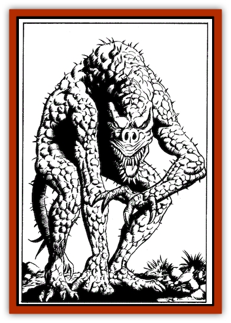
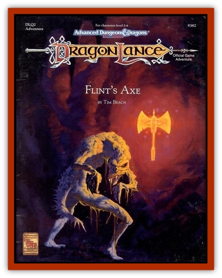

# Tyin

| Statistic | **Adult** | **Larva** |
| --- | --- | --- |
| **Activity Cycle:** | Any | Any |
| **Alignment:** | Neutral | Neutral |
| **Armor Class:** | 5 | 10 |
| **Climate/Terrain:** | Underground | Underground |
| **Damage/Attack:** | 1-4/1-4/1-8/1-6 | 1/1/1/1/1-4 |
| **Diet:** | Carnivore | Blood |
| **Frequency:** | Very rare | Very rare |
| **Hit Dice:** | 4+4 | 1 |
| **Intelligence:** | Semi (2-4) | Animal (1) |
| **Magic Resistance:** | Nil | Nil |
| **Morale:** | Champion (15-16) | Champion (15-16) |
| **Movement:** | 15, Cl 12 | 9, Cl 9 |
| **No. Appearing:** | 1-2 | 5-10 |
| **No. of Attacks:** | 4 | 5 |
| **Organization:** | Solitary | Pack |
| **Size:** | L (9' tall) | S (2' long) |
| **Special Attacks:** | Acid globs, possible disease | Blood drain |
| **Special Defenses:** | Slime | Nil |
| **THAC0:** | 15 | 19 |
| **Treasure:** | A | Nil |
| **XP Value:** | 1,400 | 65 |

The tyin is a grotesque creature that may be related to the [[Disir|disir]]. The tyin is found only on Ansalon, while the disir lives exclusively on the continent of Taladas.

The tyin is basically humanoid, though it is misshapen and bent. Its grayish skin is constantly shedding; loose flaps of flesh hang from its body. The creature oozes a slime that covers most of its body. The slime produces an unpleasant odor that is apparent to anyone who gets close.

**Combat:** The tyin prefers to ambush its prey when possible, eaping from shadowed nooks to bite and claw. It is an excellent climber. With claws that can grip solid stone, it often hides along the ceiling of its lair.

The tyin can attack from a distance by spitting acidic globules from its mouth. The tyin must roll a successful attack roll for a globule to hit. A victim struck by the acid suffers 1d8 points of damage, with a successful saving throw vs. breath weapon indicating the victim receives only half damage

The acid globules are very sticky and continue to cause damage at a rate of 1d4 points per round (successful saving throw for half damage) until washed off or until three rounds have passed.

In melee combat, which the tyin prefers, it rips into its prey with claws, bites, and slaps from its spiked tail. A victim hit by the tyin's bite must roll a successful saving throw vs. poison or contract a degenerative disease

The disease manifests itself 2d4 days after the victim is bitten. The affected individual experiences coughing, chills, and congestion. The disease prevents normal activity. Unless treated, the disease may be fatal; at the end of its three-week course, the victim is allowed another saving throw vs. poison. Failure indicates death, while success indicates the victim has thrown off the disease.

The slime on the tyin's body is quite slippery, enabling it to slide easily through surprisingly small passages. The slime also carries the tyin's disease germs; anyone touching it has a 5% chance of catching the disease (saving throws apply as normal).

**Habitat/Society:** The tyin is a solitary creature. The different genders come together once every two years or so for mating. Afterward, the female seeks a new lair, laying clutches of 1d6 +4 eggs about every two months for the next year

Most of the creature's offspring are slain by other offspring or adults before maturing

**Ecology:** The tyin is generally the dominant predator in any underground area it inhabits. A tyin produces nothing of value, though its acid and slime may prove useful to alchemists in preparing certain potions.

**Larva** 

When a tyin's egg hatches, a crab-like larva emerges. This creature scrabbles along on all four claws, searching for food. When it finds prey, it attempts to attach itself and sink its proboscis into the victim, draining 1d4 points of blood per round until removed (which requires a simple Strength check). The larva molts and matures in about six months.

---
## Discovery & Documentation

**Source Publication:** Flint's Axe (1992)
**Campaign Setting:** Dragonlance
**Author(s):** Tim Beach
