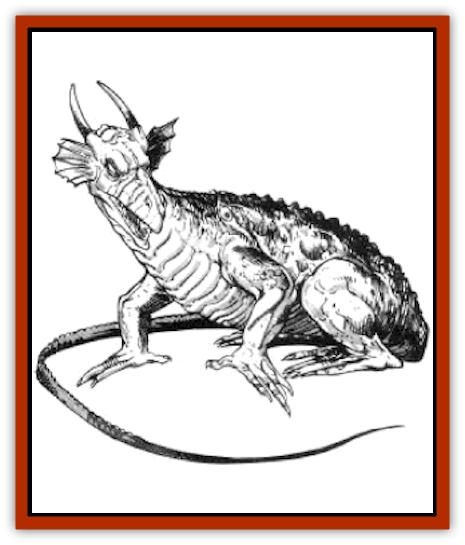

# Tylor

| Statistic | **Tylor** |
| --- | --- |
| **Activity Cycle:** | Any |
| **Alignment:** | Varies |
| **Armor Class:** | Varies |
| **Climate/Terrain:** | Any |
| **Damage/Attack:** | 1-10/1-20 (tail/bite) |
| **Diet:** | Carnivore |
| **Frequency:** | Rare |
| **Hit Dice:** | Varies |
| **Intelligence:** | Very (11-12) |
| **Magic Resistance:** | 5% |
| **Morale:** | Fanatic (16 base) |
| **Movement:** | 15 |
| **No. Appearing:** | 1-8 |
| **No. of Attacks:** | 2 |
| **Organization:** | Solitary or Clan |
| **Size:** | Varies |
| **Special Attacks:** | Nil |
| **Special Defenses:** | Special |
| **THAC0:** | Varies |
| **Treasure:** | Nil |
| **XP Value:** | Varies |

Tylors are huge land dragons with no wings. They are usually the products of evil [[Dragon_General_Information|dragons]] mating with [[Hatori|hatori]]. Tylors have the heads of their dragon parents and the bodies of hatori. Their flesh changes color to match the land they are traveling across.

These creatures are intelligent and can naturally converse in the common tongue and the tongue of any dragon.

**Combat:** Although always possessing powerful offensive spells, tylors love to destroy their prey with bites and tail lashes. If the prey is getting away or proves too powerful for physical attacks, the creatures move out of melee range and use spells.

Tylors can be found in all types of terrain, but in cold weather the creatures become very slow and require large amounts of food to continue moving and fighting.

**Breath Weapon/Special Abilities:** A tylor inherits none of the breath weapons of its parents. It does inherit the peculiar resistances of its ancestor, however. A tylor can inherit only one resistance, so it is not possible to have a tylor that is resistant to both cold and fire.

**Habitat/Society:** A tamed tylor makes an excellent mount. It enters into any battle and fights with its rider. It always longs to be free, however; if a tylor's rider becomes incapacitated, the creature often eats its rider and then rushes off into the wilderness.

Tylors in the wild form loose, far-flung clans. They live far apart because of their tremendous appetites. They all prefer the edges of the desert and can hunt equally well in the desert or in more lush lands. Shallow underground lairs are their favorite homes and they naturally build such places near frequently traveled roads.

It is instinctive in wild tylors that once every century they meet in groups of 100 to 500 to talk of their lives.

**Ecology:** Tylors undergo a striking transformation as they advance through the age categories. When they reach a new age category, they shed their skins in a two-day process. As they shed their skins, they actually grow larger and their new skins toughen up. DMs must reroll their Hit Dice per their new age category.

Tylors never live past the Old stage of dragon growth.

Tylors that mate with other tylors breed true. They are unable to produce offspring from other dragons or other desert reptiles.

| Age Category | Age (years) | Hit Die Modifier | Combat Modifier | Fear Radius | Save Modifier |
| --- | --- | --- | --- | --- | --- |
| 1 Hatchling | 0-5 | Nil | Nil | Nil | Nil |
| 2 Very young | 6-15 | +1 | Nil | Nil | Nil |
| 3 Young | 16-25 | +2 | +1 | 10 yards | Nil |
| 4 Juvenile | 26-50 | +3 | +2 | 20 yards | -1 |
| 5 Young Adult | 51-100 | +4 | +3 | 30 yards | -2 |
| 6 Adult | 101-200 | +5 | +4 | 40 yards | -3 |
| 7 Mature Adult | 201-400 | +6 | +5 | 50 yards | -3 |
| 8 Old | 401-600 | +7 | +6 | 60 yards | -3 |

| Age | HD | Body Lgt. (') | Tail Lgt. (') | AC | Spells W/P | MR | XP Value |
| --- | --- | --- | --- | --- | --- | --- | --- |
| 1 Hatchling | 1d6 | 3-6 | 3-6 | 4 | 1/1 | 5% | 175 |
| 2 Very young | 2d6 | 6-15 | 6-15 | 3 | 1/1 | 5% | 270 |
| 3 Young | 3d8 | 15-24 | 15-24 | 2 | 1 1/1 | 7% | 650 |
| 4 Juvenile | 4d8 | 25-33 | 25-33 | 1 | 1 1/1 | 9% | 975 |
| 5 Young adult | 5d10 | 34-42 | 34-42 | 0 | 2 1/1 1 | 11% | 9,000 |
| 6 Adult | 5d10 | 43-51 | 43-51 | -1 | 2 2/2 1 | 13% | 10,000 |
| 7 Mature adult | 6d12 | 52-60 | 52-60 | -2 | 2 2 1/2 2 | 15% | 11,000 |
| 8 Old | 6d12 | 61-80 | 61-80 | -3 | 2 2 2/2 2 1 | 17% | 13,000 |

---
## Discovery & Documentation

**Source Publication:** MC4 Dragonlance Appendix (w/binder #2) (1989)
**Campaign Setting:** Dragonlance
**Author(s):** Rick Swan

### Other Creatures Found in This Source Book
   * [[Anemone_Giant_Sea|Anemone, Giant Sea]]
   * [[Bear_Ice|Bear, Ice]]
   * [[Beast_Undead|Beast, Undead]]
   * [[Bird_Krynn|Bird (Krynn)]]
   * [[Disir|Disir]]
   * [[Draconian_Aurak|Draconian, Aurak]]
   * [[Draconian_Baaz|Draconian, Baaz]]
   * [[Draconian_Bozak|Draconian, Bozak]]
   * [[Draconian_Kapak|Draconian, Kapak]]
   * [[Draconian_General_Information|Draconian, General Information]]
   * [[Draconian_Sivak|Draconian, Sivak]]
   * [[Draconian_Proto-_Traag|Draconian, Proto-, Traag]]
   * [[Dragon_Amphi|Dragon, Amphi]]
   * [[Dragon_Astral|Dragon, Astral]]
   * [[Dragon_Kodragon|Dragon, Kodragon]]
   * [[Dragon_Krynn_Othlorx_General_Information|Dragon (Krynn), Othlorx, General Information]]
   * [[Dragon_Krynn_General_Information|Dragon (Krynn), General Information]]
   * [[Dragon_Sea|Dragon, Sea]]
   * [[Dreamshadow|Dreamshadow]]
   * [[Dreamwraith|Dreamwraith]]
   * [[Dwarf_Daergar|Dwarf, Daergar]]
   * [[Dwarf_Hill_Neidar|Dwarf, Hill, Neidar]]
   * [[Dwarf_Mountain_Hylar|Dwarf, Mountain, Hylar]]
   * [[Dwarf_Theiwar|Dwarf, Theiwar]]
   * [[Dwarf_Zakhar|Dwarf, Zakhar]]
   * [[Elf_Half-|Elf, Half-]]
   * [[Elf_High_Qualinesti|Elf, High, Qualinesti]]
   * [[Elf_High_Silvanesti|Elf, High, Silvanesti]]
   * [[Elf_Sea_Dargonesti|Elf, Sea, Dargonesti]]
   * [[Elf_Sea_Dimernesti|Elf, Sea, Dimernesti]]
   * [[Elf_Wild_Kagonesti|Elf, Wild, Kagonesti]]
   * [[Eyewing|Eyewing]]
   * [[Fetch|Fetch]]
   * [[Fire_Minion|Fire Minion]]
   * [[Fireshadow|Fireshadow]]
   * [[Gnome_Tinker|Gnome, Tinker]]
   * [[Gurik_Cha'ahl|Gurik Cha'ahl]]
   * [[Haunt_Knight|Haunt, Knight]]
   * [[Horax|Horax]]
   * [[Human_Krynn|Human (Krynn)]]
   * [[Imp_Blood_Sea|Imp, Blood Sea]]
   * [[Kalothagh|Kalothagh]]
   * [[Kani_Doll|Kani Doll]]
   * [[Kender|Kender]]
   * [[Kyrie|Kyrie]]
   * [[Lizard_Man_Krynn|Lizard Man (Krynn)]]
   * [[Minotaur_Krynn|Minotaur, Krynn]]
   * [[Ogre_High|Ogre, High]]
   * [[Ogre_Krynn|Ogre (Krynn)]]
   * [[Phaethon|Phaethon]]
   * [[Saqualaminoi|Saqualaminoi]]
   * [[Shadowperson|Shadowperson]]
   * [[Shimmerweed|Shimmerweed]]
   * [[Skrit|Skrit]]
   * [[Spectral_Minion|Spectral Minion]]
   * [[Spider_Krynn|Spider (Krynn)]]
   * [[Stag|Stag]]
   * [[Tayling|Tayling]]
   * [[Thanoi|Thanoi]]
   * [[Wichtlin|Wichtlin]]
   * [[Wyndlass|Wyndlass]]
   * [[Yaggol|Yaggol]]
