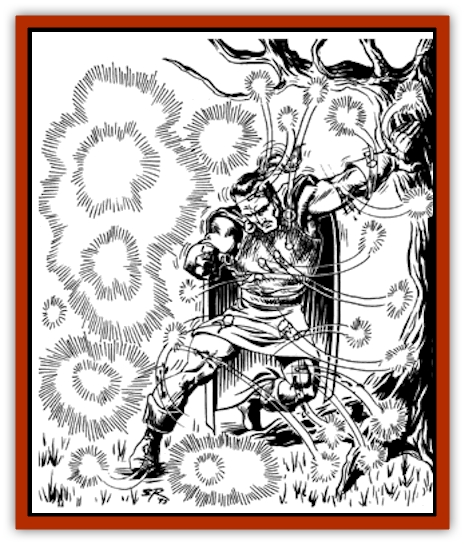
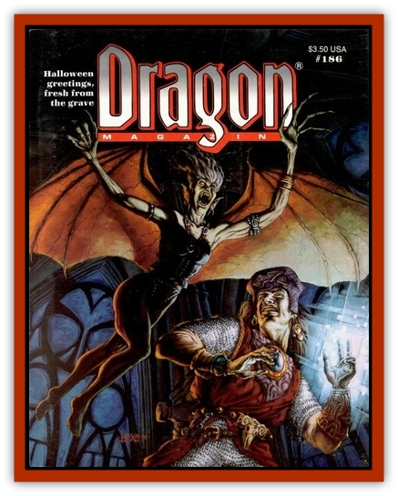

# Tymher-haid

| Statistic | **Tymher-haid** |
| --- | --- |
| **Activity Cycle:** | Any |
| **Alignment:** | Neutral evil |
| **Armor Class:** | 3 |
| **Climate/Terrain:** | Any inhabited |
| **Damage/Attack:** | 1/10 of a point |
| **Diet:** | None |
| **Frequency:** | Rare |
| **Hit Dice:** | See below |
| **Intelligence:** | Semi- (2-4) |
| **Magic Resistance:** | Nil |
| **Morale:** | Steady (11) |
| **Movement:** | Fl 18 (A) |
| **No. Appearing:** | (10-100 &ldquo;sparks&rdquo;) |
| **No. of Attacks:** | 1 |
| **Organization:** | Swarm |
| **Size:** | T (1&rdquo; sparks) |
| **Special Attacks:** | Nil |
| **Special Defenses:** | Immune to fire, psionics, and illusions |
| **THAC0:** | See below |
| **Treasure:** | Nil |
| **XP Value:** | Half basic XP value (as per DMG, Table 31) for its hit dice |

When powerful evil people or creatures are slain, there is a chance that they will return to plague the living as undead, such as [[Wight|wights]], [[Spectre|spectres]], and [[Ghost|ghosts]]. Weaker and less evil creatures usually do not suffer this fate, but if a large number of them are killed at one time and place, and if they don't receive proper funerary rites, they may return as an exceedingly minor form of undead, called collectively a tymher-haid, or "ghost-swarm".

A tymher-haid is both beautiful and horrible to behold. The individual members appear as small, multicolored sparks in a loosely defined mass, forming a brilliant display in the air. The only thing that disturbs this image is the fact that a tymher-haid reserves its most dazzling displays for attacking any living creatures it comes across. Swooping and diving in
intricate arcs, a tymher-haid gradually "stings" its victim to death.

**Combat:** When attacking, a tymher-haid descends on its victim like a swarm of wasps, singeing its prey with every fiery touch. A "spark" does only a tenth of a point of damage each, but the sheer number of spark stings (up to one hundred per round) will eventually overwhelm most any victim not resistant to fire. Each spark attacks by swooping down at its victim and giving it a minute burn upon contact. As it gains speed on its approach, its coloration becomes more intense and grows brighter, building up the energy it will deliver to its victim before dulling back to its normal appearance after striking. Thus, for someone not in the midst of an attack, the kaleidoscopic patterns and colors of the mass attacks are beautiful to behold.

A tymher-haid attacks as if it were a single creature, dividing the total number of sparks it contains by 10 (always rounding down) to determine its effective hit dice. Thus, a swarm of 52 sparks would attack as a 5 HD creature and a 49-spark swarm would have 4 HD. Because the tymher-haid attacks from all sides simultaneously, shield and dexterity bonuses to the victim's armor class are ignored, and the tymher-haid gains a bonus of +2 to hit due to its members' small size. If the tymher-haid scores a hit, damage done by the many stings is equal to its effective hit dice. If the tymher-haid drops below 10 sparks, a successful attack does less than a point of damage, so while it will remain a distraction sufficient to disrupt spell-casting, it is no longer a threat to most life.

As each spark is nearly mindless, the tymher-haid uses only the simplest of tactics in combat. In fact, a tymher-haid will only infrequently (20% of the time) divide its attacks among multiple opponents, usually concentrating on killing one creature before it turns its attention to another. Because it doesn't care what living creature it kills, a tymher-haid will consider attacking any living creature near it including humans, riding beasts, pack animals, birds on nearby trees, or passing swarms of insects. Usually, whatever nearby creature makes itself the most noticeable, by way of large size, movement, sound, or other attention-getting activities, finds itself the next victim of an attacking swarm. Conversely, this mindlessness makes it immune to the effects of most psionics or illusions, as those effects are spread equally amongst all the constituent sparks in the crowd.

Each spark within a tymher-haid has only a single hit point, but a spark's small size and high maneuverability make it hard to hit with normal weapons. The sparks are immune to all fire-based attacks but are particularly vulnerable to water. A flask of water sprayed into a tymher-haid will kill 1d6 sparks (holy water kills twice that number), and a *create water* spell will destroy 2d10 sparks per level of the caster. In addition, spells such as *protection from evil* keep it at bay, while a *raise dead* spell kills the tymher-haid instantly. Clerics will find them relatively easy to turn (treated as skeletons), but as only 2d6 sparks are normally turned or destroyed by a cleric performing this attack, it might not serve much purpose.

**Habitat/Society:** No matter what race of creature they were in life, the sparks of a tymher-haid understand no language. They communicate with each other by a limited form of telepathy that serves only to transmit imperatives such as "target" and "threat identification". A mind-reading creature would detect no mind at all in one spark, and only the most rudimentary one in the tymher-haid as a whole.

A tymher-haid needs no food to sustain itself and gains no pleasure from killing creatures. In this respect, it acts more as an uncaring force of nature like the wind and rain than as an undead monster like a [[Ghoul|ghoul]] or [[Wraith|wraith]].

Although such an occurrence would be exceedingly rare, if two tymher-haid swarms encountered each other, they would merge into a single tymher-haid, behaving in all ways as if they had always been a single group-entity.

**Ecology:** A tymher-haid is a naturally (though rarely) occurring undead, originating in places of great carnage such as gutted dungeons and bloodied battlefields, but not appearing until the dead are long forgotten, sometimes not for years after their deaths. Because of the sparks' vulnerability to water, a tymher-haid does not often survive for long after its formation, being more likely to die in a normal rainstorm than at the hands of adventurers. Thus, a tymher-haid usually does not get far from its place of origin.

Because a tymher-haid is formed of such commonly available stock, more than one evil necromancer has attempted to discover a spell that will create or control one. While they have several similarities to the lowest forms of undead, the corpses animated using the *animate dead* spell on the site of a mass death (where a tymher-haid might be expected to form) would create [[Zombie|zombies]] and [[Skeleton|skeletons]] but no swarm of deadly sparks. Even powerful necromancers find themselves unable to work with a tymher-haid, as the *control undead* spell grants control over only six sparks at a time. Only the most dedicated of necromancers would dedicate years of research to create and control a tymher-haid.

---
## Discovery & Documentation

**Source Publication:** Dragon186 (1992)
**Campaign Setting:** Dragon Magazine
**Author(s):** 

### Other Creatures Found in This Source Book
   * [[Memento_Mori|Memento Mori]]
